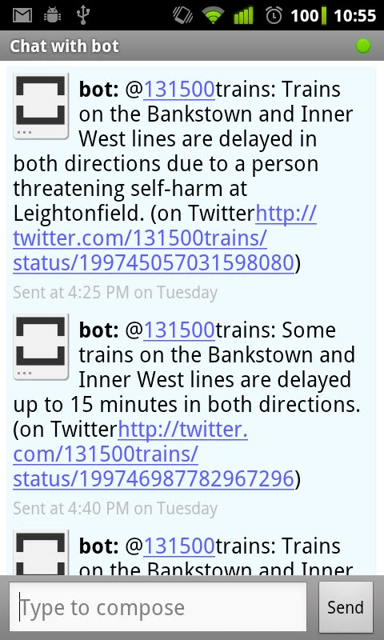

Here's a little hack I thought I'd share. There are maybe other ways to do this, but this way took all of two minutes, which suits me. My daily routine has me taking a train along the Inner West Line (here in Sydney), and I wanted to know in advance if there was any issues with the line. 131500 provides weekely emails about upcoming trackwork, and there's an RSS feed of delays; this is what you'd see in many of the Sydney transport-related apps. Another information source is through Twitter. For all of these sources I only really care about the one line I take every day - the quickest answer would seem to be if I could only get updates on Twitter for my line

Luckily this is all quick to do using an only service called [ifttt](http://www.ifttt.com). What I needed to do was create a task searching Twitter for "Inner West from:131500trains", and if any new items are located it sends me a message on GTalk. This is one example of what I like about having some mostly open data - I can consume it how I want it. Let's just say I'm looking forward to [GovHack 2012](http://www.govhack.org)

This example could be extended for other purposes, e.g. searching for the word "discount" on some suppliers Twitter stream.

  
  
