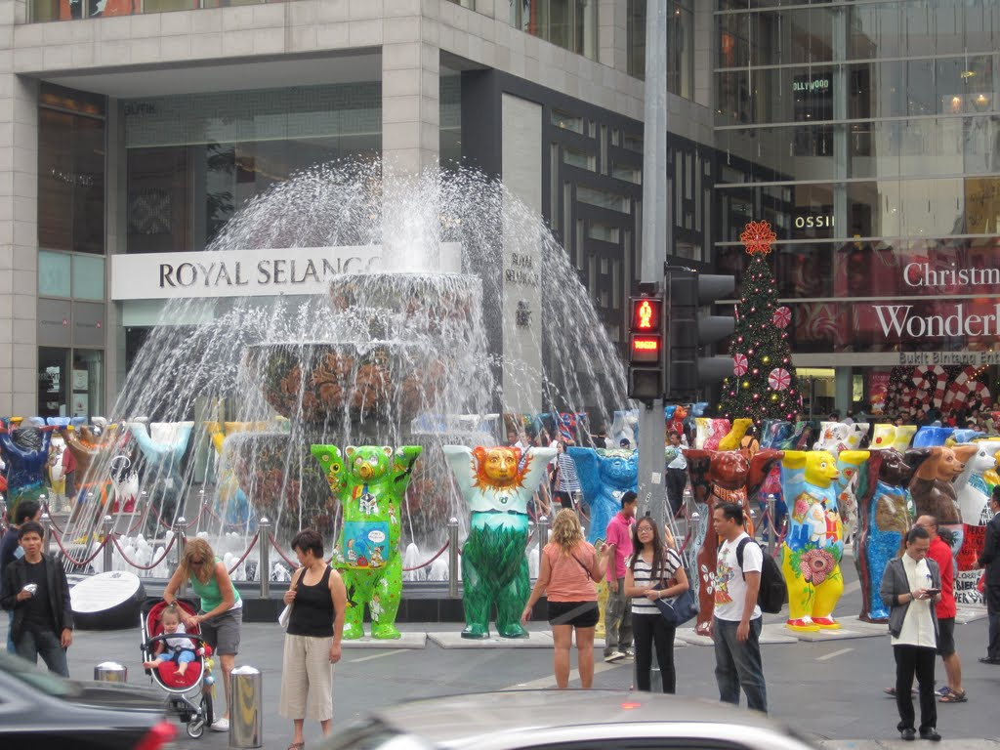
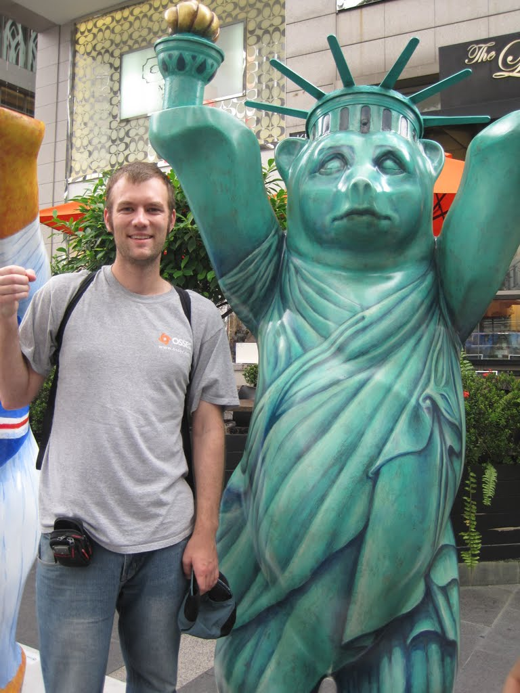
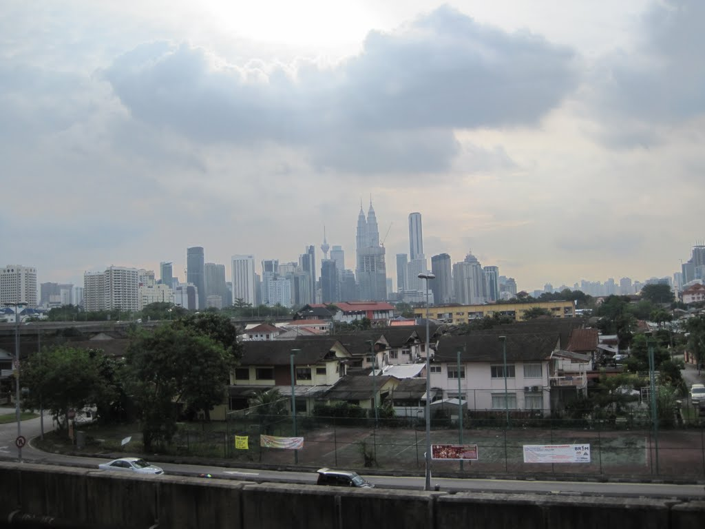

Kuala Lumpur is familiar to me, yet each time I go back I do something unique. My layover this time was a mere 16 hours, enough to go into the city, visit some sights, and start adjusting to the jet lag of crossing to the other side of the world.

The LCCT is located an hour from KL Sentral, with frequent buses running between the two. My trip brought me to KL Sentral just after breakfast time, and I was hungry after choosing not to buy food on the AirAsia flight. I walked out of the main train station looking for curry, one of my fondest memories of Kuala Lumpur and something I seek every time I transit through. Just around the corner I found a busy restaurant and ordered roti with curry. Then another. Then a third. And finally another dish too.

By the end of the meal I was stuffed. I had eaten maybe 118% of what I should have, but I walked contentedly out of the restaurant, having spent only a few dollars in total, and jumped on the monorail to one of the food districts. I walked around in search of water but was too full to eat. The Berlin Bears were on display, although Taiwan was missing, which left me scheming about how to create one.

Back at the main station, I decided to beat the heat and take a train to the end of one of the lines, without knowing what was there, simply to explore. As the train approached the end of the Green Line, the areas I could see from the carriage looked more residential and less set up for wandering visitors, with no food stalls in sight (I was getting hungry again).

Without getting off, I took the train back to Sentral, returned to my favourite curry place, and ate one final meal before my next departure.

While I didn't see any major sights or visit any major attractions, the curry made my layover worthwhile. Sometimes it is nice simply to experience a culture very different from one's own, which is exactly what Kuala Lumpur gave me.

