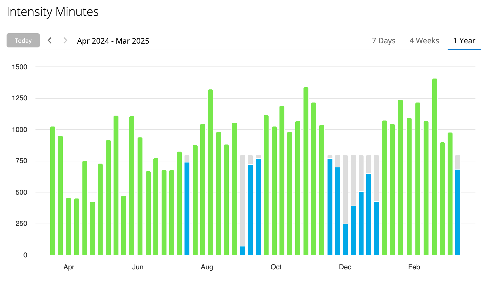
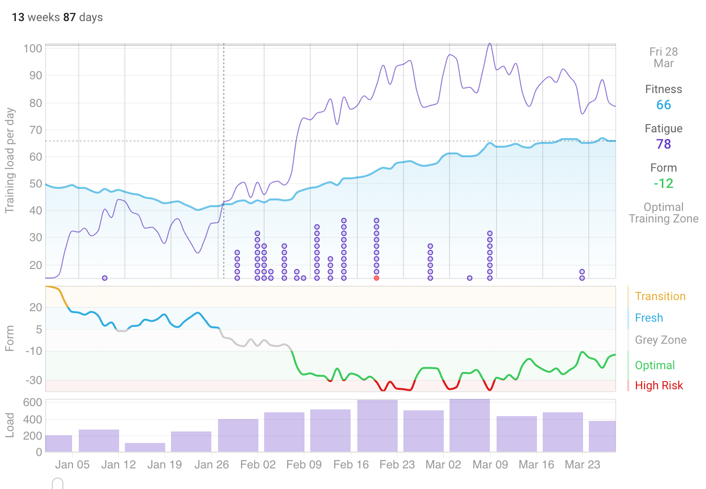
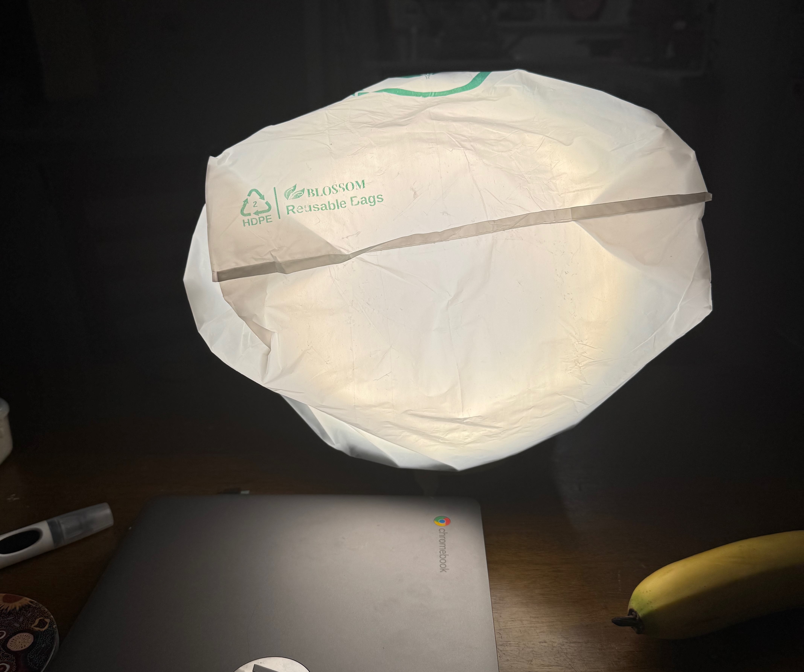
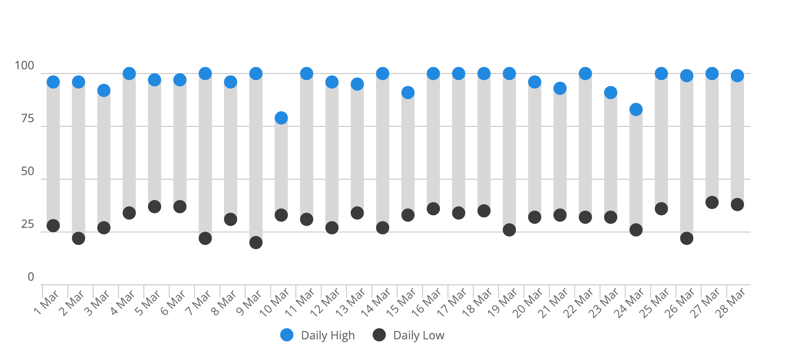
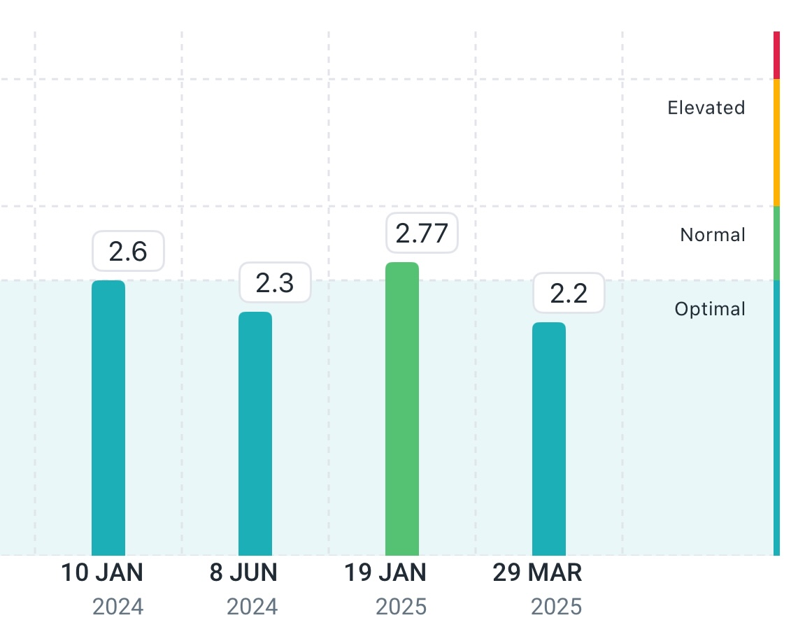
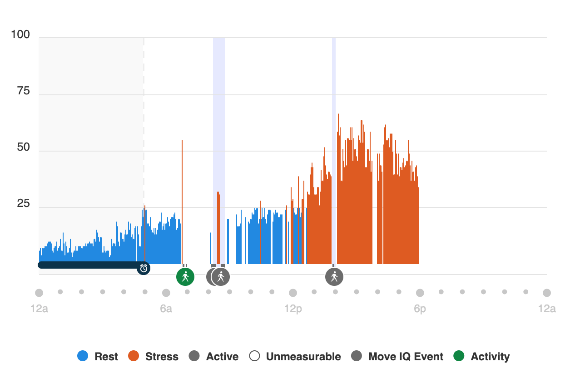
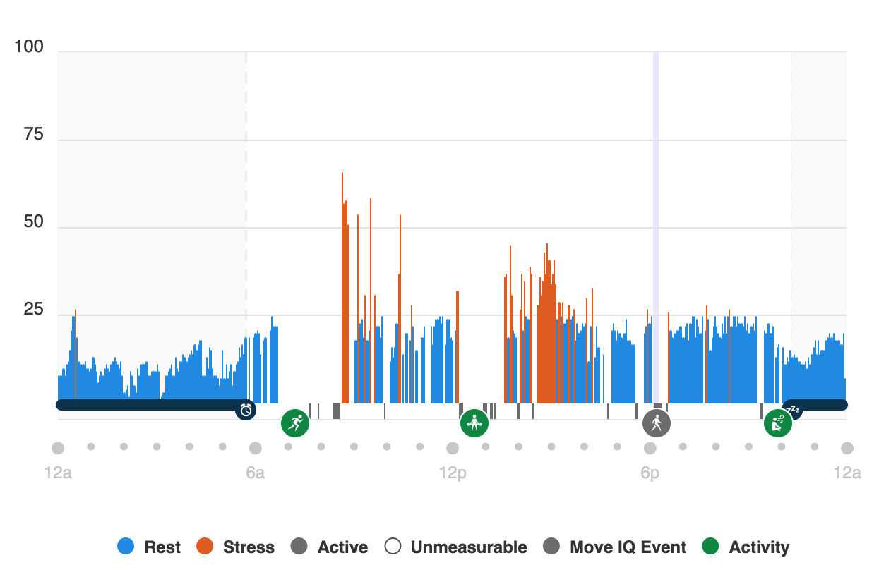

### Background

I have a journal of all the travels I did when I was in my 20s, and sometimes it is enjoyable to re-read the various journeys that I went on.  In those entries I could see my writing change, both in voice and theme, as I gained more life experience.

Recently I wrote about my [health journey in 2024](/2025/01/state-of-health-2024.html), and I have a goal to write a quarterly entry. This is the first entry of what I hope to be many entries.

Now that I have returned from some travels in India I have been able to focus more on my health. I have returned to a diet lower in saturated fat, and been able to generally increase the amount of exercise that I have been doing.

### Experiments / Focus Areas

This quarter I had a few experiments.

1. **Train more** by getting up to 60-70km/week running, and get in the gym 3-4 times per week. I should see my Vo2Max increase, and RHR decrease. The goals here are to build muscle, bone mineral density, general cardio protection, and sleep better.
2. **Sleep better** by meditating before bed, starting wind down by 8pm, and increasing glycine consumption before bed.

#### Train More

Here is what my 'intensity minutes' look like for the previous 12 months, and you can clearly see the impact of travelling in Dec/Jan:

And then the previous 3 months in intervals.icu. My goal is to get to 80 Fitness and stick there for the rest of the season.

My target fitness routine remains the following:

##### Monday

* Easy Run (~8km)
* Resistance Training (upper)

##### Tuesday

* Hard Run (Vo2Max 4x4)
* Resistance Training (lower)

##### Wednesday

* Easy Run (~8km or longer)
* Resistance Training (core)

##### Thursday

* Hard Run (Nx1000, or a beach tempo run)
* Resistance Training (lower)

##### Friday

* Easy Run (~8km or longer)
* Resistance Training (upper)

##### Saturday

* Long Run

##### Sunday

* Play Day (swimming or a hike or walk somewhere)

Many weeks I only achieve about 90% compliance, e.g. today I had a DEXA scan so couldn't do my morning run, and then had blood work so skipped the gym. I'll likely still walk home to make sure I get my 10,000 steps in.

#### Sleep better

In addition to increasing my glycine consumption I've started reducing the amount of liquids I drink after dinner, to good results of needing to wake up and go pee. I also purchased a pee jug as a further experiment.

One observation I made is that for two evenings I played a computer game until close to bed time, so missing wind down, and I think it severely impacted the quality of my sleep. I didn't go to bed any later, but I think all the light impacted my circadian rhythm. I have purchased some clip on blue/green light blocking glasses to see if that helps, although I'll be avoiding playing any games for a long time (it is about a once/year type of escape). Interestingly, my HRV started dropping after that, too, but perhaps that's just a byproduct of sleeping slightly worse.

Speaking of circadian rhythm, given it is soon winter here in Sydney, I wanted to get a light to trigger cortisol production first thing in the morning. Given it is an experiment I purchased some LED lights in the right wavelength from AliExpress, taped it in a metal mixing bowel, and put a plastic bag over it. I had the 12v PSU already. I think it is helping, and I start getting pretty tired by 9pm, and I'm often lights out by 9:30pm. I usually wake up around 5:30am, but sometimes when my "body battery" is full at 5am or earlier I'm wide awake and ready to go.

  

### This Quarter's Supplement Stack

Some principles that I try to follow:

- Avoid bill burden
- Wait until a supplement is on the ITP supported interventions page
- Have a biomarker in mind that a certain supplement will change.

And here's what is currently in my stack:

| Morning                 | Ad Hoc / Evening  |
| ----------------------- | ----------------- |
| Fish Oil (6g)           | Magnesium Taurate |
| Niacin (50mg)           | Iron (10mg)       |
| Calcium (333mg)         | Glycine (5-10g)   |
| Vitamin D (33mcg)       | Astaxanthin (7mg) |
| Vitamin K2 mk7 (100mcg) |                   |
| B Complete              |                   |
| Lysine (1g)             |                   |
| Zinc (5mg)              |                   |
| Hyaluronic Acid (200mg) |                   |
| Fenugreek (1000mg)      |                   |

My [Nutty Pudding](nutty-pudding-modified-recipe/index.md) also has TMG, Creatine, Pea Protein, Taurine, and HCP.
### Results

* Increase weight ❌
* Increase muscle ❌
* Increase BMD ✅
* Improve sleep quality ✅
* Improve Vo2Max ✅
* Decrease RHR ✅
* Improve LDL ✅

**Weight/Muscle:** Unfortunately, I had mixed results. My DEXA scan results showed that while my body fat % decreased from 18.5% to 17.7%, my lean mass also decreased. This is a bit puzzling given my weight has remained stable and I'm strength seems to have increased since a year ago, but perhaps this is all neuromuscular. My main takeaway from the DEXA is that I need to eat more, which is hard, because I feel like I'm already always eating. This will be a goal for the next quarter.

**BMD:** Increased from 1.116g/cm^2 to 1.130. I'm not certain the machine's variance in accuracy, but I'll count this as a win.

**Sleep:** Usually I wake up with a 100 "body battery" according to Garmin, which might be a better indicator than my sleep score. My average sleep score since coming back from travelling was 87, but the best indicator is that my sleep scores are relative stable and only dipping below 75 4 times since returning.

**Vo2Max/RHR:** My average resting heart rate was 49. My Vo2Max according to Garmin is now slightly above 52.

**LDL:** After the sudden increase while travelling my LDL has dropped back down to normal levels. I'd like to get it down below 2 mmol/L.

**PhenoAge:** I'm going to start tracking PhenoAge more regularly as part of these quarterly posts, so here is the first one. Lots to improve on! I calculated one using my data from 01-2024 and it was almost 11 years difference, so it seems like I'm going backwards.

### Focus For Next Quarter

I think the main focus for next quarter will be relatively similar to this one. I am unlikely to change my supplements that much, and I think my main goal should remain to add muscle. One other potential area of exploration might be to look at stress levels, and see if I can correlate Garmin's stress score with other events. For example, here is my stress graph for today, where I wasn't able to run or go to the gym. My average "stress score" is 26", which is higher than my quarterly average of 21.

This becomes obvious when compared to my score from a few days ago, when I did 4x4s in the morning and a hard(ish) leg day at lunch.

I need to figure out how to better overlay my daily activities before I can solve this one, so I might explore this over the next quarter.
