### Reflection

A challenging quarter, as I spent three three weeks travelling; it took me at least a week to start feeling normal in each direction, and much longer to recover. Additionally, because I was leaving for such a long time, I think my work/life balance suffered prior to the trip. However, physical health isn't the only thing that matters, and I think travelling helped me and my family grow.

I finished some more Longevity-related books, like *Longevity Leap*, and then also *The Art of Dying Well*. I've also started learning more from [Michael Lustgarten](https://michaellustgarten.com/). In particular I like his minimalist approach and lifestyle, and that he prioritises whole foods over supplements.

### Focus Areas

This quarter I had a several areas I wanted to focus on:

1. **Improve fitness** by training more. My goal is to get above a 75 fitness score on intervals.icu, and still maintain 3+ gym sessions per week.
2. **Gain weight** by starting to track my food in Cronometer, again, and not eating out anymore. 
3. **Sleep better** by improving my sleep hygiene (starting wind down by 8pm, in bed by 9pm, wearing red light glasses at night, and increasing glycine consumption before bed). I also experimented with taking Magnesium Glycinate before bed.
4. **Reduce Stress** by being mindful of when I eat my meals, and what meals I'm consuming. Additionally, wherever possible, avoid evening meetings.
5. **Improve Biomarkers** by looking at my nutrition, as well as the above items.

Let's go through what I experimented with, and the result.
#### Improve Fitness

My main forms of exercise remain running and strength training. There are two tools I use:

1) Garmin's Intensity Minutes (and other metrics)
2) intervals.icu

Both of these tools help warn me of overtraining, but also lets me see the impact of my planned workouts. For example, as of today (7-May-2025), here is my plan for the rest of the quarter and showing the previous two years of training:

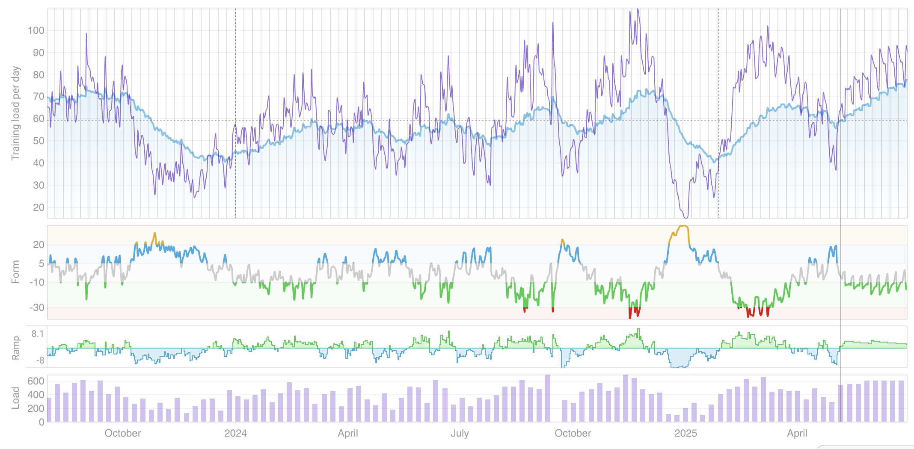

My goal was to get above a 75 fitness score according to intervals.icu without injury, and to average above 800 'intensity minutes' according to Garmin. In Intervals.icu, the "fitness" score, also known as Chronic Training Load (CTL), is ==a measure of your average training load over the past six weeks==.
##### Results

* Fitness score of 75 or above ❌
* Average intensity minutes of 800 or above ✅
* Improve Vo2Max ✅
* Decrease RHR ❌

So, how'd I do? Let's look at the previous 3 months in intervals.icu. My goal was to get above 75 'fitness':

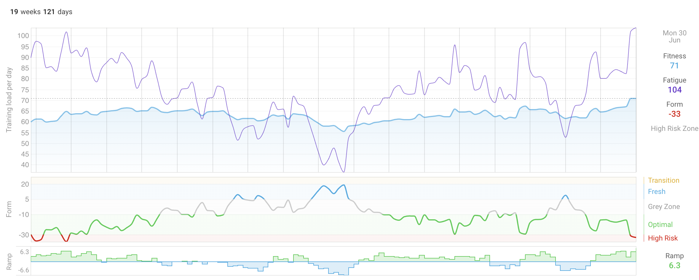

And I only got to a 71. The main setback seemed to be the 3 week trip I took to Europe, as I tried to keep up with my fitness, but in some instances it was just too difficult. Additionally, I think the challenge was as much the jet lag as the trip itself, as it took a while for me to get my circadian rhythm back in sync.

Here is what my 'intensity minutes' look like for the previous 12 months, which also shows my dip in Dec/Jan while I was travelling, and to a lesser extent in April when I was travelling again:

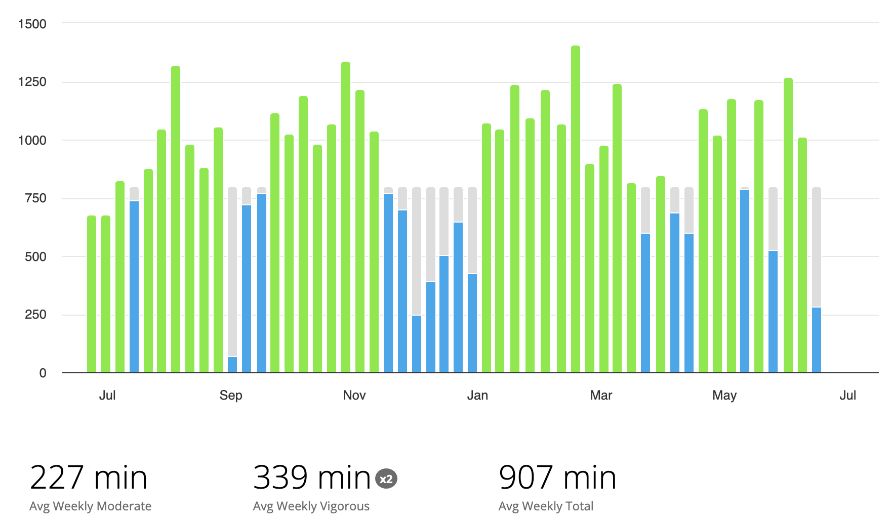

My fitness routine remains similar to the previous quarter.

**RHR:** My average resting heart rate was 52. This is a slight increase from 48 back in late February, and with another dip to 49 in late April. I think RHR is impacted as much by training load as other stress factors.

Vo2Max: My Vo2Max according to Garmin is now 52ml/kg/min. This has been consistent for about 4 months now, and is a little higher than the 51ml/kg/min
#### Gain Weight

##### Plan

My previous DEXA saw body fat % decrease, but also a slight decrease in lean muscle mass. This is somewhat confusing to me, as I'm lifting heavier than ever before, but apparently that can be purely neuromuscular.

I'm also confused because my weight hovered between 76 and 78kg for the previous 12 months (screenshot from end of April).

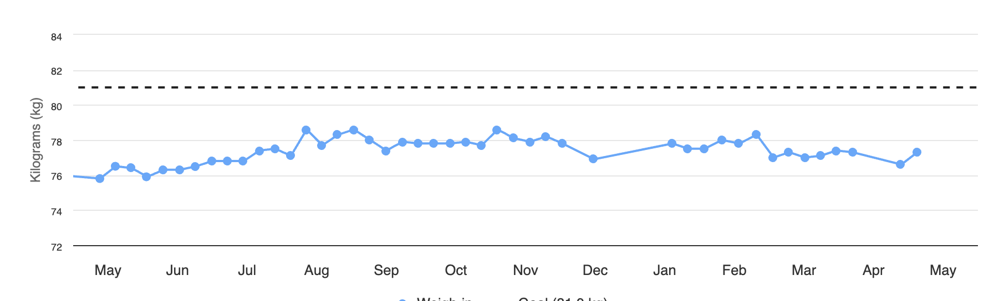

Regardless, to maximise my chances of building muscle I need to be in a calorie surplus, and I suspect that when things get busy, given I try to avoid eating out (as well as how expensive it is!), I sometimes don't get enough calories. 

Enter Cronometer. I had previously used this tool to look at my micronutrient profile, so I could fill those gaps with supplementation, so I resumed using it this quarter. The below image is from early May targeting 80kg by the end of June.

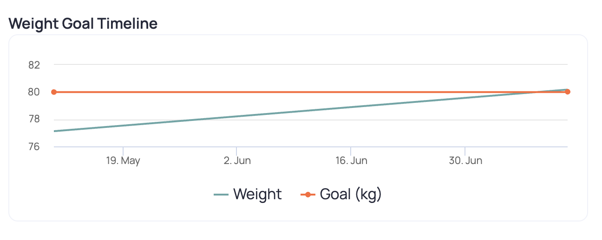

Early on I was having trouble hitting the calorie target, as can be seen from this random day of food tracking from Cronometer.

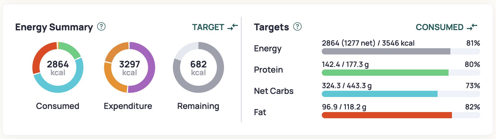

We can see from this that my protein consumption is adequate. I still wished to remain on a whole foods plant based diet wherever possible. Unfortunately, I'm not really driven by food, and I don't believe my mood is negatively impacted by being in a slight calorie deficit; in fact, I generally don't even notice besides perhaps my runs being harder, or potentially not sleeping as well. This means that without tracking my consumption it is difficult for me to be in a surplus.

Towards the end of May I started to dial in meal prepping, and getting in a better habit of what foods to bring. By the end of the quarter I was almost able to even hit my calorie targets even on long run days, which is up to 5000 calories!
##### Results

* Increase weight  ✅
* Increase muscle  🤷
 
I gained weight almost exactly as Cronometer predicted, which is exciting. 

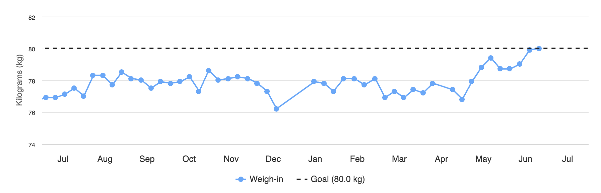

I didn't need to do any major tweaks to my diet, just a few extra calories per day. I have a hypothesis that too many extra calories (e.g. 300+) starts to impact my sleep, so sticking in the 100-200 extra calorie range seems to be the right zone to build muscle, but also still be able to sleep well.

#### 

#### Sleep better

##### Plan

The National Sleep Foundation (NSF) has a long list of tips ([[https://www.thensf.org/sleep-tips/]]), but I follow all of those. In addition to these tips, I also:

* Get light between 5:30am and 6:00am
* Wear blue light blocking glasses after about 7pm
* Observe the 3-2-1 rule (3 hours before bed: No more food or water. 2 hours before bed: No more work. 1 hour before bed: No more screen time.)
* Take 5-10g of glycine per day
* Sleep in my own bed (except when travelling)

Overall, I fall asleep quickly each evening. However, the challenge that I need to overcome is that I sometimes wake up at 3:30am - 4:00am full of energy, and rarely wake up after 6am. Although this usually still allows for a healthy sleep duration of 7-8 hours, I would prefer 8+ hours if possible. However, the challenge is when I wake up at 4am and can't get back to sleep.

One observations I had is that I might get in to a vicious cycle: I wake up early, eat food, and then the night night wake up again... hungry. Repeat. One thing I changed this quarter was eating at the same time every morning even if I woke up early.

A note about glycine: I think I need to have a routine where I have it just after dinner, as otherwise I get pretty sleepy during the day. More experiments needed.

##### Results

* Improve sleep quality ❌

It looks like sleep duration was worse across the board. Note: this is not time in bed, but what Garmin records. I'm especially confused by the one on Tuesday, and that will require additional exploration.

|           | Q1 2025  | Q2 2025  |
| --------- | -------- | -------- |
| Sunday    | 7.725726 | 7.676688 |
| Monday    | 7.971282 | 7.749676 |
| Tuesday   | 7.539861 | 5.977523 |
| Wednesday | 7.423009 | 7.427821 |
| Thursday  | 7.122735 | 7.888013 |
| Friday    | 7.920641 | 6.988376 |
| Saturday  | 7.701432 | 7.45453  |

We can also see this with the Body Battery stats; whatever I was doing in February and March seemed to be helpful.

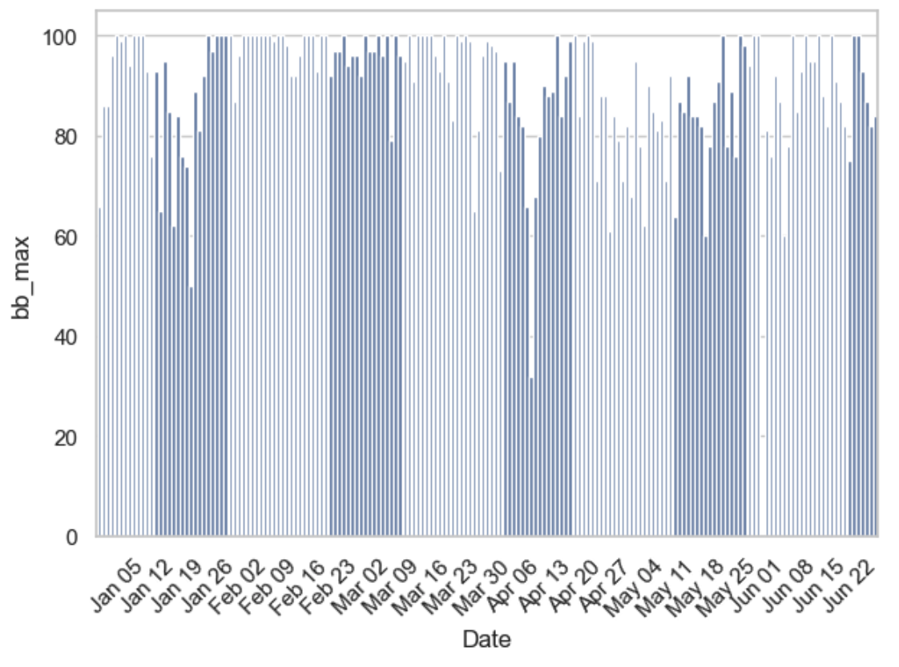

It looks like upon returning from my travels to India at the end of January I had two months where I balanced sleep and exercise quite well, but that started to erode in the lead-up to travelling to Europe. I'll need to improve how this graph is presented in the future.
#### Decrease Stress

##### Plan

I had a desire to decrease stress this quarter, but at the same time I didn't really have a plan of how to make it happen. One area of focus was to avoid late night meetings wherever possible, as I have found that they tend to impact my sleep.

However, because this was an area of focus, I did attempt to be mindful of what caused stressed. One area that I am actively exploring is the impact of food on my 'stress' metric, and I'm starting to see a pattern that meals with a lot of carbohydrates (e.g. 250g of gnocchi or 150g of dried pasta, or a significant amount of white rice) seems to trigger a response. Although I don't eat white rice at home, sometimes when eating out I didn't always have a choice. Switching to brown rice appears to help.

##### Results

Overall it looks like I was more stressed this quarter than last quarter, but that could also be because of other factors less in my control - I see a pattern that most years Dec-March my stress levels are the lowest in the year.

|           | Q1 2025   | Q2 2025   |
| --------- | --------- | --------- |
| Sunday    | 21.555556 | 24.307692 |
| Monday    | 20.555556 | 20.076923 |
| Tuesday   | 20        | 27.147436 |
| Wednesday | 21        | 22.615385 |
| Thursday  | 20.25     | 22.538462 |
| Friday    | 23.625    | 23.538462 |
| Saturday  | 21.444444 | 22.692308 |

The heatmap below is a great way to see how the quarter played out.

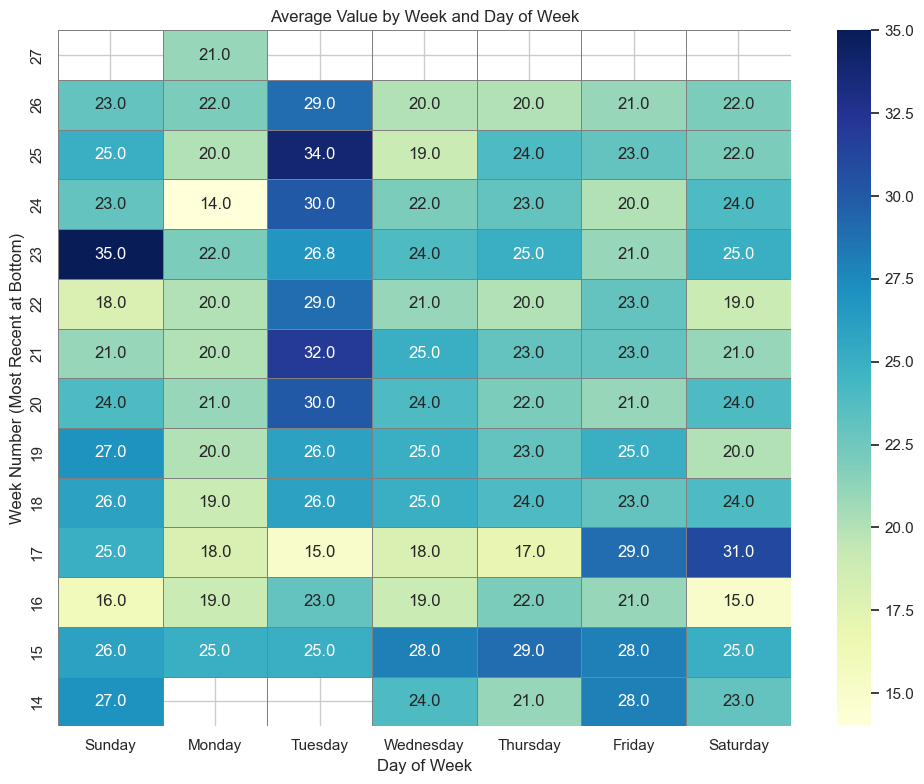

Some of the larger events in this quarter really stood out, such as:

- Week 15 is when I flew to Europe (the Thursday)
- Week 18 is when I arrived home (the Sunday)
- Tuesdays (after returning) are usually a _hard_ day for exercise, where I do some kind of harder run (e.g. 4x4) and do a leg day.
- Sundays are usually when I do a longer run

I'm a little curious what changed between Q1 and Q2 when it comes to Tue/Thr, as these were previously my *least* stressful day of the week. 

I still have more work to do when it comes to reducing stress levels.
#### Improve Biomarkers

##### Plan

And then what really matters - improving biomarkers. This is ultimately an outcome of achieve a number of the above items as well nutrition. One area that I think I've done really well on since returning from Europe was eating well; sufficient protein, lots of fibre, avoiding dairy, and minimising saturated fats.
##### Results

I'm going to start tracking PhenoAge on a quarterly basis, as long as I can keep getting tested without too much drama. Here are the results.

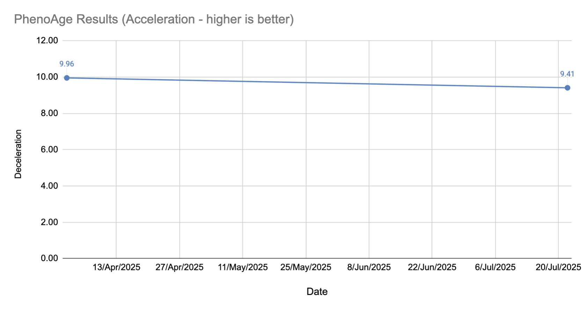

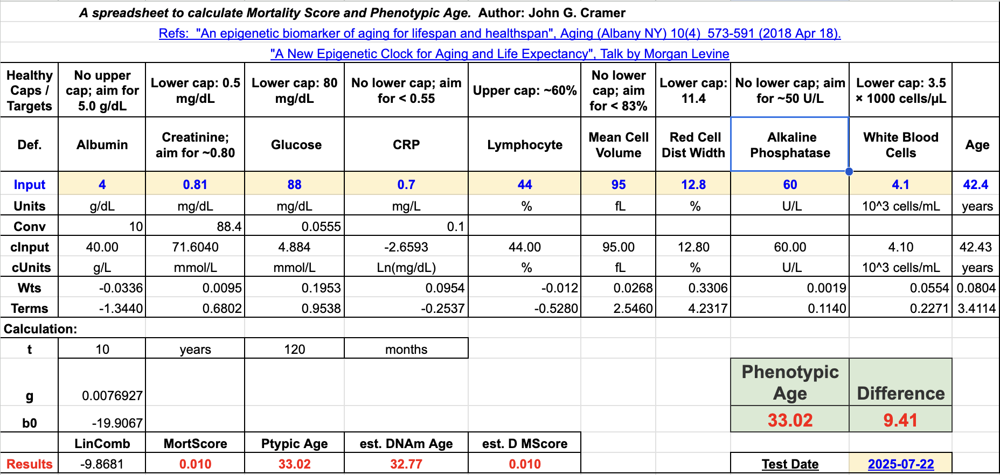

Compared to my previous test we can see that:

* Albumin: 4.53 → 4.00 🔴
* Creatinine: 0.76 → 0.81  🔴
* Glucose: 88 → 88  ⚪️
* CRP: 0.3 → 0.7  🔴
* Lymphocyte: 27.4 → 44 🟢 (*however*, I had to calculate the % from the absolute value, so this might be entirely wrong)
* MCV: 93  → 95 🔴
* RDW: 12.6 → 12.8 🔴
* Alkaline Phosphatase: 75 → 60 🟢
* WBC: 6.6 → 4.1 🟢

Although none of these changes are significant, it is absolutely the wrong direction. There are two explanations: (1) I did the blood draw too soon after finishing my FMD cycle, and (2) I had been feeling a little under the weather the week before.

I'm reminding myself that this isn't a sprint, but a marathon, so we can keep refining as we go along. Next round of testing will hopefully be better!

If I use a tool like Bortz Blood Age calculator, [my blood age and chronological age](https://www.longevity-tools.com/humanitys-bortz-blood-age#age=42.6_years&S-cystatin-C=0.79_mg%2FL&RDW=12.8_%25&S-GGT=12.6_IU%2FL&S-SHBG=68_nmol%2FL&B-HbA1c=5.7_%25&NEUabs=1.8_x10%5E9%2FL&S-hsCRP=0.5_mg%2FL&MCV=95_fL&MONOabs=0.4_x10%5E9%2FL&MCH=32.4_pg&S-ALP=60_IU%2FL&S-glucose=5.1_mmol%2FL&S-albumin=4.0_g%2FdL&S-urea=4.6_mmol%2FL&S-ApoA1=139_mg%2FdL&LYM=44_%25&S-cholesterol=3.8_mmol%2FL&RBC=4.41_x10%5E12%2FL&S-25-OH-D=36_nmol%2FL&S-ALT=25_IU%2FL&S-creatinine=81_%C2%B5mol%2FL) are unfortunately almost the same. One nice thing about Longevity Tools is that it tells you some areas of focus, for example:

- [Increasing Vitamin D - 25(OH)D](https://www.longevity-tools.com/biomarker/S-25-OH-D#S-25-OH-D=36_nmol/L) from 36 -> 174.72 nmol/L would decrease Bortz Blood Age by 4.1 years.
- [Lowering Cystatin C](https://www.longevity-tools.com/biomarker/S-cystatin-C#S-cystatin-C=0.79_mg/L) from 0.79 -> 0.62 mg/L would decrease Bortz Blood Age by 3.1 years.
- [Increasing RBC](https://www.longevity-tools.com/biomarker/RBC#RBC=4.41_x10^12/L) from 4.41 -> 5.3 x10^12/L would decrease Bortz Blood Age by 1.8 years.
- [Increasing Creatinine](https://www.longevity-tools.com/biomarker/S-creatinine#S-creatinine=81_%C2%B5mol/L) from 81 -> 95 µmol/L would decrease Bortz Blood Age by 1.5 years.  
    Increasing muscle mass to 80% should reach optimal creatinine levels.
- [Lowering MCV](https://www.longevity-tools.com/biomarker/MCV#MCV=95_fL) from 95 -> 86 fL would decrease Bortz Blood Age by 1.5 years.
- [Lowering SHBG](https://www.longevity-tools.com/biomarker/S-SHBG#S-SHBG=68_nmol/L) from 68 -> 45 nmol/L would decrease Bortz Blood Age by 1.2 years.
- Lowering HbA1c from 5.7 -> 5.2 % would decrease Bortz Blood Age by 0.9 years.
- [Lowering MCH](https://www.longevity-tools.com/biomarker/MCH#MCH=32.4_pg) from 32.4 -> 29 pg would decrease Bortz Blood Age by 0.9 years.
- [Increasing ApoA1](https://www.longevity-tools.com/biomarker/S-ApoA1#S-ApoA1=139_mg/dL) from 139 -> 190 mg/dL would decrease Bortz Blood Age by 0.9 years.
- Increasing Cholesterol (Total) from 3.8 -> 4.9 mmol/L would decrease Bortz Blood Age by 0.8 years.

I believe the top 3 can be improved via supplements (D, B, and Iron). Creatinine will require increasing muscle mass, which might take some time. SHBG I'm experimenting with adding some boron to my stack.

### This Quarter's Supplement Stack

Some principles that I tried to follow:

- Avoid bill burden
- Wait until a supplement is on the ITP supported interventions page
- Have a biomarker in mind that a certain supplement will change.

And here's what is currently in my stack:

| Morning                     | Evening                     | Ad Hoc         |
| --------------------------- | --------------------------- | -------------- |
| Fish Oil (6g)               | Magnesium Glycinate (150mg) | B Complete     |
| Niacin (50mg)               | Glycine (3g)                | Iron (20mg)    |
| Calcium (333mg)             | NAC (1g)                    | Vitamin C (1g) |
| Vitamin D (33mcg)           | Astaxanthin (7mg)           |                |
| Vitamin K2 mk7 (100mcg)     |                             |                |
| B12 (1000 mcg)              |                             |                |
| L-Methylfolate  (1000 mcg)  |                             |                |
| Lysine (1g)                 |                             |                |
| Zinc (5mg)                  |                             |                |
| Hyaluronic Acid (200mg)     |                             |                |
| Iodine (150mcg)             |                             |                |
| Creatine (3g - in smoothie) |                             |                |
| TMG (500mg - in smoothie)   |                             |                |
| HCP (15g - in smoothi)      |                             |                |

I swapped out the B Complete with a B12 (methylcobalamin) and L-Methylfolate combination. I've added in iodine (via kelp) now, too, given I'm essentially on a vegan diet and don't eat much salt.

When looking at Cronometer the only vitamin that I am routinely shot on is Vitamin A, so I need to figure out a way to get that in my diet. If possible I prefer to get it via food instead of supplement.

### Experiments 
##### Fasting Mimicking Diet

I conducted one experiment this quarter: the[ Fasting Mimicking Diet](https://valterlongo.com/fasting-mimicking-program-and-longevity/).

You can read more about my experience here: https://www.kelvinism.com/2025/07/prolon-fmd.html

Did my biomarkers get better? There are so many variables this quarter that it is hard to point to this one experiment calling out if things got better or worse, but it helps to at least look. How soon should I test after a thing like this without screwing up the results? According to one of the FMD studies linked above, and another study that I vaguely remember about testing after Ramadan, I seem to remember in their methodology the researchers waiting 8-12 days before testing.

After waiting 8 days I was able to take my blood test, and discovered that my PhenoAge... got worse! Check out the Biomarkers section for more details.

##### Heavy Metals Testing

While travelling in India I was able to do a blood test that included testing for heavy metals, and the results were generally unremarkable with the exception of Caesium and Beryllium.

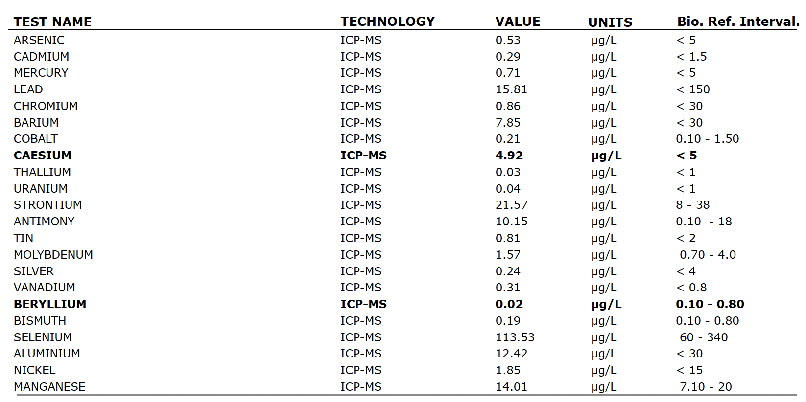

To corroborate these I also did a Hair Tissue Mineral Analysis test via ToxTest, and here are the results:

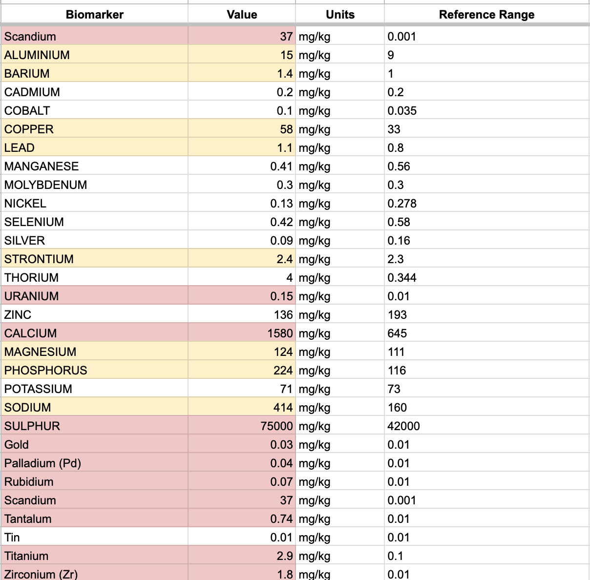

From what I could research none of this should actually cause me to lose any sleep, and HTMA isn't really that proven as a diagnostic tool. The Uranium and Thorium level are a worry though, but given my blood results were acceptable I am just assuming I went somewhere hiking that had higher levels radioactive elements.
### Focus For Next Quarter

I think the next quarter will remain similar to this one. Cronometer is working really well for me to be able to control my calories, and to force me to eat from a list of known 'good' food. For example, if someone offers me some kind of snack, then I'll probably skip it purely because of the pain of needing to try and keep a record.

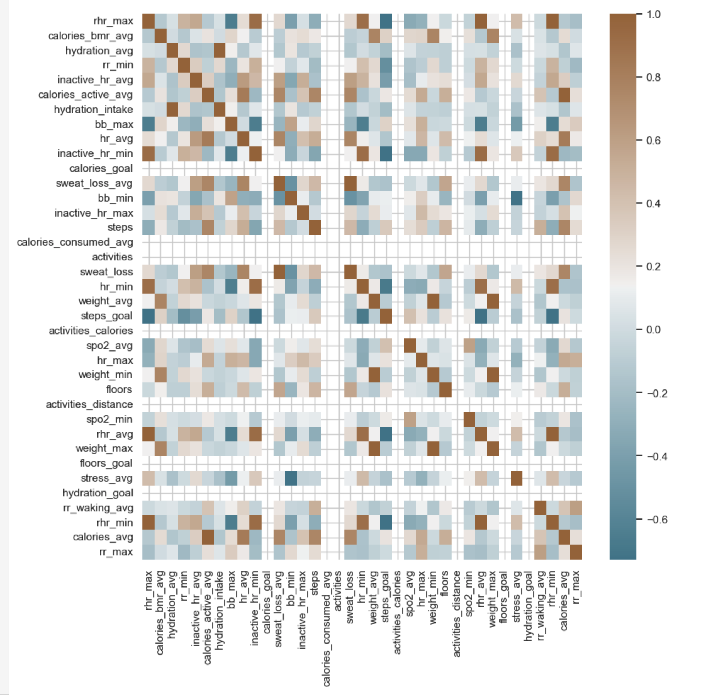

The biomarkers that I will specifically target include, in order of priority:

**IGF-1**: This is potentially from eating too much protein. I'm going to remove pea protein from my smoothie, as well has the HCP. Let's see if it drops.

**MCV & RDW**: Seem potentially related to being slightly off. I've got an experiment in mind, too. Need to optimise B12 levels.

**Albumin**: Potentially related to FMD.

**hsCRP**: I've had it at 0.3 several times before, so I know I can get it that low. Potentially related to FMD.
