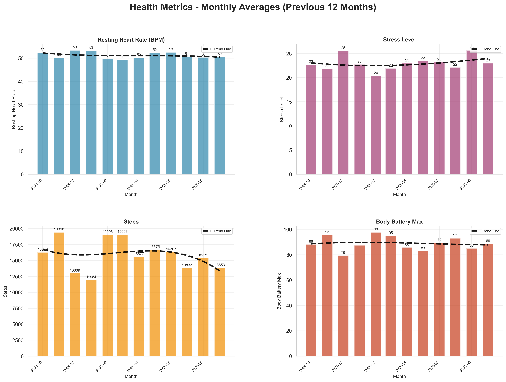
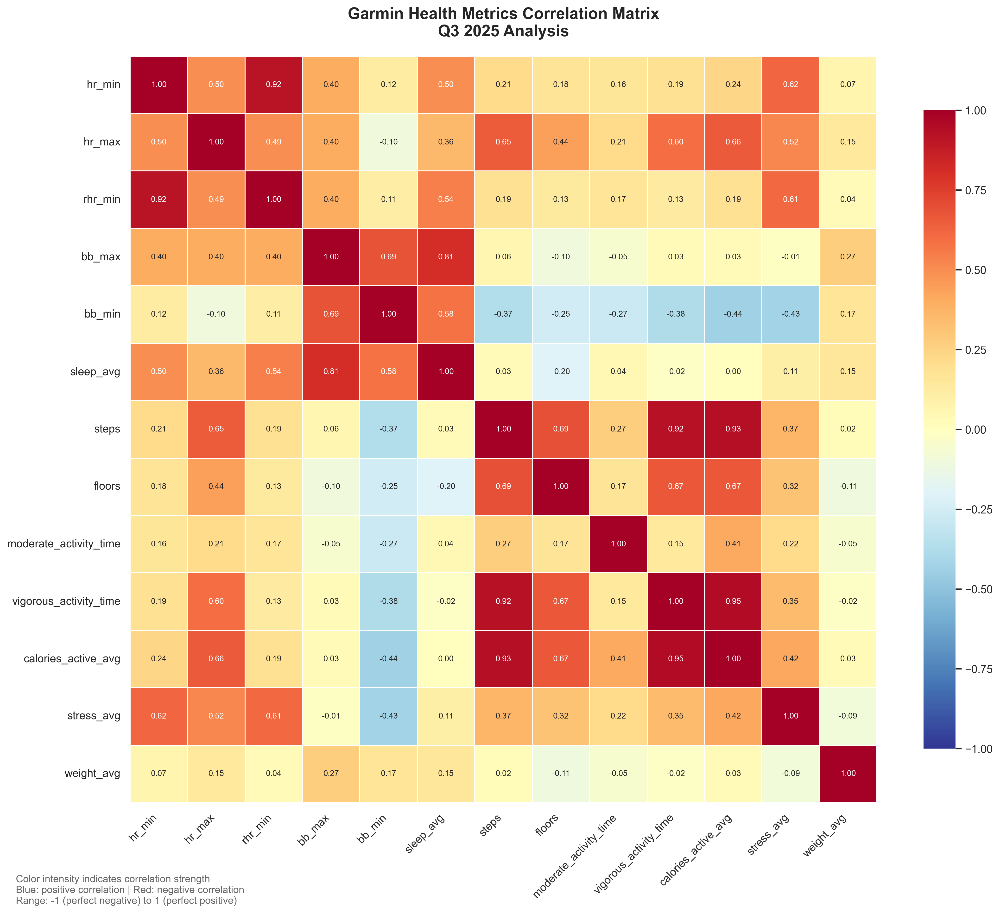
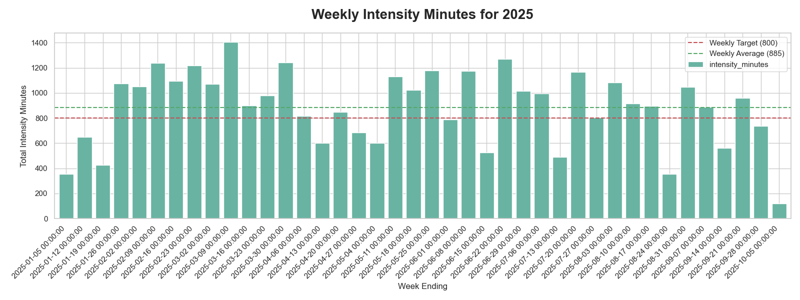
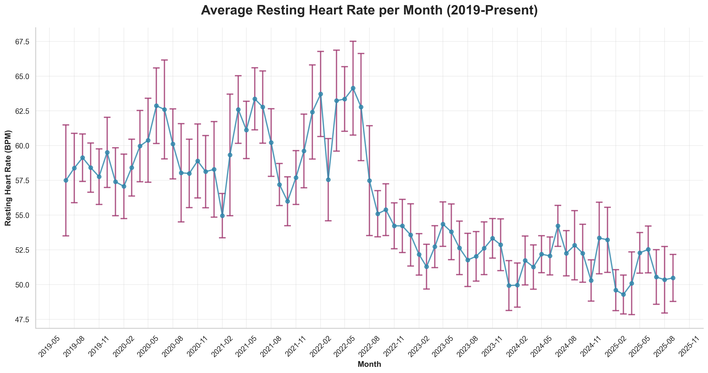
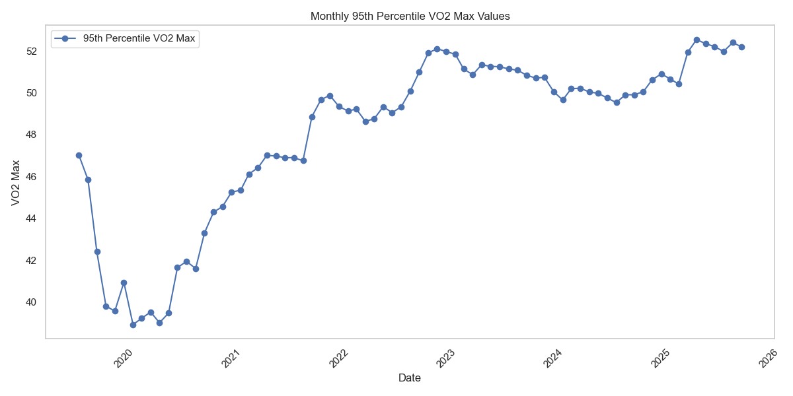
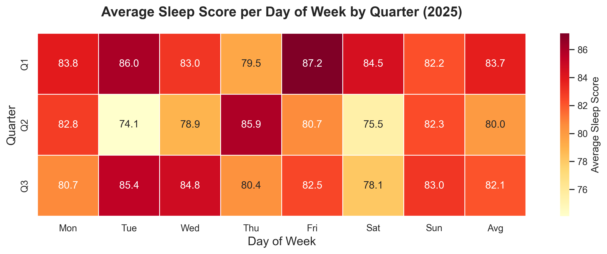
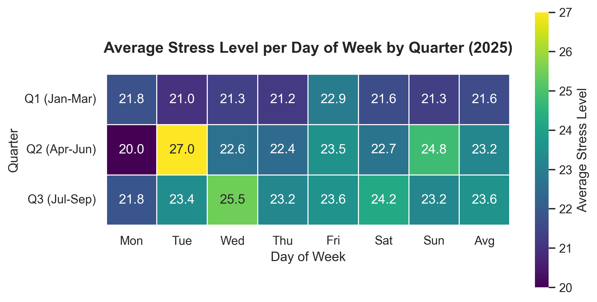
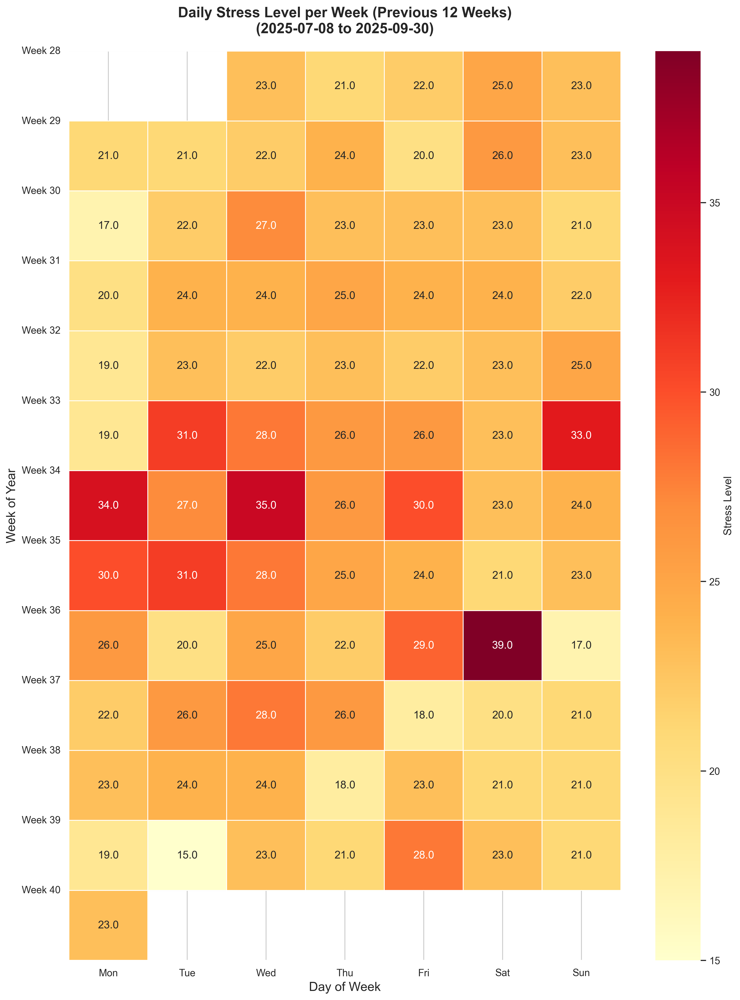

### Reflection

Add a reflection here. TBC.
### Focus Areas

As usual, there are four areas that I wanted to focus on:

- *Improve fitness* by training more. My goal is to get above a 75 fitness score on intervals.icu
- *Sleep better* by improving my sleep hygiene and experimenting with meal timing.
- *Reduce Stress* by examining meal composition and avoiding anything that might impact my sleep
- *Improve Biomarkers* by looking at my nutrition, as well as the above items.

Overall most metrics are improving, as we can see with the following key metrics.

Over the previous year we can see that:

* Resting Heart Rate is **decreasing** ✅
* Stress is **decreasing** ✅
* Steps are **maintaining** ✅
* Body Battery (max/day) is increasing ✅

We can see correlations for the quarter with the below correlation matrix.
  

Looking at the correlations, here's an analysis of the relationships and whether they make intuitive sense:

- Sleep is the most powerful driver of recovery (Body Battery), not activity volume.
- More movement predictably raises calorie burn but also nudges up stress and lowers recovery by bedtime.
- Heart rate measures (min HR, resting HR) are excellent indicators of stress load.
- Weight is largely independent from short-term fluctuations in activity, sleep, or stress.

Let’s go through how I did this quarter and what I experimented with.
#### Improve Fitness

##### Goals  

- Average intensity minutes (Garmin) of 800 or above ✅
- Improve Vo2Max ✅
- Decrease RHR ✅
##### Analysis

I look at intensity minutes as a way to make sure I'm getting enough fitness, regardless if I'm running or at the gym or kayaking. My goal is 800 minutes per week 80% of the weeks, which is significantly higher than the commonly recommended 150 minutes per week. The reason I've chosen to say "80% of the weeks" is because there are some weeks when I need to travel for work, and it is harder to reach this target.

For example, on one of my trips to China I only managed 348 minutes. Part of this was due to accidentally leaving my running kit in my check-in bag, but there was no way I was going to hit 800 minutes: I was working 12 - 16 hour days every day, and it was 40C outside, so could only run on a treadmill.

Similarly, I had a bit of a drop when I traveled to Singapore on a Monday, and back on Thursday. I did manage more intensity minutes, but did not meet my 800 minute goal.
  

My average intensity minutes for Q3 was 846 per week.

In addition to load we can have a look at Resting Heart Rate, as that is often related to sufficient recovery.
  

And let's look at Vo2Max, which stayed roughly the same this quarter.
  
##### Experiments

Towards the end of August I decided to make one big change to my fitness routine: trying to get both my run and strength training session completed before work. There are two reasons for this: 

* Firstly, I sometimes run out of time to go to the gym at lunch, or I have to cut workouts short.
* Secondly, to group all my exercise together. If doing a significant amount of exercise this could be a problem, but a 60min run and 30min strength session isn't really that much. What I am about to say is my opinion only, and I haven't read any research to substantiate. Here goes... due to my splitting of running and strength training, I'm activating mTOR twice per day, and sometimes consuming extra protein at lunch for the gym session. Additionally, when going to lunch, my Garmin highlights a significant amount of stress, which is why I avoid going to the gym at night (plus it being logistically challenging).  
 
My experiment was to wake up, have a protein shake supplemented with EAA, and go run straight away, and when returning home doing a strength session immediately afterwards. Then I'll have an extra large Nutty Pudding + LF yogurt + granola with my morning supplements, then shower. If I can turn this in to a long term habit I should be able to save some time each day, as it will cut down on the extra shower at lunch.

#### Improve Sleep
##### Goals
- Improve sleep quality ✅
##### Analysis

Let's have a look at my sleep scores since buying my Garmin:

  

And then when comparing each quarter this year we can see some trends with each day of the week. Although this quarter has seen an improvement, it looks like something happens midweek that knocks me off my sleep game.

My trip to China was also challenging for my sleep, even though I managed to avoid an overnight flight. My hotel room the first night was too close to the elevators and kept me up - until I requested to change rooms at 11PM - but even then I never really got back to sleep.

However, it really validated some hunches I was having: eating a heavy carb meal seems to disrupt my sleep. I can see this even on my Garmin, where my stress levels spike after certain meals, but not after others. I ordered a small bowl of noodles around 4:30PM when I arrived, and while glorious, my stress levels were elevated for hours. I even did a little walk afterwards to try and stabilise my blood sugar and insulin levels. 
##### Experiments

I conducted a few experiments this quarter, including:

- Nutrition: adjusting my final meal of the day to be a bit earlier (~4pm) and then also reducing the amount of lentils in it, increasing broccoli, and eliminating the raisin toppings. I also adjusted the seeds I topped it with to try and hit my Omega 3 : 6 ratio better.
- Hygiene: I continued to use my blue light blocking snap-on glasses every evening
- Morning light: I continued to use my DIY SAD light whenever possible.
- Caffeine: I continued to consume almost none, except for a tsp of matcha in my morning smoothie.
- Supplements: I'll continue with Tart Cherry for now, but I'm not certain on its efficacy.

Overall I'd consider these experiments a success.
#### Decrease Stress

##### Goals
- Decrease stress ❌
##### Analysis
Let's have a look at stress per quarter grouped by day of the week:

We can see an overall decrease in stress, and the lowest for the year. My stress levels on Tuesdays have decreased on average, but I think that is more likely because I slowed down going to the gym due to injury. Monday is the least stressful day of the week; my guess here is because that is when I tend to have a rest day.

  

Week 31 appears to have been fairly stressful, and coincidentally I started feeling like I was fighting something the week after. At the end of Week 32 I travelled to China, and then was there for all of Week 33. The days were quite long, and I had less control over my nutrition than I normally would.
##### Experiments

No stress-related experiments for the quarter.

#### Improve Nutrition

##### Goals
- Stick below 20g of saturated fat per day ✅
- Get between 110 and 125g of protein per day ✅
- Get over 70g of fibre per day ✅
- Meet 100% coverage of micronutrients ❌

So, why am I not at 100%? Let's look at areas where I can improve.

**Metabolism Support**

I'm probably close enough here to not worry about it.

**Antioxidants**

I now add a single carrot to my Nutty Pudding, so I expect that to slowly increase my beta-carotene levels this next quarter, and I've started eating "Melonballs", basically just small watermelons, so lycopene may increase. Ultimately I need to eat more tomatoes. This is an area of focus. 

For Lutein & Zeaxanthin, I believe my values are actually a little higher than this, but missing in some of the nutrient values in certain foods that I've added.

**Men's Health**

I'm OK with 112g. Cronometer does % for targets, so unless I can do a fixed target and combine that with % for fat and carbs, then this will be hard to always meet.

That's it. Everything else is where I want it to be.
###### Macronutrients

Let's see some other trends from Cronometer. We can see my energy consumption decreased in Q3, as I was doing less exercise, so my weight has remained stable. Saturated fats have decreased which is good, but that could just be due to eating less.

| Year | Quarter | Energy (kcal) | Carbs (g) | Protein (g) | Fiber (g) | Fat (g) | Saturated (g) |
| ---- | ------- | ------------- | --------- | ----------- | --------- | ------- | ------------- |
| 2025 | 2       | 3279.5        | 444.4     | 142.0       | 84.7      | 124.2   | 21.5          |
| 2025 | 3       | 2839.2        | 380.9     | 111.4       | 76.0      | 114.4   | 19.9          |

###### Vitamins and Minerals

Not many surprises here; B6, B12, and Vitamin D all increased. Interestingly Leucine and Methionine also increased despite fewer calories, which could be because I am eating more sardines and travelled more.

| Year | Quarter | QuarterLabel | B1 (Thiamine) (mg) | B2 (Riboflavin) (mg) | B3 (Niacin) (mg) | B5 (Pantothenic Acid) (mg) | B6 (Pyridoxine) (mg) | Vitamin D (IU) | Iron (mg) | Zinc (mg) | Leucine (g) | Lysine (g) | Methionine (g) | B12 (Cobalamin) (µg) |
| ---- | ------- | ------------ | ------------------ | -------------------- | ---------------- | -------------------------- | -------------------- | -------------- | --------- | --------- | ----------- | ---------- | -------------- | -------------------- |
| 2025 | 2       | 2025-Q2      | 5.1                | 3.1                  | 56.4             | 9.5                        | 5.0                  | 816.2          | 29.6      | 20.5      | 5.7         | 4.7        | 1.2            | 924.2                |
| 2025 | 3       | 2025-Q3      | 2.7                | 2.1                  | 50.7             | 8.2                        | 63.2                 | 2933.4         | 33.0      | 21.7      | 5.9         | 5.5        | 1.3            | 1216.3               |

| Year | Quarter | QuarterLabel | B1 (Thiamine) (mg) | B2 (Riboflavin) (mg) | B3 (Niacin) (mg) | B5 (Pantothenic Acid) (mg) | B6 (Pyridoxine) (mg) | Vitamin D (IU) | Iron (mg) | Zinc (mg) | Leucine (g) | Lysine (g) | Methionine (g) | B12 (Cobalamin) (µg) |
| --- | --- | --- | --- | --- | --- | --- | --- | --- | --- | --- | --- | --- | --- | --- |
| 2025 | 1 | 2025-Q1 | nan | nan | nan | nan | nan | nan | nan | nan | nan | nan | nan | nan |
| 2025 | 2 | 2025-Q2 | 5.1 | 3.1 | 56.4 | 9.5 | 5.0 | 816.2 | 29.6 | 20.5 | 5.7 | 4.7 | 1.2 | 924.2 |
| 2025 | 3 | 2025-Q3 | 2.7 | 2.1 | 50.7 | 8.2 | 63.2 | 2933.4 | 33.0 | 21.7 | 5.9 | 5.5 | 1.3 | 1216.3 |
#### Improve Biomarkers

##### Goals
- Decrease IGF-1 ❓
- Decrease MCV ❓
- Decrease RDW ❓
- Increase Albumin ❓
- Decrease hsCRP ❓
##### Analysis

[INSERT CHART FROM PHENOAGE]:

(Blood panels still to be taken)
##### Experiments

I did have a fair amount of experimentation here, including:

- **MCV & RDW**: After my biomarkers showed that I remain low on B12, Iron, and Vitamin D, I opted to focus on getting those in to better ranges. I swapped out the B Complete with a B12 (methylcobalamin) and L-Methylfolate combination, which I hope will increase absorption. I have also started to take a sublingual B12 every morning. There's also a need to optimise my iron balance by increasing my ferritin levels from 41 µg/L to somewhere between 60-80 µg/L; I've increased my frequency of taking a 20mg iron supplement.
- I've added in iodine (via kelp) now, too, given I'm essentially on a vegan diet and don't eat much salt.
- Updated my daily smoothie to have a carrot to try and increase my beta-carotene (vitamin A) intake without supplementing.
- Increased Vitamin D from 1,000 IU to 4,000 IU because my vitamin D levels have been deficient all year.
- Started eating sardines. Ideally I would like to drop or reduce the fish oil, as this has shown no impact on health or life span via the ITP.
- Started eating watermelon for the lycopene.
- Albumin: Potentially related to the FMD, or perhaps I just need more protein due to higher levels of training. I have contemplated cutting down on my protein consumption to lower IGF-1, but I think I'll keep the pea protein in my daily smoothie.

Because of subscribing to Cronometer I'm able to get more reports, such as my Nutrient Balances and Nutrient Targets, which have encouraged me to tweak the food I eat.

### Supplement Stack

Some principles that I tried to follow:

- Avoid bill burden; prefer food over pills.
- Wait until a supplement is on the ITP supported interventions page, or has significant evidence behind it
- Have a biomarker in mind that a certain supplement will change

And here's what was in my stack for Q3:

| Morning                     | Evening           | Ad Hoc            |
| --------------------------- | ----------------- | ----------------- |
| Fish Oil (6g)               | Astaxanthin (7mg) | Iron (20mg)       |
| Niacin (50mg)               | Glycine (5g)      | Vitamin C (500mg) |
| Calcium (333mg)             | NAC (1g)          |                   |
| Vitamin D (4000 IU)         | Tart Cheery       |                   |
| Vitamin K2 mk7 (100mcg)     |                   |                   |
| B12 Methyl (1000 mcg)       |                   |                   |
| B12 (Liposomal, 1000 mcg)   |                   |                   |
| L-Methylfolate  (1000 mcg)  |                   |                   |
| B5 P-5-P (50mg)             |                   |                   |
| Lysine (1g)                 |                   |                   |
| Zinc (5mg)                  |                   |                   |
| Hyaluronic Acid (200mg)     |                   |                   |
| Iodine (150mcg)             |                   |                   |
| Creatine (5g - in smoothie) |                   |                   |
| TMG (1.5g - in smoothie)    |                   |                   |
| Boron (1mg - in smoothie)   |                   |                   |
| Taurine (3g - in smoothie)  |                   |                   |

Here are the changes that I made this quarter:

* Increased **TMG** from 500mg to 1.5g to try and better support methylation and decrease homocysteine.
* Removed **HCP** in order to try and decrease IGF-1.
* Added a **liposomal form of B12**, just in case I have absorption issues. 
* Moved **iron** from being ad hoc to every evening, and taken alongside **vitamin C**.
* Removed **magnesium glycinate** from evening stack, as getting enough from diet.

I may add some of these back in at a later date.
### Focus For Next Quarter

I'll keep experimenting with Cronometer to refine my nutrition, and I've found great insight so far. Really really valuable increase to my understanding and approach to nutrition.

I'm contemplating dropping the following supplements, as it appears as though I am getting enough from food:

* Calcium - remove
* Fish oil - move to evening pills
* Lysine - remove
* Iron - every evening
* Vitamin C - every evening
* Zinc - increase to 15mg from 5mg

Wish me luck!
