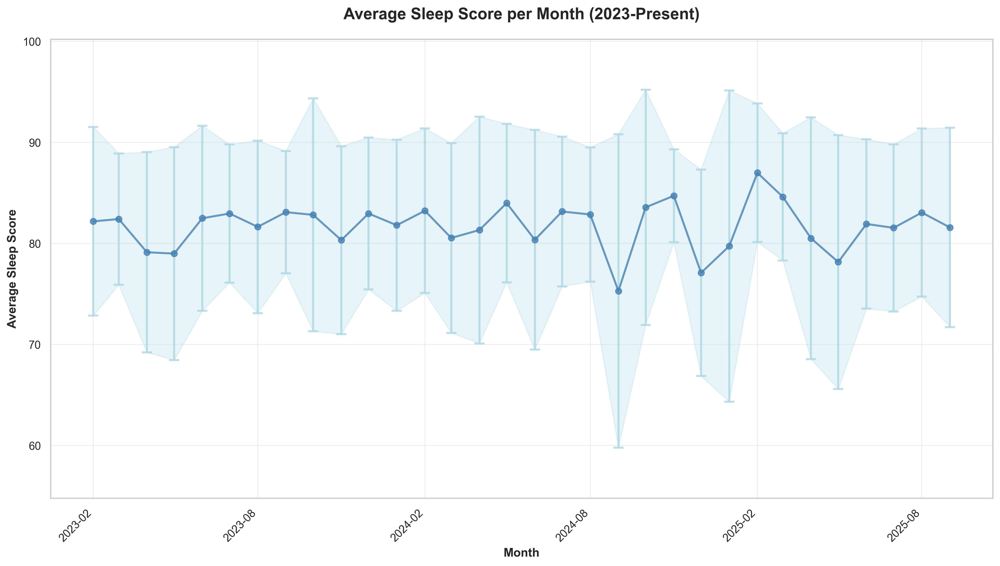
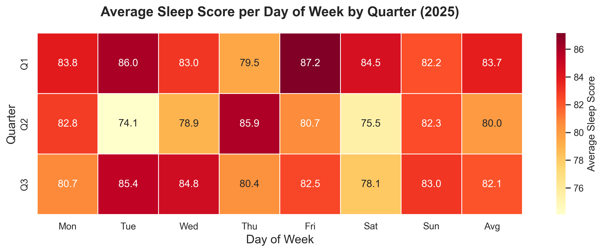
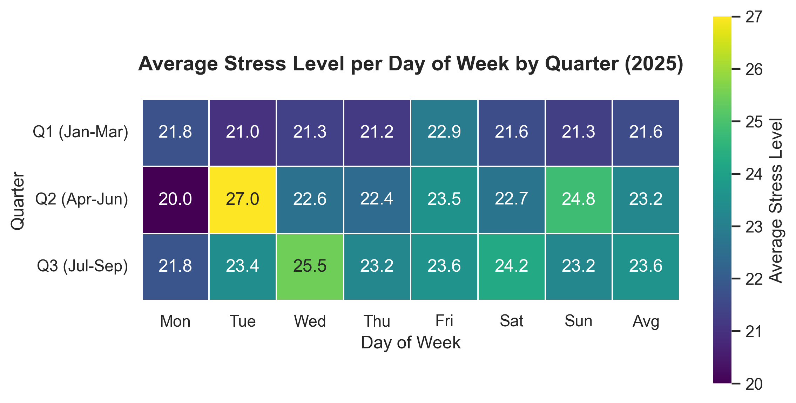

  

### Reflection

Add a reflection here.
### Focus Areas

As usual, there are four areas that I wanted to focus on:

- *Improve fitness* by training more. My goal is to get above a 75 fitness score on intervals.icu
- *Sleep better* by improving my sleep hygiene and experimenting with meal timing.
- *Reduce Stress* by examining meal composition and avoiding anything that might impact my sleep
- *Improve Biomarkers* by looking at my nutrition, as well as the above items.

Let’s go through how I did this quarter and what I experimented with.

Overall most metrics are improving, as we can see with the following key metrics.

  

#### Improve Fitness

##### Goals  

- Fitness score of 75 or above ❌
- Average intensity minutes of 800 or above ✅
- Improved Vo2Max ✅
- Decrease RHR ✅
##### Analysis

I look at intensity minutes as a way to make sure I'm getting enough fitness, and I have a target of 800 minutes per week according to Garmin.

  

We can also see this represented in my yearly chart from intervals:

[INSERT INTERVALS CHART HERE]: 

In addition to load we can have a look at Resting Heart Rate, as that is often related to sufficient training.
  
  
##### Experiments

I didn't have any fitness-related experiments this quarter; just rinse and repeat.

  #### Improve Sleep
##### Goals
- Improve sleep quality ❌
##### Analysis

Let's have a look at my sleep scores since buying my Garmin:

  

And then when comparing each quarter this year we can see some trends with each day of the week. Although this quarter has seen an improvement, it looks like something happens midweek that knocks me off my sleep game.

##### Experiments

I conducted a few experiments this quarter, including:

- Nutrition: adjusting my final meal of the day to be a bit earlier (~4pm) and then also reducing the amount of lentils in it, increasing broccoli, and eliminating the raisin toppings. I also adjusted the seeds I topped it with to try and hit my Omega 3 : 6 ratio better.
- Hygiene: I continued to use my blue light blocking snap-on glasses every evening
- Morning light: I continued to use my DIY SAD light whenever possible.
- Caffeine: I continued to consume almost none, except for a tsp of matcha in my morning smoothie.
- Supplements: I'll continue with Tart Cherry for now, but I'm not certain on its efficacy.

Overall I'd consider these experiments a success.
#### Decrease Stress

##### Goals
- Decrease stress ❌
##### Analysis
Let's have a look at stress per quarter grouped by day of the week:

We can see an overall decrease in stress, and the lowest for the year. My stress levels on Tuesdays have decreased on average, but I think that is more likely because I slowed down going to the gym due to injury. Monday is the least stressful day of the week; my guess here is because that is when I tend to have a rest day.

  

Week 31 appears to have been fairly stressful, and coincidentally I started feeling like I was fighting something the week after.
##### Experiments
No stress-related experiments for the quarter.
#### Improve Biomarkers

##### Goals
- Decrease IGF-1 ❌
- Decrease MCV ✅
- Decrease RDW ✅
- Increase Albumin ✅
- Decrease hsCRP ✅
##### Analysis

[INSERT CHART FROM PHENOAGE]:

We can see that...
##### Experiments

I did have a fair amount of experimentation here, including:

- After my biomarkers showed that I remain low on B12, Iron, and Vitamin D, I opted to focus on getting those in to better ranges. I swapped out the B Complete with a B12 (methylcobalamin) and L-Methylfolate combination, which I hope will increase absorption. I have also started to take a sublingual B12 every morning.
- I've added in iodine (via kelp) now, too, given I'm essentially on a vegan diet and don't eat much salt.
- Updated my smoothie to have a carrot to try and increase my vitamin A intake without supplementing.
- Started taking 20mg iron every night.
- Increased Vitamin D from 1,000 IU to 4,000 IU
- Started eating sardines. Ideally I would like to drop the fish oil, as this has shown no impact on health or life span via the ITP.
- Started eating watermelon for the lycopene

Because of subscribing to Cronometer I'm able to get more reports, such as my Nutrient Balances and Nutrient Targets, which have encouraged me to tweak the food I eat.

For example, here are my Nutrient Targets (without supplementation):

[NUTRIENT TARGETS CHART]:

And here are my Balances (with supplementation):

[NUTRIENT BALANCES CHART]:
### This Quarter's Supplement Stack

Some principles that I tried to follow:

- Avoid bill burden; prefer food over pills.
- Wait until a supplement is on the ITP supported interventions page
- Have a biomarker in mind that a certain supplement will change

And here's what is currently in my stack:

| Morning                     | Evening           | Ad Hoc |
| --------------------------- | ----------------- | ------ |
| Fish Oil (6g)               | Astaxanthin (7mg) |        |
| Niacin (50mg)               | Glycine (5g)      |        |
| Calcium (333mg)             | NAC (1g)          |        |
| Vitamin D (4000 IU)         | Iron (20mg)       |        |
| Vitamin K2 mk7 (100mcg)     | Vitamin C (1g)    |        |
| B12 Methyl (1000 mcg)       |                   |        |
| L-Methylfolate  (1000 mcg)  |                   |        |
| Lysine (1g)                 |                   |        |
| Zinc (5mg)                  |                   |        |
| Hyaluronic Acid (200mg)     |                   |        |
| Iodine (150mcg)             |                   |        |
| Creatine (3g - in smoothie) |                   |        |
| TMG (2g - in smoothie)      |                   |        |
| HCP (15g - in smoothie)     |                   |        |

### Other Random Charts

We can see correlations for the quarter with this chart. I would like to supplement this with additional data at some point, because most of these metrics are fairly obvious how they are correlated. For example, steps and distance, or floors_up and floors_down. 
  

### Focus For Next Quarter

I think the next quarter will remain similar to this one. I've subscribed to Cronometer, so I'm getting some additional insight from that. I'm contemplating dropping the following supplements, as it appears as though I am getting enough from food:

* Calcium
* Fish oil
* Lysine

