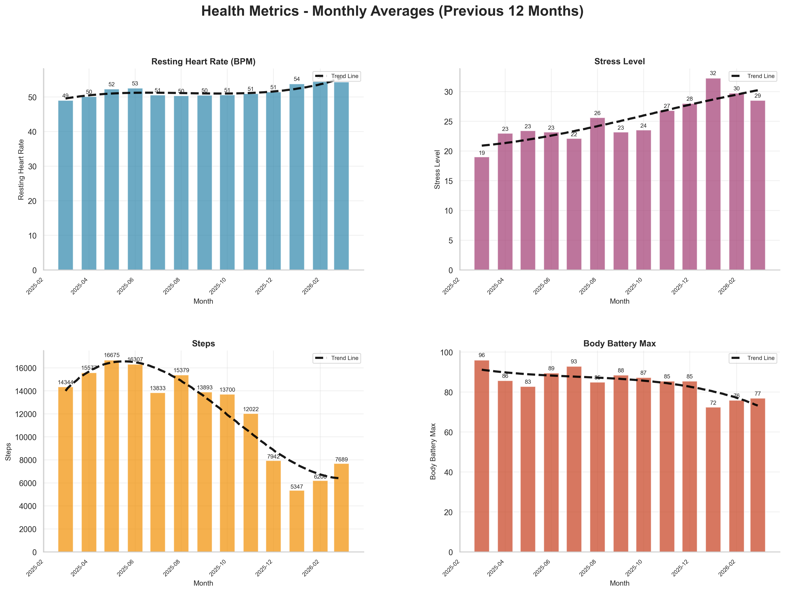
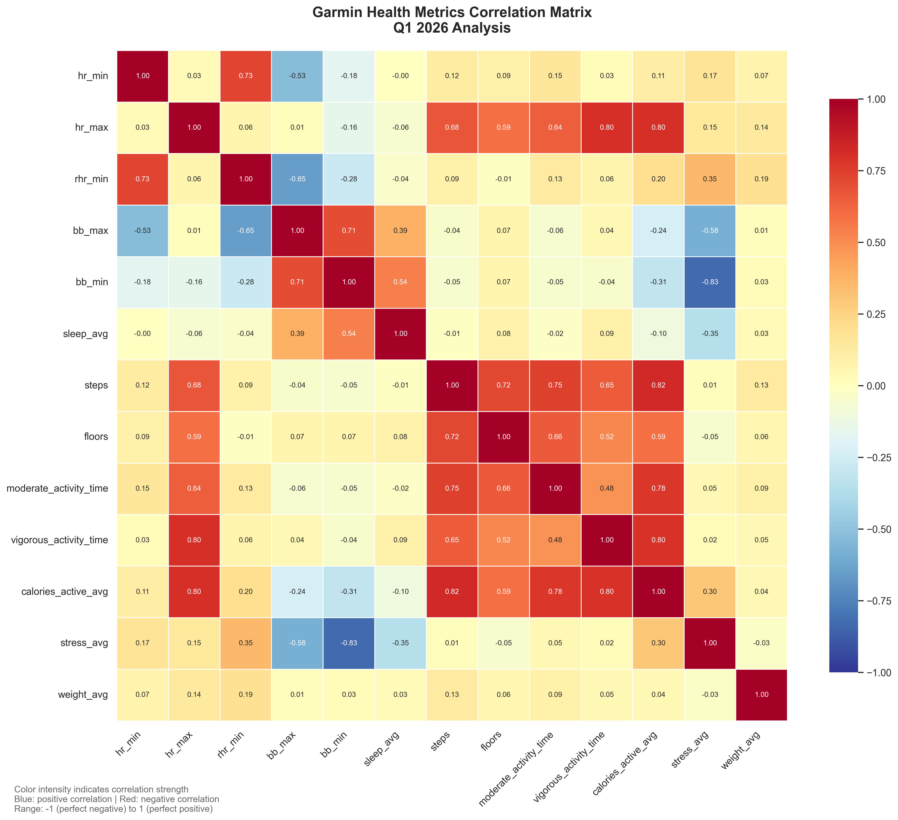
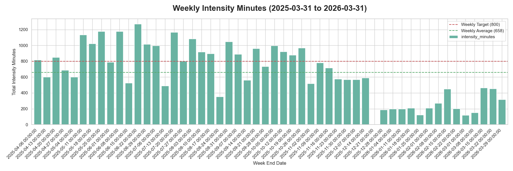
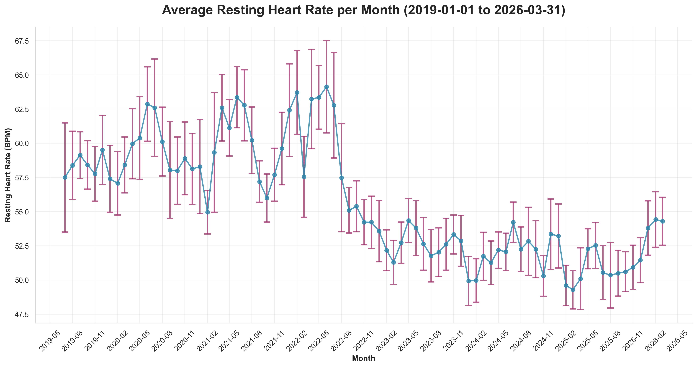
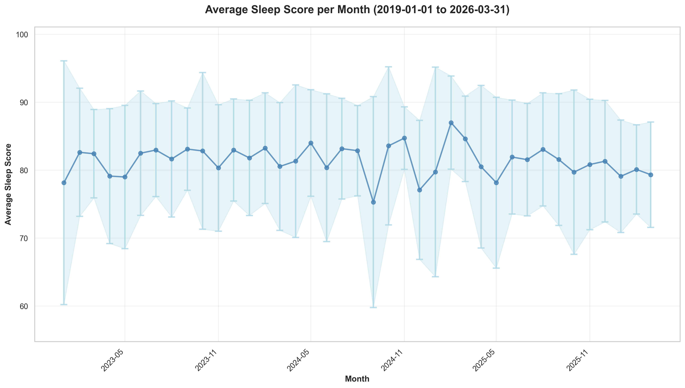
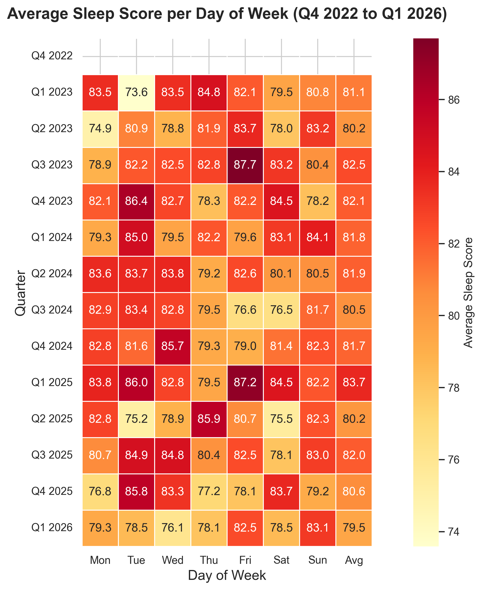
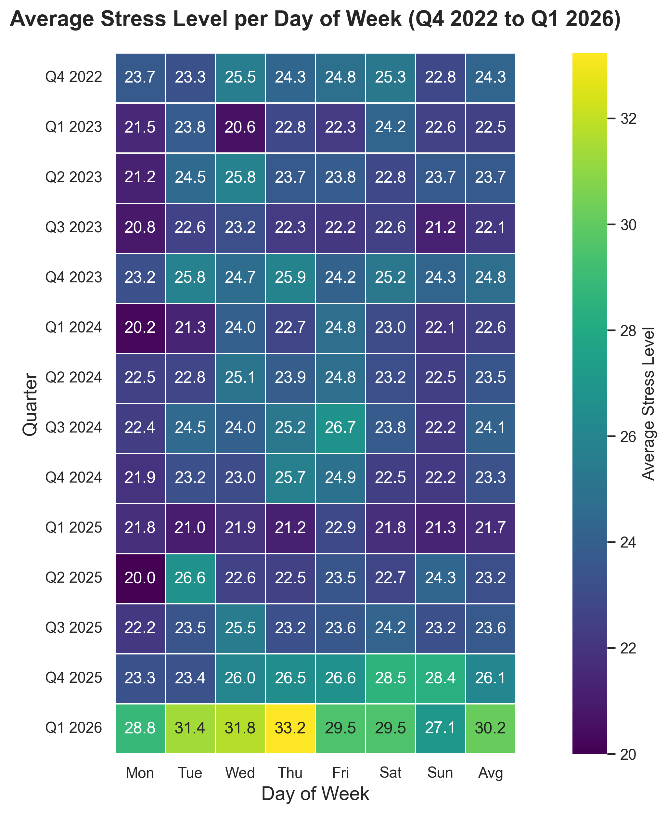
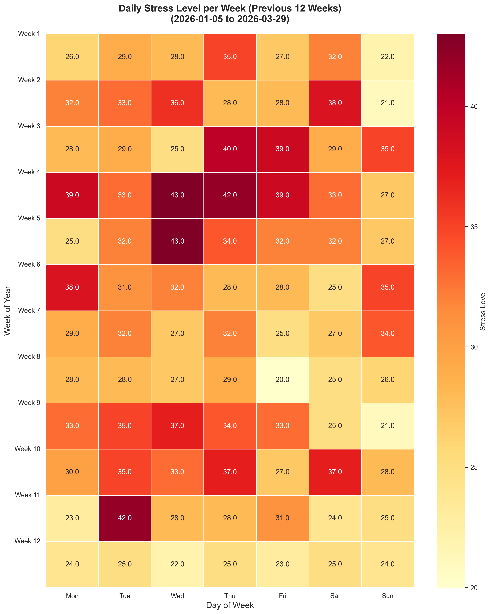

### Reflection

Q1 2026 was a rebuilding quarter from a training and recovery perspective. The data shows reduced training load, lower daily steps, higher stress, and lower body battery relative to late 2025.

### Focus Areas

As usual, there are four areas that I wanted to focus on:

- *Improve fitness* by training more. My goal is to maintain 800 intensity minutes on average per week.
- *Sleep better* by improving my sleep hygiene and experimenting with meal timing.
- *Reduce stress* by examining meal composition and avoiding anything that might impact my sleep.
- *Improve biomarkers* by looking at my nutrition, as well as the above items.

Overall most metrics moved in the wrong direction this quarter, as we can see with the following key metrics.
  

Over the previous quarter (Q4 2025 to Q1 2026):

- Resting heart rate rose from 51 to 54 (+3 bpm).
- Stress rose from 25 to 29 (+16%).
- Average daily steps dropped from 11,289 to 6,420 (-43%).
- Body battery dropped from 89 to 78 (-12%).
- Weekly intensity (median) dropped from 583 to 205 (-65%).

We can see correlations for the quarter with the below correlation matrix.
  

Looking at the correlations, a few stood out:

- `bb_min` and `stress_avg` were strongly negatively correlated (-0.83), which aligns with higher stress days draining recovery.
- Activity and output metrics stayed tightly linked (`steps` with `calories_active_avg`: 0.82; `hr_max` with `calories_active_avg`: 0.80).
- `hr_min` and `rhr_min` remained strongly coupled (0.73), which is expected.

Let us go through how the quarter looked by focus area.

#### Improve Fitness

##### Goals

- Average intensity minutes (Garmin) of 800 or above ❌
- Improve Vo2Max ⚪ (no data)
- Decrease RHR ❌

##### Analysis

I look at intensity minutes as a way to make sure I am getting enough fitness, regardless of whether I am running, at the gym, or kayaking.
  

For Q1 2026:

- Average weekly intensity minutes: **258**
- Median weekly intensity minutes: **209**
- Weeks >= 800 minutes: **0 of 13**

In addition to load, resting heart rate is useful for interpreting adaptation and recovery.
  

Q1 2026 monthly average RHR sat around **54.2 bpm**, up from Q4 2025 levels.

VO2 max could not be evaluated this quarter, likely due to no qualifying running activities in the configured period.

##### Experiments

No fitness experiment notes were recorded in this dataset for Q1.

#### Improve Sleep

##### Goals

- Keep average sleep score about 80 ⚠️

##### Analysis

Sleep held close to target but was slightly down from Q4.
  

Q1 2026 average sleep score was **79.5** (vs **80.6** in Q4 2025).

Day-of-week pattern for Q1:

- Best: Sunday (**83.1**) and Friday (**82.5**)
- Weakest: Wednesday (**76.1**) and Thursday (**78.1**)

##### Experiments

No sleep-specific experiment notes were captured in the generated data. Add qualitative notes here if needed.

#### Decrease Stress

##### Goals

- Decrease stress ❌

##### Analysis

Stress increased this quarter.

Quarter average stress was **30.2**. Highest days were Thursday (**33.2**) and Wednesday (**31.8**), while Sunday was lowest (**27.1**).

The 12-week heatmap shows consistently elevated stress through the quarter rather than a short isolated spike.

##### Experiments

No stress-specific interventions were logged in this dataset for Q1.

#### Improve Biomarkers

##### Goals

- Decrease IGF-1 ❓
- Decrease MCV ✅
- Decrease Fasting Glucose ❌
- Decrease RDW ⚠️
- Increase Albumin ❓
- Maintain hsCRP ✅

##### Analysis

The latest biomarker follow-up happened after quarter-end, so the April 22, 2026 results are compared against the most recent prior available result for each marker.

| Biomarker   | Prior                  | Latest                   | Trend                       | Status                 |
| ----------- | ---------------------- | ------------------------ | --------------------------- | ---------------------- |
| **IGF-1**   | 35 nmol/L (2025-10-10) | Not retested in Apr 2026 | No update                   | Previously above range |
| **MCV**     | 101 fL (2026-01-17)    | 95 fL (2026-04-22)       | Decreased                   | Back in range          |
| **RDW**     | 12.5% (2026-01-17)     | 12.8% (2026-04-22)       | Increased slightly          | Still in range         |
| **Albumin** | 45 g/L (2026-01-17)    | Not retested in Apr 2026 | No update                   | Previously in range    |
| **hsCRP**   | 0.2 mg/L (2025-10-10)  | <0.2 mg/L (2026-04-22)   | Stable to slightly improved | Excellent / in range   |

- **MCV** was the clearest win, dropping from 101 fL on January 17, 2026 to 95 fL on April 22, 2026 and returning to the normal range.
- **hsCRP** remained very low, improving slightly from 0.2 mg/L on October 10, 2025 to <0.2 mg/L on April 22, 2026.
- **RDW** moved slightly in the wrong direction from 12.5% to 12.8%, but it still sits comfortably within range.
- **IGF-1** still needs retesting, since the latest result on file remains the elevated 35 nmol/L result from October 10, 2025.
- **Albumin** cannot be reassessed yet because it was not rerun in the April 2026 follow-up.

Additional April follow-up items also stood out:

- Free testosterone fell from 260 pmol/L on March 28, 2025 to 183 pmol/L on April 23, 2026 and is now below range.
- SHBG improved from 68 nmol/L on March 28, 2025 to 57 nmol/L on April 23, 2026, but it remains above range.
- FSH increased from 7.7 IU/L on March 28, 2025 to 10 IU/L on April 23, 2026, putting it slightly above range.
- Total testosterone fell from 20.5 nmol/L on March 28, 2025 to 13.1 nmol/L on April 23, 2026, though it remains in range.

When plugging this into PhenoAge we get a view like this:

![[Pasted image 20260425154148.png]]

This is a slight improvement from my previous test, but a slight decrease from two tests ago.

##### Experiments

* The improved MCV values are likely from fine tuning my b12 and folate supplements that have been ongoing over the previous 9 months. Also of note is that my homocysteine levels have also dropped by almost 50% since this time last year.

#### Improve Nutrition

Back in Q4 I stopped tracking my nutrition so closely, as adding them into Cronometer was taking more effort than I'd like. Additionally I went on a road trip, which meant eating out a substantial amount of meals, so that became problematic.
##### Experiments

* Get back to meal prepping a majority of my meals. Although I did meal prep a lot in Q1, there were still a number of meals that I had to eat out.
* I started eating more yogurt to see if it could help increase my Red Cell Count (RCC), but I see no change here, so I'm dropping given the dairy portion might have contributed to my stubbornly high IGF-1 and LDL values.
### Supplement Stack

Some principles that I tried to follow:

- Avoid pill burden; prefer food over pills.
- Wait until a supplement is on the ITP supported interventions page, or has significant evidence behind it.
- Have a biomarker in mind that a certain supplement will change.

| Morning                     | Evening            | Ad Hoc            |
| --------------------------- | ------------------ | ----------------- |
| Vitamin D (5000 IU)         | Glycine (10g)      | Iron (20mg)       |
| Vitamin K2 mk7 (100mcg)     | NAC (1g)           | Vitamin C (500mg) |
| B12 Methyl (1000 mcg)       | Tart Cherry        | B5 P-5-P (50mg)   |
| L-Methylfolate  (1000 mcg)  | Melatonin (300mcg) | Magnesium         |
| B6 (25mg)                   |                    |                   |
| Zinc (15mg)                 |                    |                   |
| Hyaluronic Acid (200mg)     |                    |                   |
| Iodine (150mcg)             |                    |                   |
| Creatine (5g - in smoothie) |                    |                   |
| TMG (1.5g - in smoothie)    |                    |                   |
| Boron (1mg - in smoothie)   |                    |                   |
| Taurine (3g - in smoothie)  |                    |                   |
| Astaxanthin (7mg)           |                    |                   |
| Fish Oil (6g)               |                    |                   |
|                             |                    |                   |
|                             |                    |                   |
|                             |                    |                   |
##### Experiments

* I dropped Niacin in the previous quarter, and I'll keep that out for now. Although my sleep score decreased, I had fewer nights of waking up at 2am wide awake.
* I added fish oil back in, as it turns out I wasn't eating sardines that frequently. I'll leave it in for now unless this changes.

### Focus For Next Quarter

Based on Q1 2026 data, key priorities for Q2 2026 are:

- Rebuild weekly training volume gradually toward the 800-minute target.
- Recover average daily steps back into 10k+ territory.
- Prioritise stress-reduction habits on mid-week days (especially Wed/Thu).
- Bring average sleep score back above 80 consistently.
- Re-test IGF-1 and Albumin, confirm that the MCV improvement holds, and follow up the Free Testosterone / SHBG / FSH pattern.

From a supplement perspective, next quarter I'll be changing:

* Dropping Astaxanthin, as evidence seems to indicate it is most beneficial for skin health, and I'd rather use the money to buy sunscreen. I may change if my inflammation levels rise, but they have historically been low.
* I'm combining my B-vitamins into a single pill to reduce burden.
* Dropping Tart Cherry and Melatonin from my night time ritual - I don't think they're significantly helping with sleep quality.
