### Reflection

Q2 2026 was a better recovery quarter than Q1: stress dropped, body battery improved, steps came back up, active calories increased, and VO2 max started to recover.

It was not a clean win. Sleep stayed just under target, May had a noticeable dip, and weekly intensity was still well below the 800-minute goal. But after the injury-disrupted Q1, this looks like movement in the right direction rather than another quarter of drift.

### Focus Areas

As usual, there are five areas that I wanted to focus on:

- *Improve fitness* by rebuilding training volume and getting back toward consistent weekly load.
- *Sleep better* by improving sleep hygiene and meal timing.
- *Reduce stress* by reinforcing daily recovery habits.
- *Improve biomarkers* by focusing on measurable lab outcomes.
- *Improve nutrition* by using food choices to support glucose, recovery, and biomarkers.

Overall quarter snapshot:
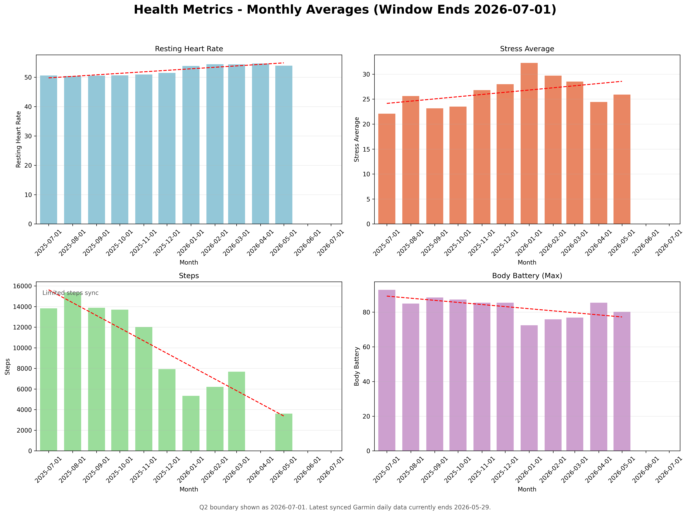

Data coverage note: LifeDB synced successfully on July 11, 2026, with Garmin data available beyond the end of Q2. The Q2 Garmin analysis below uses daily-summary records from April 1 through June 30, 2026, plus 88 scored sleep nights.

Quarter-over-quarter highlights:

- Average stress fell from **30.2** in Q1 to **25.9** in Q2, based on 89 Q2 daily-summary records.
- Average max body battery rose from **75.0** in Q1 to **82.4** in Q2.
- Average daily steps rose from **6,421** in Q1 to **9,069** in Q2.
- Average active calories rose from **363** in Q1 to **520** in Q2.
- Average resting heart rate was flat at **54.2 bpm** in both Q1 and Q2.
- Average sleep score was essentially flat: **79.5** in Q1 vs **79.2** in Q2, across 88 scored Q2 nights.
- Average daily intensity rose from **35.6** to **72.2** intensity minutes, but that still was not enough to hit the weekly target.

Correlations for the quarter:
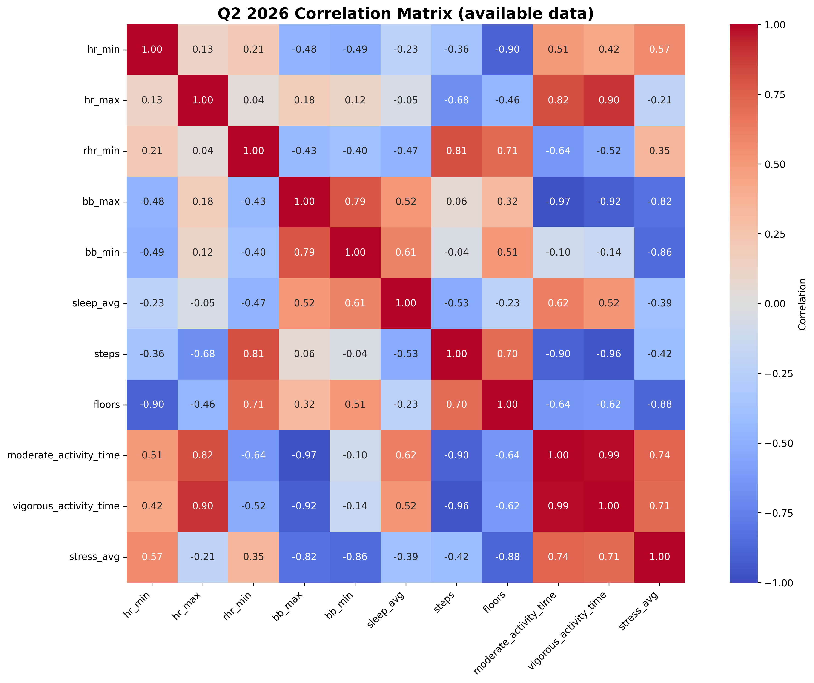

The broad pattern is what I would expect: activity and output metrics cluster together, and stress still sits opposite recovery. The most useful practical signal is not exotic: higher-stress weeks were the weeks where body battery recovery looked more fragile, and the better activity weeks tended to line up with higher active calories and steps.

Let us go through how the quarter looked by focus area.

#### Improve Fitness

##### Goals

- Average intensity minutes (Garmin) of 800 or above ❌
- Improve Vo2Max ⚠️
- Decrease RHR ⚠️

##### Analysis

I look at intensity minutes as a way to make sure I am getting enough fitness, regardless of whether I am running, at the gym, or kayaking.
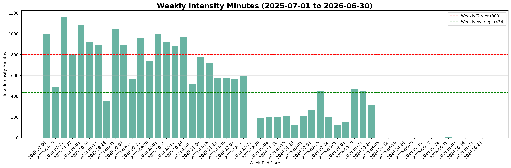

Q2 was a real improvement from Q1, but still below the target:

- Weeks counted: **14** week-ending buckets
- Average weekly intensity minutes: **459.4**
- Median weekly intensity minutes: **434.0**
- Weeks at or above 800 minutes: **1 of 14**
- Best week: **960** minutes, week ending June 14
- Lowest week: **128** minutes, week ending June 30, because it only contains the final two Q2 days

That is much better than Q1's very low training load, but it is still a long way from the 800-minute goal. April started strongly, May dipped, and June had one very big week before settling back down.

Resting heart rate is more complete:
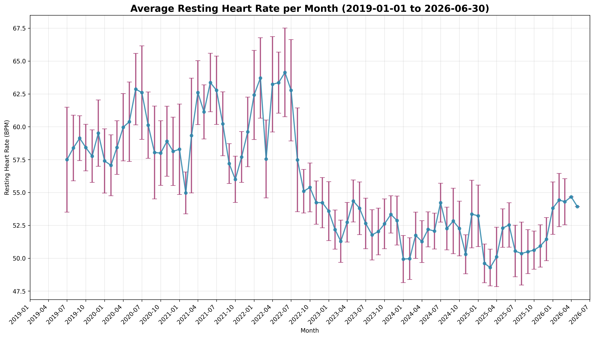

Average RHR was **54.2 bpm**, exactly flat against Q1. Monthly RHR moved from **54.7** in April to **54.0** in May and **53.9** in June, so there is a small positive slope inside the quarter even though the quarter average did not improve.

VO2 max came back onto the board with **13** readings between April 10 and June 27:

- Minimum: **46**
- Maximum: **48**
- Average: **46.8**

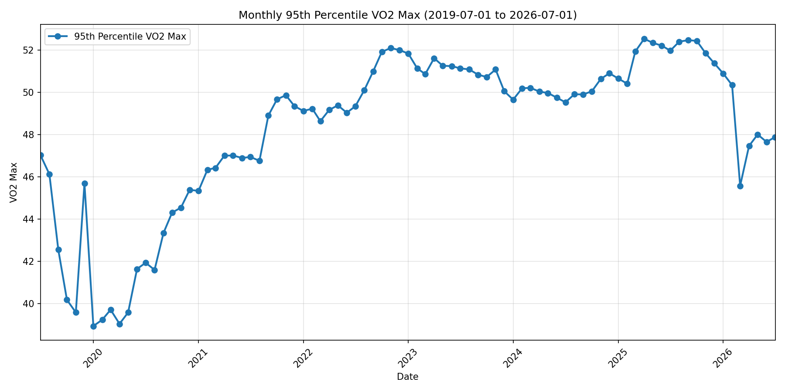

That is still below late-2025 levels, but it improved from the Q1 readings around 45 and gives me a usable baseline for Q3.

The activity mix also looked more alive again: LifeDB found **52** Q2 activities, led by walking, fitness equipment, running, and hiking.

##### Experiments

The Q1 plan was to rebuild training volume with a more structured running and strength schedule. The data suggests I did rebuild, but not consistently enough yet. The Q3 experiment should be less about finding the perfect schedule and more about making the ordinary weeks repeatable.

#### Improve Sleep

##### Goals

- Keep average sleep score about 80 ⚠️

##### Analysis

Sleep stayed close to target, but just under where I want it.
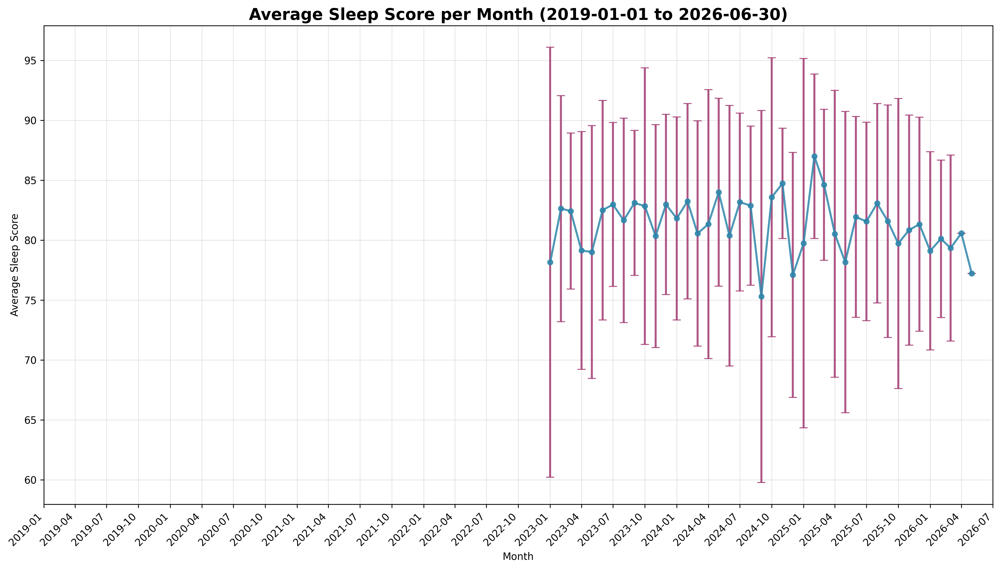

For Q2:

- Nights with sleep-score data: **88**
- Average sleep score: **79.2**
- Average sleep duration: **7.43 hours**
- Q1 comparison: **79.5** average sleep score and **7.27 hours** average sleep duration

Monthly sleep score was **80.6** in April, **77.8** in May, and **79.2** in June. That makes May the main weak patch of the quarter.

Day-of-week sleep pattern:
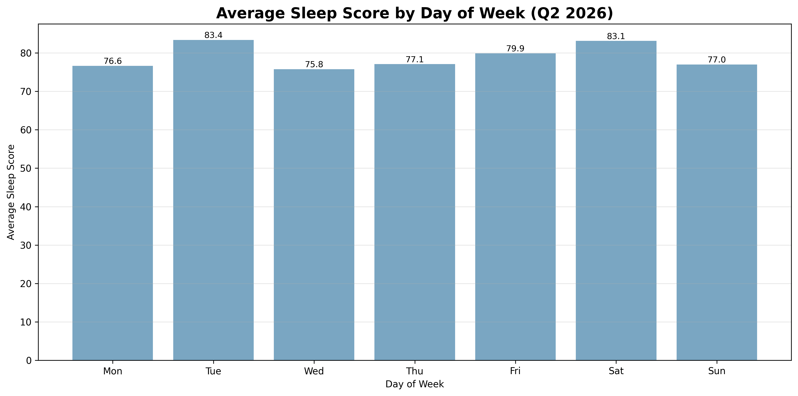

The strongest sleep-score days were Saturday (**81.8**, 12 nights) and Friday (**80.0**, 13 nights). The weakest were Monday and Thursday, both **78.2**. The day-of-week spread is not enormous, but the work-week pattern is still visible.

##### Experiments

The main practical sleep question remains meal timing and evening routine. The numbers say I am close to target, but not reliably above it. That means Q3 should focus on consistency rather than a new complicated intervention.

#### Decrease Stress

##### Goals

- Decrease stress ✅

##### Analysis

Stress is the clearest improvement in the Q2 Garmin data.

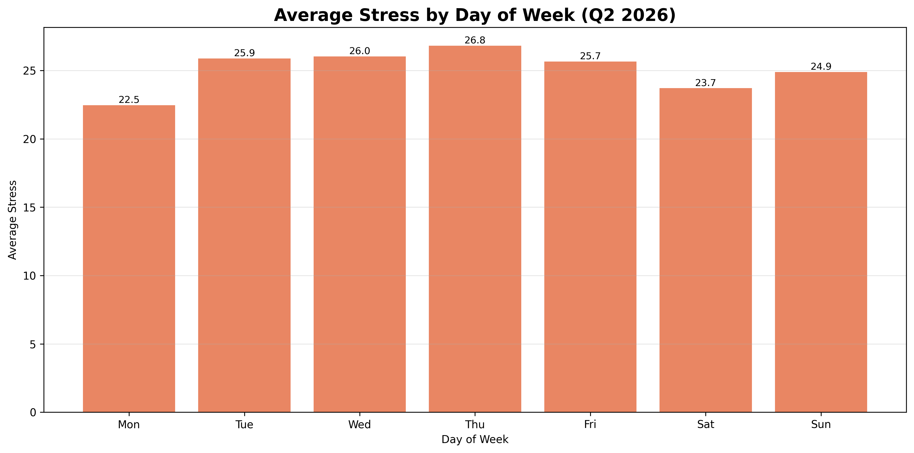

Average stress dropped from **30.2** in Q1 to **25.9** in Q2, across **89** daily-summary records. That is a meaningful move in the right direction.

Weekly stress trend:
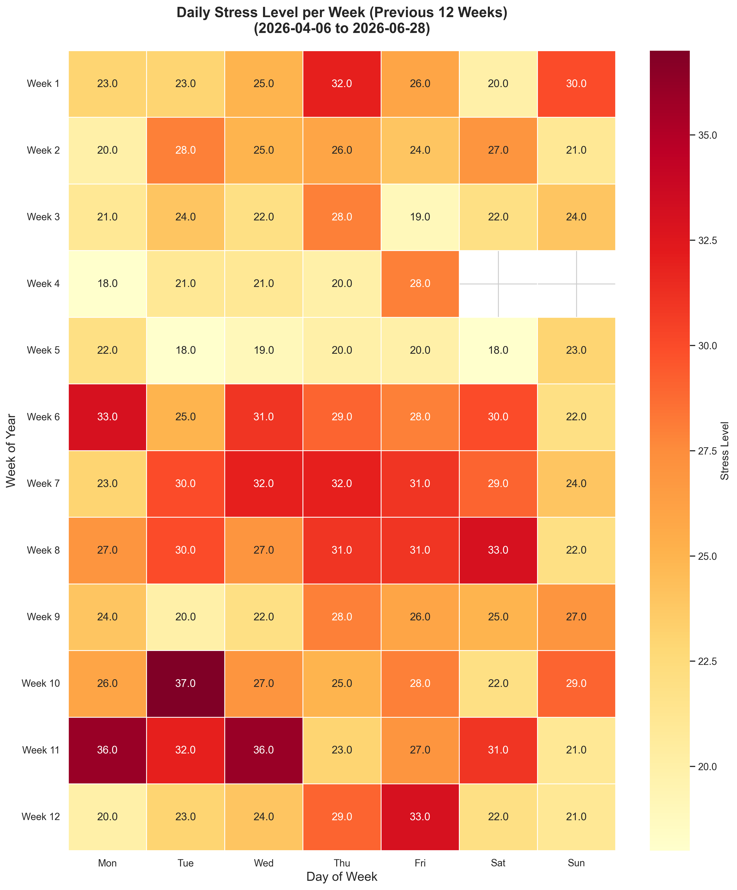

The highest-stress days were Thursday (**27.2**) and Friday (**26.9**). Monday was lowest (**24.5**), with Sunday also relatively low (**24.7**). So the mid-to-late-week stress pattern is still there, but the whole baseline looks lower than Q1.

##### Experiments

I do not want to over-explain the cause from Garmin data alone. The measured result is clear: stress came down and recovery improved. The useful Q3 question is what made April work better, and how to avoid the May dip turning into a default pattern.

#### Improve Biomarkers

##### Goals

- Decrease IGF-1 ❓
- Keep MCV in range ✅
- Decrease fasting glucose ❌
- Keep RDW stable ⚠️
- Increase or maintain albumin ❓
- Maintain hsCRP ✅
- Follow up free testosterone / SHBG / FSH ⚠️

##### Analysis

The latest biomarker follow-up in the `Biomarkers` sheet is from April 22, 2026, which sits inside Q2. I also checked the `PhenoAge History` sheet for the April 23, 2026 PhenoAge update.

| Biomarker | Prior | Latest | Trend | Status |
| --- | --- | --- | --- | --- |
| **IGF-1** | 35 nmol/L (2025-10-10) | Not retested in Apr 2026 | No update | Previously above range |
| **MCV** | 101 fL (2026-01-17) | 95 fL (2026-04-22) | Decreased | Back in range |
| **Glucose** | 5.1 mmol/L (2025-10-10) | 5.4 mmol/L (2026-04-22) | Increased | Borderline / worse |
| **RDW** | 12.5% (2026-01-17) | 12.8% (2026-04-22) | Increased slightly | In range |
| **Albumin** | 45 g/L (2026-01-17) | Not retested in Apr 2026 | No update | Previously in range |
| **hsCRP** | <4.0 mg/L (2026-01-17) | <0.2 mg/L (2026-04-22) | Improved / clearer low result | Excellent |
| **Free Testosterone** | 260 pmol/L (2025-03-28) | 183 pmol/L (2026-04-22) | Decreased | Below range |
| **SHBG** | 68 nmol/L (2025-03-28) | 57 nmol/L (2026-04-22) | Decreased | Still above range |
| **FSH** | 7.7 IU/L (2025-03-28) | 10 IU/L (2026-04-22) | Increased | Slightly above range |

Key interpretation:

- The clearest win is **MCV**, which moved from out of range back into range.
- **hsCRP** is excellent at **<0.2 mg/L**.
- **Glucose** is now the main metabolic marker to watch, sitting at the top edge of the reference threshold.
- **Free testosterone / SHBG / FSH** still need follow-up. SHBG improved but remains high; free testosterone is below range; FSH is slightly above range.
- **IGF-1** and **albumin** still need retesting because they were not included in the April follow-up.

PhenoAge also updated on April 23, 2026:

- Chronological age: **43.2**
- Phenotypic age: **32.34**
- Difference: **10.84 years younger**

That is a tiny improvement in phenotypic age from **32.41** on January 17, 2026, though the overall difference only widened because chronological age also moved forward.

##### Experiments

The improved MCV result still points in the right direction for the B12/folate work from previous quarters.

The glucose experiment was the main nutrition-linked biomarker experiment this quarter. The CGM made it much easier to see which meals were uneventful and which meals caused a large spike. The laksa example was the clearest warning shot: the spike was obvious, and even walking afterward did not fully blunt it.

#### Improve Nutrition

##### Goals

- Improve glucose control.
- Keep meal prep consistent enough that eating out does not become the default.
- Use nutrition changes to support sleep, stress, and biomarker follow-up.

##### Analysis

The April glucose value of **5.4 mmol/L** makes glucose the obvious nutrition focus. It is not catastrophic, but it moved in the wrong direction and sits right at the top of the listed range.

The CGM experiment made this less abstract. Some regular meals looked fine, including toast with peanut butter and fig jam, the Nutty Pudding-inspired smoothie, and pasta with vegetables. The standout exception was laksa, which caused a large glucose spike.

##### Experiments

The main experiment that I ran this quarter was around fasting glucose. While my numbers aren't terrible, I wanted to try and drive this number down. I decided to re-visit getting a CGM and see which foods spike my levels. The first day was relatively uneventful: wholemeal toast with peanut butter and fig jam was fine, as was my "Nutty Pudding"-inspired smoothie, same with some pasta and vegetables. On day two though I decided to try a new laksa place, which isn't a type of food I even typically eat that often, and stood back as I could see my fasting glucose levels soar. When I saw them raise I immediately went on a walk, but even that didn't help.

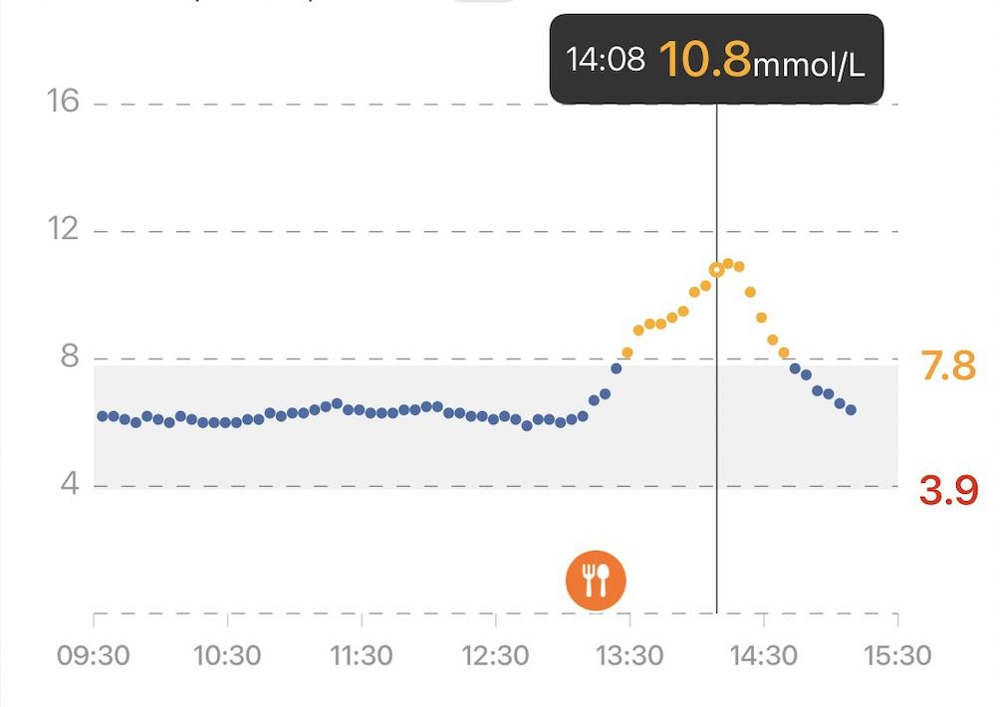

My intuition started to experiment with different foods. Overall here is what my record looked like for the entire duration:

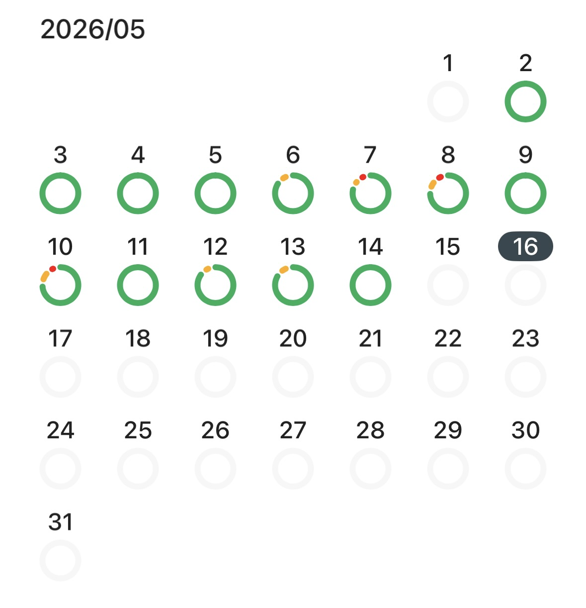

#### Food that spiked my glucose

- Laksa
- Wonton noodle soup
- GYG burritos
- Airline food

This isn't to say that I'll never eat these sorts of meals again, but I'll aim to time them better around exercise.
### Supplement Stack

Some principles that I tried to follow:

- Avoid pill burden; prefer food over pills.
- Wait until a supplement is on the ITP supported interventions page, or has significant evidence behind it.
- Have a biomarker in mind that a certain supplement will change.

Current stack:

| Morning | Evening | Ad Hoc |
| --- | --- | --- |
| Vitamin D (5000 IU) | Glycine (10g) | Iron (20mg) |
| Vitamin K2 mk7 (100mcg) | NAC (1g) | Vitamin C (500mg) |
| B-complex / methylated B vitamins | Magnesium | B5 P-5-P (50mg) |
| Zinc (15mg) | | |
| Hyaluronic Acid (200mg) | | |
| Iodine (150mcg) | | |
| Creatine (5g - in smoothie) | | |
| TMG (1.5g - in smoothie) | | |
| Boron (1mg - in smoothie) | | |
| Taurine (3g - in smoothie) | | |
| Fish Oil (6g) | | |

##### Experiments

- The B-vitamin simplification is the supplement change most tied to a measurable result, because MCV stayed back in range.
- Fish oil remains in the stack for now because sardines were not frequent enough to make food-only omega-3 intake reliable.
- Dropping tart cherry and melatonin still looks reasonable unless the Q3 sleep data clearly worsens.

### Focus For Next Quarter

Based on the completed Q2 data, key priorities for Q3 2026 are:

##### General

- Keep pressure on the mid-week recovery pattern, especially Wednesday through Friday.
- Bring average sleep score back above 80 consistently.
- Treat May as the cautionary month: lower sleep, lower body battery, and lower activity are all visible there.

##### Exercise

- Rebuild weekly training volume toward the 800-minute target.
- Use the 13 Q2 VO2 max readings as a baseline and push the trend back above 48.
- Keep the ordinary training weeks repeatable before optimizing the ambitious ones.

##### Biomarkers

- Re-test IGF-1 and albumin.
- Confirm that MCV stays in range.
- Follow up glucose with either fasting glucose, HbA1c, fasting insulin, or a structured CGM review.
- Follow up free testosterone, SHBG, and FSH.

##### Nutrition

- Keep using CGM feedback to identify meals that produce outsized spikes.
- Treat high-spike restaurant meals as experiments rather than defaults.
- Keep meal prep boring enough to be reliable.

Wish me luck!
