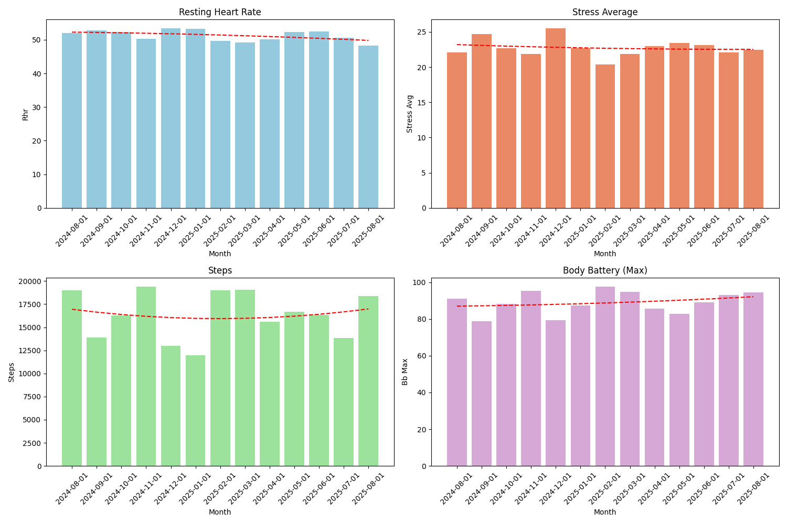
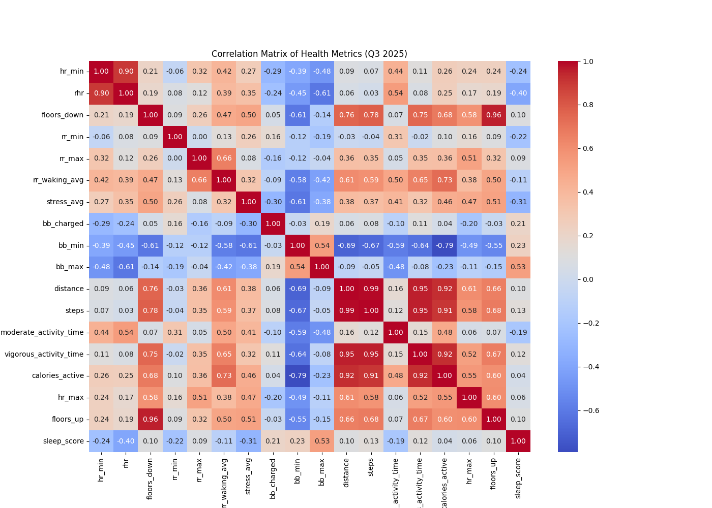
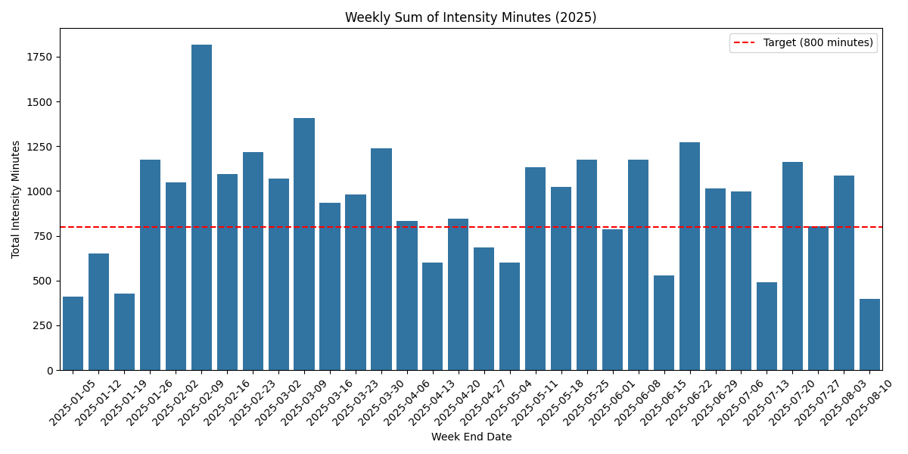
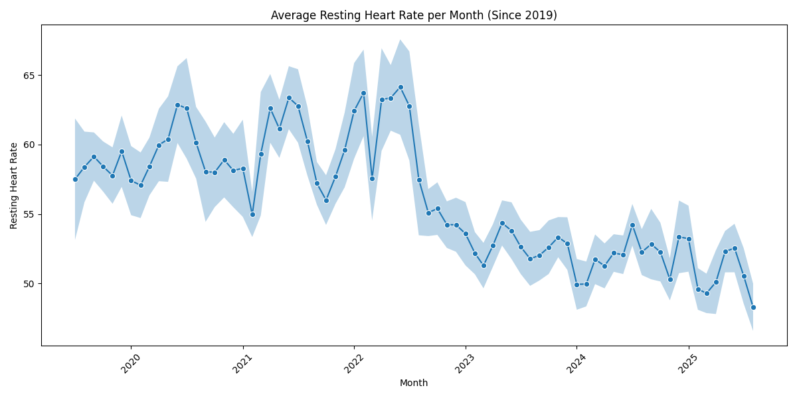
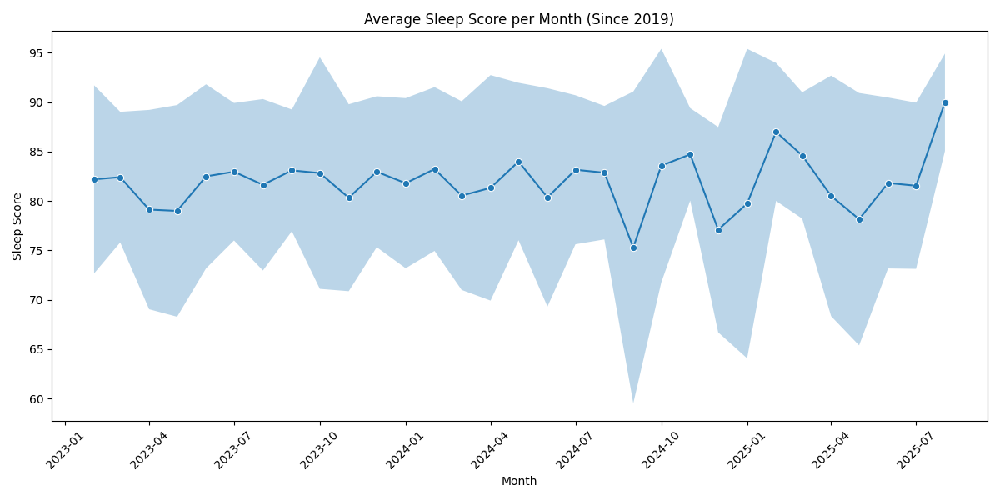
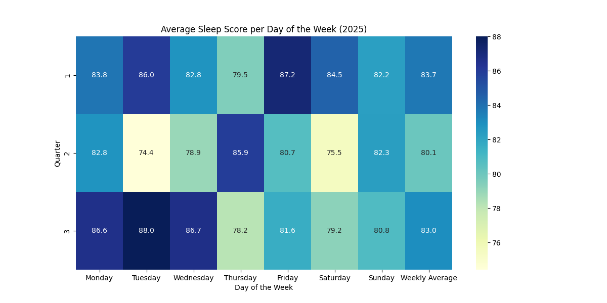
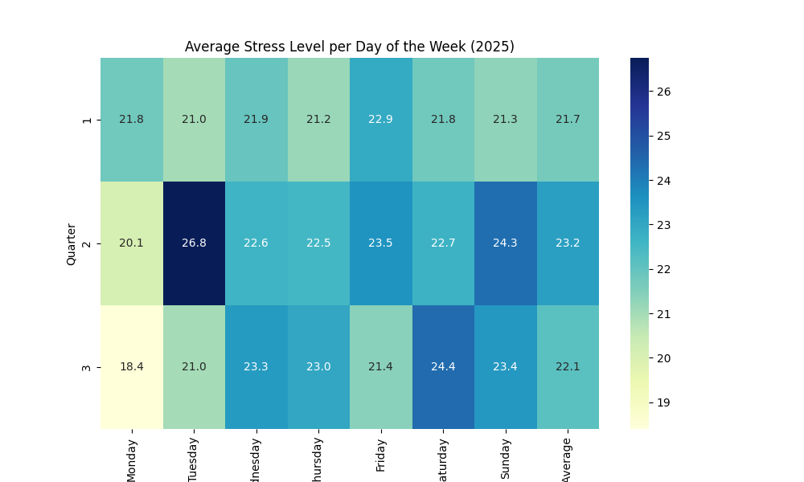
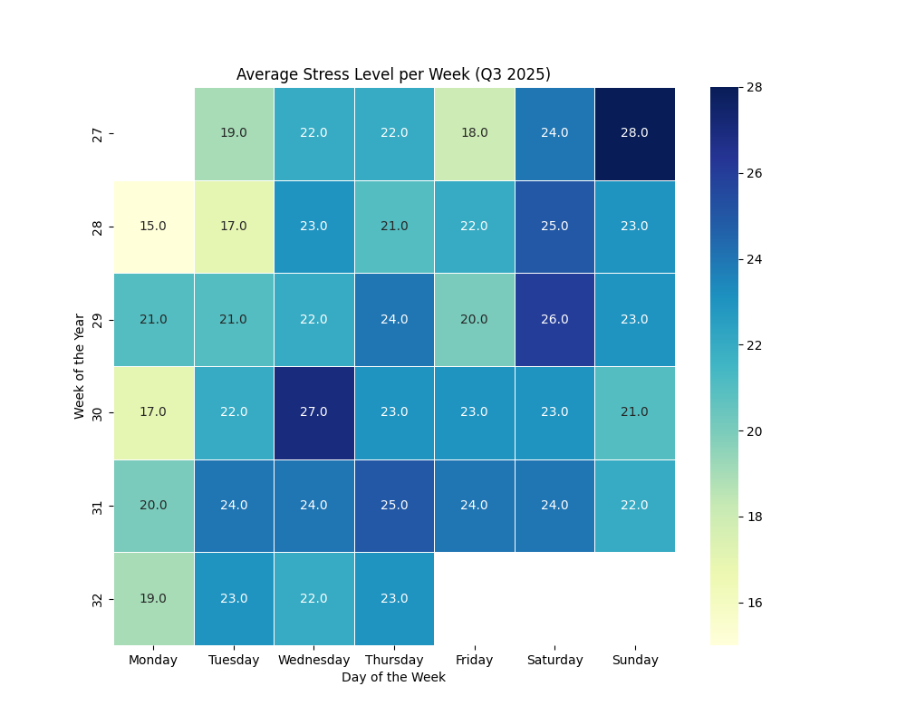

### Reflection

- What defined this quarter overall?
- What worked better than expected?
- What was harder than expected?
- What mindset or principle helped most?

### Focus Areas

As usual, there are five areas that I wanted to focus on:

- *Improve fitness* by training more and maintaining consistent weekly load.
- *Sleep better* by improving sleep hygiene and meal timing.
- *Reduce stress* by reinforcing daily recovery habits.
- *Improve biomarkers* by focusing on measurable lab outcomes.
- *Improve nutrition* by making food choices that support all of the above.

Overall quarter snapshot:

Quarter-over-quarter highlights:

- Which 3-5 metrics changed the most versus last quarter?
- Which changes were improvements, and which were regressions?
- What likely explains those shifts?

Correlations for the quarter:

Correlation notes:

- Which 2-3 correlations stood out most?
- Which relationships felt intuitive vs surprising?
- What should be tested next quarter based on these correlations?

Let us go through how the quarter looked by focus area.

#### Improve Fitness

##### Goals

- Average intensity minutes (Garmin) of 800 or above ❓
- Improve Vo2Max ❓
- Decrease RHR ❓

##### Analysis

How did load, recovery, and output trend this quarter?

- What were average and median weekly intensity minutes?
- How many weeks met the target threshold?

How did resting heart rate trend?

- What changed compared with last quarter, and what may have driven it?
- If VO2 max data exists, summarize how it moved and why.

##### Experiments

- What fitness experiments or adjustments were run?
- What was the observed effect of each?
- What will be kept, changed, or dropped next quarter?

#### Improve Sleep

##### Goals

- Keep average sleep score about 80 ❓

##### Analysis

How did sleep trend across the quarter?

Day-of-week sleep pattern:

- What were the best and weakest days?
- What patterns appeared around bedtime routine, meals, or schedule?

##### Experiments

- What sleep-related experiments were tried?
- Which appeared helpful, neutral, or unhelpful?
- What sleep protocol will continue next quarter?

#### Decrease Stress

##### Goals

- Decrease stress ❓

##### Analysis

How did stress levels trend this quarter?

Weekly stress trend:

- Which days or periods were highest stress?
- Was stress elevated consistently or concentrated in specific weeks?
- What likely drivers showed up this quarter?

##### Experiments

- What stress interventions were attempted?
- What changed after each intervention?
- What stress-management habits will carry forward?

#### Improve Biomarkers

##### Goals

- Which biomarkers were priorities this quarter?
- For each: target direction (increase/decrease/maintain) and reason.

##### Analysis

How did priority biomarkers change?

| Biomarker | Prior | Latest | Trend | Status |
| --- | --- | --- | --- | --- |
| **[Biomarker 1]** | [Prior result + date] | [Latest result + date] | [Direction] | [In range / Out of range] |
| **[Biomarker 2]** | [Prior result + date] | [Latest result + date] | [Direction] | [In range / Out of range] |
| **[Biomarker 3]** | [Prior result + date] | [Latest result + date] | [Direction] | [In range / Out of range] |

Optional biological age / risk view:

Key interpretation:

- Wins: Which biomarker changes were most meaningful?
- Concerns: Which markers worsened or remain out of range?
- Follow-ups: Which tests need rechecking next quarter?

##### Experiments

- What interventions were linked to biomarker changes?
- Which interventions likely contributed positively?
- Which interventions should be revised or stopped?

#### Improve Nutrition

##### Goals

- What nutrition goals were set this quarter?
- What intake or behavior targets supported those goals?

##### Analysis

- What eating patterns were most consistent this quarter?
- Which nutrition habits were easiest vs hardest to maintain?
- Which choices likely supported or hindered sleep, stress, and biomarkers?

##### Experiments

- What nutrition experiments were run?
- What outcomes were observed?
- What nutrition changes should continue next quarter?

### Supplement Stack

Some principles that I tried to follow:

- Avoid pill burden; prefer food over pills.
- Wait until a supplement is on the ITP supported interventions page, or has significant evidence behind it.
- Have a biomarker in mind that a certain supplement will change.

Current stack:

| Morning | Evening | Ad Hoc |
| --- | --- | --- |
| [Supplement + dose] | [Supplement + dose] | [Supplement + dose] |
| [Supplement + dose] | [Supplement + dose] | [Supplement + dose] |
| [Supplement + dose] | [Supplement + dose] | [Supplement + dose] |

##### Experiments

- Which supplements were added, removed, or dose-adjusted this quarter?
- What motivated each change?
- Which changes appeared beneficial, neutral, or negative?

### Focus For Next Quarter

Priorities for next quarter:

- Which 3-5 priorities matter most, and why?
- What specific habits or actions will support each priority?
- What might block execution, and how will that be managed?

Biomarker retest checklist:

- Which biomarkers need retesting?
- What date window is targeted for each retest?
- What result would count as improvement for each marker?

Wish me luck!
