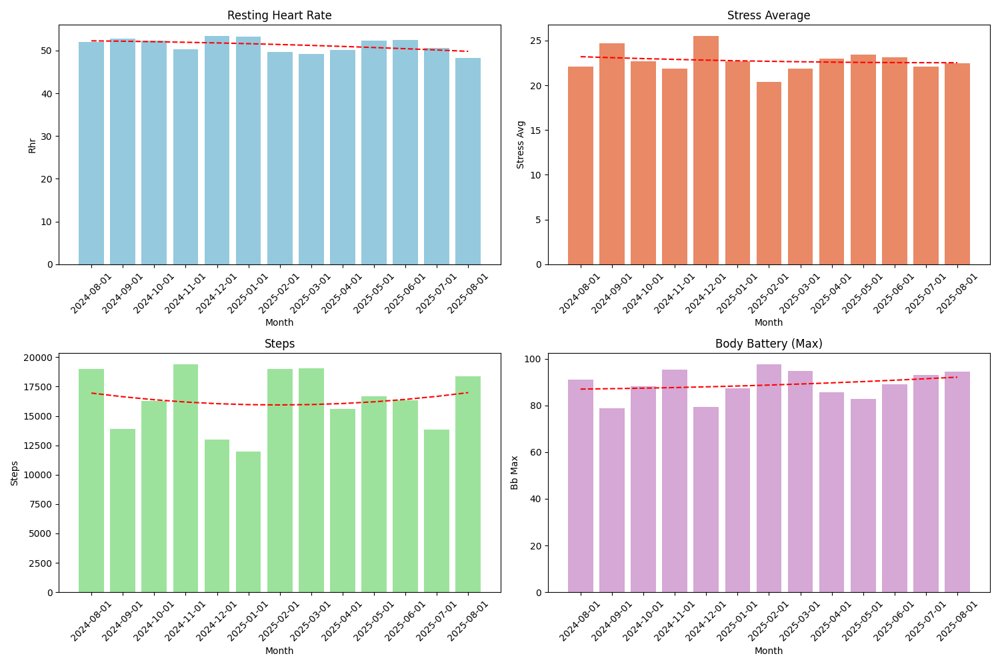
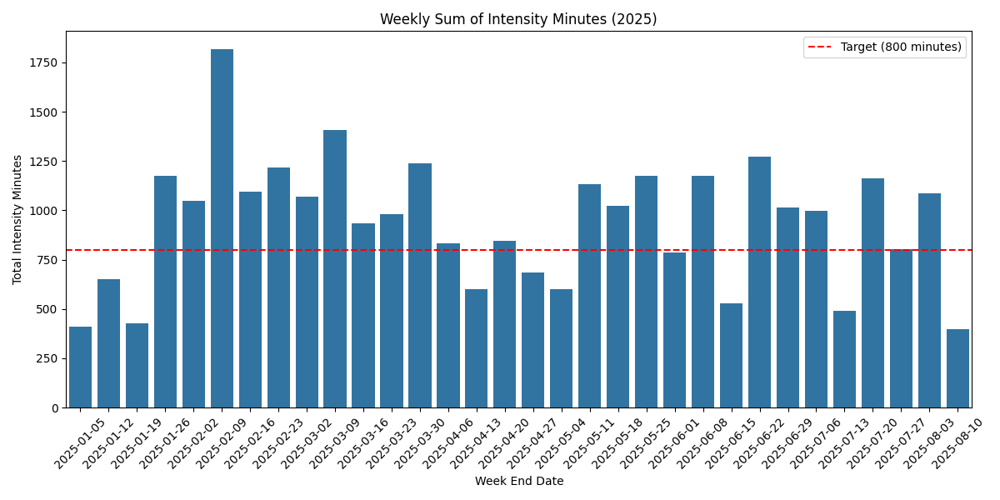
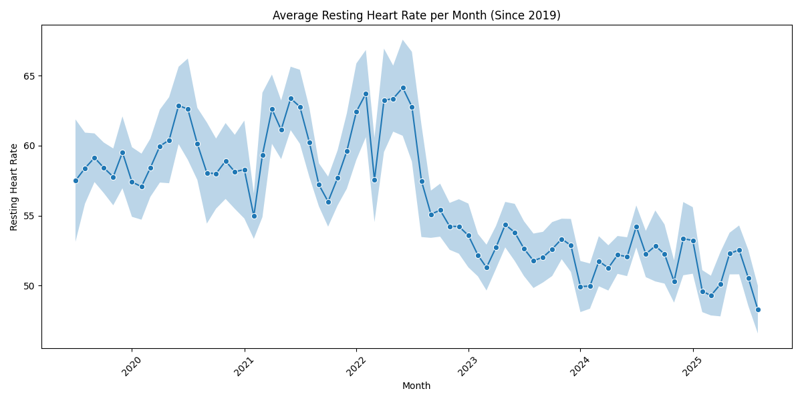
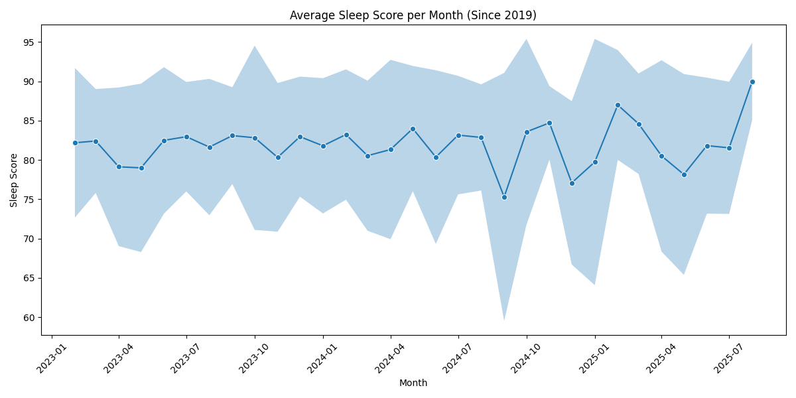
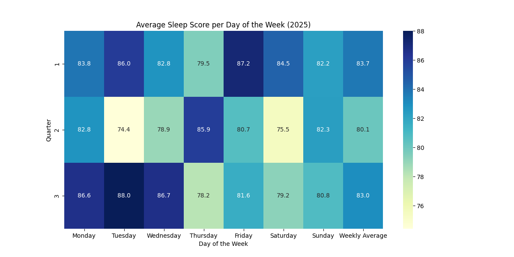
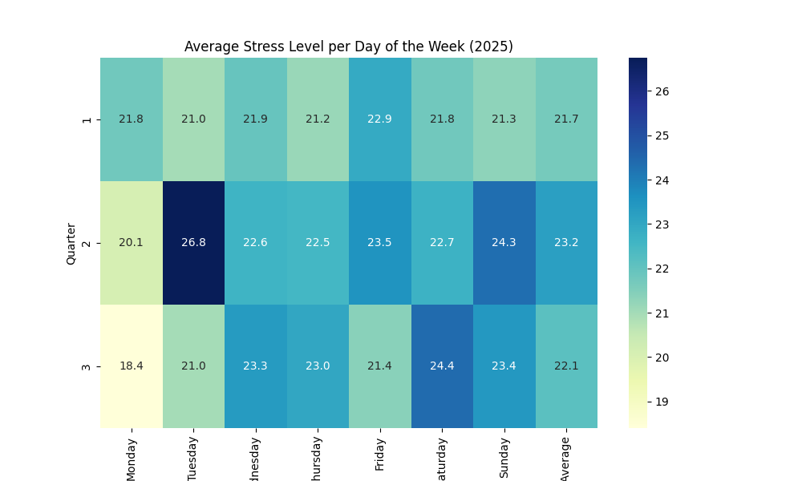
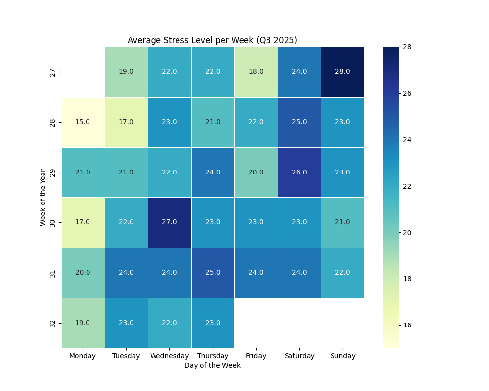
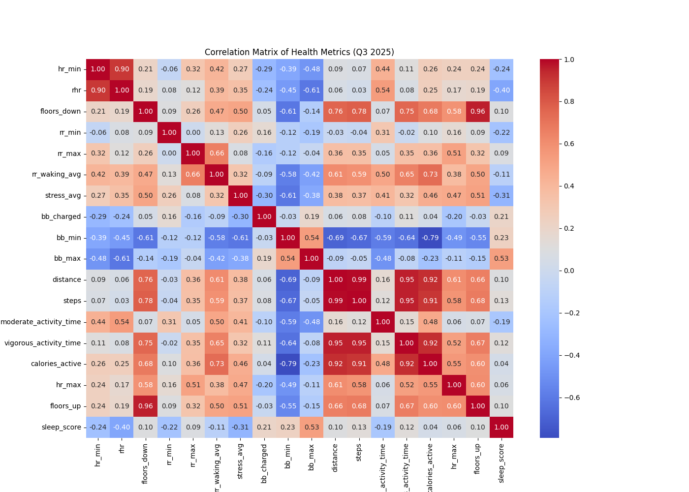

  

### Reflection

Add a reflection here.
### Focus Areas

As usual, there are four areas that I wanted to focus on:

- *Improve fitness* by training more. My goal was to maintain a fitness score above 70 on intervals.icu
- *Sleep better* by {add summary of any experiments}.
- *Reduce Stress* by {add summary of any experiments}.
- *Improve Biomarkers* by looking at my nutrition, as well as the above items.

Let’s go through how I did this quarter and what I experimented with.

Overall most metrics are improving, as we can see with the following key metrics.

Over the previous year we can see that:

* Resting Heart Rate is **decreasing** ✅
* Stress is **decreasing** ✅
* Steps are **maintaining** ✅
* Body Battery (max/day) is increasing ✅

Let's see what can contribute to these.

#### Improve Fitness

##### Goals  

- Weekly intensity minutes (Garmin) of 800 or above 80% of the time ✅
- Improve Vo2Max ✅
- Decrease RHR ✅
##### Analysis

I look at intensity minutes as a way to make sure I'm getting enough fitness, regardless if I'm running or at the gym or kayaking. My goal is 800 minutes per week 80% of the weeks, which is significantly higher than the commonly recommended 150 minutes per week. The reason I've chosen to say "80% of the weeks" is because there are some weeks when I need to travel for work, and it is harder to reach this target.
  

I hit my intensity target {INSERT PERCENTAGE} of the weeks this quarter.

In addition to load we can have a look at Resting Heart Rate, as that is often related to sufficient training. We can see that my RHR continues to trend downwards.
  
##### Experiments

I didn't have any fitness-related experiments this quarter; just rinse and repeat.
#### Improve Sleep
##### Goals
- Improve sleep quality ❌
##### Analysis

Let's have a look at my sleep scores for the previous few years, averaged per month:

  

And then when comparing each quarter this year we can see some trends with each day of the week.

 {INSERT ANY OBSERVATIONS}
##### Experiments

I conducted a few experiments this quarter, including:

- {INSERT ANY SLEEP-RELATED EXPERIMENTS}

{INSERT IF SUCCESS OR NOT}
#### Decrease Stress

##### Goals
- Decrease stress ❌
##### Analysis
Let's have a look at stress per quarter grouped by day of the week:

{INSERT ANY STRESS-RELATED OBSERVATIONS}
  

{INSERT ANY STRESS-RELATED OBSERVATIONS}
##### Experiments
No stress-related experiments for the quarter.
#### Improve Biomarkers

##### Goals
- Decrease IGF-1 ❌
- Decrease MCV ✅
- Decrease RDW ✅
- Increase Albumin ✅
- Decrease hsCRP ✅
##### Analysis

[INSERT CHART FROM PHENOAGE]:

We can see that...
##### Experiments

I did have a fair amount of experimentation here, including:

- {INSERT ANY BIOMARKER-RELATED EXPERIMENTS}

Because of subscribing to Cronometer I'm able to get more reports, such as my Nutrient Balances and Nutrient Targets, which have encouraged me to tweak the food I eat.

For example, here are my Nutrient Targets (without supplementation):

[NUTRIENT TARGETS CHART]:

And here are my Balances (with supplementation):

[NUTRIENT BALANCES CHART]:
### This Quarter's Supplement Stack

Some principles that I tried to follow:

- Avoid bill burden; prefer food over pills.
- Wait until a supplement is on the ITP supported interventions page
- Have a biomarker in mind that a certain supplement will change

And here's what is currently in my stack:

| Morning                     | Evening           | Ad Hoc |
| --------------------------- | ----------------- | ------ |
| Fish Oil (6g)               | Astaxanthin (7mg) |        |
| Niacin (50mg)               | Glycine (5g)      |        |
| Calcium (333mg)             | NAC (1g)          |        |
| Vitamin D (4000 IU)         | Iron (20mg)       |        |
| Vitamin K2 mk7 (100mcg)     | Vitamin C (1g)    |        |
| B12 Methyl (1000 mcg)       |                   |        |
| L-Methylfolate  (1000 mcg)  |                   |        |
| Lysine (1g)                 |                   |        |
| Zinc (5mg)                  |                   |        |
| Hyaluronic Acid (200mg)     |                   |        |
| Iodine (150mcg)             |                   |        |
| Creatine (3g - in smoothie) |                   |        |
| TMG (2g - in smoothie)      |                   |        |
| HCP (15g - in smoothie)     |                   |        |

### Other Random Charts

We can see correlations for the quarter with this chart. I would like to supplement this with additional data at some point, because most of these metrics are fairly obvious how they are correlated. For example, steps and distance, or floors_up and floors_down. 
  

### Focus For Next Quarter

I think the next quarter will remain similar to this one. I've subscribed to Cronometer, so I'm getting some additional insight from that. I'm contemplating dropping the following supplements, as it appears as though I am getting enough from food:

* Calcium
* Fish oil
* Lysine

