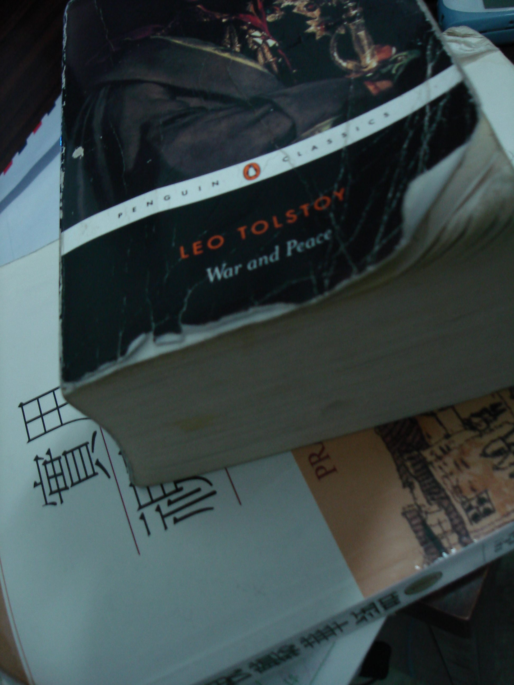

When I was younger I hated reading. I mean, I guess I didn't hate reading, but I always found better things to do. Like dig holes.

Times have changed. Throughout middle school I thoroughly enjoyed reading the Xanth fantasy series by Piers Anthony; Dean Koontz was pretty good as well. In high school my teachers spoon-fed me fine literature, with special thanks to Mrs. Bowen-Jones for her AP Literature course. Compared with many people I have talked with at uni, I had the privilege of being exposed to many great works. While the fine details have now somewhat faded, I still remember the overall themes and motifs. At the time I didn't fully enjoy or appreciate the privilege I had. Indeed, the push from my teachers to read certain books appears to parallel the push from my mom to get me to eat vegetables. Alas, I still don't really like vegetables.

Yesterday I finished [War and Peace](http://www.amazon.com/gp/redirect.html?ie=UTF8&location=http%3A%2F%2Fwww.amazon.com%2FWar-Peace-Penguin-Classics-Tolstoy%2Fdp%2F0140444173%2Fsr%3D1-2%2Fqid%3D1171357974%3Fie%3DUTF8&tag=kelvinismcom-20&linkCode=ur2&camp=1789&creative=9325). Of all the works of literature I have read, both fiction and nonfiction, I think War and Peace was the most influential. I wasn't gripped by obsession as I have been with other books (e.g., The Da Vinci Code, which I read in an afternoon); I never shut reality out while reading. Instead, I feel like War and Peace supplemented my reality, and my view of the world and events in my past slowly changed.

At 1,444 pages, War and Peace is one of the longer books I have read. Even though I have read books of similar length in short periods of time (e.g., Cryptonomicon, at over 1,500 pages, in two days), War and Peace took a while. This stemmed from the unprecedented number of characters (almost 500), the complex relationships, and the deep thoughts presented by Tolstoy. Unlike many modern novels that are written to entertain, War and Peace is meant to influence.

Would I recommend War and Peace? Absolutely. But I would add that reading it isn't simply like reading a book; it is more like forming a relationship. So, if you are looking for something new to read, it might be high time to visit your local bookstore and peruse the Russian literature section.
