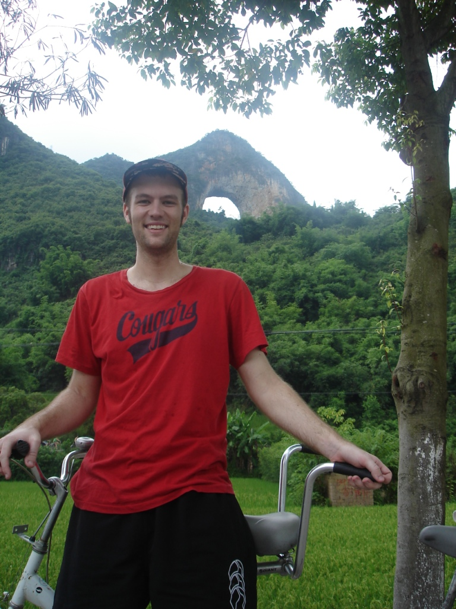

I awoke at 8:00 and went to breakfast. At 10:00 I rented a bike (a tandem!) and started biking to Moon Hill. The traffic was pretty dense, so I needed to be careful, but I enjoyed myself nonetheless.

Halfway up the road I paused for a break, and an older woman approached me to ask if I wanted to buy postcards. Since they were cheaper than in town (about 70 US cents), I bought a pack. The hunt was on, and all the other vendors surrounded me. Yelling "go away, go away" had no effect, if they understood it at all. I cycled across the bridge and took my rest.

Within an hour and a half I had reached the hill, which was easy to spot from the number of people trying to sell things and tickets. I decided to pass on purchasing a ticket and continue up the road. Just around the corner was a perfect view of the hill and its huge opening through the rock.

I continued up the road, passing rice paddies being worked by water buffalo. I reached the next town, which was fairly run-down, then turned around and returned to Yangshuo. On my way back I took a break under a bridge and marveled at how  every possible thing had been transformed into a tourist activity. The little patch of river where I sat seemed to be the only undeveloped tourist spot.

By 16:00 I was back in Yangshuo, and I wandered around a little. I took a shower and pondered what to do next. I decided to read somewhere, but unlike the U.S., there weren't many cafes in Yangshuo, at least not ones that charged less than $4 per drink. So I sat in KFC. The ice cream was a nice treat. After three hours of reading, I ate dinner at a "Taiwanese Style" restaurant, though neither my companion nor I had eaten that style of food before. Still, it wasn't bad. The waitress was especially kind, even though some of the customers were extremely rude.

I purchased some water and food, then boarded my bus for Guangzhou.
