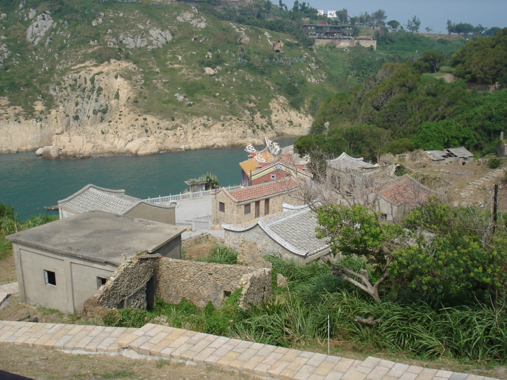
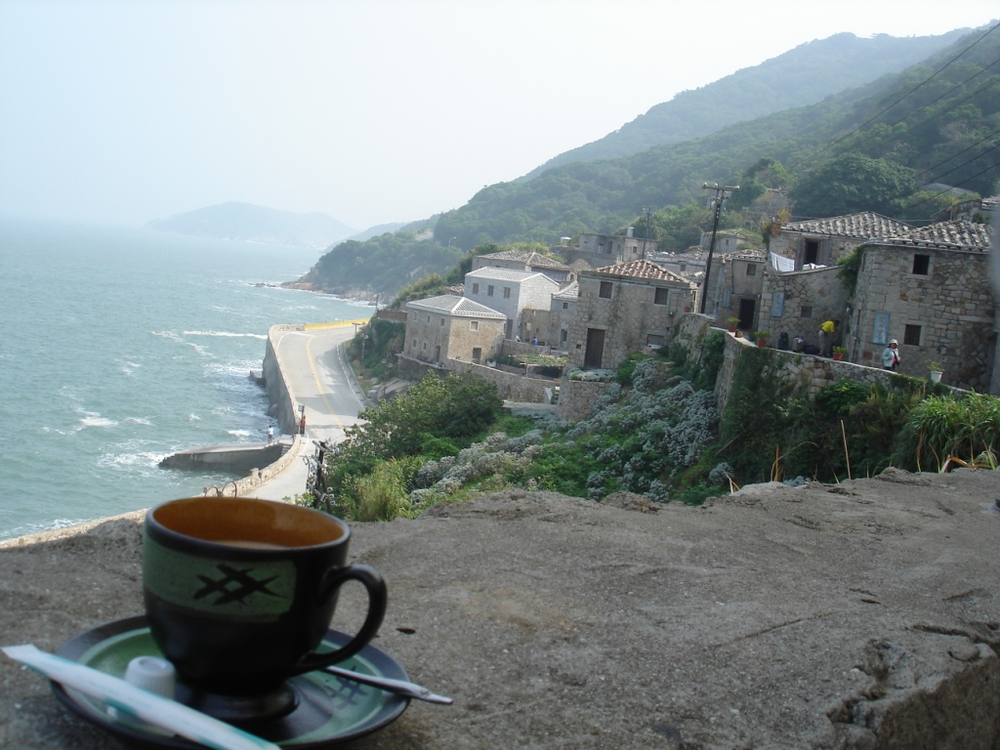

I awoke to the sound of two alarm clocks and voices in the background. The good feelings from the previous day were still with me, and I slowly crawled out of bed.

After quickly packing, I descended from my loft to find breakfast, included with the stay, waiting at the table. In keeping with local tradition, the soup carried the flavour of rice wine, or some other strong liqueur. I ate quickly, since my 7:00am ferry surely wouldn't wait. The hostess gave me a ride to the harbour, where I bought my ticket and left the South Island.

My destination was East Island, an even smaller island than the one I had just visited. The ferry ride was decent and not too bumpy. I arrived 50 minutes later.

While the South Island was transforming from a military base into a tourist destination, East Island was only beginning the change. I was quickly struck by the kindness of everyone I met in the Matsu Islands. Immediately after leaving the ferry, I started walking up the mountainside; a local shop owner gave a few fishermen and me a lift. Instead of simply dropping me in town, he drove around the island and gave me a tour. Every half-mile, I stopped to examine something. A semi-active military station sat below the lighthouse, an artillery piece in a deep bunker faced the ocean, and finally I visited a completely deserted village. With a direct view of the Chinese coast, the village had apparently been abandoned during military "exercises" 10 or 15 years earlier. Given that residents could see missiles and weapons pointed in their direction, it was understandable that they wanted to leave.

In the village, I took my first nap of the day. A charming gazebo-style shelter stood near the coast, and the sound of the ocean combined with the light breeze put me to sleep almost immediately.

Two hours later, I awoke to the chatter of a tour group. Sure enough, a group of ten people swarmed around me. They walked through the village, and I decided it was best to be on my way.

I walked back towards the lighthouse, down by the "tourist centre," and up the road to the largest village on the island. Perhaps 100 people lived there, and judging by the camouflage hanging on clotheslines, many were soldiers. I made a circuit of the village and stopped at a small restaurant. I ordered my usual "niu riu mien" (beef noodles), garlic toast, and another noodle dish. I also had a vanilla Coke.

Afterwards, I departed for the ferry far too early. Having already walked many miles, I slowly made my way up the hill, where I encountered several old tanks of the kind scattered throughout the island. They made a perfect backdrop for photographs.

After several hours of walking, I arrived at the harbour but was still two hours early. I alternated between reading and napping; I read a little of War and Peace.

Just before the ferry arrived, a large group entered. One person came closer and said, "hao jiu bu jian!" (long time no see). It was the group that had stayed with us the previous night. I started talking with them and learned they were returning to the North Island, where they lived. They invited me to dinner, a BBQ, and even to stay at their place.

I already had a reservation, so I couldn't stay with them. I boarded the ferry, first returning to the South Island and then continuing to the North Island; the ride back was quite bumpy. I talked briefly with Peggy, the daughter, in Chinese, or at least tried to. Everyone eagerly renewed the invitation to dinner and then to an island-sponsored BBQ.

After arriving, my guesthouse owner picked me up and drove along a winding road to a small village, which again reminded me of the French Riviera. The main difference was that the roofs were grey rather than postcard red. My room was on the third floor of a restored building, with photographs of the renovation covering the walls. Everything creaked, but large mats on the floor helped dampen the sound. After unpacking, I walked back along the road to a village between the guesthouse and the harbour. I soon found my new friends and was escorted into their house, where a seafood banquet awaited me. Some people had already finished, but there was plenty of food to go around.

I ate and ate: fish of a variety considered very expensive in Taiwan, shrimp, several soy dishes, including little round pieces I found especially tasty, lots of vegetables, and some old wine, or "lao jiu." The rice wine had a distinctive flavour that was not too alcoholic but soothing. Shortly after the first part of dinner, our group of about 20 departed for the main harbour. My "ten-minute" walk lasted about half an hour, but nobody was in a hurry, so nobody cared. Soon I heard KTV, or karaoke, and saw a dozen small BBQs everywhere.

This weekend was the Moon Festival, when BBQ and mooncakes are practically a requirement. The moon, as mentioned yesterday, captured my attention several times throughout the night. Apparently, it was fuller and more vivid than it had been in the previous ten years.

The BBQ was a delight. I made a small fire behind the harbour, alongside perhaps 100 other people, and cooked all sorts of meat: sausages, little white balls, hot dogs, and slices of steak on bread, all glazed in sauce and tasting wonderful. One thing a visitor quickly realised was that my hosts didn't understand the meaning of full, or "bao le." Food kept coming my way. Luckily, every bite was a treat, and somehow my body made room for more.

I left the BBQ just in time to avoid singing "liang zhi laohu," or "Two Tigers." After a quick ride back to the guesthouse, I said a very appreciative goodnight. An unpleasant cold shower awaited me, followed by bedtime. The food, a few beers, and good memories put me to sleep within minutes of crawling into bed.
