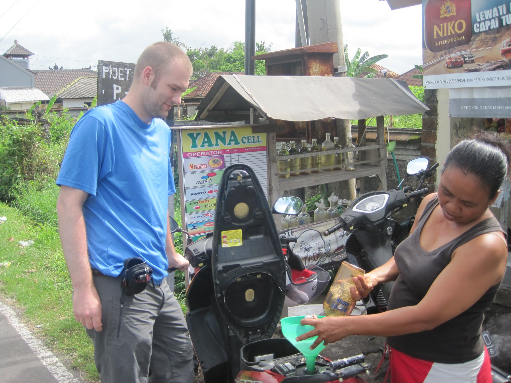
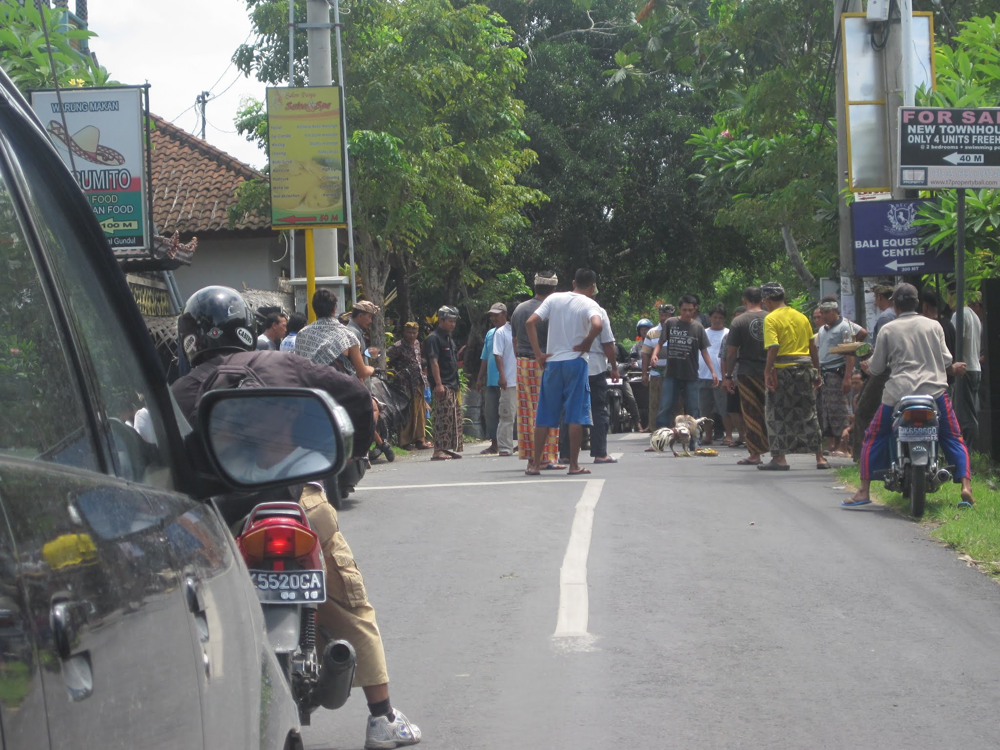
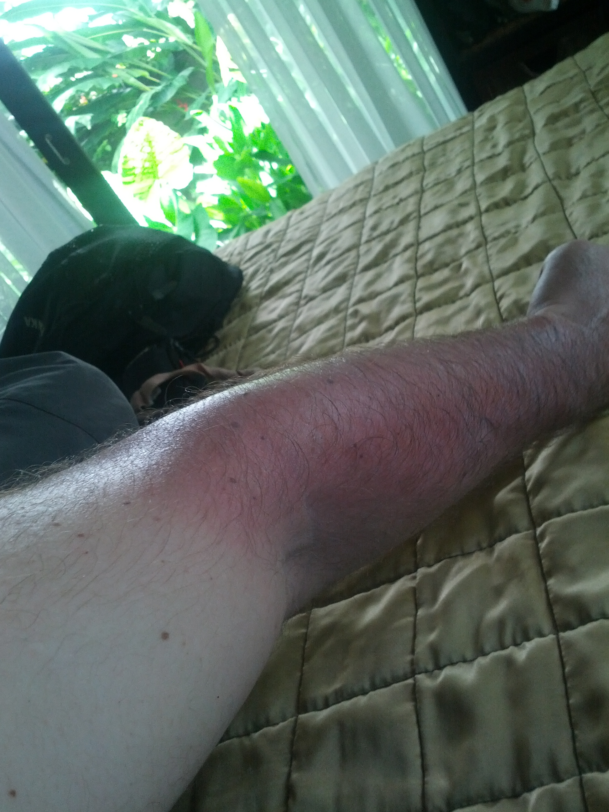
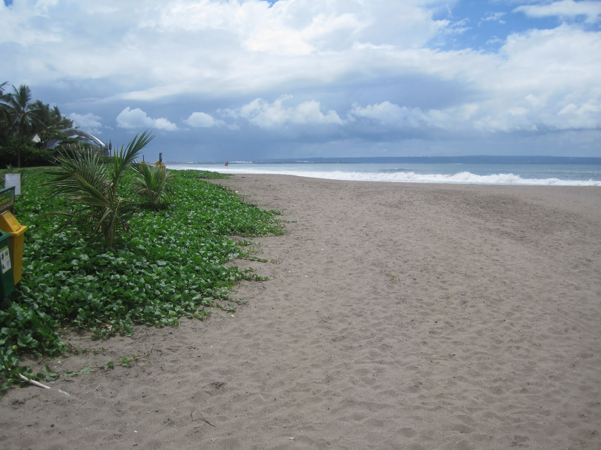
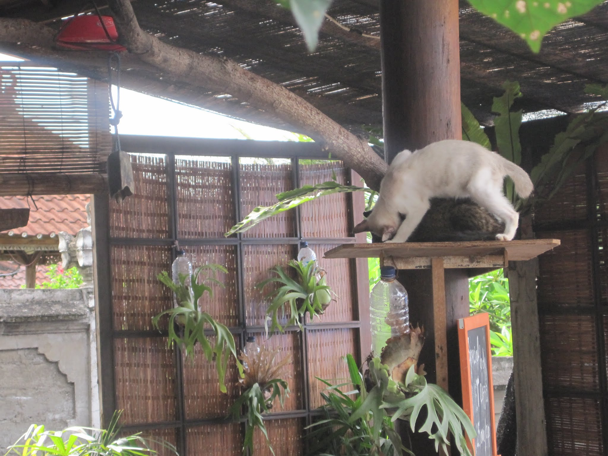
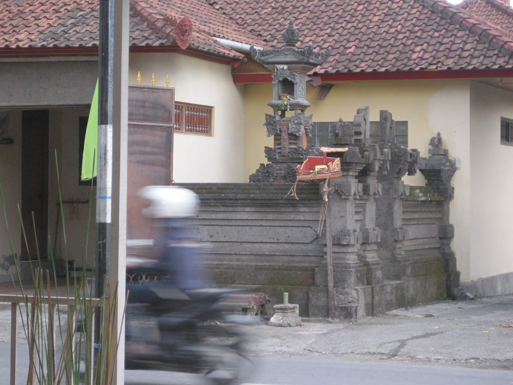
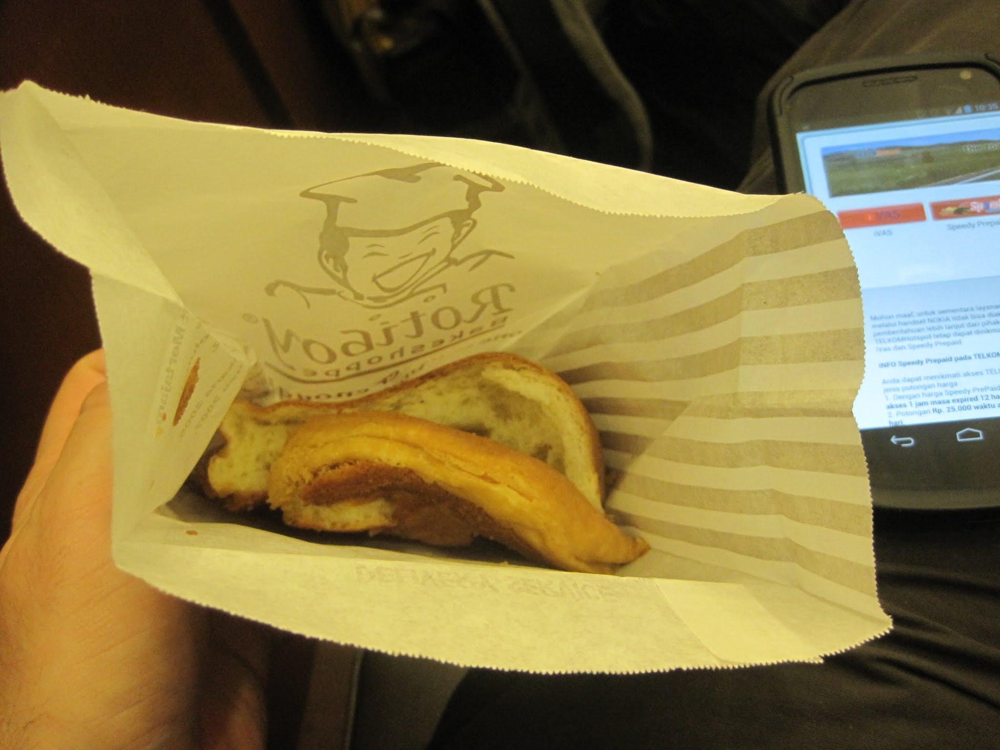
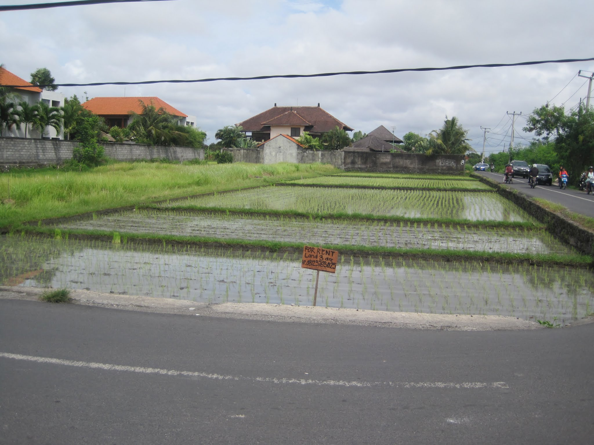

Every time I travel, I discover something I could have done better. I now follow many of those lessons, such as bringing only electronics that charge via USB, but still forget others, such as packing a stuff sack for dirty clothing.

This trip to Bali began with a lesson I will not forget: before leaving the airport, confirm that the taxi driver understands the destination. My delayed flight arrived after midnight, but the taxi desk was still open. I organised a prepaid taxi for 135,000 rupiah, or about US$13. Prepaying reduced the need to haggle and removed any concern about a longer route increasing the fare. My previous taxi ride in Bali had been straightforward, but this time the driver and I had no language in common. With many other drivers available, I should have confirmed that we could communicate basic directions before setting off. After about 45 minutes, we reached Canggu, the semi-rural area where I would spend a few days before continuing to Nepal. Despite having the address, resort name, and a map, we became lost and drove around for some time. I asked the driver to call the hotel, but we were unable to connect. Meanwhile, I kept the resort updated by text because someone was likely staying awake for my arrival.

[Embedded map](https://www.google.com/fusiontables/embedviz?viz=MAP&amp;q=select+col2+from+1RFDybcyTiZ_M_VoDJdx9sjuqeMKU1cx-RnRxMg&amp;h=false&amp;lat=-8.664237149588834&amp;lng=115.15061350706615&amp;z=13&amp;t=1&amp;l=col2&amp;y=2&amp;tmplt=2)

I stopped by one place and asked for directions. They even made a map. We drove a bit, took what seemed to be a wrong turn, and asked somebody else. After more driving, the driver stopped again for help. The owner had sent me a text with directions, so I jumped out of the taxi and asked a local, "can you read this?" She read it back word for word, which was accurate, but did not help much. I then asked, "OK, so do you know where it is?" She replied, "Go straight, turn right, then left soon." I was only two minutes away from the  hotel.

The driver drove while I directed. I arrived about 1:30am.

My lesson was to confirm the route and a reliable way to communicate before getting into the taxi. Google Maps also did not allow me to download Bali for offline use, so I should have used Maps(-) to download the island in advance. My GPS was having difficulty, and turning on my phone at the airport might have given it more time to establish a location.

I woke the next morning rested and relieved to be in a bed; the days before departure had been jam-packed and short on sleep. The retreat had two or three villas around a small pool, set away from the main road. My unit had an outdoor shower and bathroom, but the bed was comfortable.

After waking, I had a delightful breakfast of simple crepes, fruit, and Balinese-style coffee. I then walked to a currency exchange. While booking, I had accidentally reserved a room for one person and needed to pay an extra $10 per night. I exchanged some Australian dollars for Indonesian rupiah and walked back, a round trip of about three kilometres. The retreat offered me a moped for getting around. At first, I said I was happy to walk. A moped had not been necessary on my previous visit to Ubud: the main attractions were either close enough to walk to or far enough away to require a bus. This rural area was different, so I agreed to rent the moped for A$5 per day.

With the moped, I set off to explore the surrounding area. A "shortcut" between two arterial roads was used mainly by motorbikes, although a few cars also attempted it. With almost no prior experience, I made the ill-advised decision to drive. In retrospect, this was not a sensible decision. After a few cautious trial runs, I was soon moving around the area. I stopped at a small place, Menung Canggu, for a simple lunch of nasi goreng with chicken. Many local menus offered a focused selection of fried rice, fried noodles, and one or two other dishes. I also had lime juice, checked my email, and decided to take a longer ride.

I applied sunscreen and set off for Tanah Lot, a temple on a rocky outcrop about 20 kilometres from Canggu. The route involved riding on the main road for some time. Road conventions for mopeds were not always obvious, so I stayed to the left when I was not passing and moved into the right-hand lane only when I needed to turn.

I reached Tanah Lot about 35 minutes later, paid 62,000 rupiah, and walked around the market. I had seen many markets by then, but still enjoyed the small stalls lining the roads. Several craftspeople were making wooden statues with hand tools and drills, then finishing them with varnish. I could only imagine what my [VOC](http://en.wikipedia.org/wiki/Volatile_organic_compound) sensor would have reported inside their workshops.

Just before the water, at the final gateway, there was an empty box where a snake used to live - take a picture with it for a few dollars. I noticed some people holding the large python, so pulled out my camera for when I saw it. The moment the woman saw it I snapped a photo. I won't post it here until I am old and grey...

I had thought it would be possible to walk out to the temple, but there was no bridge and I did not see an obvious boat. Many visitors were taking photos. I walked up an alley to a row of nearly empty restaurants and sat at the last one. The higher vantage point offered a much better view, which I enjoyed with a coconut. When I opened my bag, I discovered that a bottle of shampoo I had bought earlier had leaked, so I used my remaining water to clean it up.

After strolling past the snake, back through the market, and to my moped, I set out to go back home.

By the time I reached the retreat, it was getting dark. Rather than ride again, I walked to a nearby place for dinner. Betelnut Bar was busy with international visitors and served mostly Western food, making it a relatively expensive place to relax for a few hours. An American spoke on Skype in one corner, a Swedish group chatted over beers, and a few Australians were scattered around the restaurant. I had one Bintang beer, ate, and walked home. Rubbish was piling up beside the road.

I watched a few episodes of Sons of Anarchy, since I brought my laptop, and fell asleep in my little room.

The next morning began with my regular breakfast at the retreat. I took the moped to a few beaches, but because I am not much of a beach person, I continued to Seminyak, about a 40-minute ride away. I realised that I should have worn a long-sleeved shirt: despite applying plenty of sunscreen, my left arm had received too much sun. I looked for a shirt in the shops, but the prices were similar to Sydney's, so I applied another layer of sunscreen instead.

I had a quick lunch and attentive service at Revolver Cafe, just off the main road. A couple from the United States sat nearby planning the next part of their trip. Their tone irritated my companion, especially when they called the waiter over to complain that they had heard the same song three times and ask for the music to be changed. We left soon afterwards.

Back at my hotel, with no "near misses", I showered and prepared for my spa. I had researched the "best" massage place nearby, Casa Spas, and I took off on the back roads. After correcting a wrong turn, which put me on the main road for longer than I would have liked, I arrived at the spa right at 15:00. I decided to only get my feet and legs massaged, worried they would rub my sunburn, but I opted for a full body massage.

The room was clean and the masseurs were professional. I felt slightly anxious during the massage, not because of the treatment, but because I could not remember removing the key from the moped. When the massage ended, I found the key and realised how relaxed I had become. In fact, I had noticed it earlier, when I stopped caring whether the key was still in the ignition.

My companion's massage lasted a little longer, but soon I was dressed and downstairs. Unfortunately, I had left most of my money at the retreat and needed to exchange more. Traffic was heavier than before, and I followed the local flow carefully to reach the currency exchange. I changed $20, more than enough to pay for the massage, and returned. After paying and meeting my companion, I headed back to the retreat. Later, I took the shortcut to the place where I had eaten lunch the previous day. After dinner and another lime juice, I returned for another episode of Sons of Anarchy and an early night.

I woke early for the taxi ride. Another guest joined me, which meant I could split the fare and enjoy some company. This driver lived near the retreat and knew the route, so the trip was quick. Before long, I was at the Starbucks outside the airport, drinking coffee and eating Rotiboy. Curiously, there were mosquitoes inside the cafe, but my companion had taken an antihistamine and was not too uncomfortable.

After clearing immigration, I waited for my flight at another Starbucks. It may sound clichéd and touristy, but I appreciated the free Wi-Fi and air conditioning.

At 15:10, I passed through a second security checkpoint, where my empty water bottles were confiscated, and boarded the flight. The older couple beside me fell asleep almost immediately, an impressive achievement given that the child in front of us continued crying for much of the journey.

Within an hour, I will arrive at LCCT, Kuala Lumpur's low-cost terminal, and we will make our way to my favourite curry place near KL Sentral.

This trip to Bali was interesting, although its allure has diminished for me with each visit. Many people go for the weather, but I prefer colder climates, and the mosquitoes do not help. I would rather walk through snow at -5°C than sit on a beach in 30°C heat. Nepal is looking very appealing.

