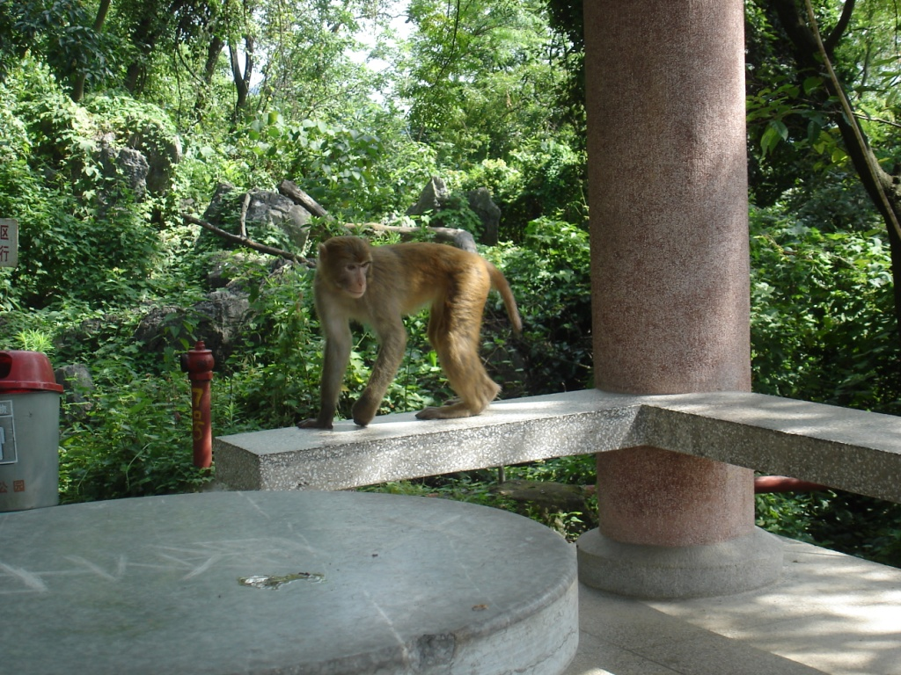

The bus arrived at about 4:00am, a little too early for me. I slept terribly; the road was in poor condition, and the bus driver drove rather recklessly. In fact, whenever I woke up, I kept saying, "I love you, I love you," because I didn't know whether each time I fell asleep would be my last. But I made it, somehow, and had to find my hostel.

I walked out of the train station and headed in the general direction of my hostel. I asked a member of the cleaning staff, who simply replied, "That way." A couple gave me more detailed directions, and I finally found it. By 5:30, I was knocking on the front door, and a man drinking beer let me in. I checked into my dorm and fell asleep.

By noon, I had woken up and decided to explore the city. I wandered across the river to Seven Star Park. Beside the river stood large clocks showing different cities, not one of them functioning, which seemed to be something of a pattern throughout China. After buying my ticket to the park, I saw a woman drinking jin jiu nai cha. I asked where she had bought it and got one myself. Too sugary, far too sugary. I entered the park and made a beeline away from the other tourists. I found a small path off to the right, then another leading into the hills. Nobody else was on it, and I eventually reached a small gazebo.

As I gazed over the city and the surrounding hills, I gasped. I looked behind me and saw a group of monkeys sitting on the bench. I tried to take a photo, but they had already wandered away. Moments later, another monkey lazily jumped onto the bench, sat down, scratched its head, and wandered off. An hour or so later, I wandered off too.

Next, I wandered to the "zoo," which was quite depressing. First, I reached the panda enclosure and saw the most dejected bear I had ever seen. The sign beside it said that the zoo had saved the bear after its habitat was disturbed by a shifting forest climate, or something similar. In other words, deforestation had left the panda without a home.

Next, I saw a brown bear, which claimed the unfortunate distinction of being the most dejected bear I had ever seen. It was in a cage the size of a small dorm room, walking in circles. Nearby, a man had a monkey dressed as a clown. Whenever the monkey failed to "perform" correctly, the man beat it with a stick while a crowd watched.

I walked around the back of the zoo and saw "Camel Hill," three hills that together resemble a camel. Some tourists took photos of me.

By 18:30, I had left the park and wandered back to the hostel. I sat in the lobby talking for some time and eventually arranged a boat ride up the Lijiang River for the next day. I ate, then walked up to my room. Two men were staying there, one French and the other American. We talked for about an hour about politics, life, China, and travel. Then, bedtime.
