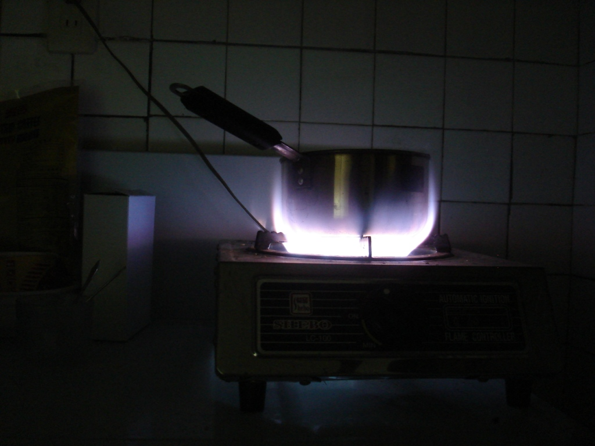

Life is full of choices. What should I wear today? What goals should I set for this week? What should I eat for breakfast? The third question is easy for me because I know how to order only a few things at the local Morning Burger. Beyond breakfast, however, there are plenty of decisions to make.

Recently, I have had to make some difficult choices, and I hope they prove to be the right ones. I made a deal with myself: once my bank balance fell to a certain level, I would find a job. Although I am careful about spending, I still need to eat. I am nearing that point, so I have decided to pause my Chinese studies and earn some money.

I am disappointed, of course.

I will still try to practise at home, but it will not be the same. My teachers have been excellent, I have liked the school, and despite always finding new languages challenging, I have generally enjoyed the experience.

I contacted two schools about teaching, and both seemed promising. The difficulty is that most schools require a one-year contract, and I will not be in Taiwan long enough to complete one. Some people have suggested signing and leaving early, but I believe my word is my bond.

Fortunately, both organisations offered part-time work. One role involves designing lesson plans, while the other is a weekend teaching position. Neither would provide an Alien Resident Certificate because I cannot sign a longer contract, and the lesson-planning role is temporary.

The real dilemma arose when the second school offered me a full-time teaching job with a reasonable salary and a contract ending the following July, when I planned to return to the United States. I enjoyed everyone I met, the school had a strong reputation, and the opportunity aligned with my broader goals. The disadvantage was that the working hours conflicted with important parts of my life outside work, so after six hours of thought, I declined an excellent opportunity. I have no regrets. There will be other good jobs, and some trade-offs are not worth making.

To the right is a picture taken from my "stove": a single burner. Needless to say, I do not cook many elaborate dinners.
