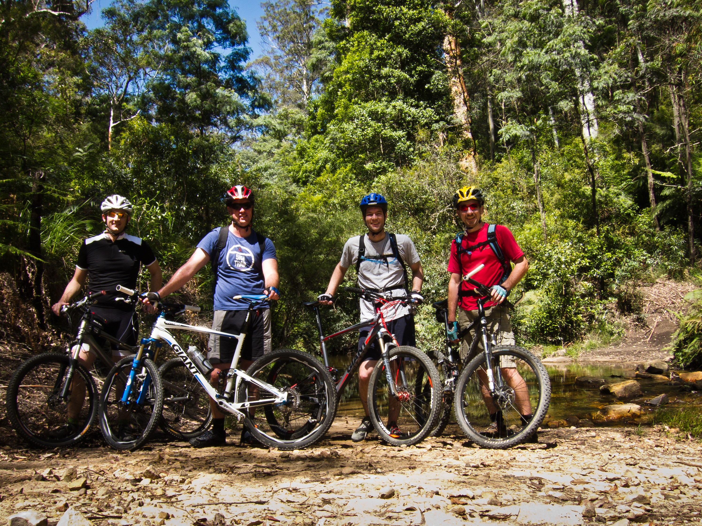

Six months ago, I purchased a new bike. I cycled frequently when I was younger, but had not ridden for about eight years. In fact, I had done relatively little physical activity during that period. The new bike changed that.

When I lived in the Blue Mountains, I rode the Oaks, a 25-kilometre fire road, several times. Anderson's Trail is a longer 35-kilometre route that connects to it, and I had been meaning to try it. Fortunately, a colleague invited me on a ride; I would have become hopelessly lost on my own.

Although the company was excellent, the ride was frustrating for me. I punctured two tyres, one on Anderson's Trail and another on the Oaks, and my legs felt sluggish throughout. I was never particularly short of breath, but my legs simply did not want to cooperate.

After we drove back to Sydney, I cycled home, showered, and returned for a barbecue. It was a great day out.
