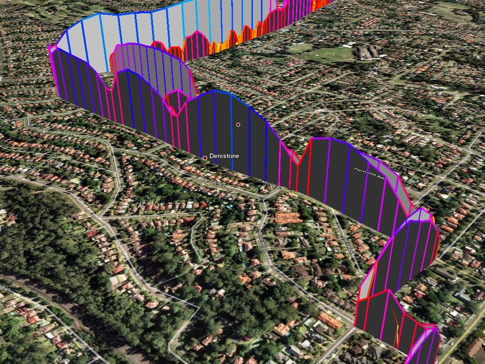
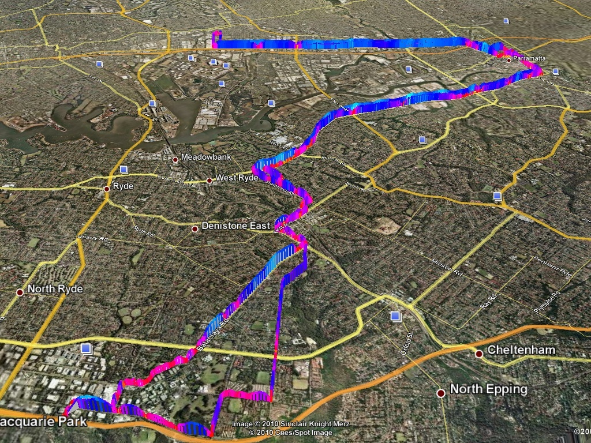

I showed a few of my co-workers my graph and one replied -- oh! that's really cool. (I think only two of my co-workers are actually interested in my geekyness). He then emailed me tonight a .kmz file containing a colorized file of his speed. I looked at the kml and noticed it appeared to be dynamically allocated judging by the top speed. Well, as you could guess, I surely had to modify my code to include colors.

Within an hour I had a semi-working example, and within two hours will easily be done with this blog post. The code might not be perfect, but it first parses the xml and returns the max speed for the trip. Next, it colorizes the speeds based on a scale of 0-255, with 0 being blue for fast and 255 for being yellow, or slow. I was going to study for the CCNA tonight, but it looks like writing Python is just too much fun.

  
  
  
  

So what, you might ask, are those dips? Good question. They are huge speed bumps (and the tall blue mound in the middle is a really steep hill).