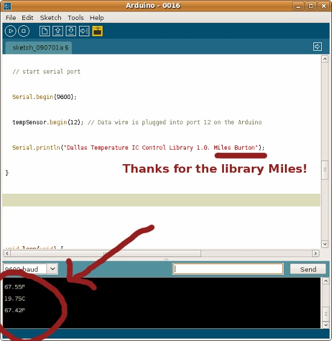
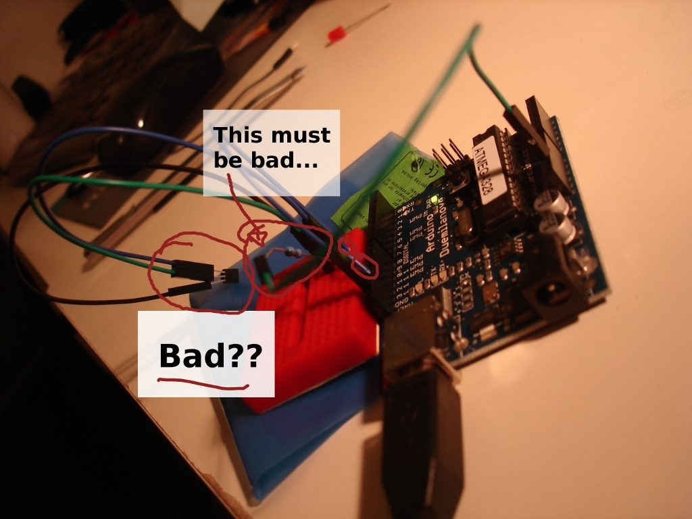

Tonight, I'm proud to say, I've returned to childhood. Let me explain.  

OK, fun over, back to work.

  
For the last year I've been wanting to purchase an [Arduino](http://www.arduino.cc/), for no other reason than to play with. Like a kid. My Arduino arrived two days ago. This is a story of problems, but not the pull-your-hair-out type, more the... like when you run out of gas in the middle of Sydney. Going to your Christmas dinner. In your friend's car. Long story.  
  
As a kid I never really learned about electronics. I took apart anything broken my parents set downstairs (and put back together the microwave I dismantled that my parent were going to give to my sister as a gift). But no electronics. I had a computer of some sort from when I was a wee kid, but not a single electronics kit, or not one I can remember.  
  
I soon realised I forgot to order a few resistors needed for the various sensors I purchased. This morning before work I stopped by the local electronics store, and like a kid in a candy shop, ordered $1.60 worth of resistors and LEDs.  
  
  
  
Just after coming home and eating insanely good Indian with YS, I set out to get an LED blinking. Without too many troubles, [success](http://www.kelvinism.com/howtos/simple-arduino-led-tutorial/)! I graduated myself to the next grade and pulled out the temperature sensor. I looked at the 'special' wires I bought to connect to the sensor and the breadboard, and I soon realised I actually purchased the M->F wires instead of the assorted pack. I started looking around for cables I could cut.  
  
Spare USB cable, no. Telephone cable, maybe. I realised I could just slice up one of the cables and see if it worked. The cables were braided instead of solid coper, which sort of made my hopes sink, but it was too late now.  
  
I soon wired everything together as the various forum posts suggest, plugged it in to my laptop, started the Arduino software, and loaded the [Dallas Temperature Library](http://milesburton.com/wiki/index.php?title=Dallas_Temperature_Control_Library), and - "Invalid CRC". I pulled the wires off, stripped a little more cabling off, plugged it back in, and tried again. It worked! I don't really know if the temperature is correct or not - we don't have any other way to measure it - but at this point, until I put in some more robust wires, I don't really even care.  
  
  
Overall, I'm happy. I've created two simple physical computing missions, and wrote two blog entries, in well under two hours. This has been quite a relaxing break from the other duties in life. I plan to make the little system 'proper' (more robust), and link it to my [mini server](http://www.kelvinism.com/tech-blog/true-consolidation). I'll then create a simple chart (via Google's API) to display on this website.  
OK, fun over, back to work.