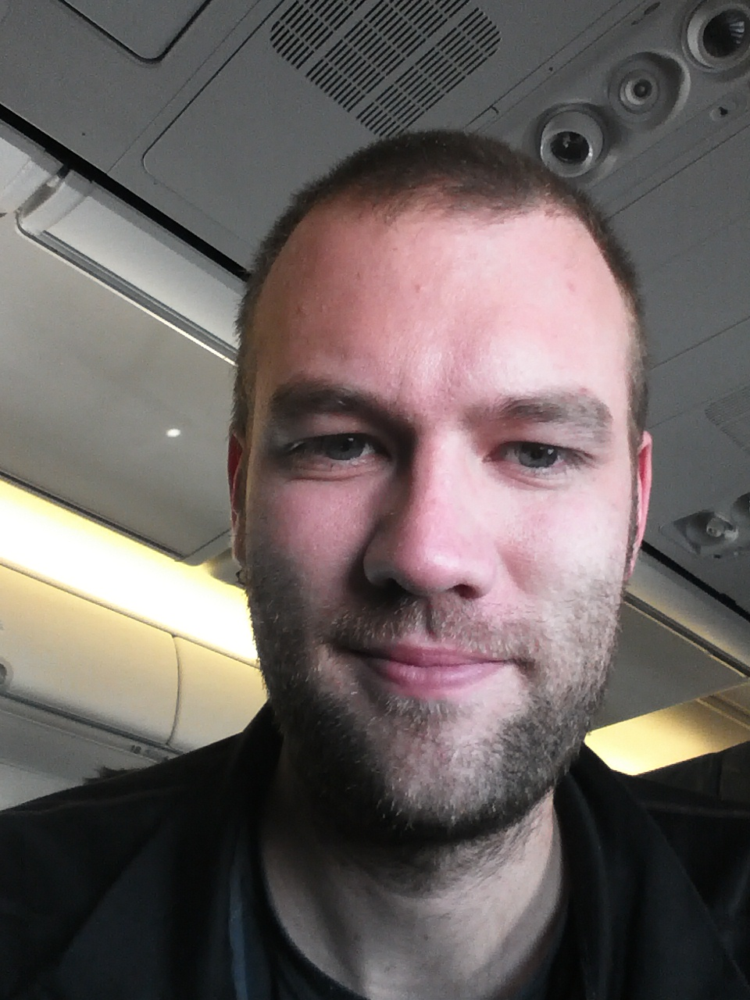
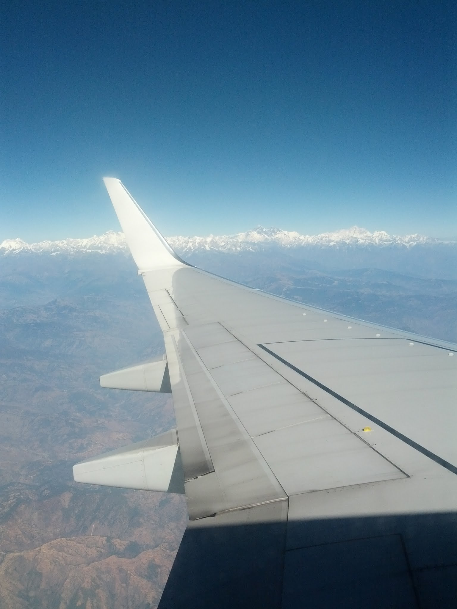

Sure enough, I did not arrive back at Kathmandu until almost 17:00, maybe later, which translated into a very long day. I debated whether I should have flown, even though that would have been more expensive, but I do not know if it would have been any safer.

I walked away from the bus stop and navigated directly to the Laughing Buddha, where I put down my bags, bought some water, and went out looking for food. After visiting a supermarket, I had dinner and a beer at MoMo Star, dodged a few more scooters, and finally settled back into bed.

Defeated

The next morning I woke up at a reasonable hour, ate breakfast, and jumped in a taxi to the airport. This driver stayed on the main roads; there was no off-roading in his little "Sports" tin can. At the airport, the first security check, before I could even reach the ticket counters, was minimal. My bags were scanned, and I underwent a "pat-down," which for me involved someone merely touching my arm. Although I am not a fan of airport security in the US, I still think a metal detector should be necessary.

The airport's ticketing system was down, so I took a seat. After a while I was called up, collected my tickets, and went upstairs to clear immigration. I then entered another holding area and waited. Feeling thirsty, I noticed staff bringing in water containers and filling the dispensers. I went over and looked for cups, since my water bottle wouldn't fit, but found only two upside-down glasses. At first I thought it was nice that they provided glassware, but on second thought I wondered where people put the used glasses. I quickly concluded that they might have been used already, so I grabbed my Platypus and filled that instead. Sure enough, within 20 minutes I had seen 15 people use the same two glasses, one after another. In an airport. Not ideal.

I ordered two coffees, since I had plenty of leftover money, and I waited.

The bathroom in the airport looked like it was being held together with glue, and the glue was starting to fall apart.

Mt. Everest, just before the wing tip

Eventually, my gate changed, and I walked around the corner to board. Near the front of the line, my travelling companion was pulled aside just before another screening, and I followed her. What I did not notice quickly enough was that men and women were being separated into two lines, which is probably why the security officer sharply redirected me when I tried to follow. "Same bus, you go." I was patted down quickly and put on a bus to the plane. The bus filled up while I watched her remain in the security line.

At the plane I waited a few minutes with some other people whose companions were still in the security line. The airport staff clearly wanted to get us on the plane but ultimately relented, and she arrived on the next bus. She did not make a big deal out of it, which was a relief.

I boarded the plane, navigated around passengers trying to photograph every part of it, and manoeuvred past airline staff attempting to get everyone seated.

After a few delays I was in the air, and it was my turn to take photos, this time of the vast mountains on the left-hand side of the plane. In the distance I could see a familiar-looking mountain, most likely Mount Everest, though I needed to confirm it online later. (Update: it was!)

Next stop: a four-hour layover in Kuala Lumpur, then back to Sydney.
