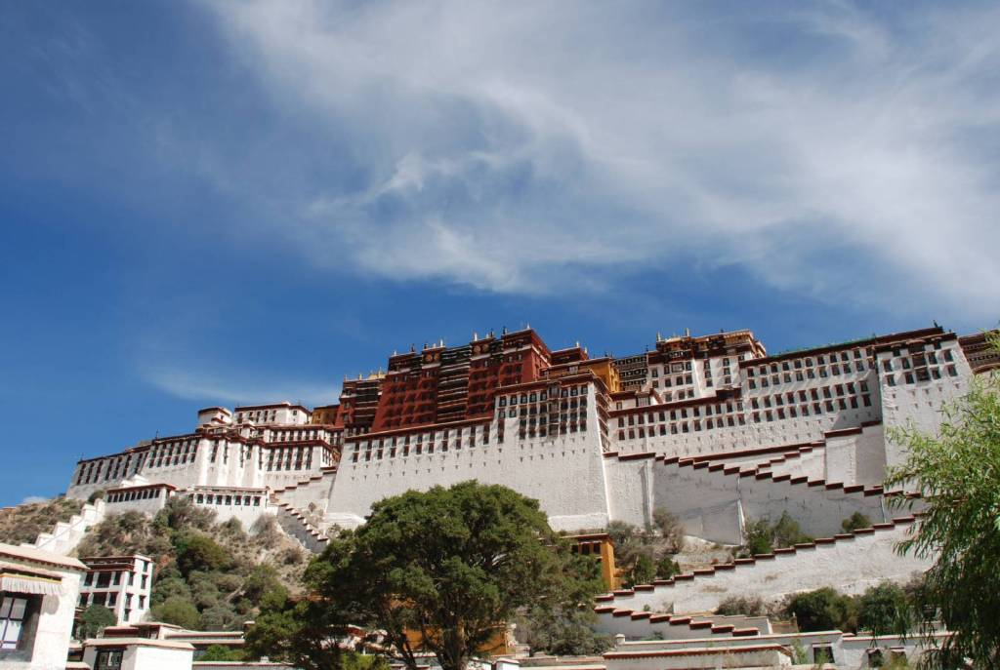
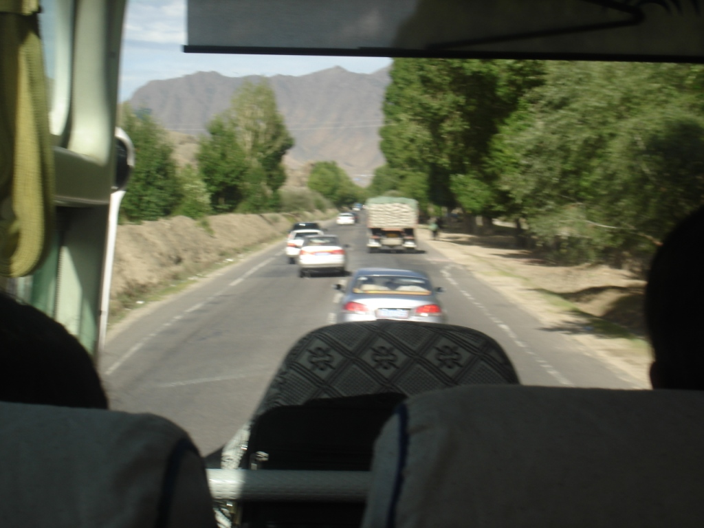

Once again, we woke up early and ate breakfast. The weather was surprisingly cold. After breakfast we walked up a hidden passageway to the fort and got almost all the way up before being stopped. Eventually, somebody asked us to buy tickets if we wanted to continue, but the price wasn't right, so we took photos of the valley and headed back down the hill. Around the corner we walked to the monastery, but, unimpressed, we left without exploring too deeply.

We inquired at the bus station about the next bus back to Shigatse, and when our truck arrived, we haggled a bit and were on our way. Halfway there, the driver asked me to duck down in the back because a checkpoint was ahead. Covered in blankets, I felt the vehicle slow as everyone fell silent, then pull away. I was free. For now.

Back in Shigatse, we bought tickets for the bus to Lhasa and were on our way. The full-length touring bus was driven as chaotically as the minibuses we had taken so far. As we approached Lhasa, we passed another checkpoint; we closed the windows, and I put on a sweatshirt. Looking back, relying on drivers to hide me from checkpoints was reckless and put them at risk, not just me.

To satisfy our cravings, we found a small street-side Muslim lamb stall. We asked how much the food would cost, and the vendor replied RMB 5 per skewer. That equates to about 70 US cents apiece, which was quite hefty. We suspected he was trying to overcharge us, decided haggling over our food wasn't worth it, and left unsatisfied. Around the corner we found another vendor just packing up for the night, yet he was all too eager to help us. We sat down for about two hours, eating more and more of the spicy food and even buying some beer at a local market. It was delicious.

Feeling warm from the lamb, we wandered back to the hotel, played some more bridge, and fell asleep by 22:00.
