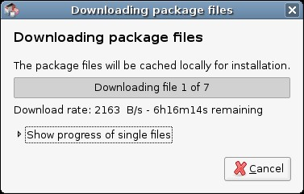

I am currently working from a Starbucks cafe, I'll admit it. The internet is normally quite good, and I pay about $15 a month to use it. Today, however, it is very unreliable. Don't believe me?

In addition to certain sites failing to load, forcing me to use pattern recognition in Tor to open them, the internet is simply slow today. I can't even connect to AIM. Frustrating.
