After weeks of travel across Europe and thousands of kilometres, I concluded my big 2012 trip with a long stay in Istanbul. I knew there would be a lot to see, although I hadn't planned far ahead.

Even though I arrived rather late at night, I still went out to explore. Istanbul is a foodie's paradise, perhaps not quite like Singapore, but with delightful sweets on every corner.

Day 0 - I ate.

Despite the late hour, I still managed to sample some of the delicacies available on every corner.

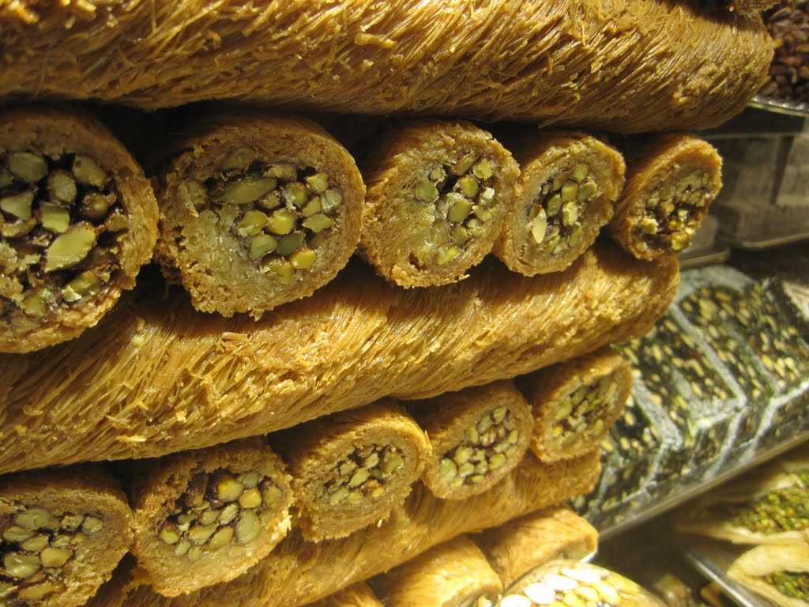

Tempting baklava on every corner.

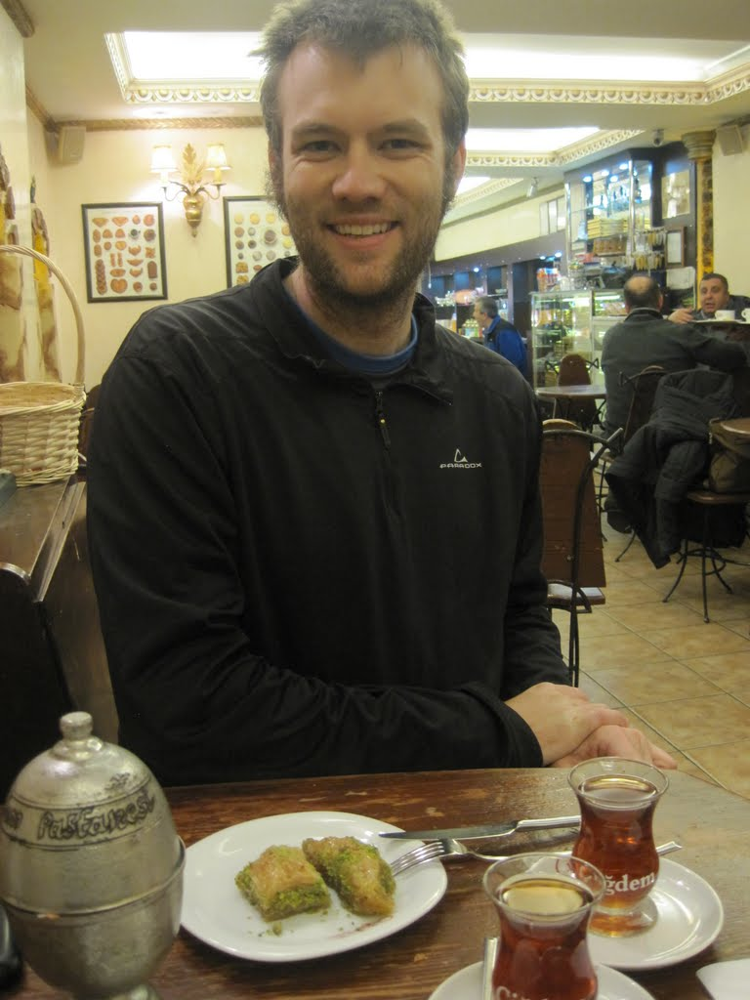

I checked into my hotel and went straight out for baklava.

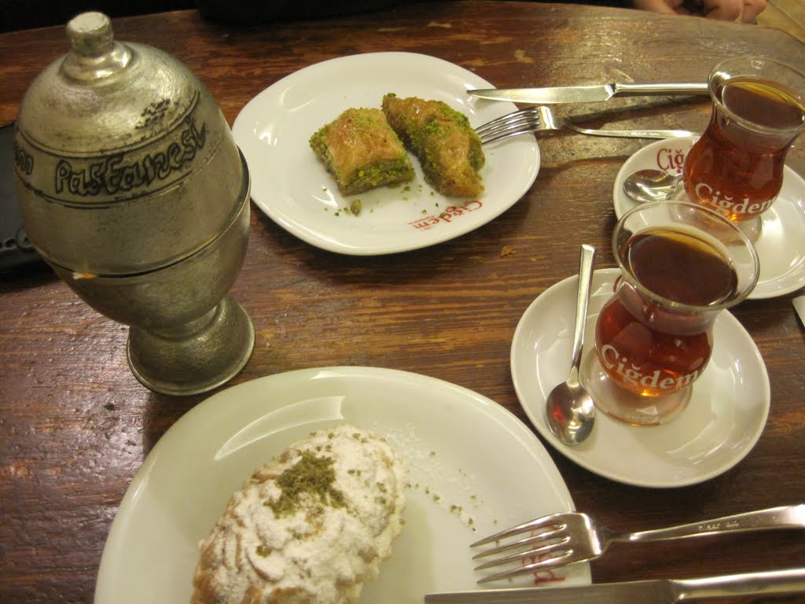

Yum

Day 1 -  The Old Bazaar, The New Mosque, Topkapi Palace, Hagia Sophia (the free part), Underground tunnels, and the Blue Mosque.

One of the beautiful things about Istanbul is how much there is to see within a compact area. I don't think there are many other places in the world where you could see so much in a single day, entirely on foot. My friends from Vienna had warned me about one particular scam in Istanbul, which goes something like this: a shoe shiner walking in front of you "accidentally" drops his brush. You call out to stop him, and he is so grateful that you alerted him to the almost-lost brush that he offers to clean your shoes. After cleaning them and hearing all about your holiday, he looks up and says, "Twenty euros, please."

The best part was that I saw this happen on multiple occasions. I suppose they didn't bother with me, since there was no hope of cleaning my duct-taped boots.

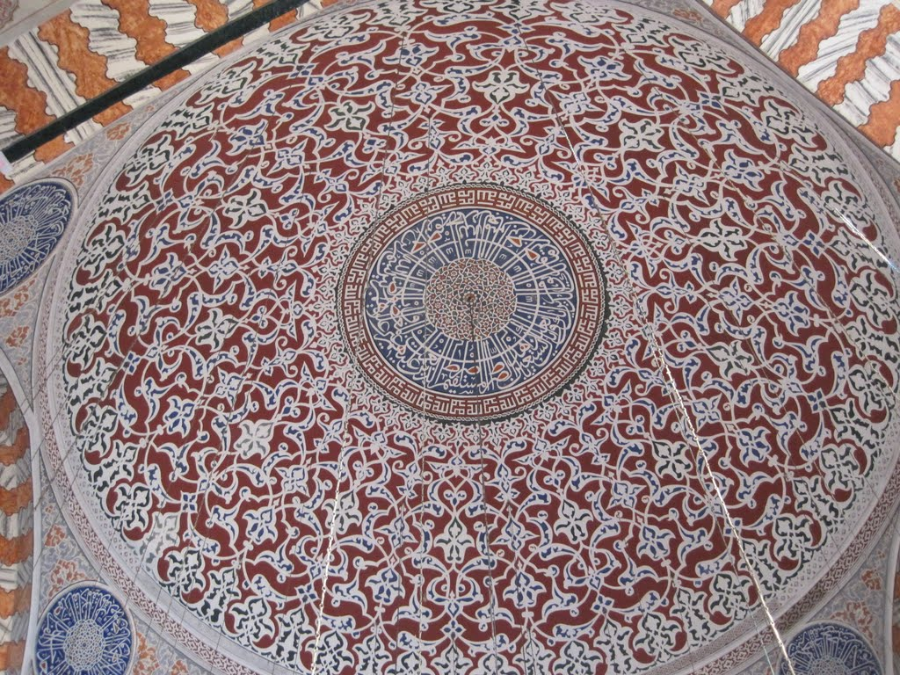

Hagia Sophia (the free part)

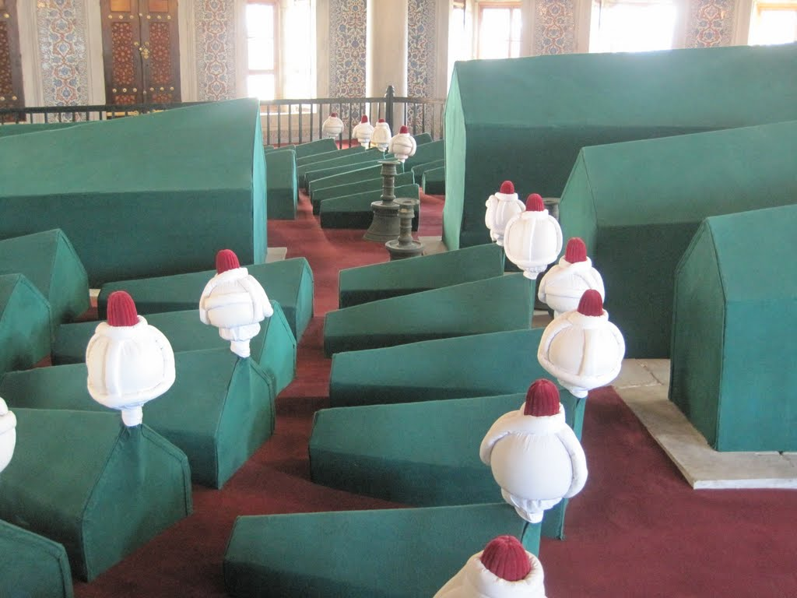

Hagia Sophia (the free part)

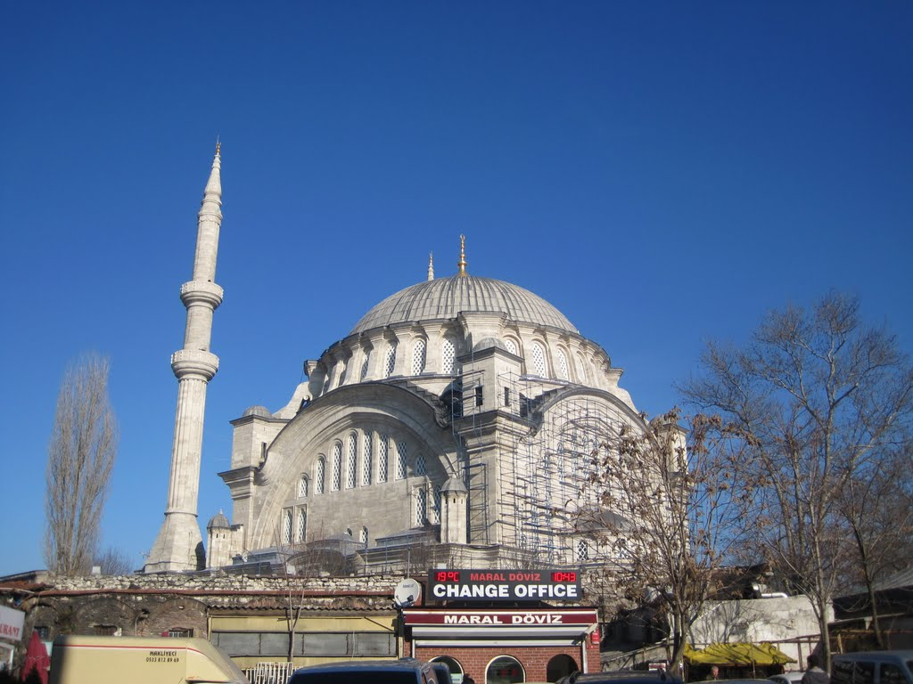

The entrance to Istanbul's underground tunnels

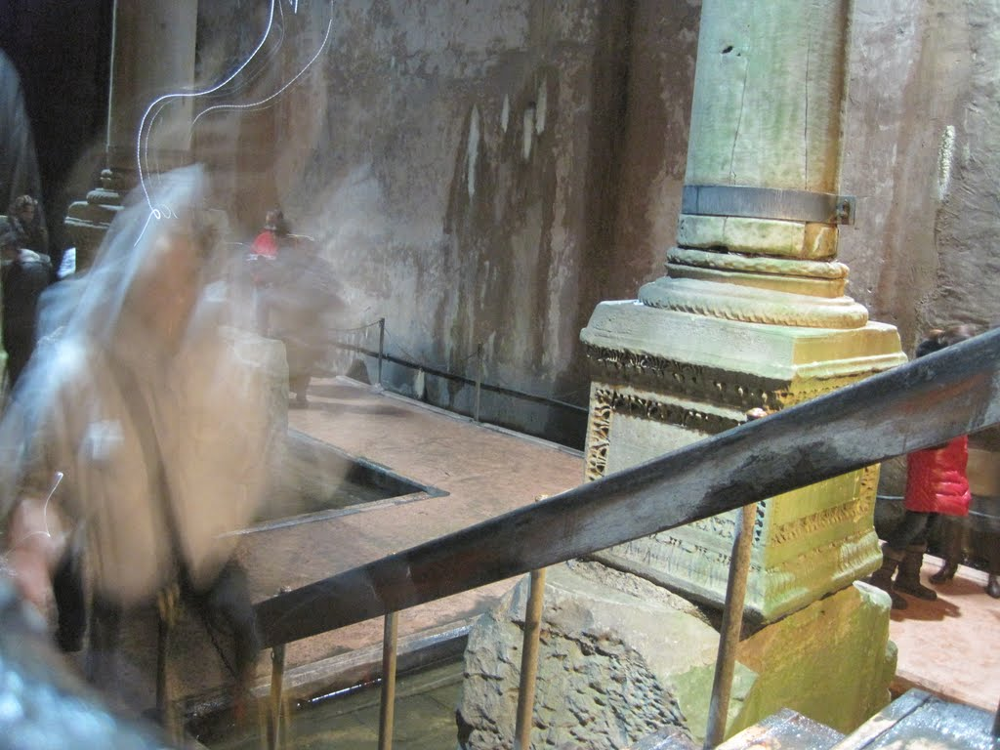

Under Istanbul

Under Istanbul

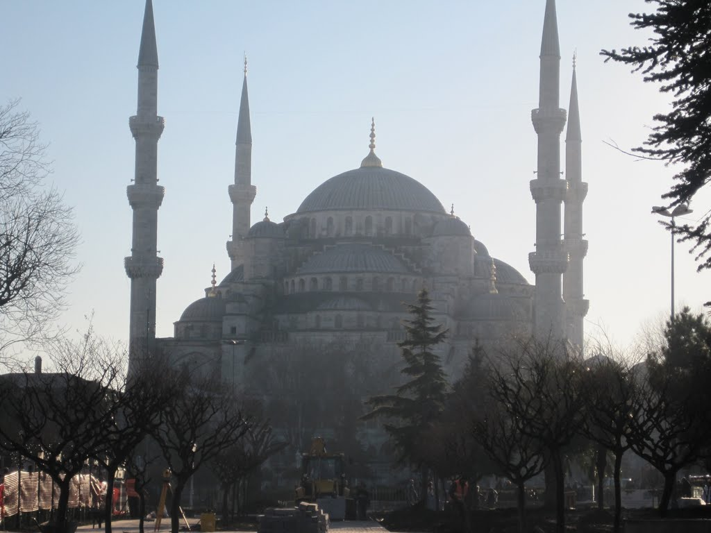

Blue Mosque

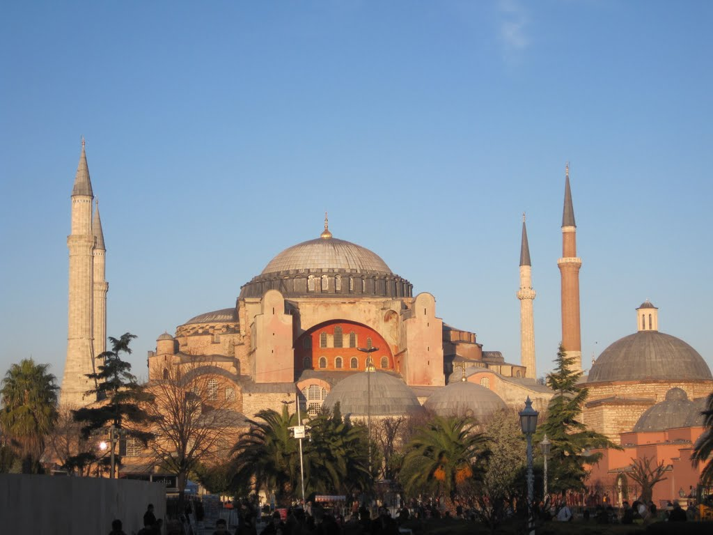

Hagia Sophia from afar

Day 2 -  Galata Tower and Eastern Istanbul.

This was mostly a relaxing day in which I visited Galata Tower and the large square nearby, then made my way to the eastern side of the city. Once there, I spent some time in a large shopping centre before finding a wonderful cafe and eating plenty of baklava. Unfortunately, I lost track of time and missed the ferry back to the main part of the city. Had I reached the terminal just three minutes earlier, I would have made it. To make matters worse, it was the last ferry. The service-desk attendant and I did not share much language, but I eventually learned that there was a bus back to the city. He wrote down the bus number, although I wasn't sure whether the first character was a G or a 6, so I began asking bus drivers. I admit that I was still somewhat nervous around vehicles, and all the buses moving through the depot were a little nerve-racking. Eventually, I found the right bus and made it back to the city.

Galata Tower

Taksim Square, where there's shopping everywhere you look

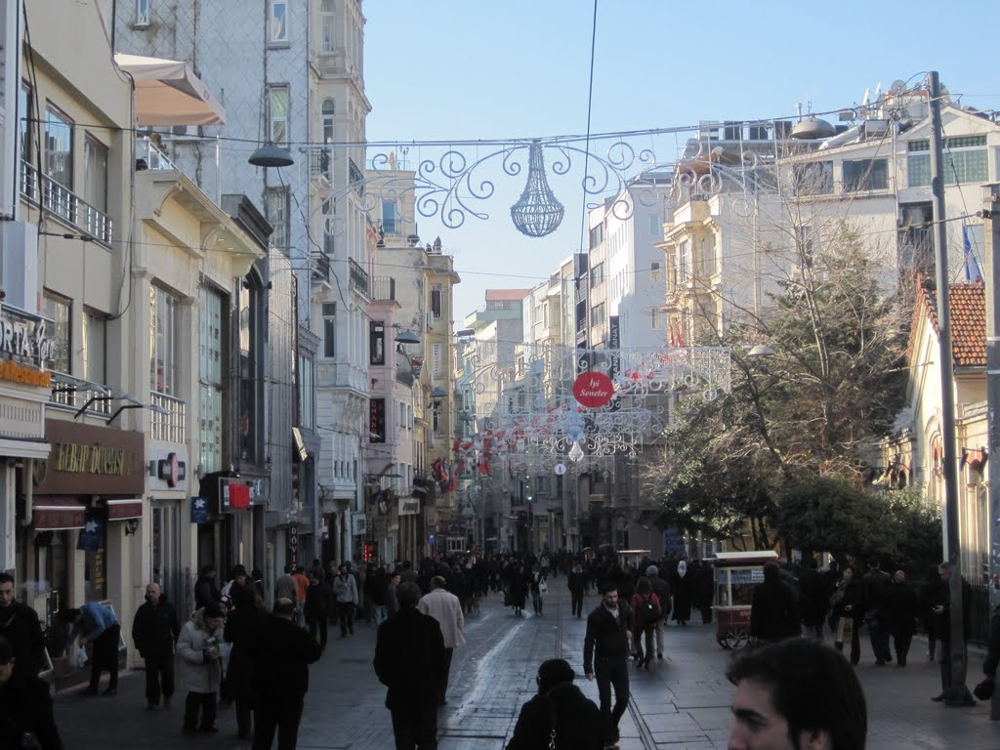

Walking from Taksim Square back to the city

Day 3 -  Hagia Sophia (the real part), and a little island - Adalar

The Hagia Sophia is absolutely amazing, and I can't wait to take my future children there. It inspired almost the same sense of awe I felt when seeing the Colosseum or the Mona Lisa.

After spending much of the day in the Hagia Sophia, I took a ferry to Adalar Island, which was apparently excellent for hiking. It was also a good excuse to collect some additional GPS tracks and escape the hustle and bustle of the city. Although the island was much quieter, there was rubbish everywhere. Donkeys and dogs roamed loose, eating much of it, and there appeared to be little effort to manage it. I walked to what I think was the top of the island, completed a loop, and returned in time to catch my ferry home. I had one last giant box of baklava, enough to eat far too much, and prepared for my flight home.

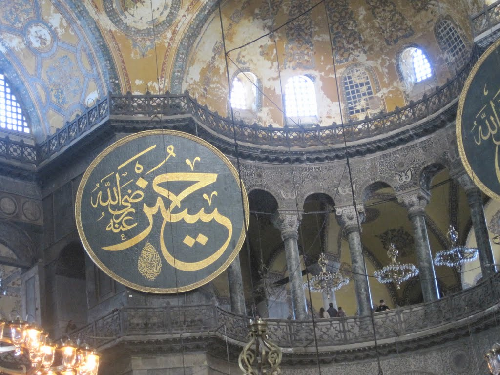

Hagia Sophia

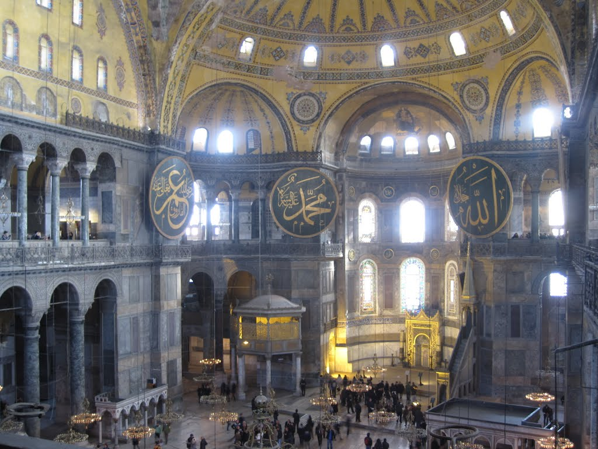

Hagia Sophia

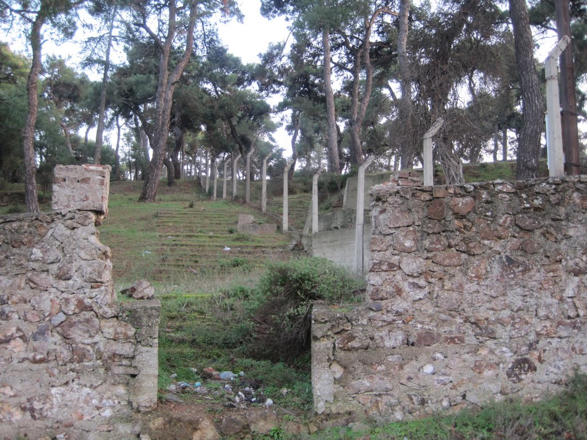

Hiking into the hills in Adalar

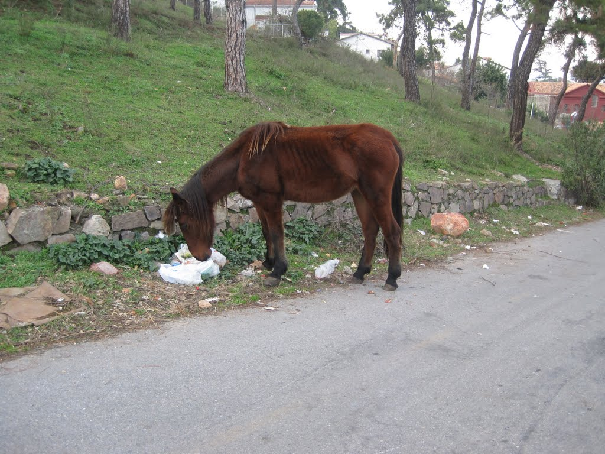

Lots of horses in the hills, with lots of trash.

These were genuinely back roads

I wasn't even certain what this was.

I had a lovely time in Istanbul. The pollution and crowds got to me eventually, but overall it was a memorable experience. Here's a map of where I went.

[Embedded map](https://www.google.com/fusiontables/embedviz?q=select+col2+from+1RFDybcyTiZ_M_VoDJdx9sjuqeMKU1cx-RnRxMg&viz=MAP&h=false&lat=41.00642676870445&lng=28.99107547709673&t=1&z=12&l=col2&y=2&tmplt=2&hml=KML)
