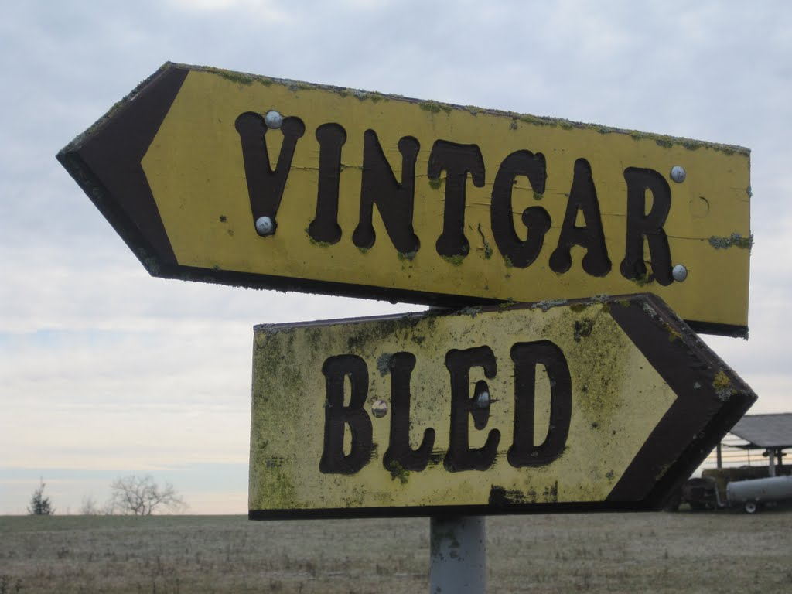
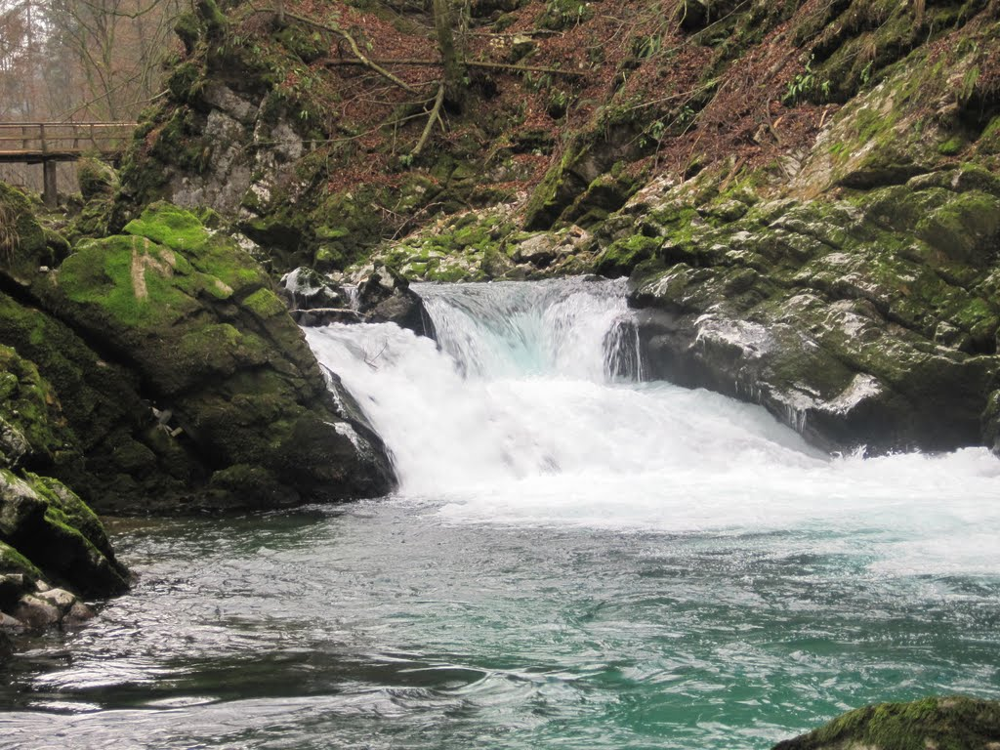
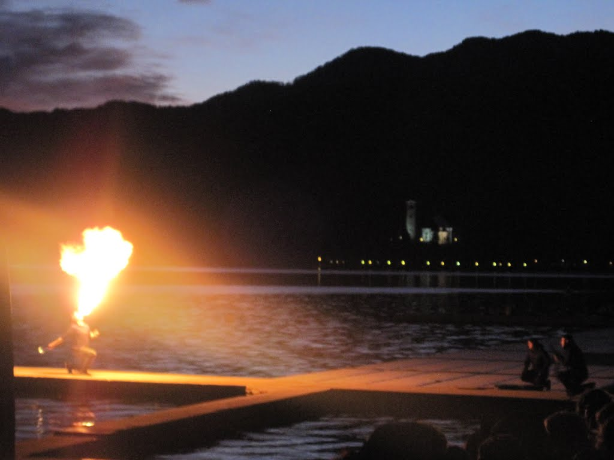

The Salzburg main train station is undergoing major reconstruction - with boards and temporary walkways everywhere. I boarded my train to Bled shortly after 8:00am, which included one transfer in Villach. In Villach two other travellers joined me, a couple from Arizona, who were on their way to Ljubljana for a first family reunion / Christmas celebration.

I enjoyed my brief encounter with the couple, an engineer and a teacher, where I discussed work/life balance and how lucky I am to live in a country that values such balance. They marvelled that I could travel regularly, stating that their children, my age, only dream of taking a month off to travel.

Lake Bled, seriously picturesque

My train arrived in Bled early, and I caught a bus to the lake. One thing to note about public transport in Slovenia, if you're ever travelling here, is that the transport almost always departs a few minutes early. I noticed this on both trains and buses.

The hostel/guesthouse I booked was a bit tricky to find, with no clear signs, but it was well placed and had great views. However, it was near the main road, as most of the hotels are, so a bit of traffic noise could be heard in my room. The biggest downside for me was that the accommodation was above a Chinese restaurant, and while I could get a 10% discount if I ever went, the kitchen and bathroom perpetually smelled a bit like cooking exhaust. I don't know if they were above the restaurant's kitchen, but the smell got old really quickly. The owners of the guesthouse likely knew this, too, and an air freshener was in the kitchen. This only made matters worse for me, as the kitchen smelled like a Chinese kitchen that had just been cleaned with raspberry bleach.

Regardless, I had the floor to myself, and since most restaurants would be closed on Christmas, I planned to purchase some groceries and cook most meals myself. The Chinese place below me was open every day, of course.

After paying for the hostel and dropping my bags in the corner, I promptly set out for the lake and castle, just a few blocks away. By the time I started walking by the lake, while eating kebabs, I opted to keep walking around the lake, which is about 7KM around. I cannot remember taking more photos of the same thing ever before - with every turn I was taking more and more.

Lake Bled is also known as the training ground for the Slovenian Olympic rowing team, and for good reason, as the lake was almost completely still. A rowing centre is on one corner of the lake and displays the number of medals the team has won, which seems to be in every Olympics for the last 30 years.

After walking around the lake, the light was quickly diminishing and temperatures were dropping, so I opted to skip the castle ("grad") and head back to my hostel. Just prior to arriving back I stopped by what would become my favourite coffee shop, Apropos, and had some beer and coffee.

Although I had really enjoyed my time in Europe, the smoking in bars and cafes had become very tedious. Despite the health aspects, the smoke creates an extra discomfort for me, as I don't have the luxury of washing my clothing every day. This means my hats, scarves, sweatshirts, and gloves smell like smoke and retain that odour for days to come.

Apropos was smoke free.

One of the advantages of my hostel was a TV in the kitchen, and while it only had 10 channels, one of them was FoxLife, which routinely showed mostly up-to-date shows. I cooked some food, ate dinner, watched FoxLife, and went to bed.

The next morning I visited Vintgar Gorge, located in a national park just outside Bled. The same bus driver from the first day took me there, through curvy roads and into the hills, and gave me basic directions on where to turn to get to the gorge.

I walked and walked, cold but leisurely, and several kilometres later reached the base of the gorge. While the ticket office was closed, the trail was still accessible, so I started walking through the gorge.

The stream, one of the most crystal-clear bodies of water I had seen, had cut sharp walls in the gorge. These walls now had water slowly dripping from them, and since it was winter, this water had become giant icicles. I must admit, the icicles were a bit scary. I had images of one breaking off and spearing me in the neck, which would likely happen given my travel karma so far. The path was icy, and boards on the walkway were broken. The image of me carefully traversing the walkways, stepping over the dangers from below, and covering my head from the dangers above, must have been a humorous sight.

The gorge was one of the more beautiful nature sites I had seen, and while I didn't walk to the end, what I did see was worth the walk. Highly recommended. It is wonderful that Slovenia has taken steps to protect the environment.

That afternoon I took the bus back to Bled and hiked up to the castle, which provided stunning views of the surrounding area, at least until the weather changed and snow started to fall. I took a few hundred more photos and hiked back to the cafe, and two cups later I was back in my kitchen with FoxLife. The sun was well and truly gone.

On my last full day I opted to visit Lake Bohinj, located about an hour's bus ride from Bled, which also provided a beautiful walk with beautiful views. While maybe not as picturesque as Lake Bled, Lake Bohinj was a better hike, and I saw plenty of locals enjoying their Christmas stroll. The bus dropped me off on the west side of the lake, and I proceeded to walk the five or so kilometres to the east side. I am glad I only walked one way, along the north side of the lake, so I avoided the road that traversed the south side.

I finished the hike feeling a sense of accomplishment from balancing city travel with nature travel, had a coffee at a small cafe (to use their bathroom), and caught the bus back to Bled.

One of my biggest expectations was to see the local tradition in Bled, something involving a bell.

Just prior to 17:00 I left Apropos for the north side of Lake Bled, where I joined hundreds of locals and tourists to learn the history of the Bled bell. A fire eater served as the evening's appetizer, followed by a light show on two boats, a girl singing carols, and then the main event, the bell.

My expectations may have been too high, and although the story was cute, I felt like it was invented to create something traditional. Regardless, it was a good time, I took a few photos, and was greeted by fireworks on my walk home.

