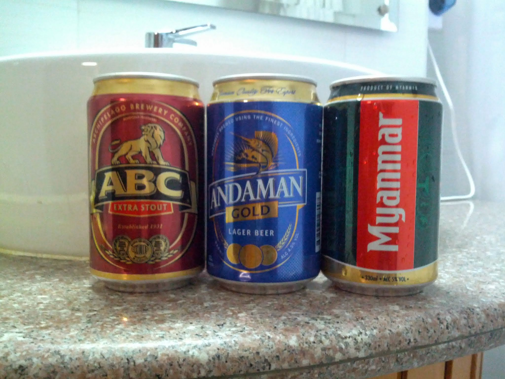

While in Myanmar on a recent trip I did a brief taste comparison of the three main beers available in most supermarkets.  
  
**Andaman** - Not to my taste, perhaps like XXXX, VB, Natural Light, or a light Steel Reserve.  
**Myanmar** - Quite refreshing, a bit like similar beers in the region, e.g. Chang, Tiger, or Laos Beer.  
  
**ABC** - An extra stout (and 8%!) in such a hot country? That's a surprise.