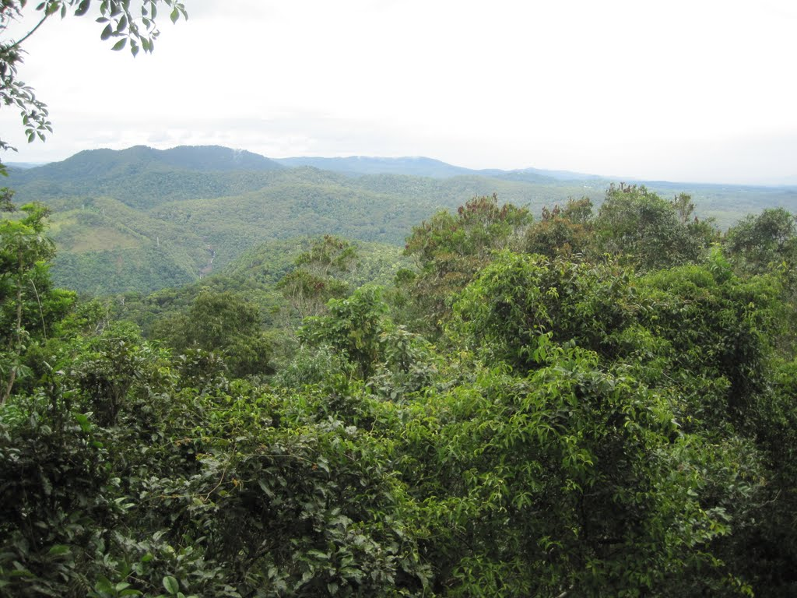
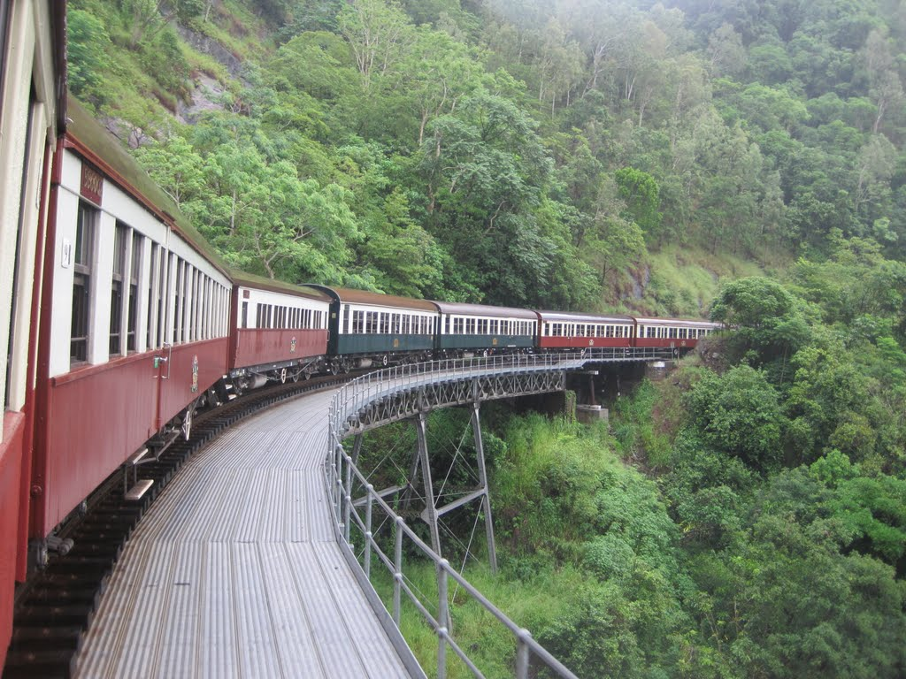
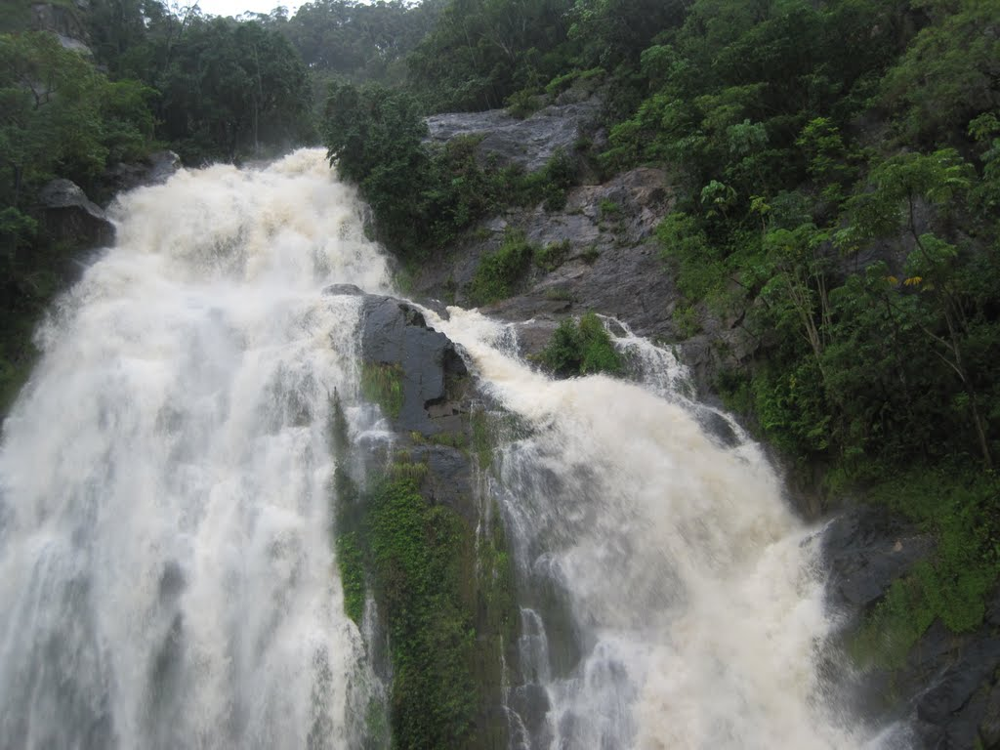
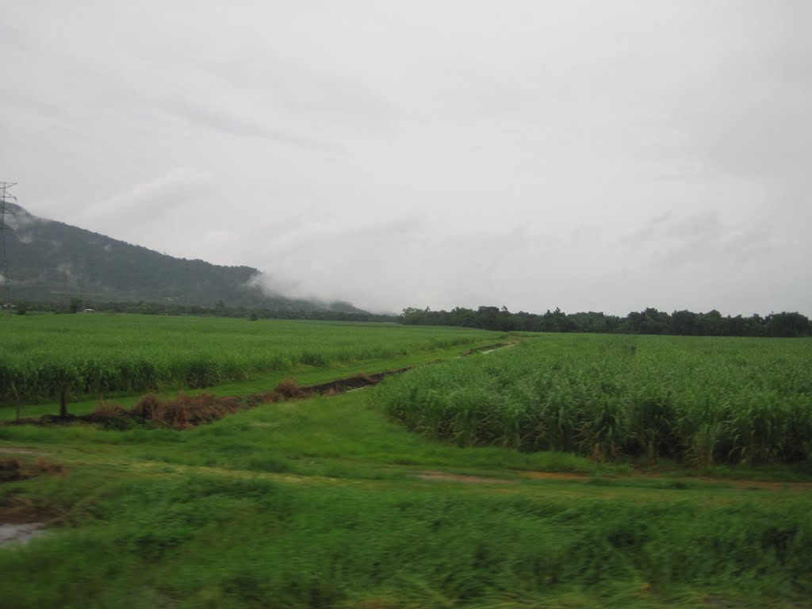
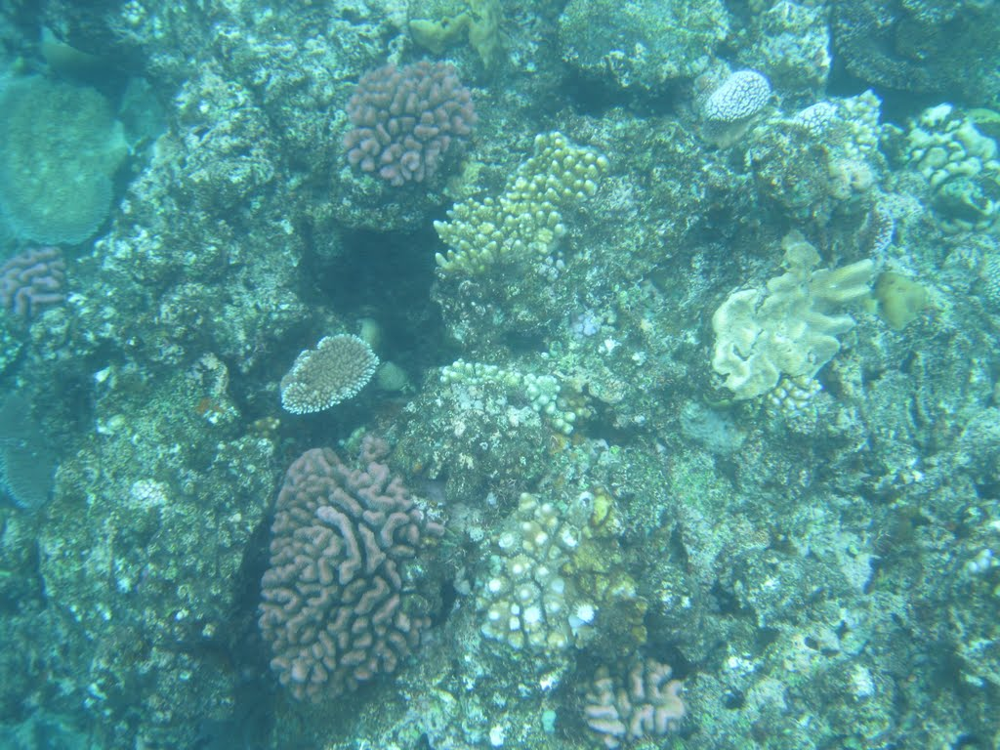
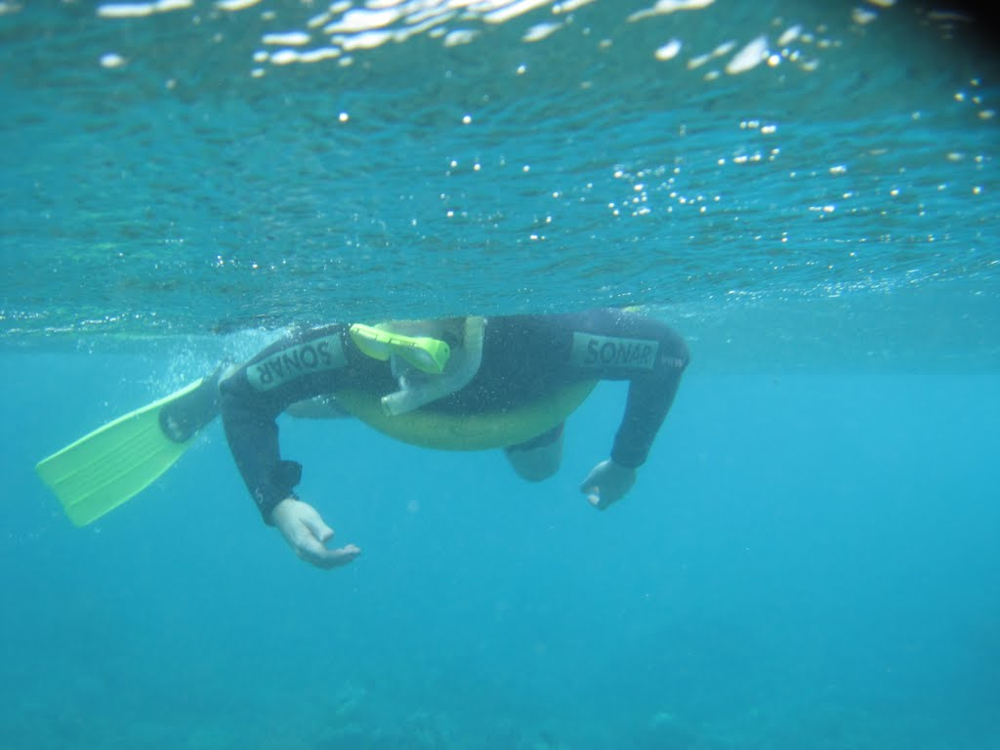
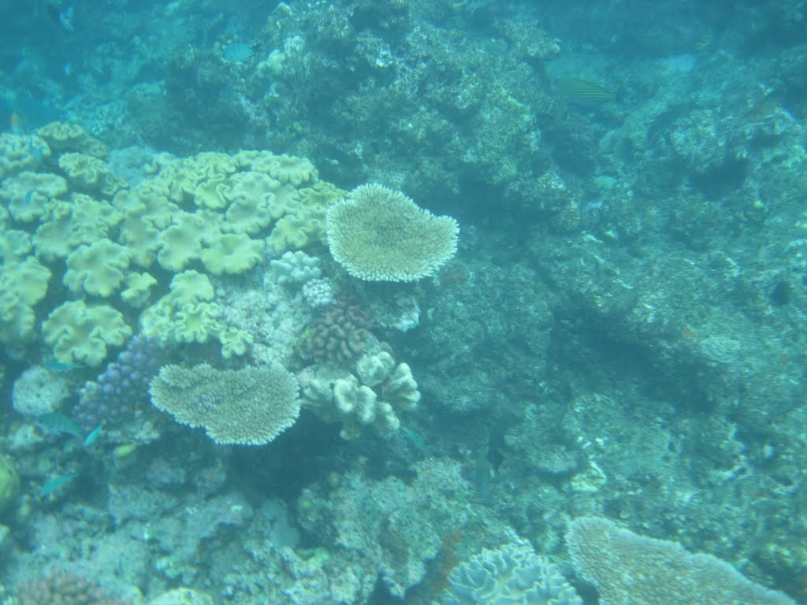

For the previous month, I had been hearing hints about a surprise birthday holiday to an unknown destination. That weekend, I finally learned that I would be travelling to Cairns in Queensland, a gateway to some of Australia's greatest natural wonders.

I left Sydney early on Friday and arrived at Cairns Airport by 9:00am. Although activities were booked for days two and three, the first day was open. After considering my options, I decided to take the Skyrail over Barron Gorge National Park and return to Cairns on the historic railway.

I boarded the 103 bus near where I had eaten breakfast. An hour later, I was buying a Skyrail ticket. The gondola travels above the rainforest and ends at the village of Kuranda. The wind was strong and rain fell, but the views still offered plenty of excellent photo opportunities. At the two intermediate stops, I followed short boardwalks through the rainforest and enjoyed views of the gorge.

The Skyrail dropped me in Kuranda, where I bought postcards and started looking for food. Just before I left the shelter of a souvenir shop, the clouds darkened and released a downpour. This was not mildly inconvenient rain; it was the kind that soaks every layer. People arriving from the village were drenched. I waited for a break, ran towards the village, took a few wrong turns, and eventually stopped for lunch and a Guinness at the hotel. Kuranda was full of visitors, with ice cream, food stalls, and souvenir shops around every corner. Much of the merchandise was made in China, and I found myself wondering what Chinese visitors thought of travelling to Australia and encountering familiar goods.

My return train departed at 15:30. My original carriage was full, but I was invited to move to another that was nearly empty. The journey followed the historic railway, which had been built in stages to serve mining communities and settlements beyond the mountains. Along the way were waterfalls, sweeping curves, and cliffs only inches from the track. The most memorable moment came when a small landslide struck the side of the stationary train while passengers were taking photographs from a lookout. Several people opened the windows and leaned out to inspect the damage. My companion and I looked at each other with the same thought: why put your head out where a landslide has just occurred?

The train returned to Cairns, and I formally checked into my hotel. My room on the top floor of the All Seasons was clean and, importantly, free of any smell of smoke. I soon prepared for sleep.

Day two began with a 7:30 pickup for the harbour, where I boarded a Reef Experience boat with about 18 other passengers. I was excited to visit the Great Barrier Reef, but that enthusiasm faded as we reached choppy open water. I made it through the marine-biology briefing before joining most of the other passengers at the back of the boat, all of us seasick. There is something humbling about holding hands with your companion while both of you are vomiting.

When we reached the reef, I recovered enough to collect my snorkelling gear, climb down the ladder, and enter the water. At first, I could not see the reef and paddled around in confusion. A crew member directed me farther from the boat, and suddenly the reef came into view beneath the rough surface. It was beautiful. After snorkelling for a while, I returned to the boat and prepared for the introductory dive included in my package. I entered the water first, followed by my companion, and the guide began our slow descent. After a while, I realised that my companion was no longer with us, perhaps because of ear pressure or discomfort. I continued down with the guide, concentrating on breathing steadily and avoiding contact with the reef. We moved along its edge and around the rock formations before gradually returning to the boat. My first dive lasted about 20 minutes and remained within the 12-metre limit. Despite generally disliking the water, I enjoyed the experience enough to consider doing it again.

Back on the boat, I was sick again and joined my companion on the upper deck. I remained curled up there while the rest of the group completed their dives. Fortunately, the return journey was less turbulent, or perhaps I simply had nothing left in my stomach. I sat beside a friendly farming couple from South Australia and talked with them about life on the farm and how it had changed over the previous 25 years.

Still feeling unwell on dry land, I returned to the hotel and looked for dinner. A shared curry was perhaps not the wisest choice for an unsettled stomach, and I slowly made my way back to the hotel and fell asleep.

Ten hours later, I woke for day three and a 7:20 pickup for a tour of the Daintree. Our guide, Tim, was originally from Penrith in Sydney. He drove five of us to several rainforest boardwalks, offering informal explanations along the way. His good humour and stories from working as a snake catcher made the tour engaging, and he even shared advice about what to do if I were ever bitten while cycling in the Blue Mountains.

The tour included a river cruise through the Daintree. The dry season might have provided better viewing, but we still saw several crocodiles. Two were so well concealed that I could barely make them out, while a smaller one, about a metre long, was clearly visible. I took photographs and could finally say that I had seen crocodiles in the wild.

We continued to a high viewpoint over the Daintree, where our four-wheel drive developed a battery problem. After a delay of an hour or two, we were moving again and soon visited an insect museum before a very late lunch. The tour concluded at Cape Tribulation, after which we returned to Cairns.

Despite what felt like a leisurely day, I still walked almost 18,000 steps and quickly fell asleep.

I had originally reserved the final day for the Skyrail and train, but because I had already completed both, I decided to explore the central business district. The heat and humidity quickly changed my plan, and I did what many sensible locals appeared to be doing: I went to the shopping centre. Although I did not need to buy much, I stopped at the local Bupa centre to ask for the nearest optometrist, bought some scones, and prepared to face the heat again. Blink Optical could not fit me in for an eye examination, so I returned to the shopping centre to cool down. By 15:30, I was back at the hotel and ready to leave for the airport.

The surprise trip was an excellent experience overall. I do not usually travel as part of the conventional tourist circuit, but I enjoyed the visit and felt relaxed despite the heat. Cairns can be expensive for visitors: food costs are high, and reaching most attractions requires using tourism operators. I found no direct public bus to the airport or to several of the places I wanted to visit. Even so, I left with ideas for a more economical return trip and better ways to see what I had missed. It was a memorable birthday gift.
