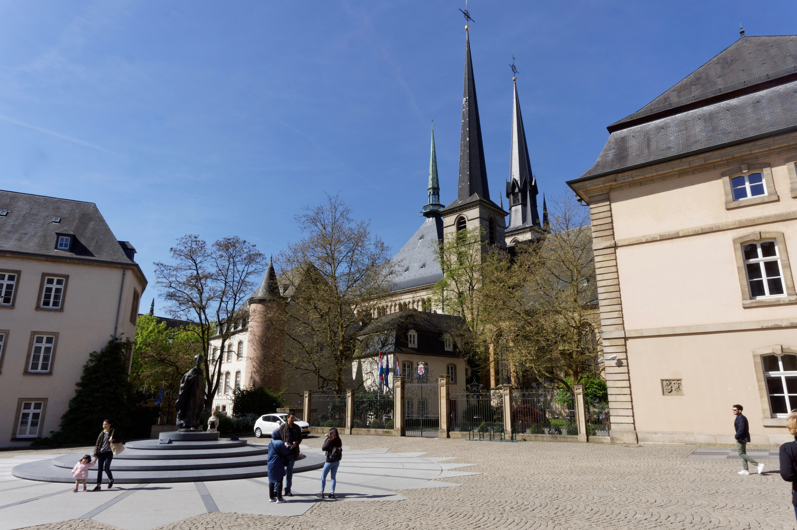
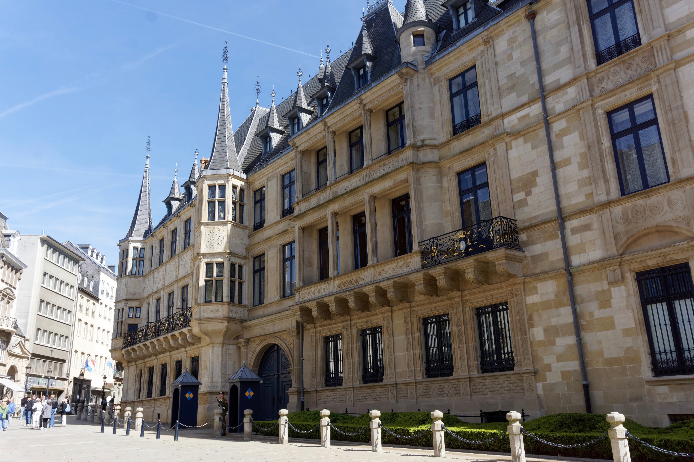

Luxembourg is a city-state just north of Nancy, and we chose it as the cheapest place from which to fly to Portugal. It is a marvellous little city, with wonderful parks surrounding the city centre. The views from the Pétrusse Casemates were especially lovely.

During one of our walks, we happened upon a giant wooden playground unlike anything I had seen before. Eva loved it, even though she had only just learned to walk.

It was a brief trip of only two days, but lovely nonetheless.

