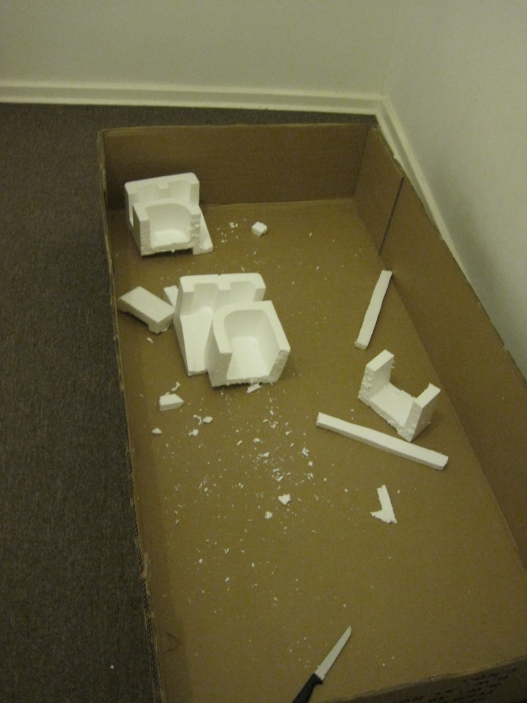
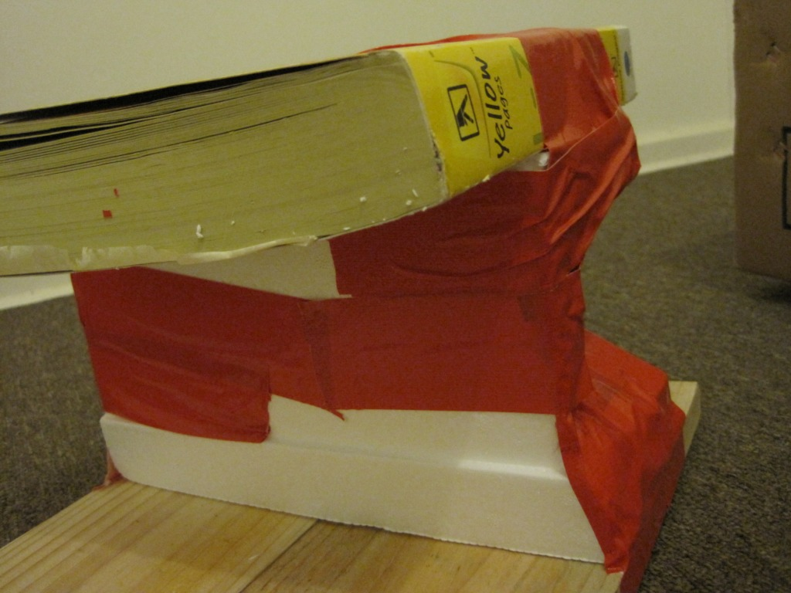
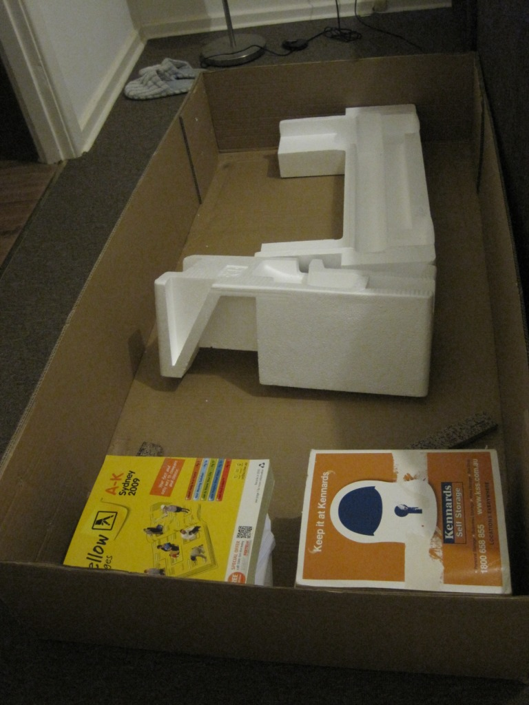

There are a few problems with modern life, especially for an office worker, most notably the sedentary lifestyle that comes with it. The last few years have been the most inactive of my life; I joked today about barely having a bruise or shedding a drop of blood since arriving in Sydney. Although I've never been a serious athlete, I was in decent enough shape at university to know that I'm now heading down a slippery slope. The clearest warning sign came when my dress pants started becoming too tight at the waist. Since I only dry-clean them, I can't even blame the washing machine. They were also tailored during a trip to Bangkok, so I can't claim they were tight to begin with.

The gym situation in Sydney, at least in my neighbourhood, is a bit dire. There aren't any gyms nearby, and those in the city cost considerably more than I would like to pay. The last time I paid gym fees, I was a student and spent about $30 for three months. The places I investigated here typically charged $20 per week.

Even if I could find a decent gym, the sedentary problem would still exist at home. After eight hours in the office at a desk (I do walk around as much as possible), I typically sit another few hours at home programming. My body started feeling uncomfortable. What I really needed was a change, and something drastic.

I started reading about people who had created standing desks and swore by them. I then found a few articles about treadmill desks, as well as several models [on Amazon](http://www.amazon.com/gp/product/B001UL38L6?ie=UTF8&tag=kelvinismcom-20&linkCode=as2&camp=1789&creative=390957&creativeASIN=B001UL38L6). Since I had never used a treadmill desk, I decided to build one myself.

There was one problem with that plan: I owned no hammer, electric screwdriver, or saw. The closest substitutes were a few mediocre steak knives. My best actual tool was a free dual-sided screwdriver from Symantec, but using it to build anything substantial seemed daunting. Home and I decided to visit Ikea.

Ikea turned out to be a bust. It had some wonderful bar tables that would work well as standing desks, but I didn't think they would span the treadmill securely enough. My next stop was Bunnings.

Bunnings is like a candy store for DIY enthusiasts, but I didn't know where to begin. Building the desk presented two obvious problems:

- Where to put the monitor, which needed to sit fairly high.
- Where to put the keyboard and mouse.

I walked around for some time, investigating outdoor furniture, storage systems, and every product in the timber aisles. An idea finally struck me: use two wooden boards and telephone books to raise the keyboard to an ergonomic height. Attaching the boards to the telephone books required another tool I somehow didn't own: duct tape. I chose racing red. I left Bunnings without knowing how to mount the monitor, but with an idea for solving the keyboard problem.

At home, I tested the telephone-book-and-board idea. Initially, I used only two telephone books from Sydney, a city of about four million people. The board fit across the treadmill rails, and the telephone books had enough flexibility to follow their contours. However, the board was a little too low, so I added another telephone book. There it was: the perfect height.

One side effect of using three telephone books was that the desk became heavy. Although the treadmill arms looked strong, I had bought the cheapest new treadmill available.

The solution was to repurpose the large polystyrene blocks in which the treadmill had been shipped. One lesson from previous attempts to cut polystyrene with cheap steak knives: cut it inside a box, or you will have "snowflakes" all over the house. I cut the polystyrene into rough cubes and added one telephone book to the bottom. For me, the 2008 and 2009 Sydney L-Z directories fit perfectly.

Apply plenty of duct tape, as shown above, and you have a lightweight desk!

The wooden boards soon presented an obvious problem: they weren't comfortable to rest my hands on. The quickest solution was to mount a spare ironing board across them; I no longer saw much point in ironing anyway. I now had a soft surface for my hands and a heat shield in case of alien attack.

The monitor solution came as an epiphany. I needed something of exactly the right height, and the large box the treadmill came in was perfect. I put the remaining telephone books in the bottom and sealed it. I shook the box as much as possible and let the books settle; my monitor remained stable. Then again, I live in Sydney, which rarely has earthquakes. Given the construction of the house I'm renting, a falling monitor would be the least of my worries. If you're in California or Taiwan, I would recommend securing your monitor properly rather than relying on duct tape alone. The good news is that, in an earthquake, you would at least have a heat shield to protect you from falling rubble.

After walking while using the computer for a few days, I'm not sure I will return to sitting at home. I can offer a few words of caution. Use a stable setup, and increase the speed gradually in 0.5 km/h increments. Also, be careful when stepping off, especially if, like me, you haven't used a treadmill in a long time. Forty-five minutes into my first session, the phone rang and I jumped off; the world seemed to flip upside down, and I nearly flew into the coffee table. Finally, it is fun for partners too. Home sent me an email today: "I'm walking+nerding on your super cool desk." She walked 12 kilometres before I got home.

In conclusion, your shopping list to duplicate my $9.85 desk:

- One basic treadmill (A$399)
- Two telephone books, sized to fit (free)
- Optional: two wooden boards for support (A$6)
- Polystyrene packing blocks (free)
- Ironing board (A$15, or free if you empty the washer and line-dry your clothes, like me)
- Large treadmill box (free)

Update: I've decided to [walk to Melbourne](http://kelvinism.com/blog/australia/walking-android/).
