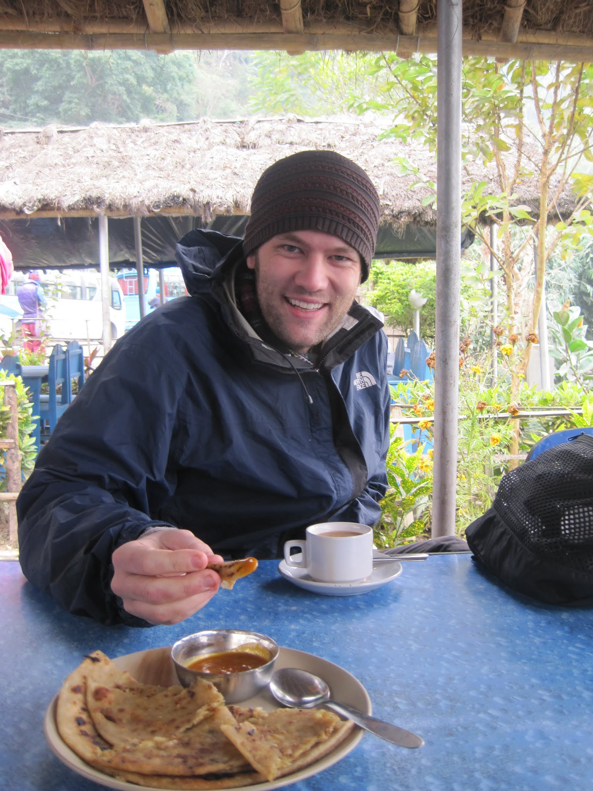
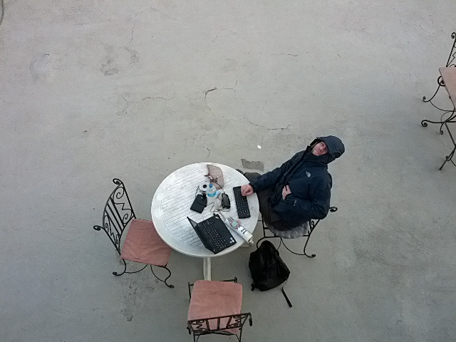
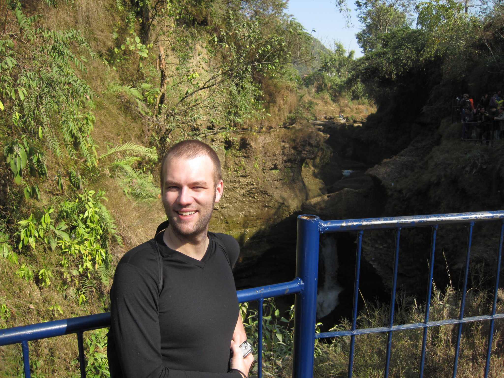
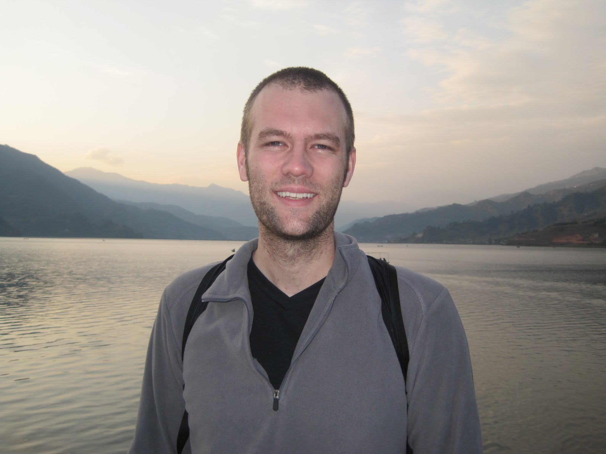
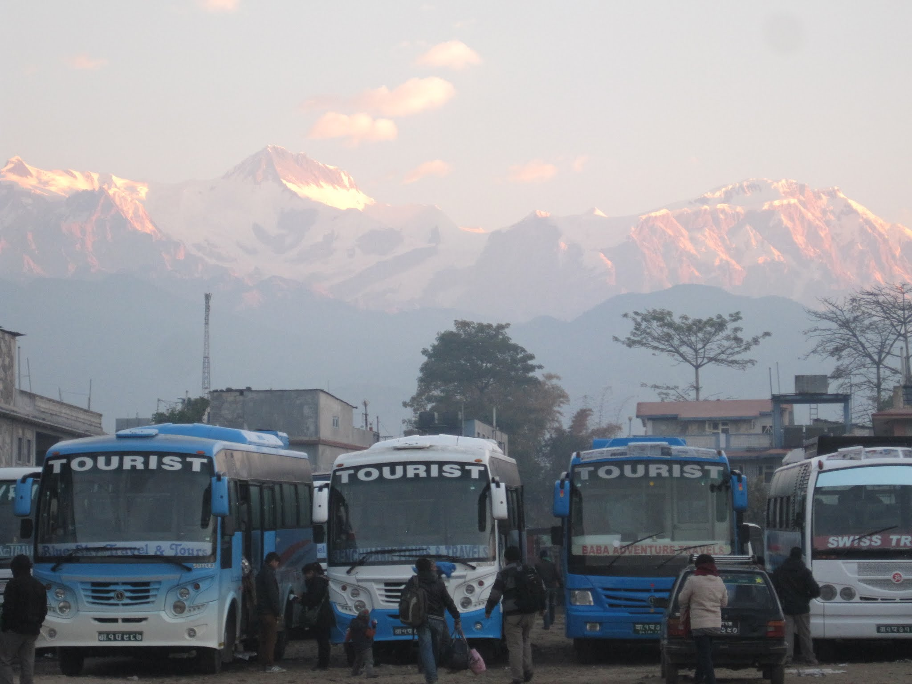
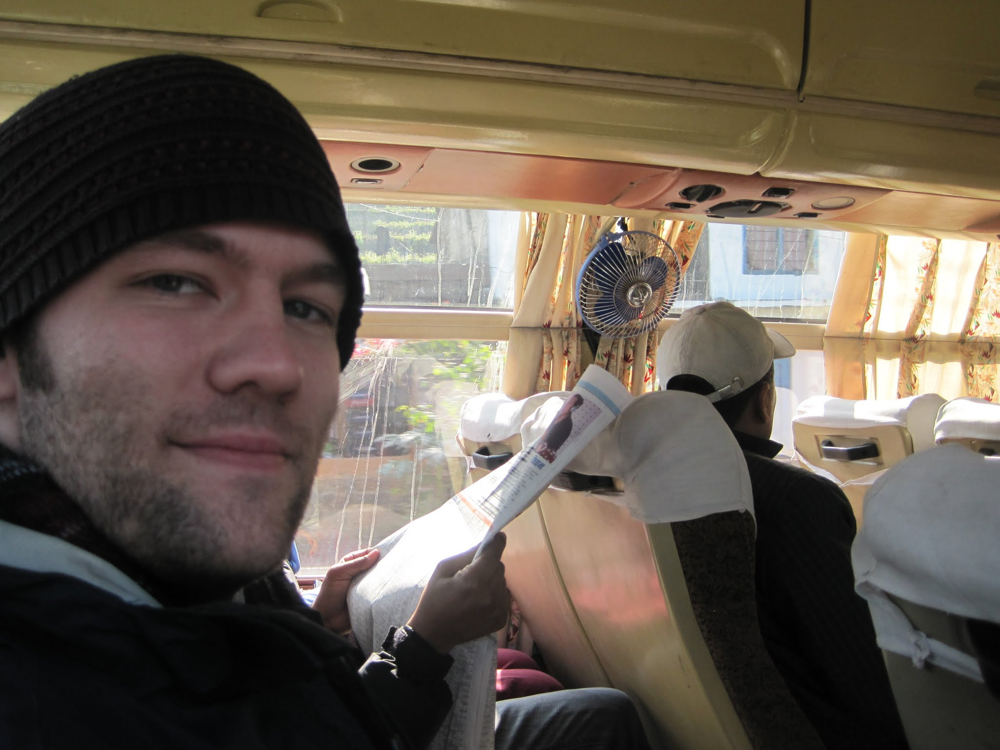
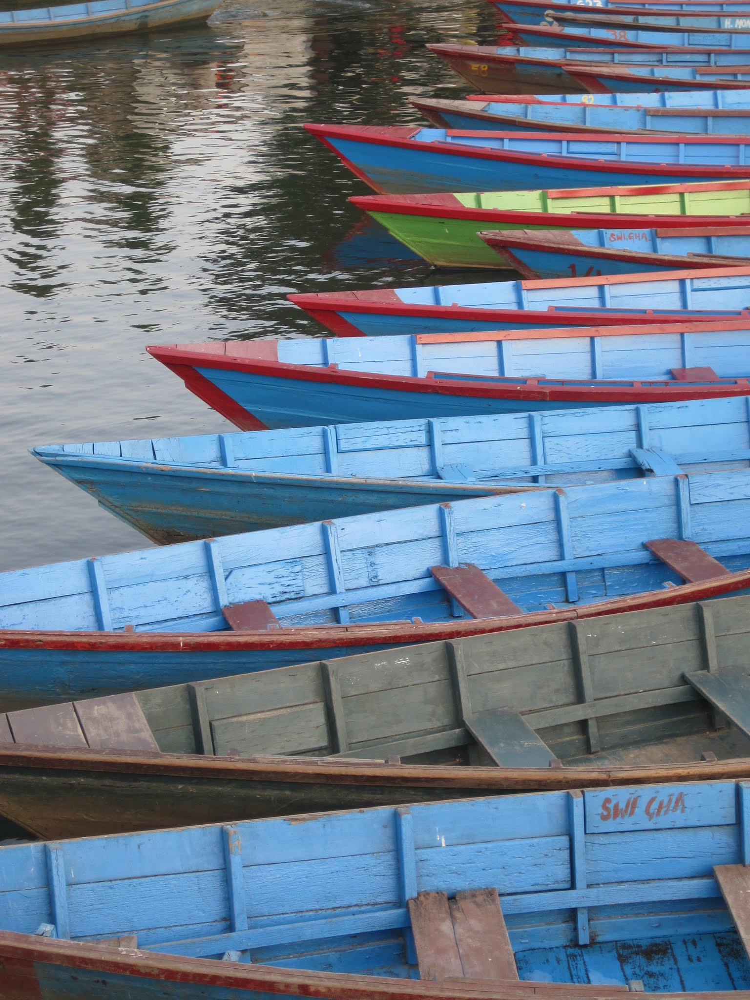
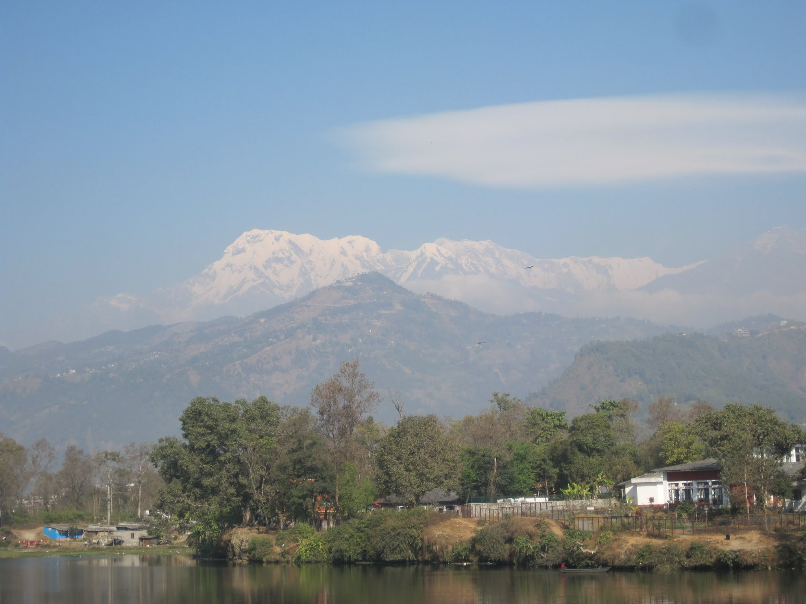
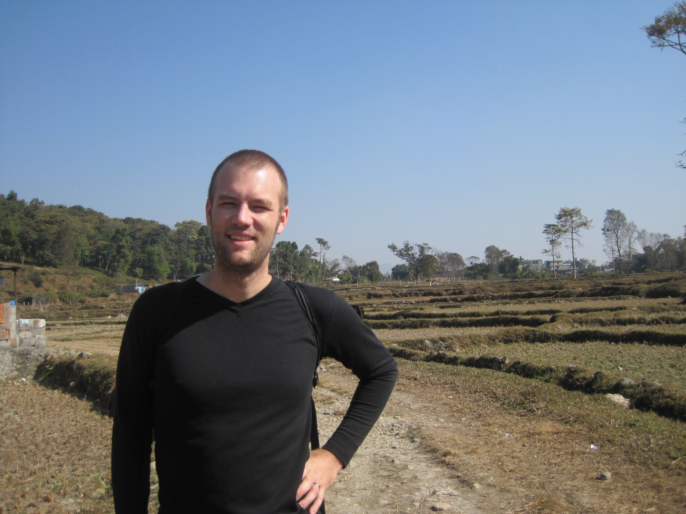
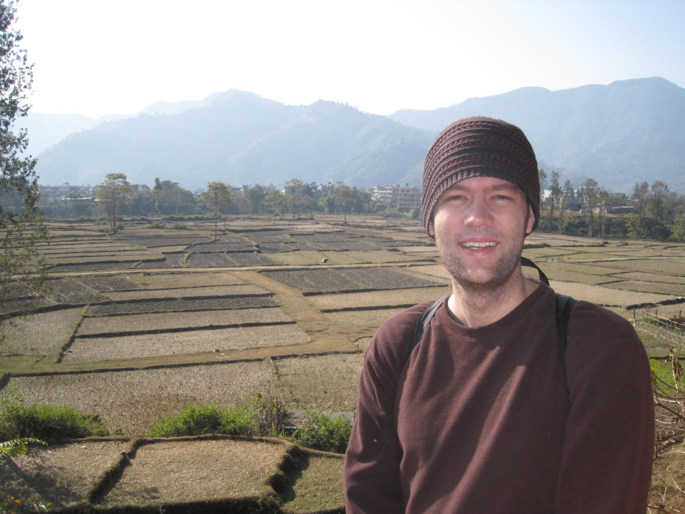

I awoke just before 6:00 a.m. and started walking. The streets were quieter than normal, but still active. It was dark enough that I used my flashlight, although the locals managed to navigate without any assistance. After walking down Thamel Road, past the Garden of Dreams, and across the street, I found a long row of "tourist buses."

There are three ways to get to Pokhara, my next destination: a local bus, a tourist bus, and a minibus. The local bus is inexpensive but apparently takes a long time because it stops in every town. The tourist bus takes much less time but is more expensive; it is basically like a Greyhound bus. Then there is the minibus, which takes about as long as the tourist bus but stops in most towns, making up for the frequent stops by travelling faster. From a safety perspective, I was comfortable choosing the tourist bus.

I was assigned to the last row of the bus but sat two rows from the back. The bus set off, slowly climbing out of Kathmandu Valley and seemingly taking more than an hour just to leave the city. The adventure started when the bus hit the first bump of the journey, sending those of us in the back airborne. The man behind me, who had been asleep, woke after flying into the air and hitting the ceiling. Not a good way to wake up!

The road became winding, with a sheer cliff on one side. At this point, I was glad to be in the larger tourist bus, although sitting near the back would be less reassuring if we were hit from behind.

The road was winding enough that I was unable to read, but not quite enough to make me carsick, at least while we were moving at that speed. We stopped for breakfast at a little roadside cafe that served an array of buffet food. After breakfast we continued for a few more hours, stopped elsewhere for lunch, and reached Pokhara a few hours later. The final stretch into Pokhara was one of the bumpiest roads I had ever travelled. It did not look that bad, but the asphalt must have dried unevenly because we bounced constantly for 45 minutes.

The owner of my guest house met me at the bus stop with a small sign, and I was soon in a taxi on my way there.

Rustafa's Guest House is an affordable, family-run place with basic rooms and hot water. I had a choice between a room on the top floor and one in the middle. I initially chose the top room, but it smelled a bit smoky, so I moved to the middle room. I put down my bags and started walking towards the city.

Pokhara, Nepal's second-largest city, still feels like an expanding village. A main road by the lakeside is lined on both sides with two-storey restaurants and shops, but a 15-minute walk takes you from one end to the other. There are still cars, but there are also footpaths, and the scooters mainly stay off them. Several cafes advertise organic and vegetarian food, although I could not tell what certification, if any, supported the organic claims.

After walking along the main street, I went to the lakeside and followed the shore. A few blocks later I reached a wharf surrounded by blue boats, with a full view of both the lake and the mountains.

After taking a few photos I walked back to the guest house.

The next day I had breakfast at one of the "organic" cafes: instant coffee and oddly chemical-tasting jam. I wanted to visit Devi's Fall, just west of the city, so I decided to walk there. After making sure I had maps of the route, I set off down the main road, took two right turns, and crossed the suspension bridge. I then joined a trail into the hills. After a while, I encountered a young boy who asked if I knew where I was going and reminded me that Devi's Fall was along the other road. The trail I was on went to the Pagoda, which honestly sounded more interesting, but he cautioned me about possible robberies along the way. I opted to turn around and return to the falls.

The story behind the falls involved a Swiss tourist whose wife drowned when the reservoir overflowed. Tourists were everywhere, although there was barely any water visible in the falls. I walked around and eventually made my way to Gupteshwar Cave across the main road. Entry cost Rs 100 per person, and I went down and down. The cave extended deep into the earth, with simple strings of lights showing the way. I had brought my flashlight just in case.

There was little to see at the bottom beyond darkness and the sound of water; the falls weren't visible. Many people were crammed onto the small viewing platform, although I am not certain what they could see.

I hiked out of the cave and was greeted by a rush of cold air and a distinct drop in temperature. I returned to the path and crossed the bridge, stopping at a small Korean restaurant along the way. After a quick bowl of ramen and a check of recent emails over Wi-Fi, I finally returned to my guest house. I freshened up and walked to the main road for dinner, stopping at a little Tibetan place. I ordered a giant fried gyoza-like dish, soup with buffalo, and a small pot of Tibetan tea. By the final cup, I suspected I might regret the tea.

After dinner I walked around some more, enjoying the car-free streets. Festivals were taking place that week, so the main road was closed to cars.

I went to bed.

I spent my final full day in Pokhara trying to relax. I contemplated hiking up the nearest hill, Sarangkot, but realised I did not feel very well. In my quest to relax, I took a few short walks along the main street to get food and made one outing to buy a souvenir. A local store, set up to provide skills development for women, was selling some unique quilts. I bought a red one, hopefully for my couch, and walked back to my guest house. I will probably use it as a scarf instead. I spent the rest of the day lounging around and preparing for my bus ride home.

For dinner I had momo from a different place, along with a beer, then returned home and fell asleep. During the afternoon I could tell that my stomach was becoming unsettled, either from something I had eaten or from the Tibetan tea. I was more inclined to blame the tea, either because of how it was prepared or because I am lactose intolerant. Just before 5:00 a.m. my stomach began hurting, and sure enough, a trip to the bathroom relieved the pain. I travel with a few Gastro-Stop tablets, and since my bus ride would take about seven hours, I knew I would be taking one.

At 6:15 a.m. my alarms went off, and I packed the last few items. I had organised a taxi the night before, so I set off for the bus stop. It was only a few kilometres away, but still far enough that taking a taxi was worthwhile.

The tourist buses were lined up neatly, prepared for their journeys. The Annapurna mountain range rose majestically behind them. I took a Gastro-Stop tablet, bought some warm bread for breakfast, and boarded the bus. The clock on board was 12 minutes fast.

By 7:30, or 7:42 bus time, we were still parked. I was having flashbacks to Lhasa, where the bus took forever to get going as people argued and tried to avoid paying. Luckily, before too long, the bus started moving. Then it stopped and let more people on. Several people bickered about something, and one man, his forehead covered in white paint, nervously ran back and forth along the bus. We started moving again, then stopped a few blocks later to collect more passengers. I had been under the impression that one benefit of a tourist bus was travelling directly from A to B. We set off again, but after a little while, still in Pokhara, the bus stopped and the man with the white paint ran outside. An entourage met him, each person placing a silk khata around his neck. It was 8:12 bus time. We had been going for only 30 minutes and, despite there being no traffic, still hadn't left Pokhara. I wondered why the entourage couldn't have come to the bus station to farewell him. The entire bus waited while he received the ceremonial scarves, and then we departed. The driver's assistant yelled something towards the back, which I might translate as, "I'm not stopping for you again, so sit down!"

At least, that's what I hope it translated as.

The bus continued along the bumpy road, which somehow felt rougher than it had on the way into Pokhara. I went airborne several times, trying to protect my back and head. The driver on the outbound journey had seemed much smoother; the return driver sent me flying left, right, and up. By 9:12 we had stopped again, this time at one of the little cafes for breakfast. I documented part of the journey along the bumpy road, which required securing my phone so it didn't fly around the bus. At this rate, I had no doubt that I would reach Kathmandu no earlier than 15:00.

