My first order of business upon arriving in Krakow was to visit Auschwitz, one of the reasons I had come. While it may not be on every traveller's itinerary, I had regretted not visiting these historical sites on my last trip to Europe.

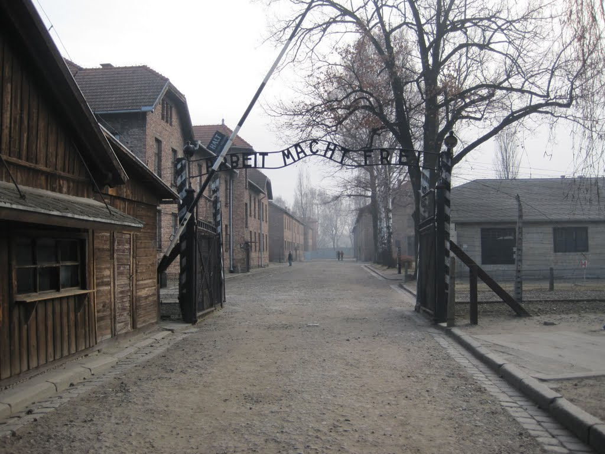

Entrance to Auschwitz

I locked my bags in storage at Krakow's main train station and located the bus terminal after walking beneath the railway tracks. I was apprehensive about visiting the camps. Although I had visited other sites of atrocities, I was nonetheless unprepared for what lay ahead.

The main bus terminal was crowded and bustling, but I was able to purchase a ticket at the counter and, after waiting just 20 minutes, board the minibus for "MUZ," or the Auschwitz museum.

The bus ride took about 80 minutes and was fairly direct. A few people got off here and there, but overall it went straight to the museum. When the driver stopped and called out "MUSEUM," the visitors, including me and several people from other Eastern European countries, disembarked. After passing through the entry area, I stood in front of the infamous sign, "Arbeit macht frei." I immediately noticed the small structures facing it, perhaps guard posts, and the double barbed-wire fence. I slowly walked clockwise through Auschwitz, reading each exhibit and entering the barracks, shocked by the methods the Nazis had used.

Although the comparison may be imperfect, I couldn't help but see some similarities between S-21 in Phnom Penh and Auschwitz. There were significant differences, of course, especially in the scale of the sites.

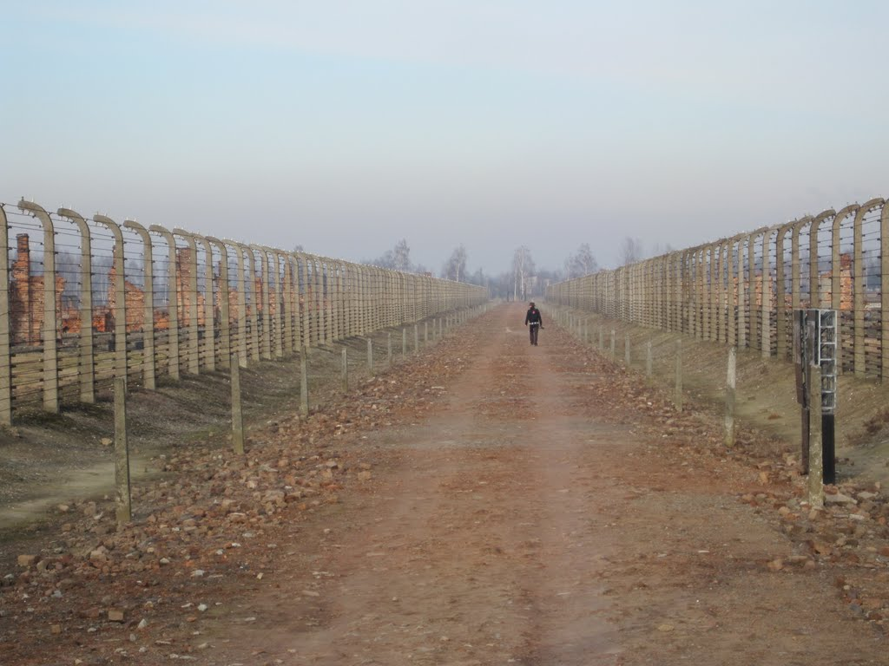

Auschwitz-Birkenau

After leaving Auschwitz I, I decided to visit Auschwitz-Birkenau, a short bus ride away. The first thing that stands out upon entering Birkenau is the vast scale of the camp; it is almost unfathomable. When one realises that each bunk may have held four or five people, the number of people imprisoned there becomes horrific to contemplate. Walking through the barracks leads to the end of the railway tracks and two plaques explaining the layout of the gas chambers used to murder people selected on arrival. It is hard to imagine what life would have been like for those imprisoned here. Other visitors tell stories of feeling ghosts or spirits. I can't say whether I experienced anything similar. Visiting in winter, with the temperature hovering around -3 C, offered only the faintest sense of one element of the hardship endured. I couldn't imagine how cold it would have been without a jacket and hat.

After a short ride back to the museum, I tried to board the bus to Krakow. I was 2 PLN short of the fare, and the driver didn't have change for 100 PLN. He eventually took change from his wallet and reluctantly handed it to me, first in the wrong amount and then correctly. It wasn't as though I were buying a candy bar with a $100 note.

Back in Krakow, I collected my bags and checked into my hotel. Because I was staying with the same chain as in Prague, the room was unsurprisingly almost identical, although perhaps slightly larger. Rather than trying to see the city at night, I admitted that I was tired from the morning's walking and sightseeing. Instead, I visited a small bar and laundromat that I had located beforehand. Tram #1 took me to Cafe Frania, near Wawel Castle, where one can do laundry and have a few beers in the same establishment. It was a good find, and leaving after a few beers with a bag of clean clothes is a great feeling.

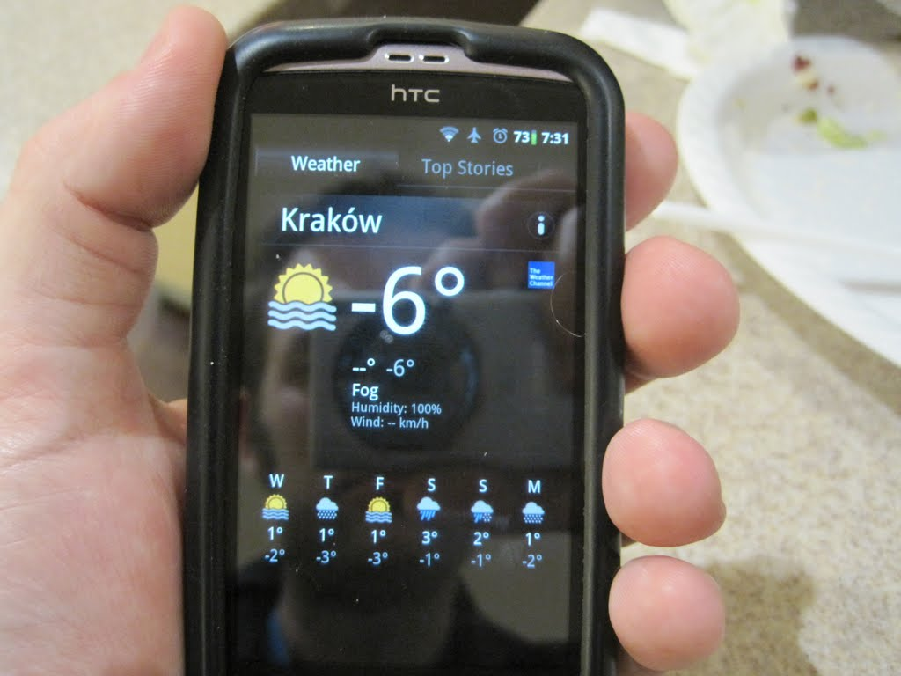

Back at the hotel, I promptly fell asleep, ready for plenty of walking the next day.

Although I didn't leave the hotel particularly early, my train wasn't until almost 10:00 p.m., which meant I had plenty of time to fill. I zigzagged through the old streets, visiting the Main Square, several churches, and Wawel Castle. I hadn't realised that I could probably have seen Wawel Castle from my hotel window. I visited McDonald's to use the Wi-Fi and bathrooms. Sadly, I've visited McDonald's in nearly every city I've been to. I usually buy at least one item, perhaps just a tea, so I don't feel as though I'm completely taking advantage of the facilities.

Finally, after having trouble finding a post office and waiting in the main mall for four hours to escape the -6 C cold, I boarded my train back to Prague.

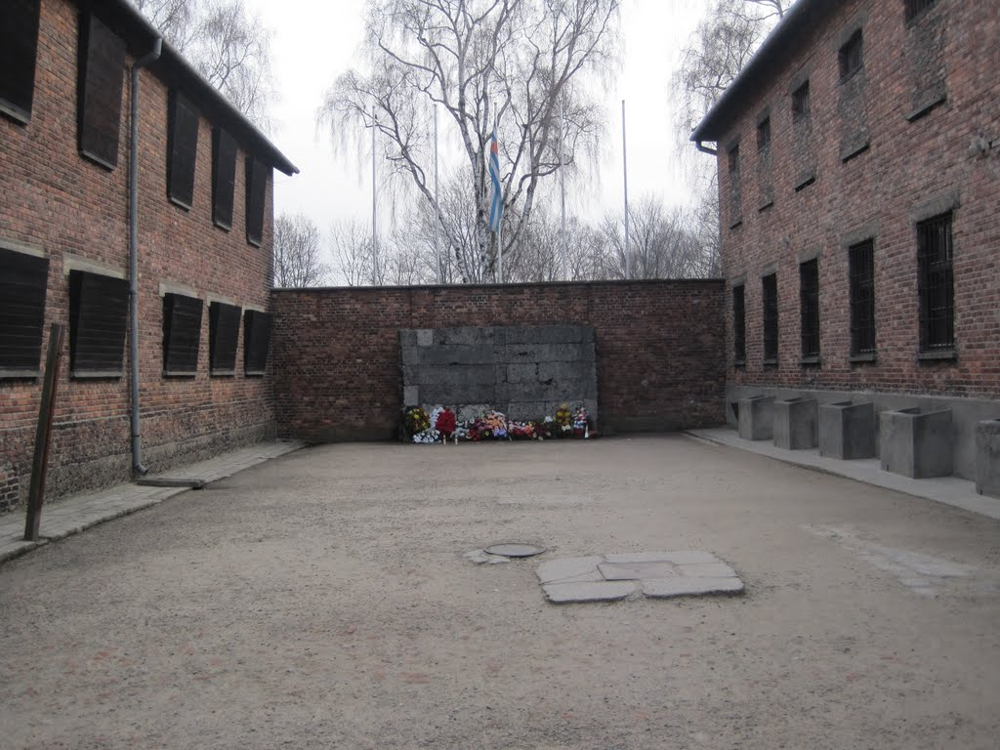

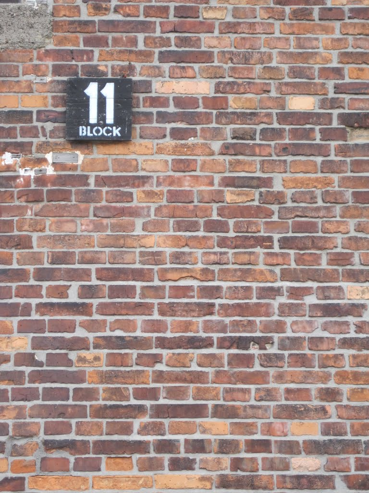

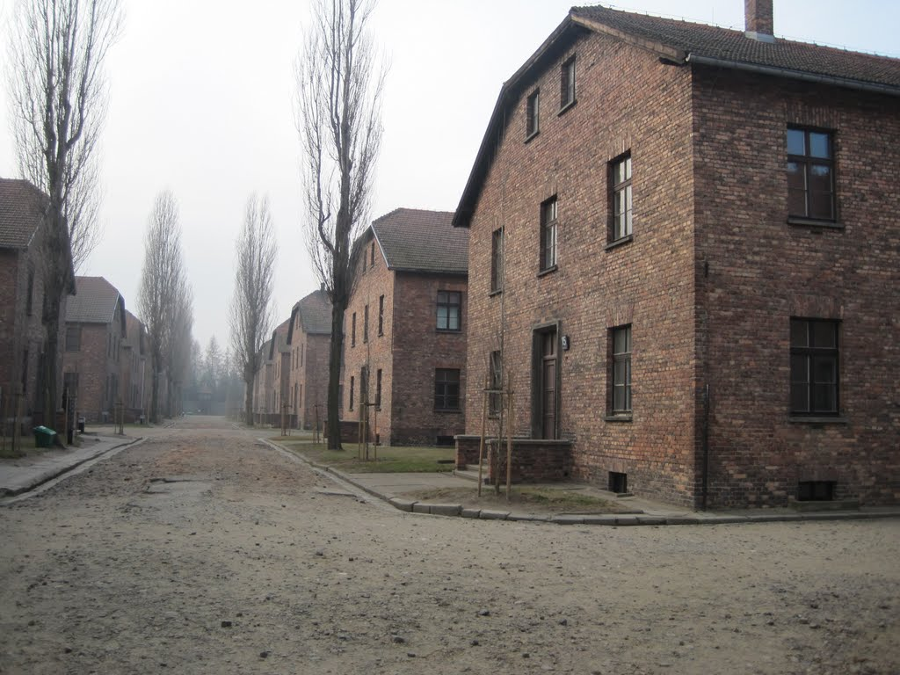

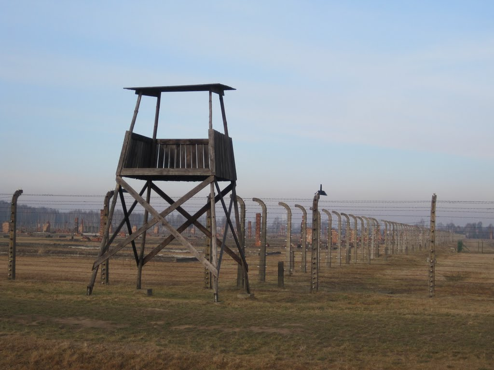

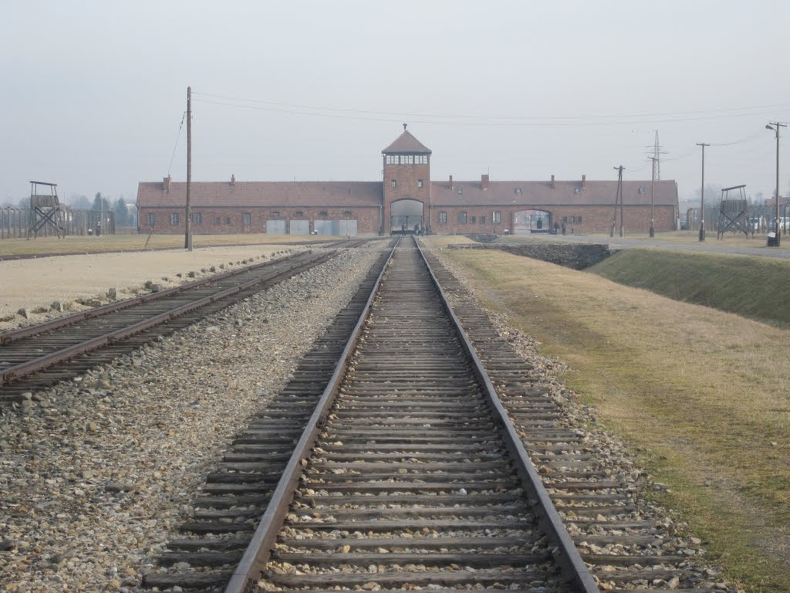

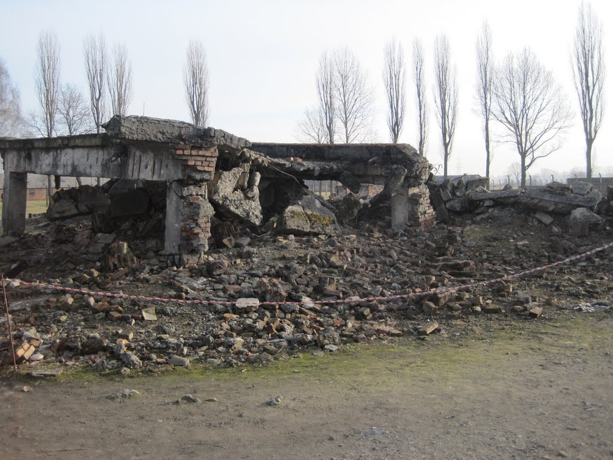

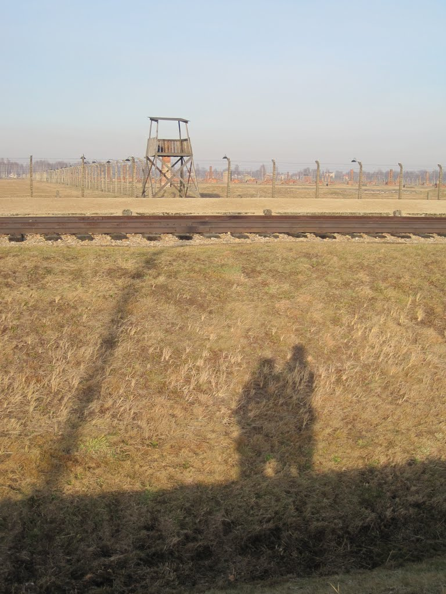

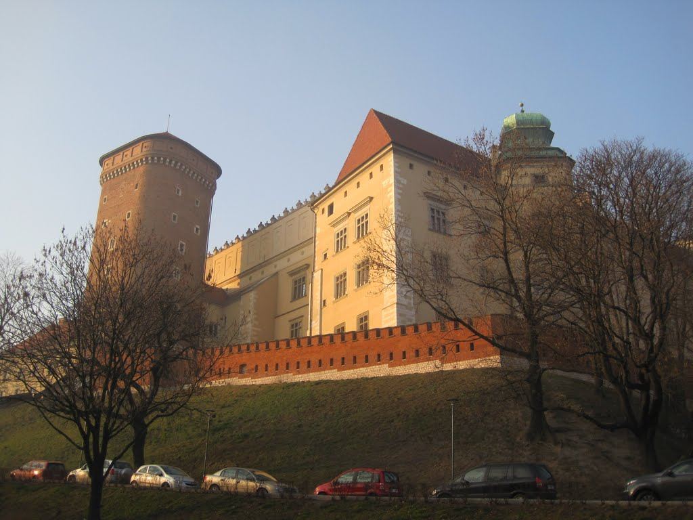

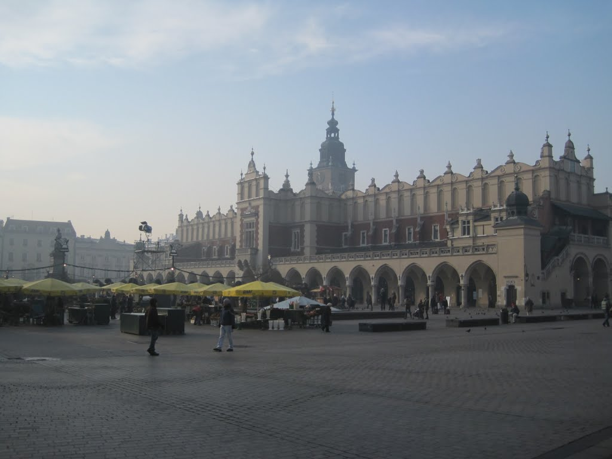
