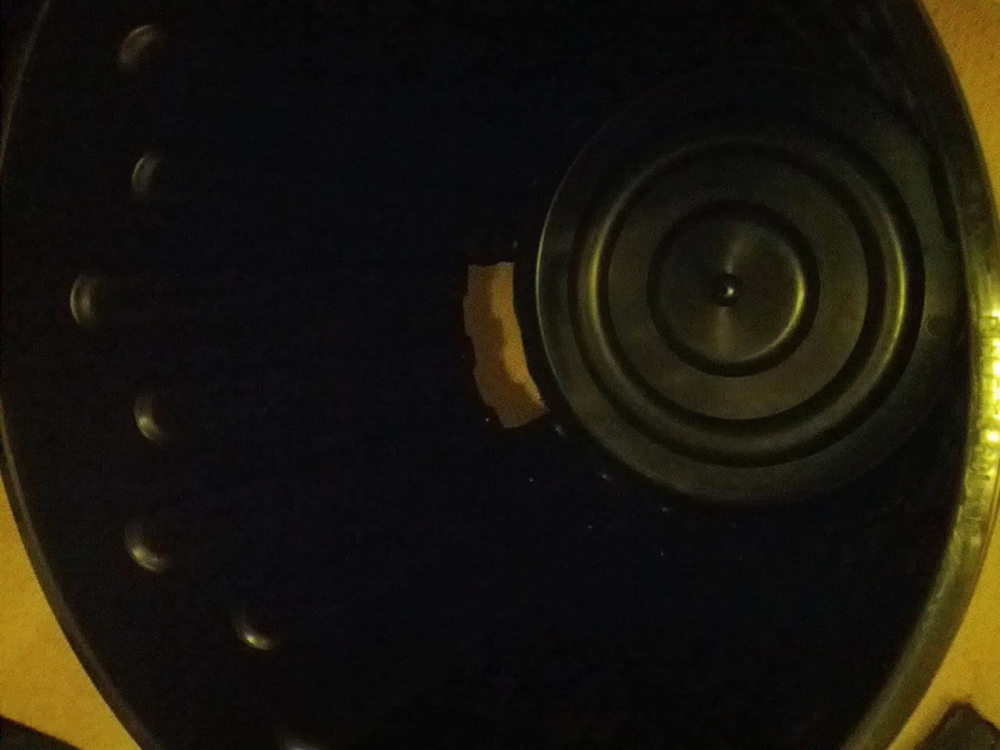
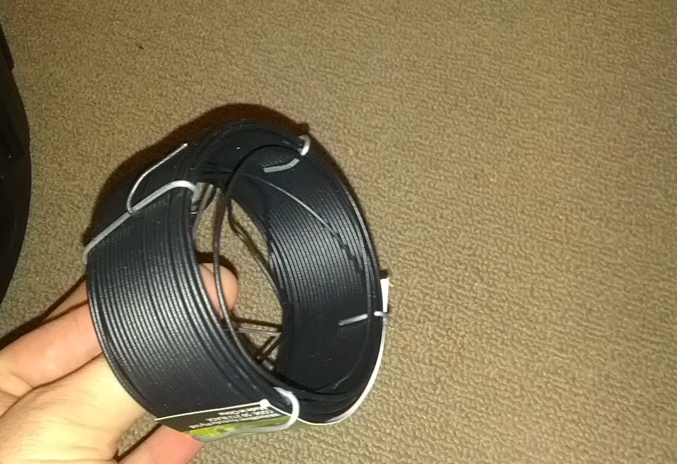
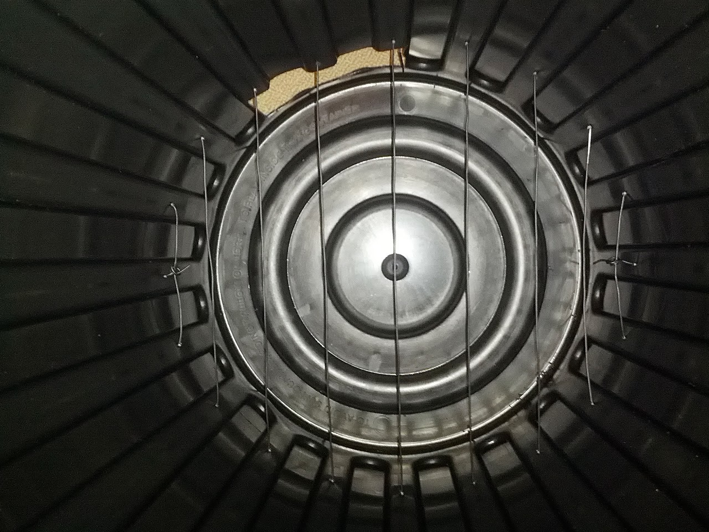
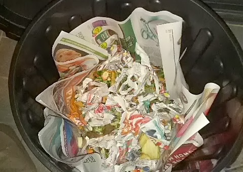
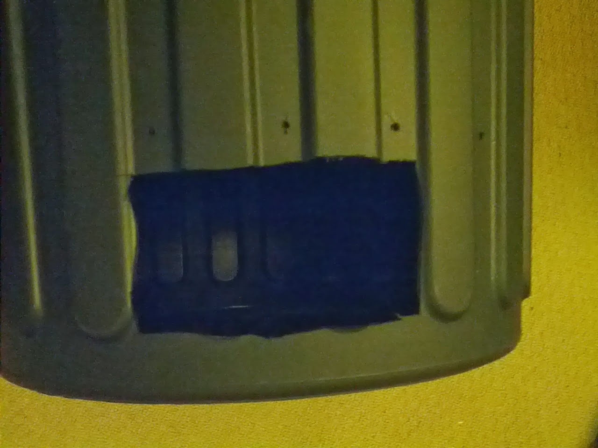

Status:  ✅
  
A few months ago we decided we wanted a worm bin, as we were eating a lot of vegetables, and tossing away bits that weren't used. We were also buying soil for our plants, so it made sense to try to turn one into another.  

  

One of our friends gave us some worms from her compost - no idea what kind - and I build an experimental CFT worm bin ([sample plans](http://vermicomposters.ning.com/forum/topics/diy-flow-through-bins-a)). We harvested once at about two months, but I don't think it was quite ready. We'll keep experimenting.

  

  

