 Read below for a long list of warnings. After reading some of the comments below, e.g. from Des, it seems like the track can vary significantly depending on when you do it.

TL;DR - in winter, after bush fires and floods, this track is a 7/6. Left Katoomba Railway Station at about 10:00am on a Saturday in early August, so I guess technically still winter. I packed quite light and intended to do this in two days, and hopefully even get back to Sydney by 5pm. I had all the topological maps offline in Gaia GPS, and created a route based on the maps in Wildwalks; I couldn’t find a GPS trace. For the record: not a single time did I ever feel lost. It is very simple from a navigation perspective: keep Cox river to right. Walk in Breakfast Creek until it forks to Carlons Creek - go left. Now, go up. And up. Here are my notes and where things got slow. Six Foot Track - beautiful and very, very easy. First 11km (starting at Katoomba station) average pace was around ~10:15/km. The next 7km was a tad bit slower, maybe around 12:00/km.  

[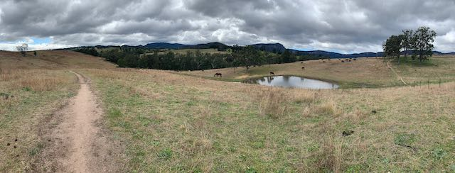](IMG_4975.jpeg)

Easy Six Foot Track. Beautiful weather.  

  

For whatever reason I crossed the bridge. Too enticing, maybe. The river at the bridge was raging. 1km or so later tried to cross the river and almost immediately was at waist level. Flipped around and back to bridge. My first thought was “this is going to make the two river crossings later a bit interesting”.

  

  

[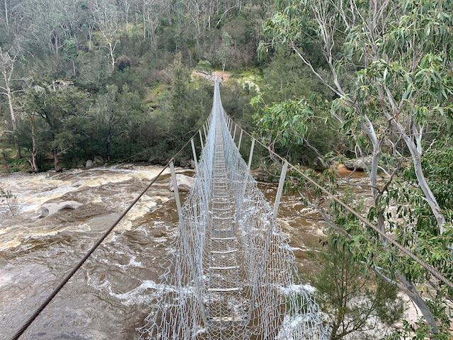](IMG_4977.jpeg)

I should have known better  

The track disappeared almost immediately and it was bushwhacking time. What I learned later is that it should be easier to walk this section, as the river is actually like… crossable. My pace slowed to 20:00/km for a few km, then up to 14:00 for a few km. Right where the track crossed the river things got tough. I slowed to 17:00/km, then further up to almost 25:00/km. More than once I was on all fours pushing my bag through whatever track was made by wombats, or having to rock climb across the near vertical boulders a few meters above the river. The thought of crossing the river would be insane. I made it to Breakfast Creek well after dark after 7pm. Moving time was 8:27m, but I don’t remember stopping besides filtering water and crawling on the ground…

  

[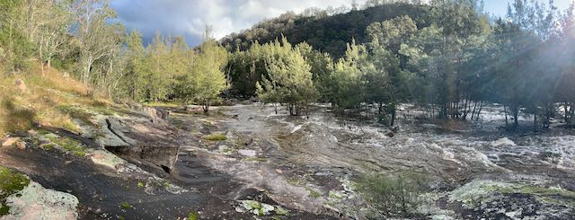](IMG_4980.jpeg)

Water all the way up to slippery rocks  

  

[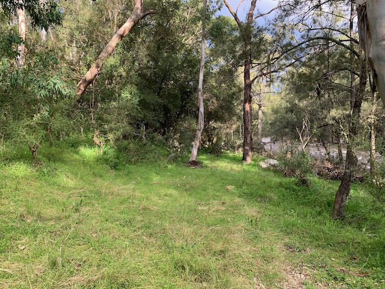](IMG_4982.jpeg)

Yep, just head on in to the bushes  

  

And you end up with pricklies like this  

  

[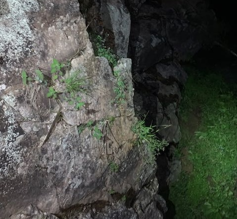](IMG_4986.jpeg)

Then you can climb down this little cliff  

  

[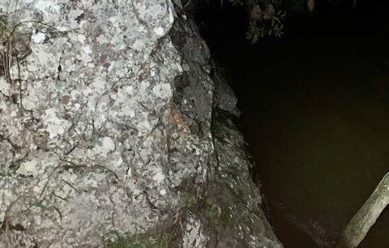](IMG_4987.jpeg)

Or scoot across this one.  
If you slip off, then you'll float downstream in the river...  

The next morning I set off after the sun came up, so starting at about 6:45am. I guess because of the big floods earlier in the year the track had washed away, as probably 75% of the time I was just rock skipping. Not a big deal, and a little hard on the ankles, but waaaay easier than the day before. Eventually hit Dunphry’s campground, and thought things would be all done. Wrong.  

[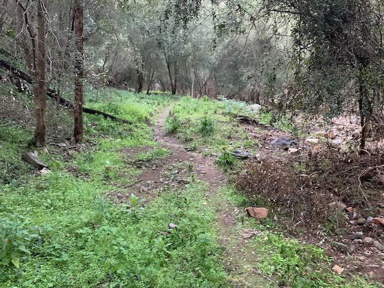](IMG_4989.jpeg)

Sometimes there was a trail, and it was awesome  

  

[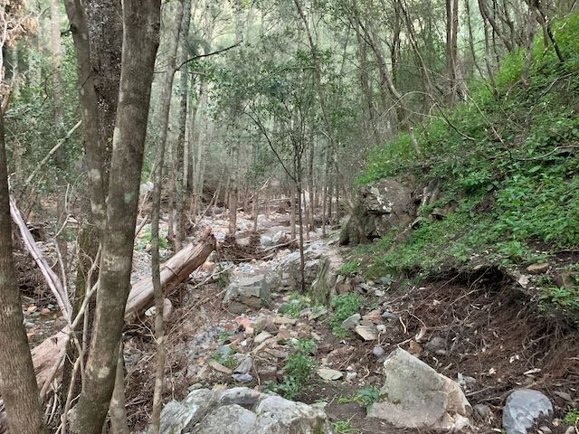](IMG_4990.jpeg)

But 75% of the time this is what the "trail" looked like  

  

[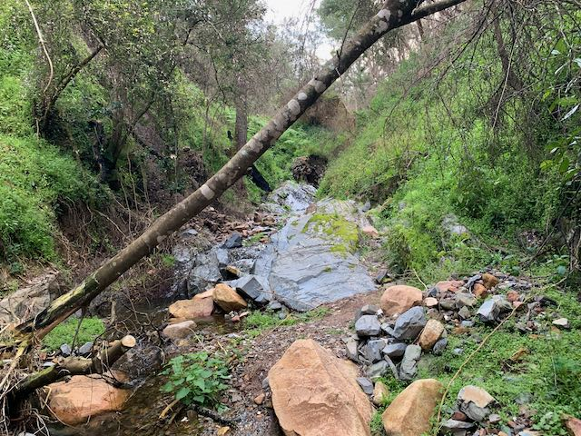](IMG_4993.jpeg)

Or this  

  

I knew from the topo maps the climb up to Carlon’s Head would be steep, and it was. And no track. Walked too far to the left and missed the little chain going up. Eventually found it, and went up one. Then another. Then another. The old historic bolts seems to have been partially replaced by newer ones. I climbed a fair bit over the last few years, so it wasn’t too big of a deal, but know that if you’ve never done rock climbing, and you have a heavy pack, this would be terrifying. And it is high enough to potentially be deadly if you fall.  

[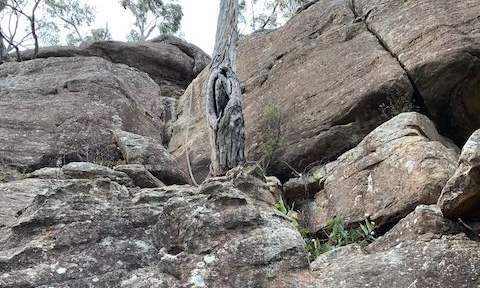](IMG_4999.jpeg)

Go up here. This was the easiest of the climbs.  

  

  

[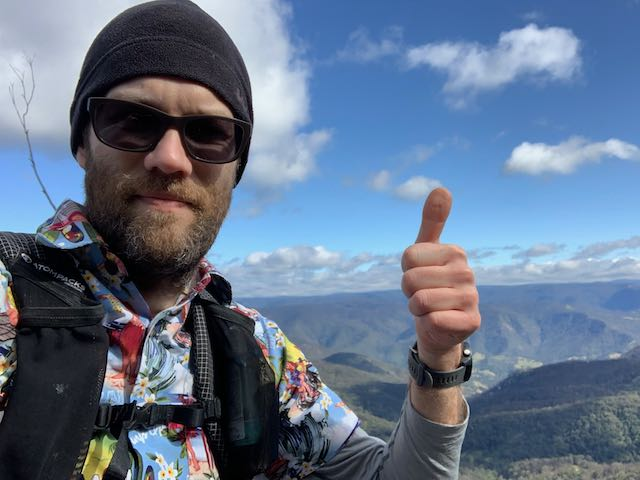](IMG_5004.jpeg)

Progress  

  

On top of the ridge, sweet! Now everything is all flat and I’m golden! Not quite. The forest fires from December took out every trace of the track. More bushwhacking, this time in burnt out forest, for two more km. Average pace was 15:30/km.

  

[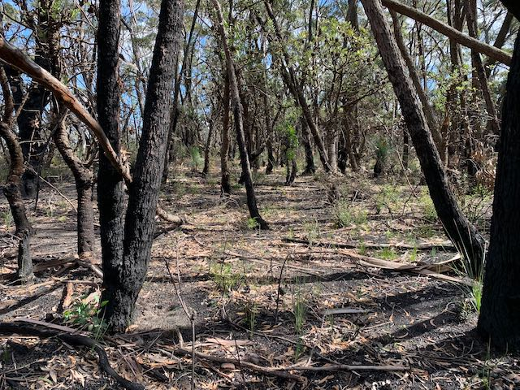](IMG_5005.jpeg)

Just walk through it. No trail. Careful to not kill any new plants growing up.  

Finally back out of the burnt woods and on to 10km of fire road. Easy. Average pace probably 10:30/km. I made it back to the train station by 13:15, with just enough time to get a coffee and catch the train home. Total distance: about 65km. Total elapsed time: ~15.5hr. Total moving time: 14hr This track would have been much easier had the river not been overflowing, or had the creeks not flooded in Jan, or had the fires not raged in December. If you are thinking about doing this, then I would absolutely recommend a few things: * Have as light of a pack as you can take. I wouldn’t have been able to climb Carlon’s Head with a 15kg pack * If trying in winter, of course bring a headlamp * Create the route and make sure to have topo maps. Again, I never felt lost * I hike in shorts almost always. If doing this again with the same challenges, I’d probably wear pants. * Bring a PLB or InReach, as there’s no apparent service from Six Foot all the way until you hit Dunphyrs. This would have been beautiful if the track existed. If you want to have a look at my maps, then check out these activities on Strava: https://www.strava.com/activities/3918994803 https://www.strava.com/activities/3919253337 Hike on!