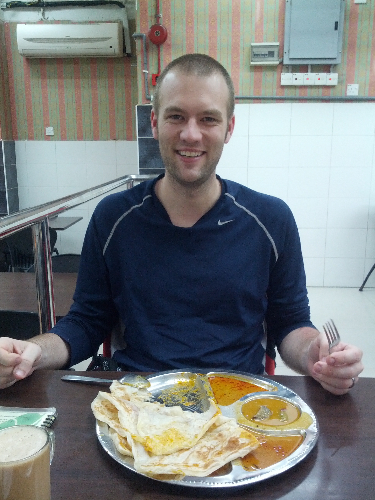
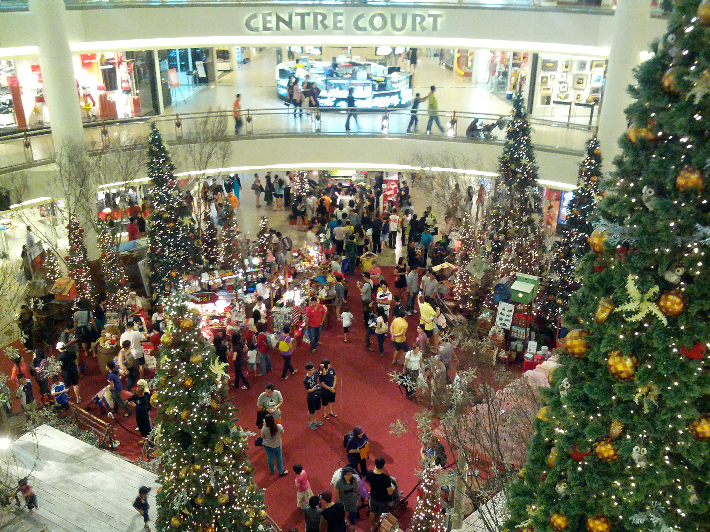

The maximum speed of the KLIA Ekspres appeared to be 160 km/h, and it was touted as the fastest train in Southeast Asia. The train had free Wi-Fi over a 4G network, so we were able to send photos home and chat on Gtalk. We also tested a Gtalk video call with each other while sitting on the same train, and it worked. I wished more people back home had Android devices so I could talk with them.

I arrived at KL Sentral just before 19:00, found my bearings, and immediately headed towards the side under construction. Although the work had progressed slightly over the previous year, overall things looked much the same. I ended up at the same curry place I had visited on my previous trip to Kuala Lumpur and ordered roti canai, chicken, and the milk tea drink. It was just as good as I remembered, and at 30 cents apiece it was hard to complain. Not much had changed in the restaurant, although perhaps the lighting was new. I paid and left, then went back to pay a little more because they had counted only four of my six roti. From there, I walked into the train station.

With a few hours to spare, I opted to visit Midtown Mall, one stop from KL Sentral. I had first visited in 2005 and returned in 2008. It had changed significantly each time, and on this visit the change was striking: if it reflected Malaysia's goal of modernising by 2020, the country was well on its way. In 2005, I had not found the mall especially interesting, and it felt largely empty. Few shops stood out, and it felt more like an indoor market. By 2008, the selection had improved. In 2012, my companion said she could have spent an entire day shopping there. The range of shops was more diverse and no longer seemed oriented mostly towards men. The mall was packed with happy families; almost everyone seemed to be under 30 and accompanied by a child or two.

After walking around some of my favourite shops, I departed for the train station. It turned out that the next train had a 40- or 45-minute wait. I soon realised I was standing in the women-only zone, so I moved just outside it and waited under one of the large fans. The train arrived shortly after 22:00, and I went down to the KLIA Ekspres terminal. Apparently, I had just missed that train as well, so I waited another 20 minutes. After 18 minutes on the Ekspres, I reached KLIA, only to miss the hotel bus by one minute. Another 30-minute wait followed before I finally returned to the hotel. The run of bad luck was unfortunate, but I remained in high spirits; the curry had been that good. Back at the hotel, I checked the expected taxi fare from Kathmandu Airport to my hotel, did some packing, and went to sleep.

My flight was at 8:55 in the morning, so just after 6:00 I left my barracks, joined the other troops in the mess hall, had some food, ran back to my room, grabbed my bags, checked out, and jumped on the bus. By 7:04, I was at KLIA and ready for my flight to Kathmandu. I cleared immigration without difficulty, found my gate, passed through a second security check, and waited for my flight. Within six hours, I should be landing in Kathmandu!
