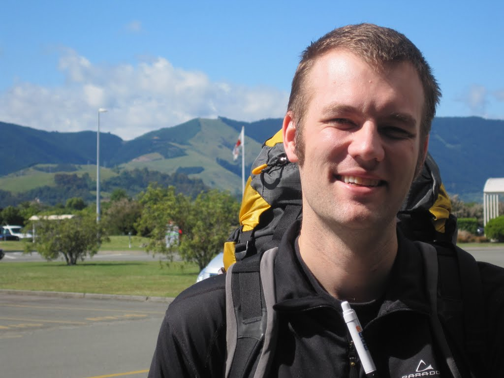

Europe 2011 Day 1

It had been almost seven years since I last went to Europe, so with nearly 40 days of paid leave accrued, it seemed like a good time to take a few weeks off. I had also just finished a PhD, so the break felt like a well-deserved reward. While planning my trip, I realised that my dad and Cathy would be in New Zealand around the time we were considering leaving. I arranged to visit them first, then take advantage of a good AirAsia fare to Paris.

Normally, flying from Sydney to Christchurch and then on to Nelson is not a big deal. However, to take advantage of discounted airfare and arrive early in the morning, I devised a slightly ambitious plan. After working a full day on the 7th, I departed for the airport for a 7:45 p.m. flight from Sydney to Christchurch. The Jetstar flight landed on time and without drama. I fell asleep before the plane even left the gate.

Because I wanted to arrive in Nelson as early as possible, I opted to catch a 6:45 a.m. flight out of Christchurch. However, because I arrived at almost 1:00 a.m., I didn't have enough time to go into the city for lodging. Luckily, Christchurch Airport is well suited to sleeping overnight and even has a designated "rest" area. Despite the music being too loud, I managed a few hours of sleep before my early flight. After a short transit in Wellington, I was at the tiny airport in Nelson.

After an hour of waiting, my dad and Cathy arrived. We had a quick hello before they went to pick up the car. Shortly afterward, I was on my way, crammed into a tiny car with a surprisingly small amount of luggage.

The four of us drove towards Tasman, near where our rental house was. Shortly after leaving the airport, I realised that this was the stretch of road where I had blown a tyre on my first trip to New Zealand, 18 years earlier.

A short drive from the airport brought us to Nelson, where we wandered around and enjoyed the beautiful weather and the changed city. The four of us took a stroll to Queen's Park, next to "Four Spirits Corner." After a quick lunch from a local bakery, I briefly used an internet cafe because Cathy needed to change a Word document for a paper she had submitted.

Between Cathy's iPhone and my Android, I was able to navigate to the rental property, check in, and unload my things. The beach right next to the house was not particularly sandy, so I only took a quick stroll.

After the beach it was, as my dad put it, wine o'clock, so I enjoyed a nice glass or two with nibbles and contemplated dinner.

My dad and Cathy were largely in charge of dinner, preparing lamb chops and salad. While my dad went on a tea mission, Cathy and I prepared the food, and we ate when he returned. The lamb chops were cooked nicely, with a great salad and not too much tomato.

We finished a game of hearts in a tie. After a quick shower, I tucked into bed, ready for sleep.
