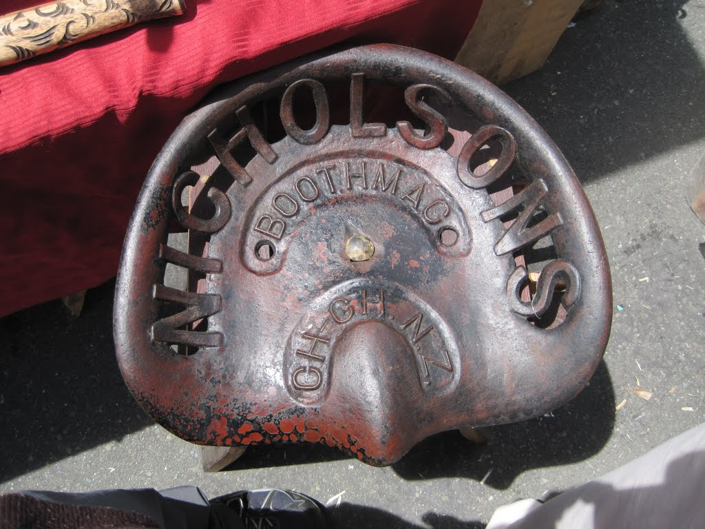

Because it was Saturday, the Nelson market was in full swing. I am not usually a market person, but this one was relaxing. Many markets sell whichever gadgets and trinkets are popular at the time; this one felt more authentic. The honey, artwork, jewellery, and food were distinctly local.

The sun was also intense. Before arriving in New Zealand, I had read about different sunscreen formulations after learning a difficult lesson at a cricket match. For the market, I applied and reapplied sunscreen containing zinc oxide and other ultraviolet filters. I avoided getting burnt, although many people around me had already developed red necks.
Nothing at the market particularly tempted me, but I did find a new hat. Made in Vietnam by Columbia, it fit well and was lightweight and breathable. My previous Marmot hat accompanied me on every adventure, so I hoped this one would serve me equally well until it eventually fell into a river somewhere interesting.
After the market, I visited a small vineyard on the way back to the holiday house and shared a bottle of wine. A lively group of American visitors nearby added plenty of volume to the afternoon.
I then drove to the coastal town of Mapua, which appeared to have two bars, a bakery, and a real estate office. At the dock, I noticed a small car struggling to pull a dinghy from the water, its tyres slipping whenever the driver accelerated. Dad, two teenagers, and I moved behind the car and helped push it up the hill. The driver called out a long "thank you" as he drove away.

My day came to a close with a seafood bbq and cards with coffee and wine. Fireworks blasted from the ocean.
On the final day of my Nelson visit, I packed and cleaned the bach. Mopping the floors seemed reasonable, although being asked to take all the rubbish with us rather than use the bins felt excessive.
My dad picked a back road to return to the city, most likely to satisfy my earlier quips about visiting the oldest bar in New Zealand. Despite it only being a bit after 11:30am, I still visited the bar, ordered four different beers, and enjoyed the surprise Battle of the Bands starting at noon. Cathy took lots of photos of an inquisitive little boy, who mentioned his father was playing in the band. He said he lived in a farm up the road, and left to go eat some berries.
Around lunchtime, I strolled through the unusually beautiful Brabford Park, then helped Dad and Cathy check into their bed and breakfast. The owners were managing the cheerful disruption of a young puppy that had just arrived. I played fetch in the backyard while my companion photographed the scene.

The last event on the agenda was an old-town Christmas festival featuring objects and displays from previous generations. Many excited children were enjoying the festivities, and my favourite exhibit was a large aeroplane.
Before going to the airport, I stopped at a bar in Nelson for one final drink and conversation with Dad. I caught my flight to Christchurch with plenty of time to spare.
