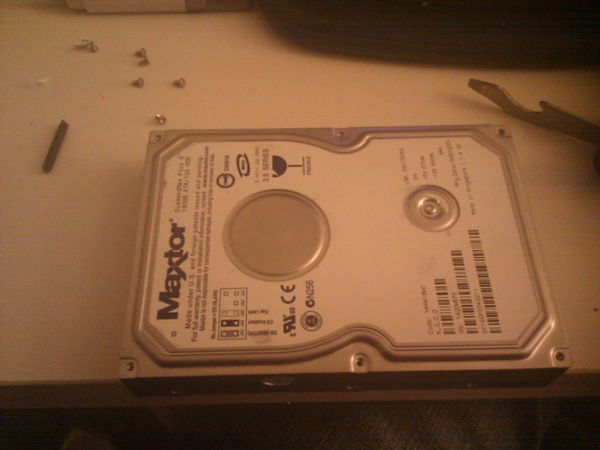
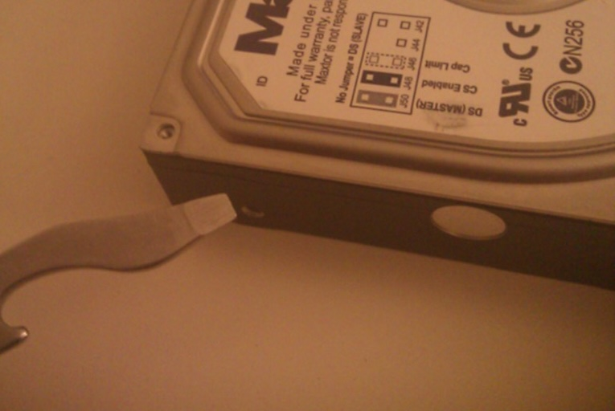
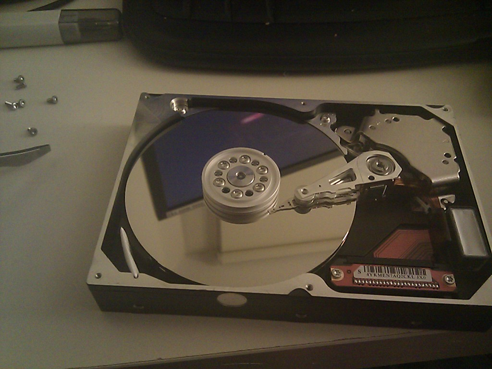
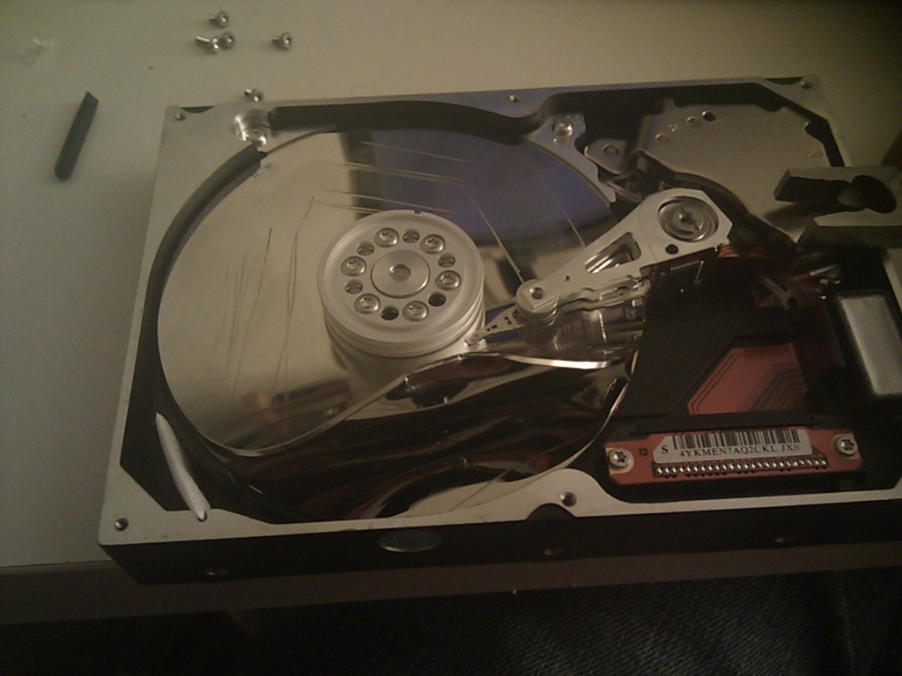
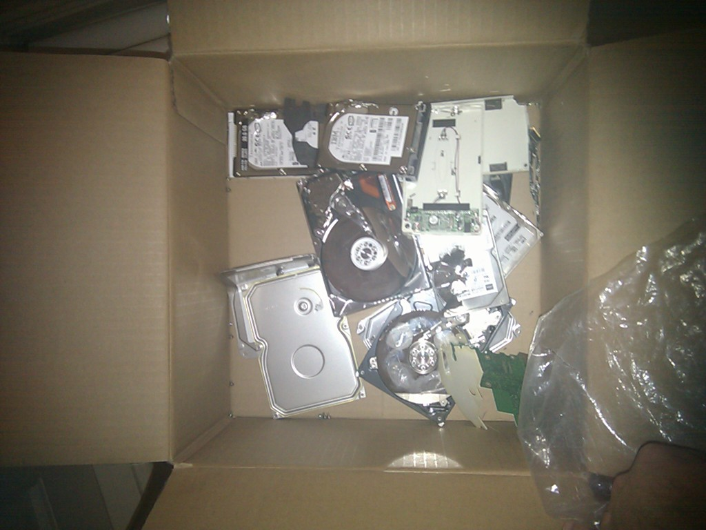

If you're like me there is a box of hard drives sitting in a dusty corner somewhere. Some are mine, some are others', but they are all in a failed or semi-failed state. So, why have I lugged them around? I've been a bit paranoid about throwing them away. Some of the hard drives are encrypted, others aren't, and the drives from friends certainly aren't. Although the chances of somebody getting the drive from a landfill and restoring it is minimal, I never wanted to take the chance.  
So, I kept lugging a bag of drives through each move.  
My friend Clinton has recently returned from Europe, and he brought me a gift: a Swiss-made Victorinox, the 'CyberTool'. After playing with it for several minutes I noticed it came with a Torx 8, 10 and 15 bit. This was a reminder that one method of mostly disabling a hard drive is to destroy the platters.  
Other methods I have heard are to use a hammer and nails - which I unfortunately don't have in our tiny apartment. Whilst finishing Dexter I started pulling apart the box of hard drives, and it surprisingly didn't take long to disable them.  
**Step 1:** Remove Torx screws  

  
  
  

  
  
_Hint: Don't forget the screw covered under the paper._  
**Step 2:** Use a flathead and pop off the cover  

  
  
  
  

  
  
**Step 3:** Stare at the shiny platters  

  
  
  

  
  
**Step 4:** Scratch platters with flathead, and bend platters if possible  

  
  
  
  

  
  
**Step 5:** Dispose of bits and pieces  

  
  
  
  

  
  
**Warning!** The CyberTool didn't have a Torx small enough to open the 2.5" hard drives, but I could just use a pair of pliers to lift up the cover and jam a flathead in there. However, and here's the warning, 2.5" platters are sometimes not made of metal. I forgot about this on the third 2.5" hard drive and covered the desk I share with YS with shards of glass.