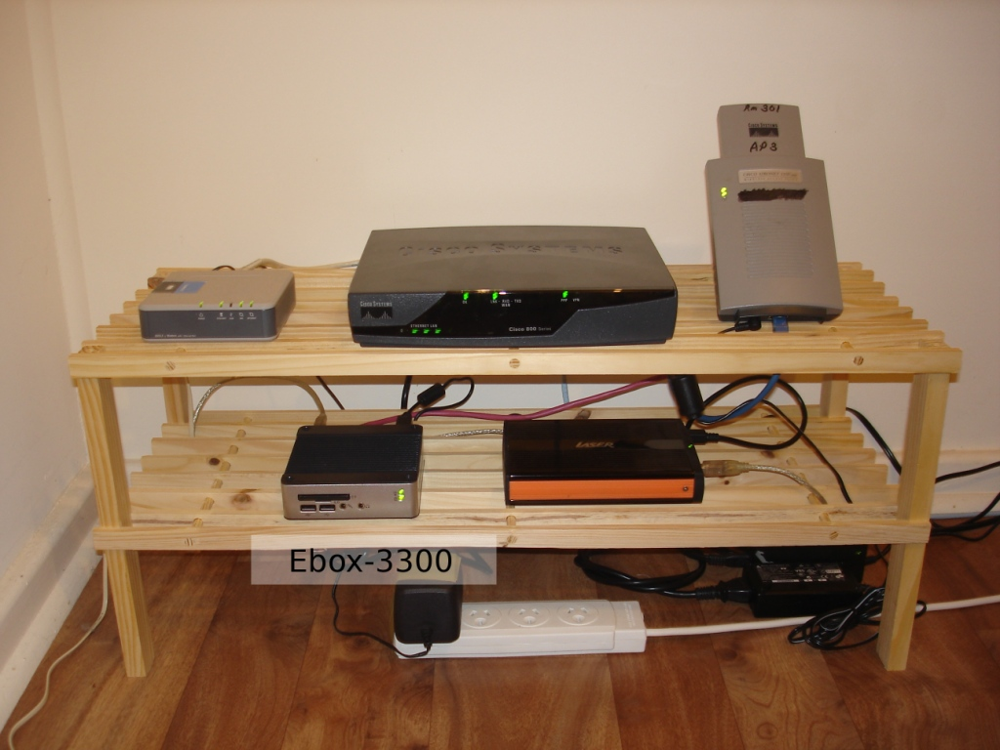

I'm wrapping up an eventful four-day weekend here in Australia.

Day 1 - On Thursday night, I went to the Blue Mountains and stayed with a few friends. I've always enjoyed visiting the area; it reminds me how much I like mountain terrain. I made my way back to Sydney on Friday and began considering what to do with the rest of the weekend.

Day 2 - On Saturday, I woke early and drove to the local supermarket to buy food for the week, as the shops would be closed on Friday and Sunday. Soon after returning home, I turned the car around and headed to Kangaroo Valley, about two hours south of my house. The drive was lovely, and traffic was light. I arrived at the campsite and was stunned by its size; it could accommodate several thousand campers. After driving around and finding what I thought was the ideal spot, I pitched my tent and set up camp. There wasn't much to do beyond exploring the area, so I cooked dinner, read, and played cards. When I tried to sleep, however, my neighbours had other plans. They weren't teenagers, as I discovered the following morning, but they behaved like them. They played extremely loud music until about 1:00am. I generally liked their taste, including Nirvana, but not while trying to sleep. Perhaps I was getting old.

Just before bed, I spotted a creature moving in the distance: a wombat. I would have liked to see one closer to my tent, but the distant sighting was still a welcome surprise.

Day 3 - After waking and cooking breakfast on my tiny stove, I headed to the coast, drove some of the tourist routes, and returned to Sydney. Overall, Kangaroo Valley made for an excellent camping trip, and I expected to do more camping in the near future.

Day 4 - I didn't do much, but the day was still enjoyable. I woke late and went shopping at Westfield with two items in mind: a bench for my computer equipment and a power plug converter. I found the bench at the Reject Shop, but the converter cost $20, so I decided to look online if I found I couldn't live without it. I also read at Borders for a while, continuing through my book on Processing. If some digital sketches appear here in the future, that will explain how I made them. After returning home, I cooked curry and assembled my new "server rack."
