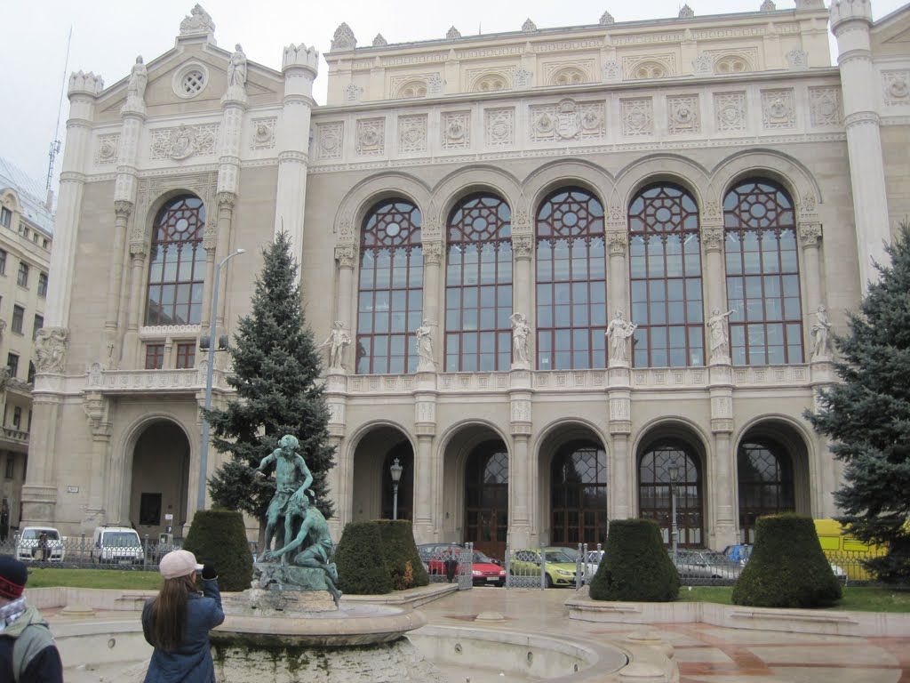
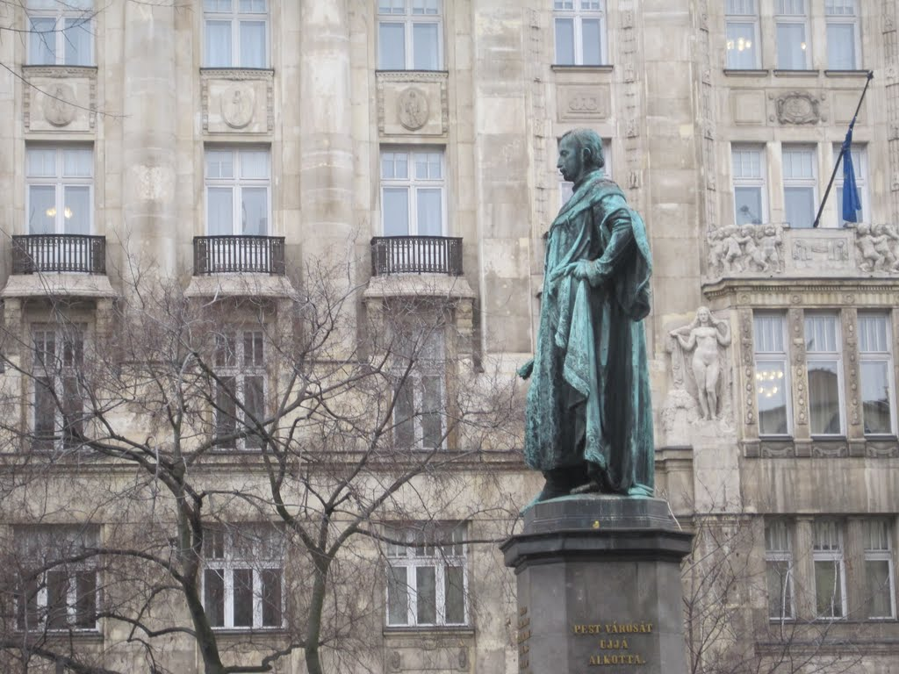
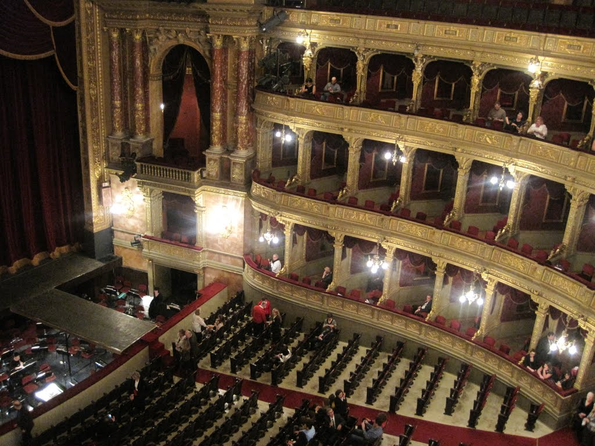
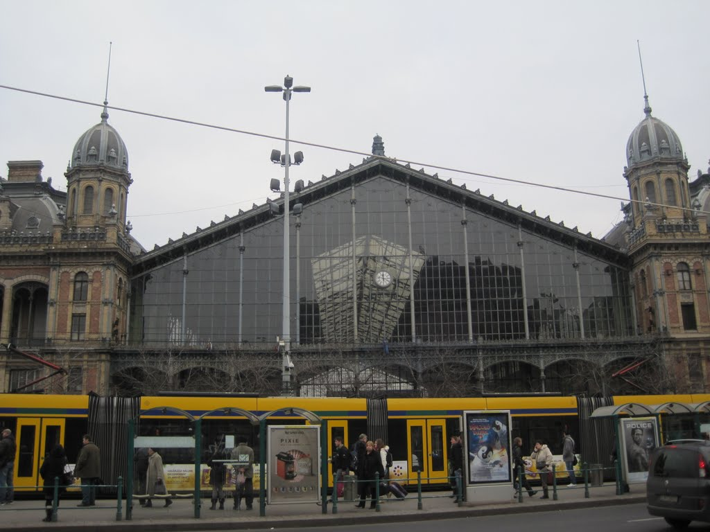
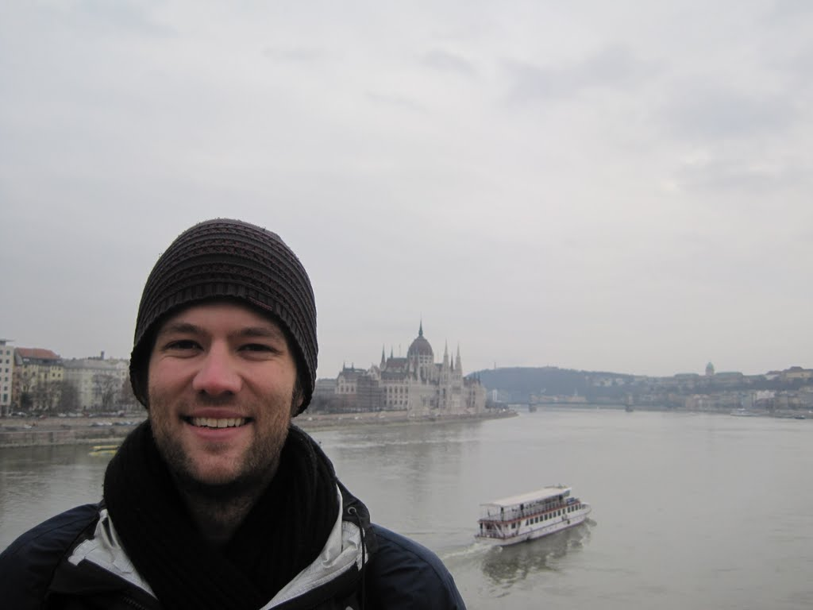
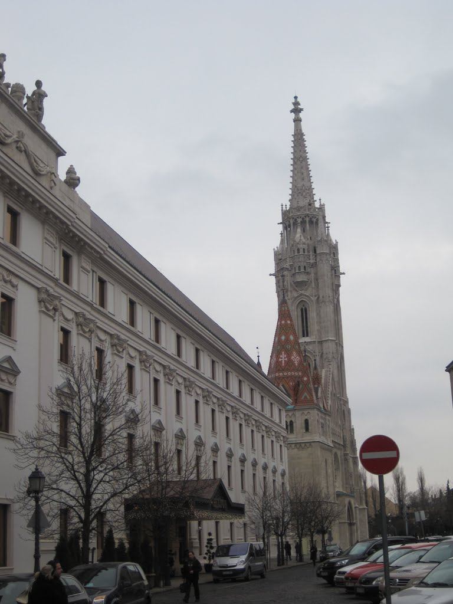
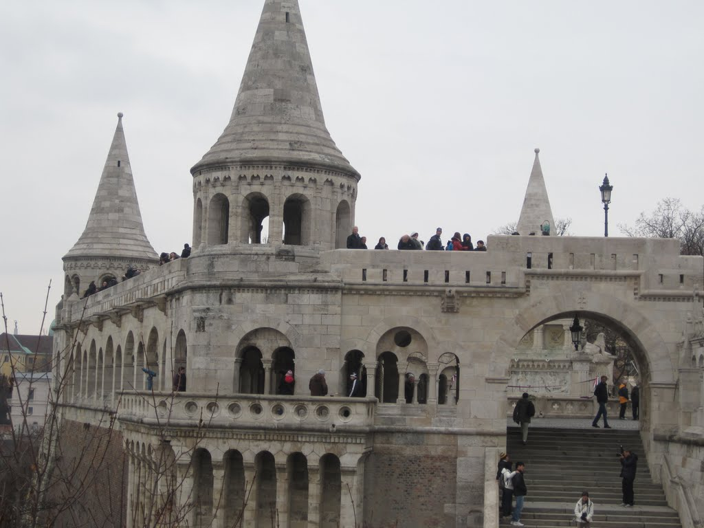
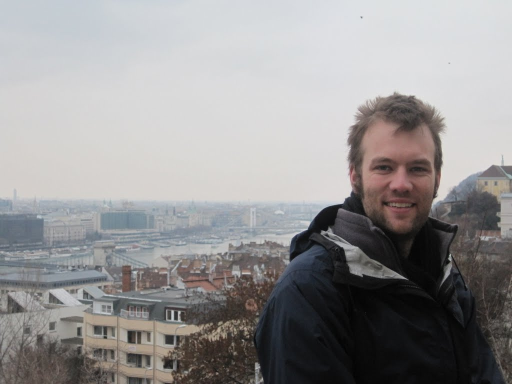
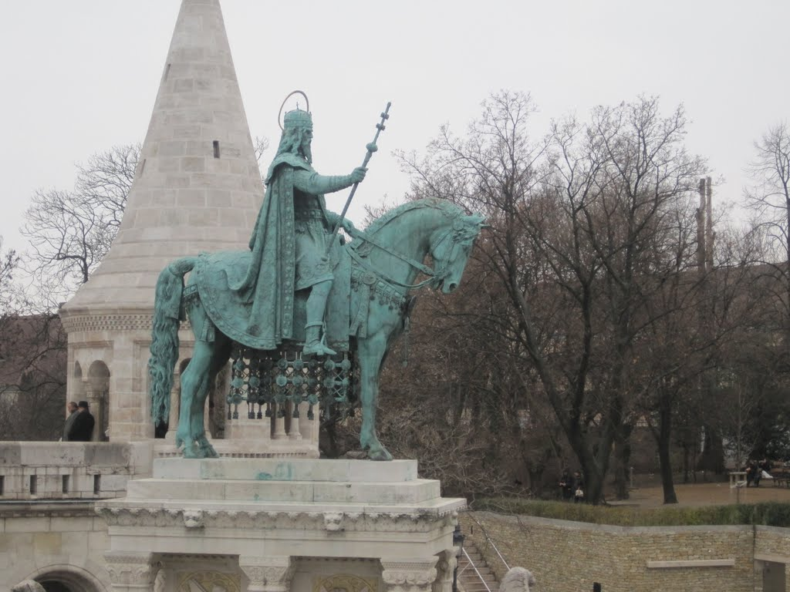
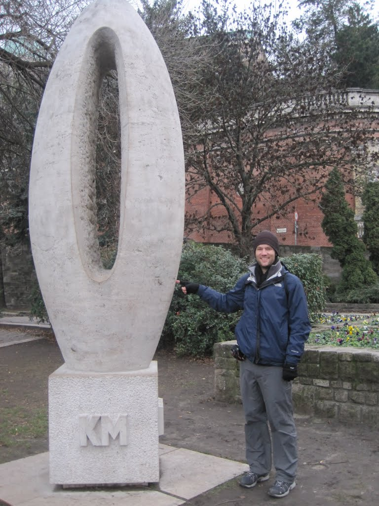

My expectations for Budapest were high, as most people had spoken warmly about their visits. Having just come from Zagreb, where I had such an enjoyable time, I was uncertain whether Budapest could live up to them. In many ways it did; in others it did not. Overall, I left with a good impression.

Having arrived late at night, I walked directly to my hotel, about 900 metres from the main railway station. I checked in, watched some BBC World, and went to sleep.

I woke feeling rested and visited the nearest coffee shop, Coffee Heaven, where we shared a large coffee and a croissant. My pastry consumption was probably higher than it should have been, but I tried to justify it with all the walking.

I had found a highly rated, tip-based tour on TripAdvisor, so I left the coffee shop and set out for the meeting point. With only a few minutes to spare, I located the "lion fountain" and a group of visitors from around the world. Our guide, Emma, was energetic and knowledgeable. Most of her stories included an interesting twist, an effective way to share history while holding everyone's attention.

Unfortunately, hunger persuaded me to leave shortly before the palace. Following a recommendation, I headed into the Jewish Quarter and ate at a pub. The set menu included a 30-centimetre pizza, a drink, and a small dessert. We also shared a 500-millilitre local beer.

After the late lunch, I returned to my hotel and prepared for an evening at the opera. Although  The Bat was performed in Hungarian without translation, the theatre's acoustics impressed me. The staff were less welcoming than I had expected, which dampened the experience. On the way home, I bought a few more pastries, a beer, and kebabs.

Watching "The Bat"

The following morning, I began a long walk through the city, following Teréz körút past the railway station and continuing across Margaret Bridge. Despite the mediocre weather, the views of Buda Castle and Sándor Palace were spectacular. Lion sculptures seemed to be everywhere.

Before entering the palace district, I wanted to try some traditional food. Triposo led us to a small nearby pancake restaurant. Fortunately, it had an English menu with the same prices as the Hungarian one.

I ordered the Mexican meat pancake, while my companion ordered the Hungarian pancake. They were closer to crêpes than fluffy American-style pancakes, and we tried to determine which was which. Still hungry, I ordered two more Hungarian pancakes and a sweet apple-and-nut pancake.

When the second round arrived, I realised that I had mixed up the first two and had already eaten the Hungarian pancake. Alternatively, the server may simply have been having some fun at my expense.

We left the restaurant well fed and walked uphill into the old town. Our first stop was Matthias Church, where I took plenty of photographs, followed by a small bakery on the way to the Royal Palace.

0KM Point

New York Cafe

One of my favourite desserts on the trip was a ring-shaped pastry sometimes described as a Transylvanian funnel cake. The bakery sold one that was larger than those I had tried in Prague and just as good: warm from the oven and coated in cinnamon.

Next came the Royal Palace, with ruins on either side and more excellent views of Budapest. According to Triposo, the zero-kilometre marker for Hungary stood at the bottom of the palace, so naturally I took a photograph. I continued through the city and saw the Dohány Street Synagogue, an impressive building with capacity for 3,000 worshippers.

My final stop that evening was the New York Café in the New York Palace Hotel, just around the corner from my own hotel. The café had historically attracted writers, although its abundant glamour felt more likely to inspire observations about high society. We ordered two coffees, a Moroccan coffee for me and a spiced coffee for my companion, along with a dessert plate. Both drinks were rich and flavourful, and the desserts left no room for anything more.

That night I packed a little, watched some more BBC World, wrote postcards, and figured out how to get to Vienna through Bratislava.
