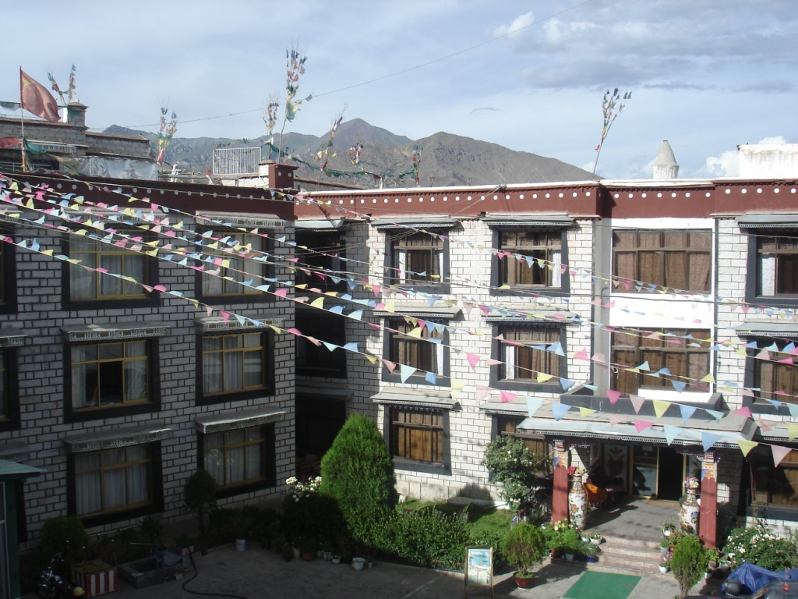

We woke early to the sound of cars, but easily ignored the noise to get a few more minutes of sleep. At 9:00 a.m. we went to a Chinese-style breakfast place around the corner from the hotel. Next, we wandered to the Potala Palace to stand in line and buy our tickets. The sun was intense; every minute without sunscreen felt like another minute closer to a burn. After a short wait, Mei and Kwon returned from buying train tickets. The line was massive, stretching along a wall and out into the open. Luckily, we were able to find some shade.

After buying tickets, we walked all the way to the bus station and inquired about tickets to Shigatse, a small city west of Lhasa. We were told simply to buy them the next day.

Near the bus station was a Muslim restaurant, where I had spicy beef noodles for just 75 cents. After lunch, I needed to use a restroom, but the restaurant didn't have one. I walked out of the restaurant and around the corner, through a little store, up two flights of stairs, and finally into a hallway. There I found the bathroom: a long trough that you straddled. No water, no door. I had overcome one of my travel limits.

Afterward, we wandered across the street to the Tibet History Museum. The museum was generally worthwhile, although I found some of the Chinese government's political framing difficult to accept. The exhibits seemed balanced until they reached the Cultural Revolution, when the information became highly skewed. One example was a framed letter from Mao to the Dalai Lama. Dated just before the Red Guard marched into Tibet, its caption presented the letter as evidence that Mao cared deeply about the well-being of the Tibetan people and their culture.

The museum exit led through a huge shopping area selling replicas of what we had just seen, but after finding our way out, we stepped back into the warm Tibetan sun.

We took the bus back to our hotel and wandered through the nearby market. The square was impressive, although you could almost feel the weight of its history in the bricks. Police were everywhere.

Our late dinner came from a little hole-in-the-wall eatery across the street, or, more accurately, a street vendor. Over the next few days, we returned to this woman again and again. While the cleanliness may have been questionable, the food was spectacular. So, what was it? She took a round piece of flatbread and spread chili sauce over it. She then added a runny cheese and a little sugar. Yum.

By 6:00 p.m. we were sitting in our room chatting. We later left for dinner at a local Tibetan restaurant, then came back and chatted some more. To help us adjust to the altitude, we went to sleep early.
