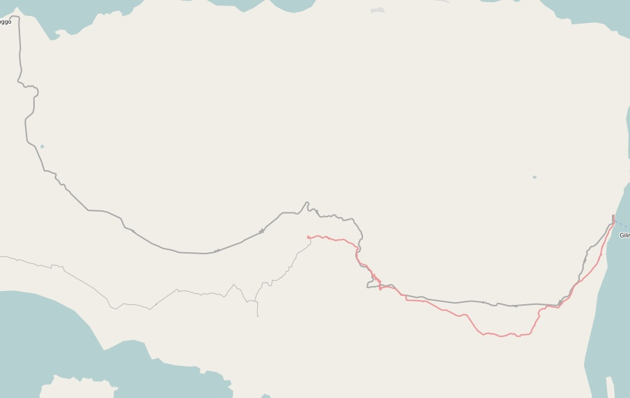
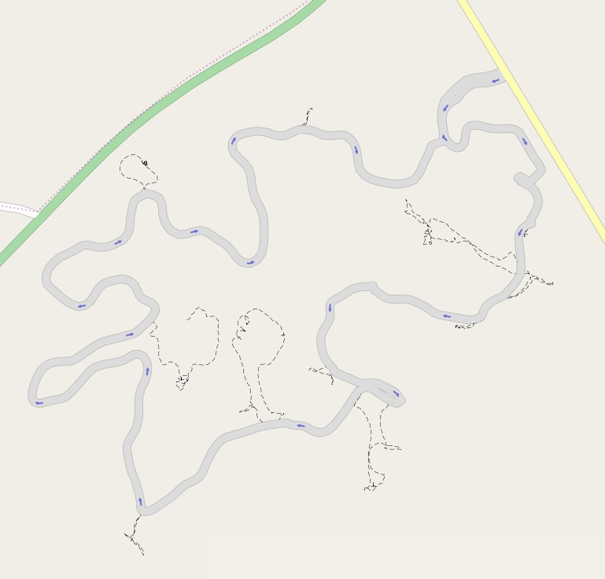

I have to admit, to me, editing [OpenStreetMap](http://www.openstreetmap.org/) is actually a little therapeutic. Sort of like gardening.

My first major contribution was when I brought my little QStarz GPS unit across Indonesia, by train, sitting against the window.

  
  
  
  

The most recent contribution was our trip to Dubbo, where I helped fill in a few missing roads, and added an initial outlay of Dubbo Zoo.

If you have a GPS or have $60 to spend on one, and like anything CAD-drawing like, give editing OSM a try!