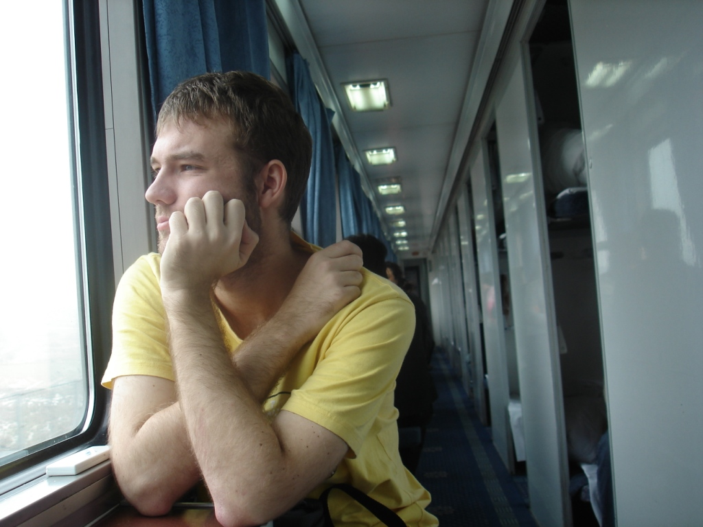
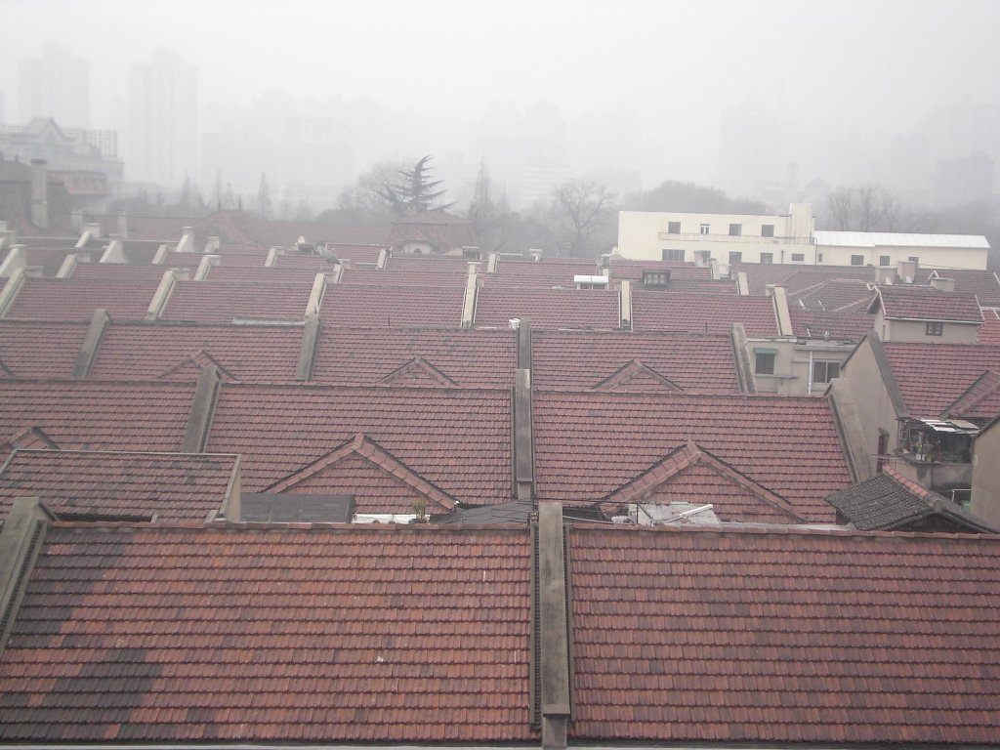
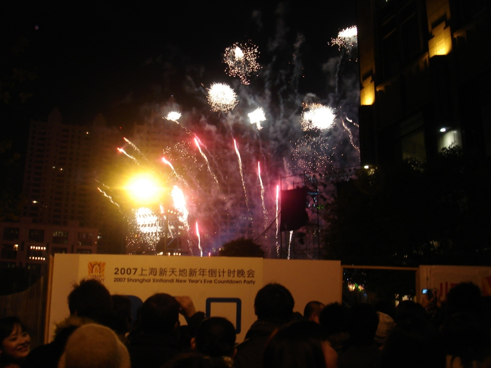
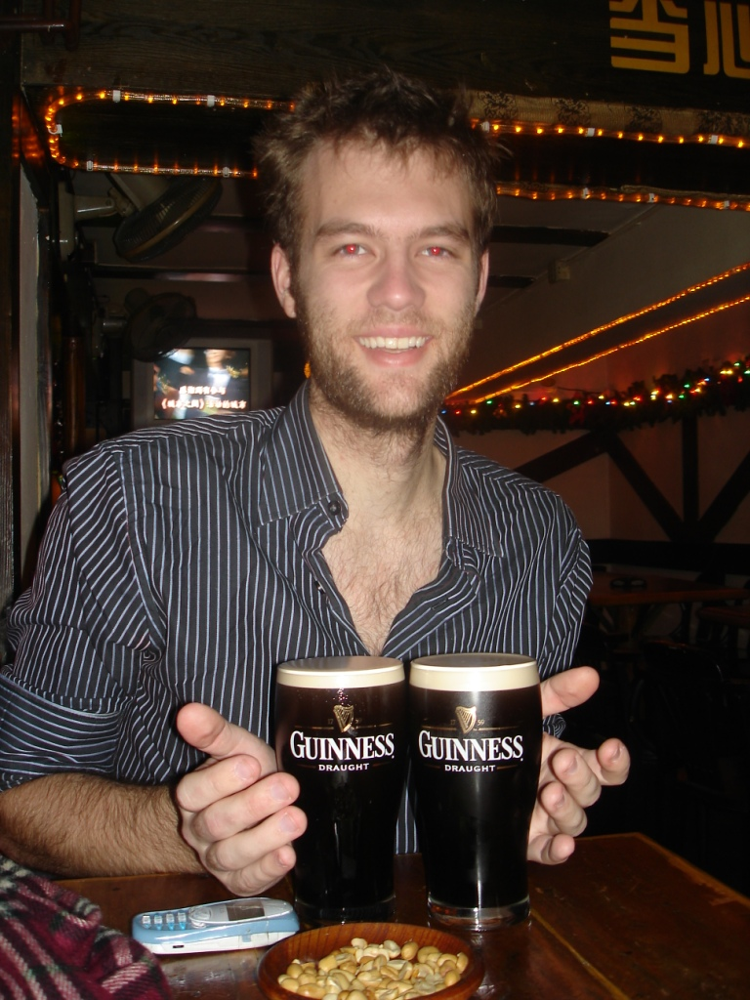

Anyone who has spent a long time on a train knows the relief of finally leaving the carriage. After roughly 22 hours, I was certainly glad to step off. Looking back, a few details stand out.

I had chosen a top bunk, and it was genuinely high. For anyone uncomfortable with climbing, I would recommend paying the small difference for a lower bunk. The advantage was that fresh air entered through vents near the top, so although it was cooler, the air seemed cleaner than elsewhere in the carriage. We had prepared ourselves for a particularly dirty train, but the reality was better than expected. There were cleanliness issues, including occasional spitting outside the designated areas, but the ride itself was smooth.

The journey did have significant drawbacks. The passenger in the lower bunk snored through most of his roughly 18 hours of sleep, which made it difficult for me to rest. Music also played loudly in the corridor for much of the trip. It was an endless loop of easy-listening instrumentals. Smoking was another problem. Most passengers used the areas near the exits, but some smoked in their compartments, and the smell drifted into ours.

How does one spend 22 hours on a train? I spent a good deal of time looking through the window, played many games of rummy, and read my books.

I had expected some beautiful scenery, but construction dominated much of the route, with old buildings being replaced by new ones. The train also offered brief glimpses of the poverty in some cities. For hour after hour, as on the route between Shenzhen and Guangzhou, a thick haze obscured the horizon. The sky became visible only as we approached Shanghai. At times, visibility appeared to be less than a kilometre. It was striking.

Arriving in Shanghai was refreshing. I left the exceptionally busy railway station and boarded the subway, where passengers were packed tightly together. Boarding and leaving the train required determination: people on the platform tried to enter as soon as the doors opened while those inside tried to leave. The result resembled a rugby scrum, even though there was space to move once everyone was aboard.

It was 31 December, which meant I would welcome the new year in Shanghai. After leaving the subway, I found the general area where I was staying. Through a contact, I had booked a small room in the old district. Rather than a hostel or hotel, it was an apartment with a private room, kitchen, and bathroom. My window offered an excellent view across the old quarter, including a distant replica of the Eiffel Tower.

The area showed a strong historical French influence, and some corners almost felt European. With fog drifting through the alleys, the streets reminded me of Frankfurt and similar cities. I collected my keys, went upstairs, and unpacked.

The apartment's main disadvantage was the bathroom. I was not especially particular, but it looked less clean than I would have preferred. Still, I showered, dressed, and went in search of a bar.

After walking for about 45 minutes, I reached the bar district. I found a small bar serving Guinness, sat down, and ordered food. Because it was happy hour, I ordered two beers under a buy-one-get-one-free offer, along with curry and rice. I followed those with a Guinness, which was mediocre but better than some I had tried elsewhere. After wishing a few people a happy new year, I resumed my walk.

I did not know exactly where I should go, but assumed the modern downtown district would have fireworks and started walking in that direction.

Eventually, I checked my map. Some nearby people helpfully called out the name of the street I was on. When I asked where I might see fireworks, they said Shanghai did not have a major display but recommended the nearby Xintiandi area. I headed that way and soon realised it was the right place to be.

At the square, access to the central concert area required tickets. I had none and did not intend to buy one, so I walked around the temporary walls. People had climbed walls, ladders, and anything else that offered a view. I continued around the perimeter and, not being too concerned where I stood at midnight as long as the setting was pleasant, sat on a bench beside two police officers.

As midnight approached, the crowd surged. I joined the countdown in Spanish, and the fireworks began. The display was modest compared with Frankfurt two years earlier, but seeing low fireworks among the buildings of such a large city was impressive. I left promptly to get ahead of the crowd. The streets were already packed, even though I was among the first to depart.

I walked home, which was not too far, and settled in for the night. Shanghai was cold at that time of year, but the heater was on and I slept well.

