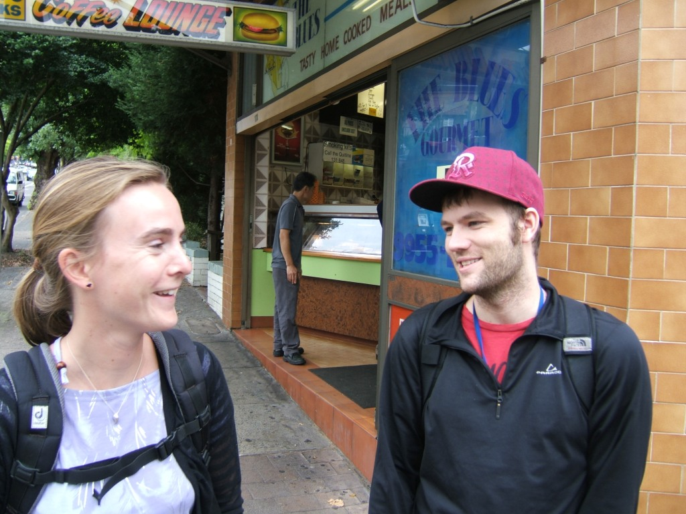
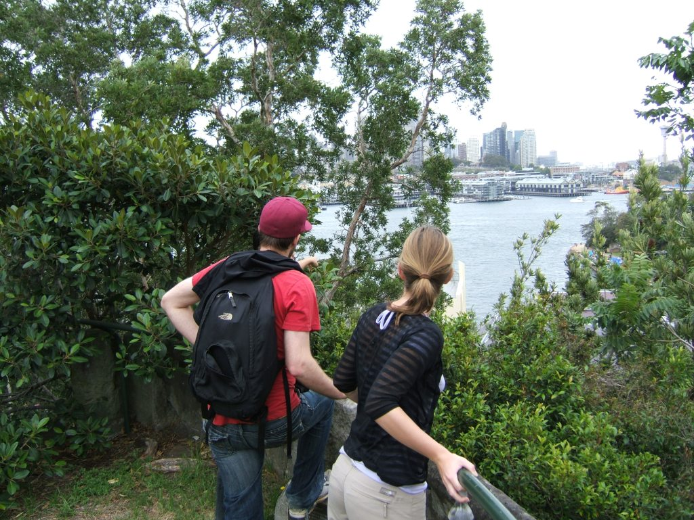
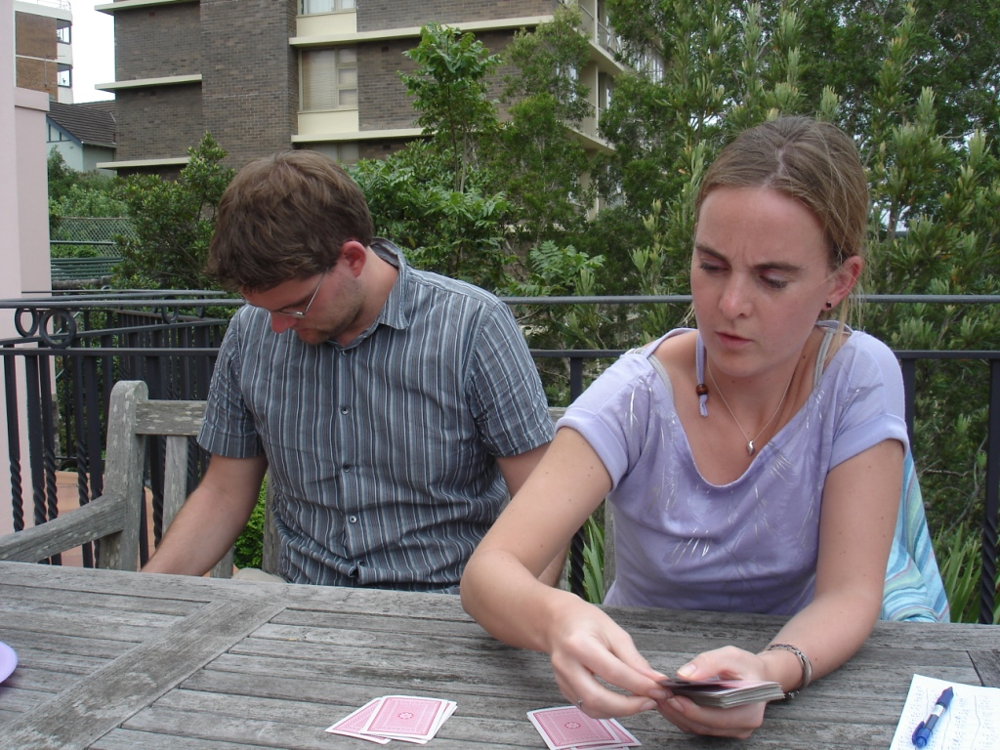
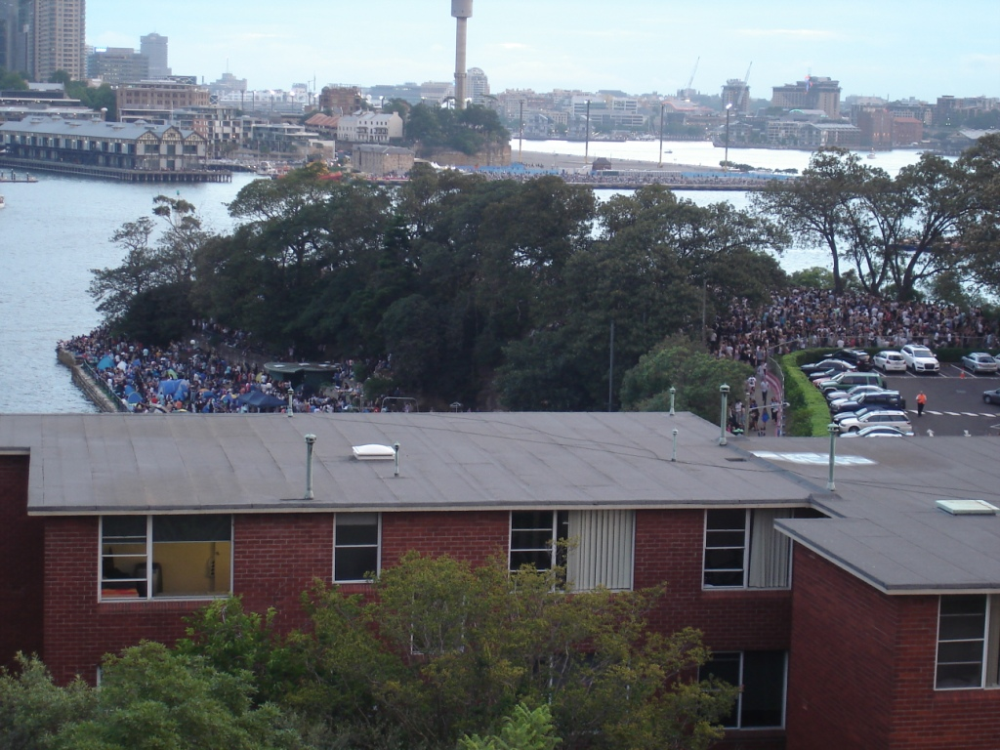
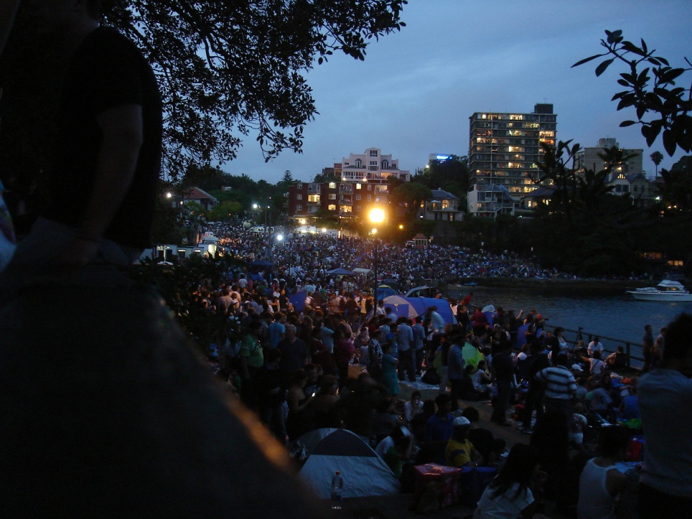
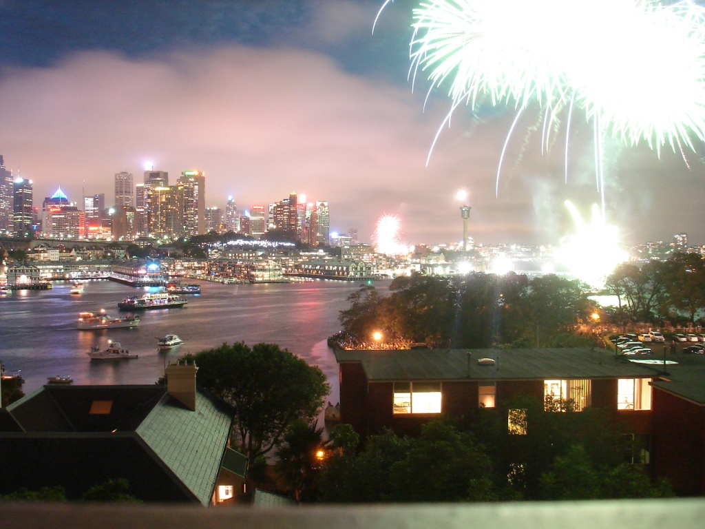
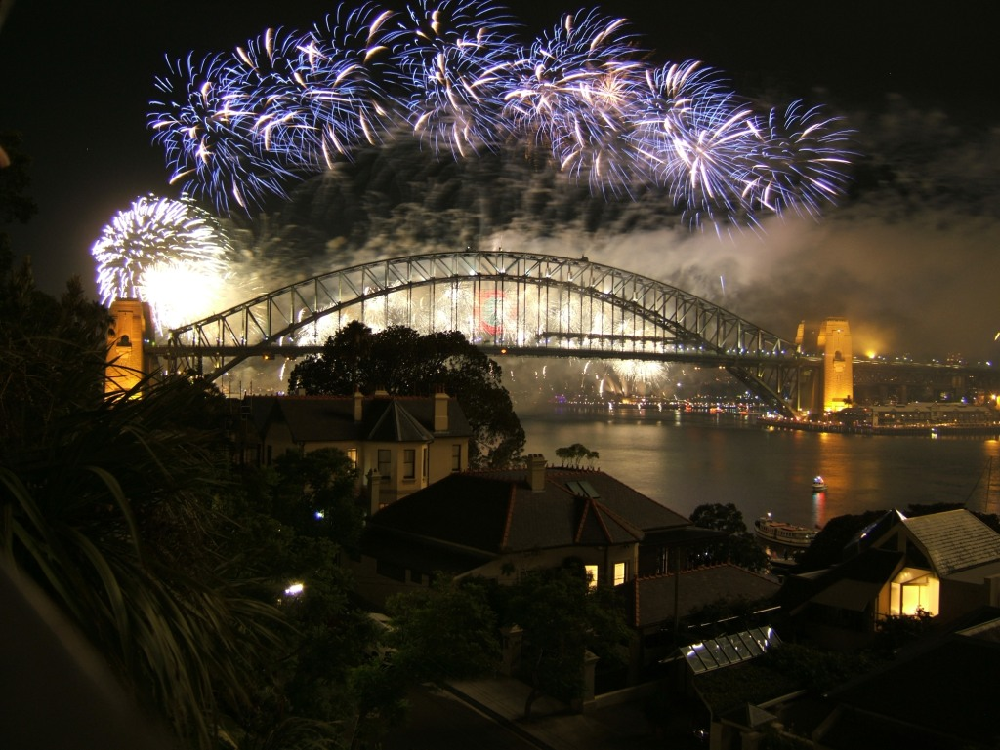
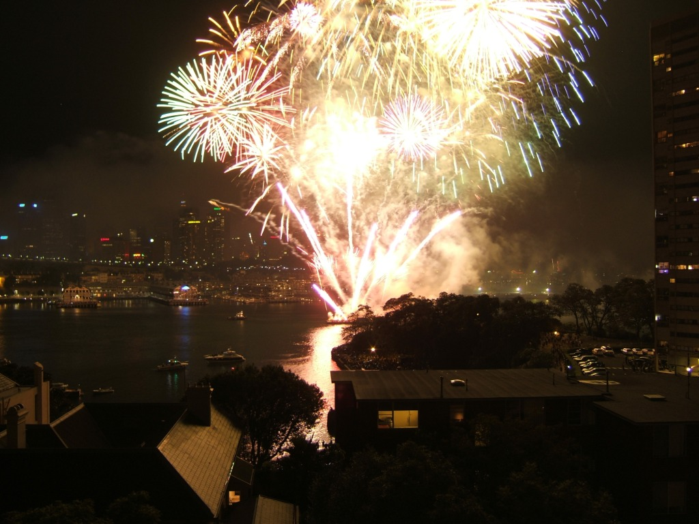
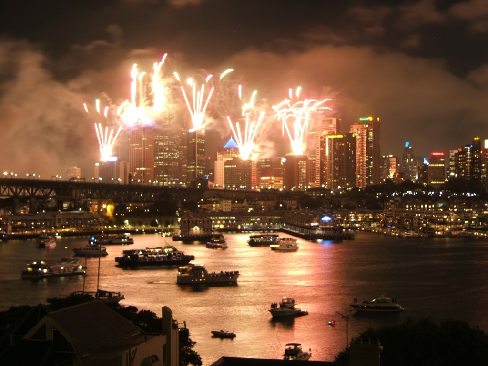
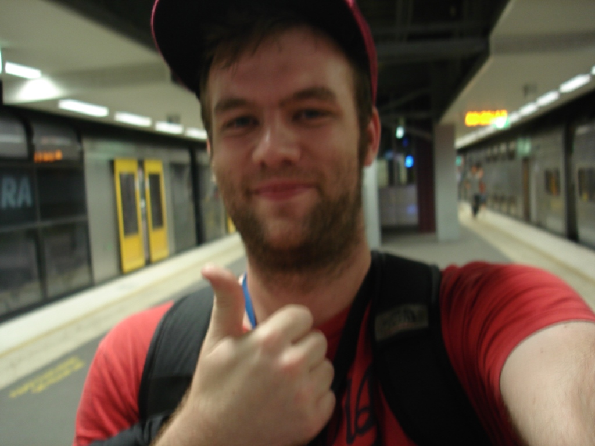

The best balcony in Sydney for viewing the fireworks.

I had always been very lucky on New Year's Eve here in Sydney. The first year, I had a friend who owned an apartment on one of the piers beside the Harbour Bridge. The views were spectacular. Last year, I decided to be a little creative and boarded the train I estimated would cross the bridge just as the fireworks began, [and it worked perfectly](http://www.kelvinism.com/blog/australia/new-years-eve-2008/). This year, I decided to do something a little different and once again ended up being very, very lucky.

My two friends from Vienna were on a Pacific trip, so they naturally came to Sydney for NYE to visit me. I had always understood that the parks filled up very quickly, so I arrived at North Sydney station by noon, bought food for the day, and set out to reserve a spot at Blues Point Reserve.

### Blues Point Reserve

[View Larger Map](http://maps.google.com/maps?f=q&amp;source=embed&amp;hl=en&amp;geocode=&amp;q=&amp;sll=-33.849332,151.203954&amp;sspn=0.003021,0.004839&amp;ie=UTF8&amp;t=h&amp;ll=-33.849408,151.204104&amp;spn=0.003119,0.005901&amp;z=17)

I had to concede one point: I had encouraged myself to arrive a little too early. I followed a group of people who looked as though they knew what they were doing. I joked that they were either going to the Point or going home. Right on cue, they turned the corner into their apartment and left me without a guide. I reached the end of the road, but a problem presented itself: there was no path down.

After looking around, I realised this was actually a great spot. I could see the Harbour Bridge and the piers, and there was just enough room for the four of us. There was even a picnic bench. I sat down.

Current time: 12:15 p.m.

After perhaps 30 minutes, I heard a door open behind me. The homeowner walked out and asked whether I planned to stay there for the fireworks. I said that I did, and she kindly asked whether I would like to use the loo. Having just realised that I had overlooked this crucial detail in my NYE plan, I accepted the offer. She then showed me the view from her balcony and told me about the Sydney Olympics, when the only clear footage of the closing ceremony was filmed from her roof.

I thanked her for letting me use the toilet and resumed my wait on the park bench.

Current time: 12:45 p.m.

Perhaps 15 minutes later, she walked out again and said, "I've called my husband, and I wouldn't mind if you came onto my balcony. You can use my loo whenever you like." For Juliene and me, access to a bathroom was a gift from the heavens, and having a table lifted my spirits. I started playing cards.

After several hours of weather that couldn't decide between rain and sunshine, and after finishing my cheese, crackers, and cookies, I settled beside the pool. Although none of us had swimsuits, I appreciated the chance to sit in the shade and dip my feet in the water. I had, naturally, risen at 5:45 a.m. that morning, and the heat had worn me out. I sprawled out and started napping. Current time: 4:30 p.m.

The daughters, who were about my age, had a few friends over. At about 5:30 p.m., they came down and offered me some cheese. Although I had already consumed nearly 300 grams, I still ate more. They then mentioned that their small dog, Piggy, had managed to claw through two bags and eat my bread. I was offered a beer, and the conversations began.

I entered the swarm of teenagers, and my worries about being stuck in a large, rowdy crowd became a reality.

Until this point, I had tried to stay out of the way. By then, however, I felt I had an interesting story to tell about who I was and why I was in Australia. I was equally interested in other people's stories, especially those of my hosts, who had kindly shared a slice of their balcony with me. The best balcony in Sydney for viewing the fireworks.

The barbecue was scrubbed and covered with meat, and I had a chance to talk with the husband. One thing that immediately struck me was his genuine curiosity about who I was. It wasn't superficial curiosity or the beginning of basic small talk. It felt as though he was adding to his broader understanding of the world. He discussed specific historical events with one of his daughters and responded, "Oh, that's a good company," when Christian mentioned where he worked in Vienna.

I helped bring the food upstairs, and everyone began eating dinner. I was given a few glasses of wine, and then we were invited to walk around Blues Point. The crowds had already thickened significantly, and the police were out in force. Directly at the entrance was the Riot Squad, with about 30 NSW police officers just below them. Around the corner, hidden from the crowd but visible from my vantage point on the balcony, were two police buses. These were not the small police vehicles that normally drove around; they were full-size buses.

I entered the swarm of teenagers, and my worries about being stuck in a large, rowdy crowd became a reality. Although this was a "no BYO zone," there were cans of beer everywhere and plenty of teenagers in "gladiator shoes" slumped in the fields. I somehow made a circuit around the Point and arrived at the bathrooms. If you're ever going to Blues Point Reserve for NYE, a word of advice: bring a bucket. The queue for the women's bathroom must have been at least 30 minutes; there was no queue for the men's. That observation leads to another piece of advice: I wouldn't lean against any trees at the Point during NYE.

The final observation, and something I had never seen before in Sydney, was the lack of a line at the beer garden. This surprised not only me but also my gracious tour guides. We quickly concluded that it was because I was standing amid the equivalent of a 15,000-student high school. After again expressing my appreciation for queue-free access to the loo, I escaped through the gates and returned for dessert.

I dutifully retold the story of how Pavlova was named, or at least my version of it. At 9:00 p.m., the "kiddie fireworks" began, and my friends were amazed that Sydney's early fireworks were bigger than Vienna's midnight display. Everyone temporarily retired until just before midnight, when the main fireworks began.

The fireworks this year appeared bigger, higher, and brighter than those of the previous two years, although that may have been because I could see five of the six barges launching them. After perhaps 15 minutes and many photos, the fireworks ended. Hello, 2010.

One thing I had learned from previous years was the difficulty of moving 1.5 million people out of the CBD. The year before, I couldn't even enter Milsons Point station, so I walked to North Sydney. Even there, the station was packed and the entrance was heavily regulated. Intoxicated people were getting into fights on the train, breaking windows, and becoming sick everywhere. My friends needed to be at the airport by 8:00 a.m., so getting a few hours of sleep was all I could think about.

Because I was slightly above the rest of the crowd, I was able to leave immediately after the fireworks and walk briskly to the station. There was no line, and within five minutes, my train arrived and I was heading home. Current time: 12:27 a.m.

### Blurry Thumbs Up at North Sydney Station

