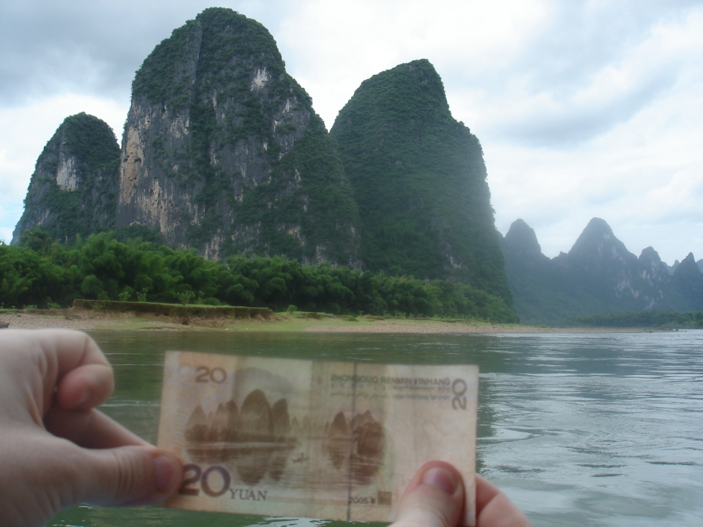

Our boat to Yangshuo left at 09:00, so we needed to wake reasonably early. We ate some local Guilin noodles and met a French couple who were also travelling up the river. By 09:30, we were on our way along the Li River.

The boat ride was beautiful. Although some rubbish floating downstream revealed the river's pollution, the surrounding hills were remarkable. The same landscape appears on the back of the 20-yuan note, and I now have a photograph of it too. By 12:30, we had arrived in Yangshuo, a town popular with tourists and nestled among the hills. We had only a few things planned, so we decided to take it easy for the rest of the day. We sat beside the river chatting for some time, then collected our books and headed to a cafe. We were in bed by 23:00, ready for a busy day ahead.

