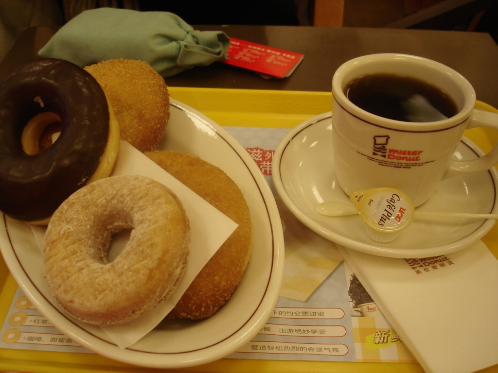
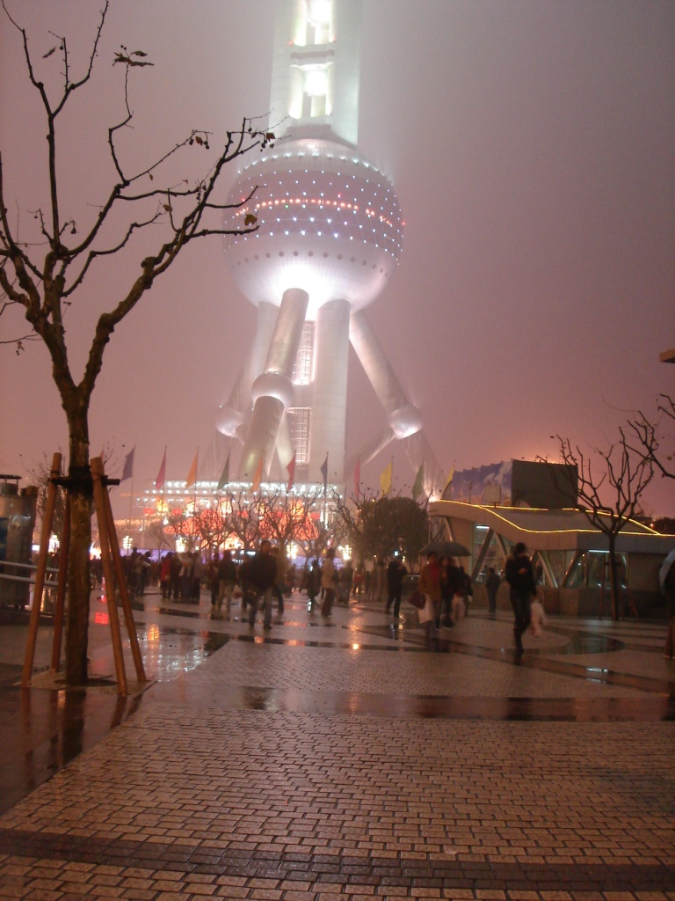

Fairly early in the morning, I woke up and got ready for the day.

 

The place where I was staying looked and felt very old, especially with the lights out. It seemed like the perfect place for ghosts to gather, so naturally I was a little spooked. I walked with her to the shower and waited for her to finish.

  

After dressing, I put all my clothes in the washing machine and set out to find breakfast. I walked along the back alleyways and eventually reached a little dumpling shop. I ordered my food, ate, and returned home. With perfect timing, my laundry had finished, so I hung the clothes up to dry and set off on the day's missions.

 

First mission: exchange some money. Since I don't like visiting banks or exchanging money often, I exchanged the rest of the funds I had brought. I should now have enough to avoid doing it again. Afterward, I spotted a Mister Donut, a chain that was also very popular back in Taiwan. But I wasn't in Taiwan, so I decided to have a donut and some coffee. I ordered and found a seat.

 

After breakfast, part two, I kept walking toward my house. One frustrating thing about the neighborhood was the number of people continually asking whether I wanted watches or bags. Until recently, a huge counterfeit market had operated nearby, and some remnants clearly remained. I'll admit that I was getting tired of being asked whether I wanted a handbag or a watch. Couldn't they tell that I didn't need a handbag? I didn't even dress stylishly.

 

I jumped on a bus with a mission to see some tall buildings. When I reached the river, it unfortunately started to rain. Across the water, I could barely see Shanghai's distinctive skyline, but I took pictures anyway. I then walked much of the way back to the nearest subway station, stopped at a huge bookstore, and took the subway to the modern district where the enormous three-sphere tower stands.

 

The tower was very impressive, I must admit. Its distinctive design made a striking contribution to Shanghai's skyline, while the Jin Mao Tower loomed nearby, although I couldn't actually see it. Half-hidden in the fog, the tower seemed almost mystical. Outside, I bought six lamb skewers from one of the vendors. I hadn't become sick at all on the trip, pei pei pei.

 

I continued exploring the city by visiting Jing'an Park and a small temple nearby. Farther down the street, I had dinner at 78, a Japanese restaurant. I then returned to the subway and, as the temperature dropped, finally made my way home.

 

After walking around for nearly nine hours, I was ready for a break. I began writing a few journal entries while watching some interesting television. By then, everyone had entered the new year, so I could fully welcome 2007. A final highlight of the day was my mom calling during their celebration just to wish me a happy new year. Go, Mom.

