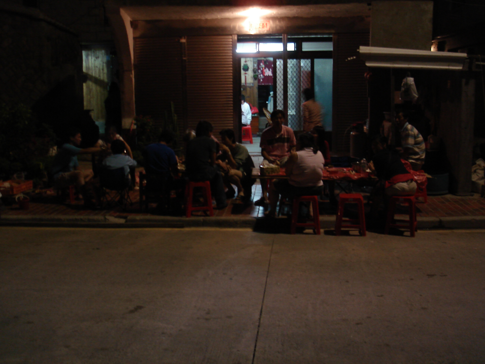

Today we awoke much later than normal. After stretching and tidying the room, we walked downstairs to the little coffee shop that served as the headquarters for our guest house. Breakfast and coffee were once again included in the price. We paid for our room and ate a muffin filled with egg and vegetables. When our coffee arrived, the woman announced, "I made his really strong, since that is how an American's Americano should be," or something similar. After breakfast, we began our mission for the day: getting an ice cream cone from 7-Eleven. The main complication was that the 7-Eleven was in a village on the opposite side of the mountain.

 

A small granite trail wound up through the hills. We climbed past a small temple and eventually reached a crest between two mountain peaks. Another small village occupied the crest, although nobody seemed to be around. A nearby map presented two options: climb through the hills to the top of the crest and then descend along a footpath, or follow the road down into the village. Since we were on a mission, and missions should never be easy, we headed up the mountain. It was quite a workout. We passed other people doing the same. "Hidden" on either side of the road were large artillery guns, all pointed in the same direction. One couldn't help wondering what it would be like on the island during a conflict, or whether the weapons were still active.

 

We soon reached the top and had an amazing view down into the large village containing the 7-Eleven. The nearby airport loomed, and we watched one of the day's three flights take off. Everything looked slightly surreal but beautiful. We found the path down to the village and began the long descent. Stone from China had been used to build most of the walls and roads because it cost half as much as stone from Taiwan.

 

After reaching the bottom of the trail, we wandered through the largely empty village. We found the 7-Eleven, reportedly the newest one in Taiwan, and bought several drinks and a small muffin. We sat and talked about the day and life, then walked to the airport to exchange our plane tickets for ferry tickets. The ferry was less expensive, and I had never taken one between the islands and Taiwan. After making the exchange, we wandered to the bus stop, where I practised my Chinese. I quickly became bored, so we got some food and returned just in time to catch the bus towards our village. After being dropped nearby, we walked the final mile or so to our room. We picked up our books and journals, began reading and writing, and considered what to do with the rest of the day.

 

After another nap and some more reading, we walked to Rita's house. As we followed the winding road along the ocean, we talked about China's proximity and the surrounding politics. After perhaps 30 minutes, we reached the house and immediately knew that we would be eating well. The house was filled with the usual 20 or so people, all enjoying different foods. We were shown to a table and began eating, although we didn't have too much because we knew this was only preparation for the next "course." Meanwhile, the BBQ outside was heating up, and we talked with several people inside. When it was ready, everybody moved to the outside tables and started eating. First course: snails. Well, sort of. I think they were hermit crabs, and they were cooked to perfection.

Some of you might not believe the paragraph above, but I tell no lies. You have to use a toothpick and make a little swivelling manoeuvre to remove the meat. Overall, they didn't taste bad. Just don't eat the last part; it is a little too bitter. Next on the menu was stingray.

 

So, what does stingray taste like? It is firm, very firm, without much meat. That was okay. I'm sure many people reading this will immediately think of Steve Irwin; I certainly did.

 

There were a few other adventurous items on the menu, but nothing as interesting as those above. I wondered whether eating the snails counted as escargot, or however one says it. As expected, we had some more "lao jiu" and eventually received a lift home. Luckily, I managed to avoid the mahjong game, especially since playing would have meant giving my money away. It looked fun, but I decided to wait for another opportunity.

