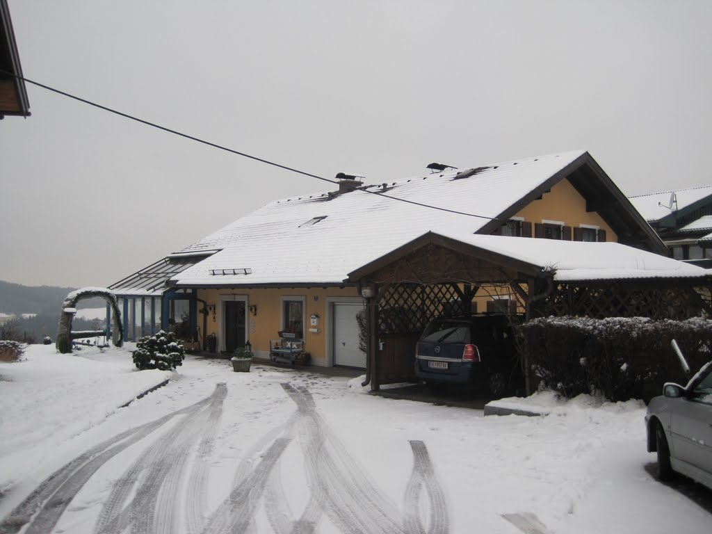
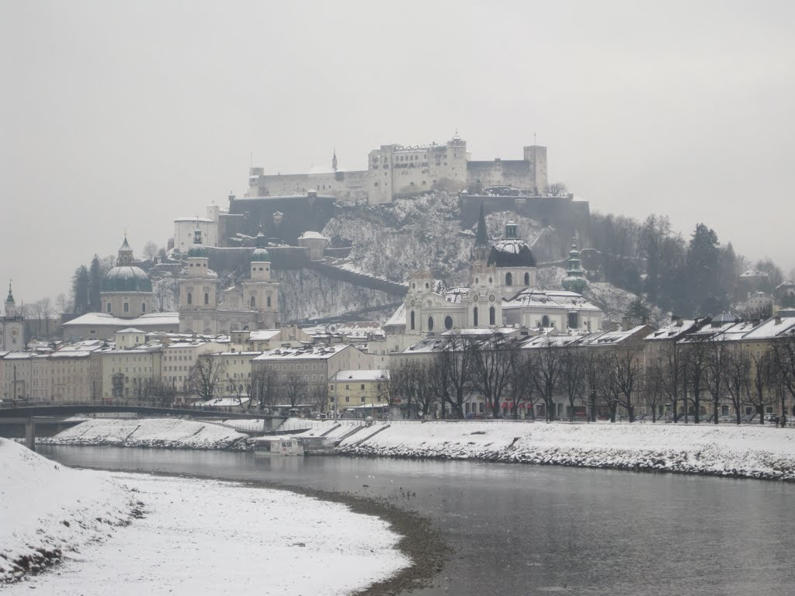
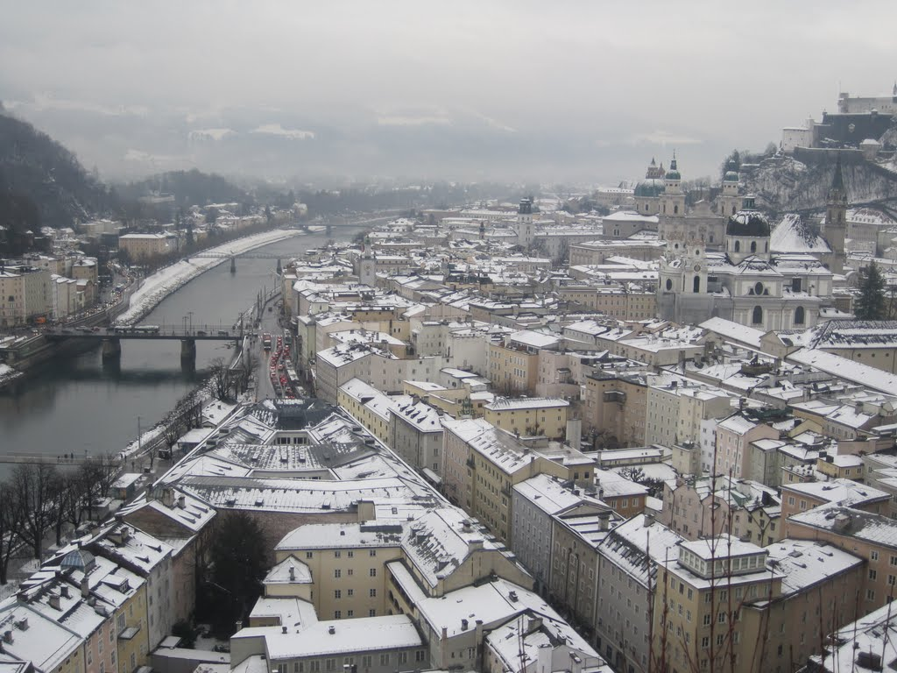
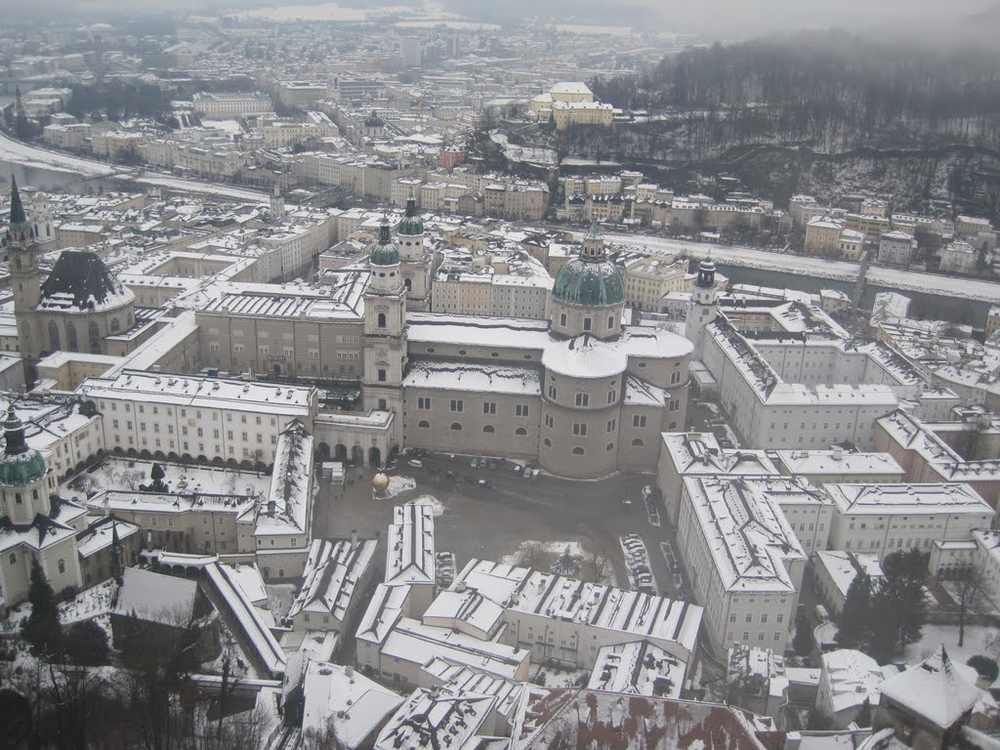
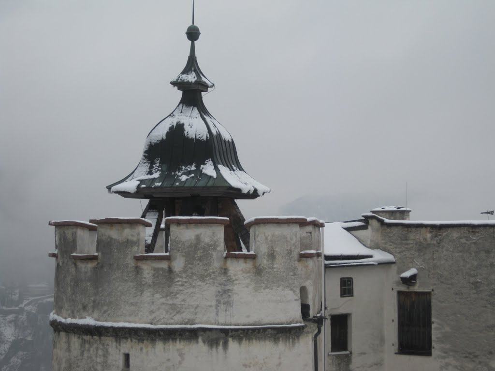
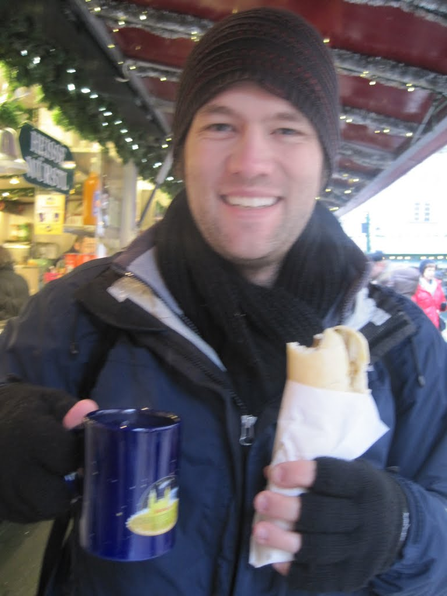
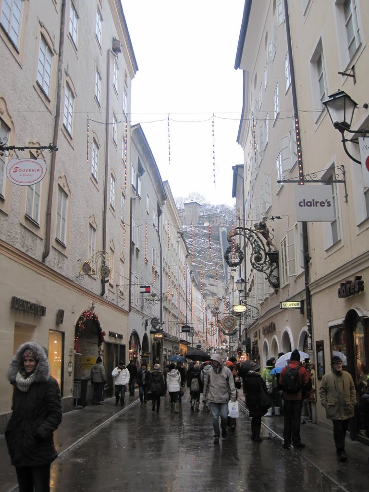
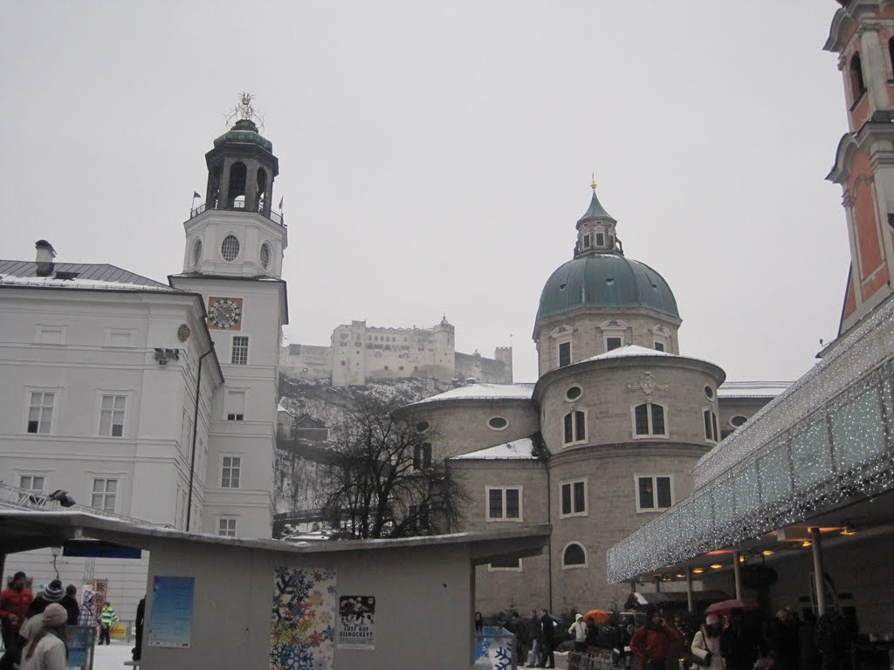

As a small town, Český Krumlov offered limited options for travelling into Austria. The train to Linz first travelled back through the Czech Republic before circling a mountain and crossing the border. Online, I found a last-minute shuttle service from Český Krumlov to Linz or Salzburg. The operator often needed to send a car or van south to collect passengers in one of those cities, so last-minute bookings could be discounted. I booked at half the normal fare, confirmed the time and price with the agency, and arrived at 6:00am ready to travel into Austria.

Early that morning, I walked the 100 metres from Hostel Merlin to the office, where the car was waiting. The journey reminded me of a drive through Yunnan, although with only the driver and me, I hoped this one would be less smoky.

The driver departed promptly, eager to reach Salzburg for his 9:00 pickup, and moved quickly through the frozen countryside. After taking a sharp right, he said, "This is a shortcut over the mountain. My best time is three minutes." I asked how far it was. "About nine kilometres." I replied, "I assume that was on a clear day in summer." He agreed and said that he drove more safely now as we passed another car. Although he drove quickly, I never felt seriously unsafe.

Haus Christine, my stay, covered in snow

The train journey to Linz alone would have taken three hours, while the shuttle reached Salzburg in two and a half. The driver offered to drop me at my hotel, a few kilometres north of the city centre, and I eagerly accepted.

Haus Christine was perched on a slope overlooking Salzburg, directly opposite Hohensalzburg Fortress. I left my bags, collected my warm clothing, bought a 24-hour bus ticket from the owner, and headed to the bus stop.

My self-guided tour took me through Mirabell Palace, past the fountain featured in  The Sound of Music, across the river near Christuskirche and Maria Himmelfahrt, and along the ridge by the Museum of Modern Art and the Numbers exhibit. It ended at Hohensalzburg Fortress.

I bought a ticket to Hohensalzburg and explored the fortress; it was well worth the cost. Rather than taking the funicular, I followed the steep, muddy path up alongside the wall.

Approaching the fortress, it was easy to understand why it had never been successfully taken by force, although it was eventually surrendered to Napoleon's troops without a fight. The views across Salzburg and the surrounding area were outstanding. During the walk, I joked that the former archbishops must have sent servants to every hilltop to identify the one with the best view, or, more likely, the strongest defensive position.

My next stop was a 30-minute audio-guided tour through part of the fortress. I had already read much of its history on Wikitravel, so some material was familiar. I visited the so-called Torture Chamber, which apparently had never been used for torture, and climbed to the top of one of the towers. It offered the best views in the fortress.

Several small museums stood at the end of the tour, some quirky and others historically significant. One exhibit included a toilet used by former royalty, a reminder of how much daily life has changed.

After the tour, I bought postcards from the gift shop and rode the funicular back to the old town. I walked briefly through St Peter's Cemetery, where many notable historical figures are buried, and continued to the Christmas market by the Petersfriedhof. After a morning of walking and having finished my biscuits, I bought what was described as "bronso": two thin sausages in curry sauce served in a bun. It was exactly what I needed. I also enjoyed another cup of mulled wine. In many ways, I felt at home in Europe during winter. A few stalls later, I saw one of the largest pretzels I had encountered and bought it. It was sweet rather than salty, but still enjoyable. As I neared the end of the market, the weather became slightly warmer and rain began to fall.

Near Salzburg University, I found an old-fashioned barometer and thermometer showing about 1°C and 100% humidity, which was unsurprising given the cold rain falling around me.

After a short break in McDonald's to check my email and share a coffee, I tried to visit Mozart's birthplace. I knew the yellow building housed a museum and stood on the same street, but I was unable to locate it. As only a casual listener to classical music, usually while studying, I was content to know that I had at least walked past it.

As the light began to fade, I started looking for a bus stop that would take me back to the hotel. I bought food for the journey and my stay in Bled, spent some time searching for the right stop, lost one euro to a bathroom turnstile, and eventually settled into a cafe-bar on a side street.

The bar, which may not even have had a name, was packed with locals who all seemed to know one another. The winter holiday was probably beginning, and the 15 or so patrons were well into their evening. Not especially hungry, I ordered a simple sausage sandwich and 500 millilitres of Ziegel. The friendly barmaid was busy, and many customers appeared to be on their third stein. I left content, if smelling slightly of smoke, and stopped at a pharmacy for vitamin C before returning to the hotel.

Bus 21 took me near the hotel. I walked up the long hill, took the vitamin C, showered, and went to bed early. I would be awake again at 6:15am.

