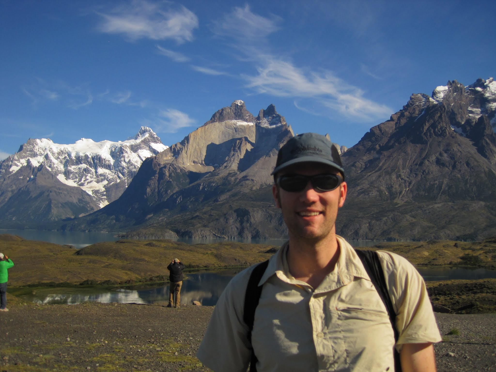
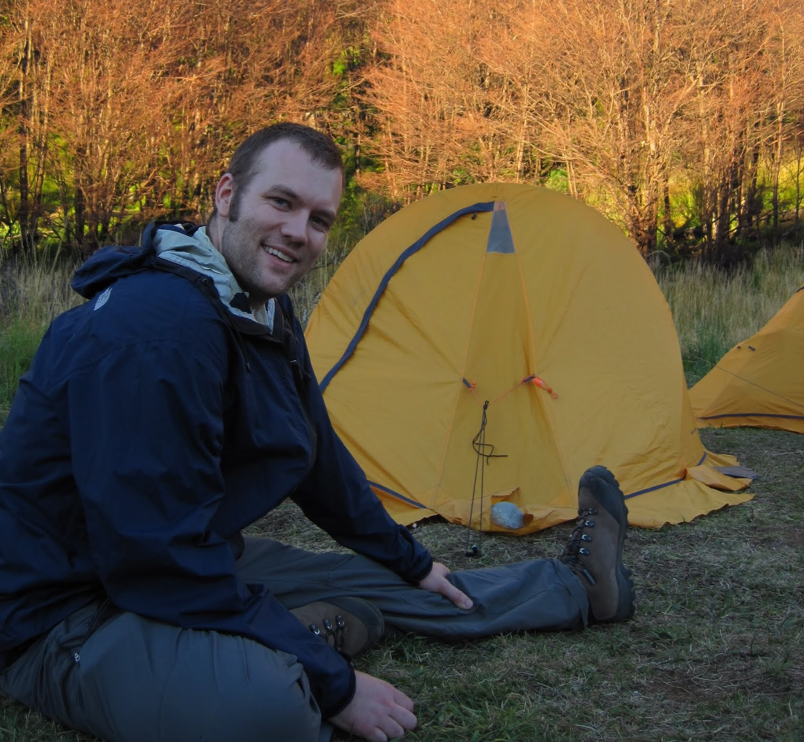
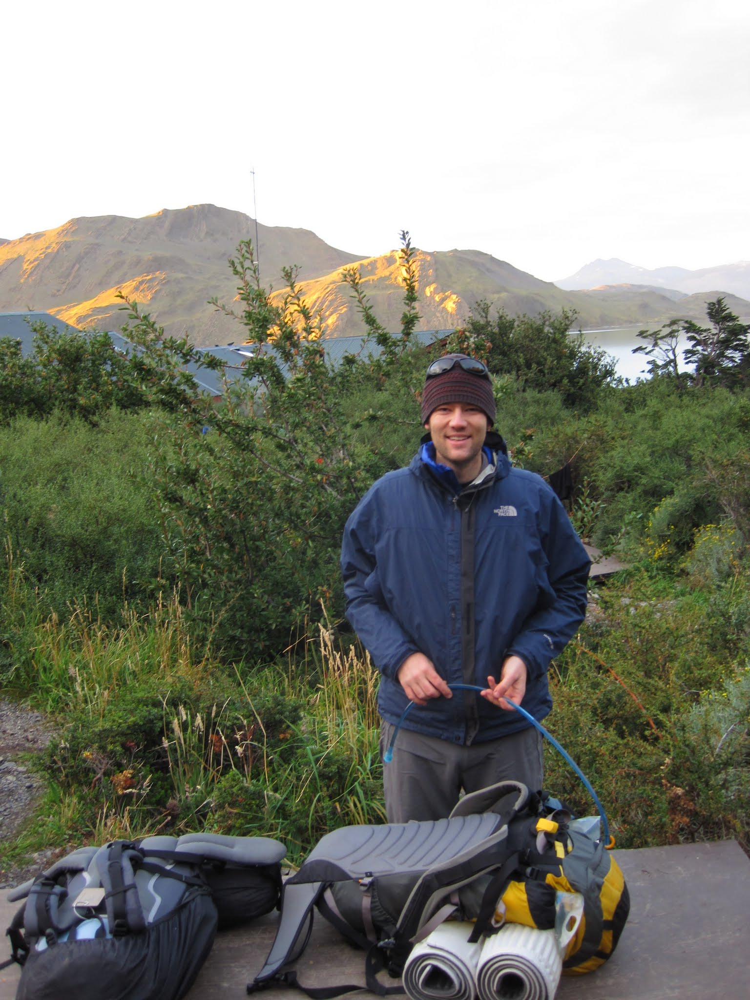
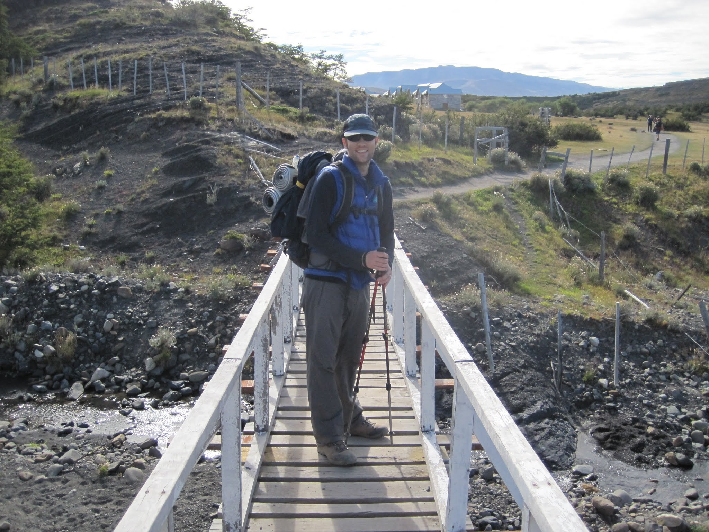

I have just returned from hiking the "W", a famous circuit through the Torres del Paine, in Patagonia. Although I did some research before doing the trek, it turns out I made a number of assumptions that turned out to be incorrect. I will detail in this entry what I learned, a few things that worked well, and a few things that did not work so well.  
  
I will try to avoid posting spoilers of the major sites, and instead focus on logistics of doing the trek. First things first: much of this content is from what I learned at a talk given at the [Erratic Rock](http://www.erraticrock.com/) hostel, at 3PM the day before entering the park. The single biggest suggestion I would give you is to go to this talk.

Next, I should clear the two biggest assumptions I had before arriving, so you can plan accordingly.

1. "Pirate" camping is frowned upon - probably even illegal in the park. You must stay at a designated camp-site.
2. You can only cook at designated areas, which means you need to plan lunch meals that do not need to be cooked.
3. Water from streams is apparently safe to drink. Nobody uses filters. Just fill up at a place with flowing water, which comes straight from glaciers, and not where there is a horse crossing.
4. There are paid refugios and free refugios.
5. The paid refugios (shelters) have showers.
6. The transportation to and from the park is timed perfectly for all the trekkers, but it is crucial you plan for what bus you want to take.
7. It gets really cold at night, at least it did in March. If you bring your own sleeping bag, then make sure it is rated at least down to -5C, maybe -10C, otherwise you won't be getting much sleep.

How do you get to the Torres del Paine?

This naturally depends where you are coming from. I were in Santiago, so flew to Punta Arenas and took a bus to Puerto Nateles. One thing that was a little unclear was if the bus would stop at the airport in Punta Arenas or not. I decided not to risk it, so caught a mini-bus from the airport to the bus terminal (3000CLP), and caught a bus to Puerto Nateles almost immediately. It turns out the bus did stop at the airport and picked on person up - there were no other seats left. I would suggest you email or call the bus company ([Bus Ferdnandez](http://www.busesfernandez.com/)) and make sure they pick you up.

  

One of the first decisions you will need to make is if you should camp, or just stay in a refugio? It was obvious the people who were staying in refugios, as their packs were usually quite small, and they smelled really clean. It was obvious the people doing the full trek, as they usually looked tired, and not terribly clean. I were in the later group. Base Camp, right next to Erratic Rock, where the 3PM talk is held, offers gear rental. The [prices](http://www.erraticrock.com/equipment/) are reasonable. Equipment needs to be reserved before you arrive during high season.

  

What are these refugios? Do they need to be booked in advance? The refugios are little shelters at different camp-sites strewn throughout the park. I camped, but I believe there are nice shelters (more similar to cabins), and some that are more like dormitories. Take note that you _must_ camp at one of these designated campsites, and they aren't all free - more details below in the day-to-day breakdown. The two companies running the refugios are: [Fantasticosur](http://www.fantasticosur.com/en/) and [Vertice](http://www.verticepatagonia.com/). I think you should book in advance, but maybe research this. 

  
What route to take? The route you take will depend strictly on how far you want to trek each day, or are capable, as you must stay at a camp-site. At the Erratic Rock talk they will give you a suggested route, from west to east, which is one I and a group of others followed. A map of the hiking area will be provided at check in.   
  
The "Erratic Rock Route" goes like this:  
  

**Day 1**

  
Catch 7:30 bus into Torres del Paine - your hostel/hotel can surely organise. Our bus cost 15000CLP return. You will enter park at about 10:00 and pay the park entrance fee. The fee is 18000CLP. You will also listen to a short talk telling you not to "pirate" camp, and don't burn down the forest. The bus will wait for you. Continue taking the bus to the second stop, which is right next to Lago Pehoe. Disembark the bus and walk to the catamaran. The boat goes between this second stop and refugio Paine Grande. The boat costs 8000CLP.  
  
You will arrive Paine Grande at about 13:00 and need to start hiking immediately. This day you will hike 11KM to Refugio Grey where you will set-up tent and put down your bags. The stay is 4000CLP. After setting down your bags you will keep going along the trail to the Mirador overlooking the glacier - this hike is about 4KM. Arrive as early as possible, as the sun will set behind the glacier and taking photos will become difficult.  
  

**Day 2**

  
Wake up rather early, cook breakfast, and hike from Refugio Grey back to Refugio Paine Grande (11KM, ~3.5hr). Have a quick lunch, and continue hiking to Campamento Italiano (7.6KM, ~2.5hr). This is a free camp-site, so set-up tent, cook dinner, and get ready for bed. There is a water sprout near the top of the camp, so you don't need to walk to the river for water.  
  

**Day 3**

  
Wake up and hike the French Valley (7.5KM each way,  ~3hr each way). Return to camp, collect your gear, and walk to Los Cuernos (5.5KM, ~1.5hr). This stay is 8000CLP, but the showers were really hot. The camp-site fills up pretty early, as people are coming from both directions, so try to arrive earlier rather than later.  
  

**Day 4**

  
Hike from Los Cuernos to Campamento Torres. About 9KM out of Los Cuernos you will encounter a big sign that says "SHORTCUT" - take it. This will take you around the backside of one mountain, by a lake, and cut some time off an already pretty long day. It is maybe 3.5hr from the shortcut to Campamento Torres, but it is all uphill. The trail gets very well used after merging with the trail from Los Torres hotel. Campamento Torres is a free camp-site. Consider camping uphill from the bathroom.

  

**Day 5**

  
Wake up quit early and depart for the Base de las Torres for sunrise. Most people leave Campamento Torres by about 6:15am, but when I went it was overcast, and the sun didn't actually hit the mountain until almost 7:50. The walk takes about 45 minutes. Take your photos, hike back down to camp, pack up, and get back to Hotel Los Torres by 14:00. I ate breakfast at sunrise at the Base de las Torres (trail mix), but had a hot lunch at Campamento Chileno. A mini bus will pick you up by Hotel Los Torres at 14:00 and take you back to Laguna Amarga. This mini bus costs 2500CLP. Your bus will depart back to Puerto Natales at 14:30. Please shower and do laundry as soon as you get back - you probably smell like you're homeless.  
  

So, what are some things that worked really well for me?  
  
One of the best things I did was keep our packs light. Our packs were both under 10KG, including five days food, sleeping bags, pads, and tent. My pack was probably about 7KG. Probably the biggest regret I heard on the trail was that everyone's pack was too heavy. I would say most were above 20KG, even for females. A lot of this was due to the food choices made. I read a book on ultralight hiking in university, so knew some basic rules for keeping pack weight down:

1.  Don't buy food in tin cans or water (e.g. tuna)
2.  Don't bring fresh fruits or vegetables
3.  Bring plastic or titanium/aluminum cutlery
4.  Don't bring "it" if you won't have to use "it" every day
5.  No knives or leatherman (you don't have tins to open now...)
6.  1x pants, 2x shirts, 2x socks, 2x underwear (or none), 1x long sleeve, 1x fleece, 1x down vest (maybe if cold), and 1x windbreaker/raincoat. That's it. You don't need three jumpers or five pairs of underwear. You probably don't even need the shirts as a base.
7.  Put duct tape on random things (e.g. trekking poles) instead of bringing a roll of duct tape.
8.  Buy food that cooks quickly, not types of pasta that take 20 minutes. Risotto is pretty efficient (boil, heat it some, take off flame and cover), as are some thing types of pasta in soup.
9.  You can eat out of the bowls you are cooking in - you don't need pots and plates.
10.  Bottles for only enough for 5 days. A full tube of toothpaste, big bottle of shampoo, and tube of sun screen all ads up the weight. The same is true for pills - you don't need a full pack of multivitamins, five will do.

I heard stories of people cooking pancakes and french fries somehow, which would taste amazing, but I would rather eat risotto and have a pack 1/3 the weight. I both made it through with not a single blister, whereas the person next to me right now has seven.  

Other suggestions of things that  worked well for me include:

1.  Wool or wool blends of everything. It dries fast, keeps you warm, and doesn't keep odour. Get some wool blend underwear for travelling if you don't already have some.
2.  Bring a super light day pack (like one of these) that you can toss water and food into for hikes that don't require the full pack. If your full pack is comfortable enough, then just use that.
3.  Polarized UV protection glasses are a must, as is a hat. There were some seriously sun burned people returning from the trip, despite putting on "two layers of sunscreen". Wear a hat.
4.  I brought my MSR "dragonfly" stove with me, and the normal cup to cook with. Erratic Rock / Base Camp have a container with half empty gas canisters. If you don't mind risking running out of gas, grab one from here. Otherwise gas is about 8 bucks.
5.  Find additional people to share food with. Oatmeal is only sold by 1KG packages, which is a lot. Most people were throwing away leftover oatmeal at the end of the trip.

However, there were a few things that did not work that well, or not work as well as expected. The worst thing was a growing pain in my right knee. I've always had some pain in my knee after hiking, but by day two I was starting to have severe pain. The trails have quite steep ascends/descends. This destroyed my knee. On day four another walker who knew about my knee passed by and said "I have some trekking poles - I tried them, tripped over myself, and haven't used them since. Wanna try?" I had never used poles before, thinking they were only for old people with bad knees... Needless to say, I'll be buying a pair when I get back to Sydney, and I finished the day 4 hike without any pain. If you ever, even once, have had pain in your knees, then rent trekking poles. I had to skip the French Valley because my knees were hurting too much (I guess technically I hiked the "U", not the "W"). If my pack was not so light, I do not think I would have been able to go up to the Torres.  
  

The second mistake I made was not bringing a flashlight. My logic was I would just go to bed when it got dark, and rise when it got light. This is what I have always done before when trekking. Unfortunately, this does not work that well when you want to be up before the sun rises, e.g. to see the Base de las Torres. I followed (closely) some people with torches, so made it, but came close to tripping quite a few times, and it generally wasn't that enjoyable. Most people had those LED lights that go on your forehead - that would be advisable.  
  

Finally, I brought a Platypus for water. Hiking back in Oregon there would be some stretches with no water - maybe 4-5 hours of hiking without easy access to water. In the Torres del Paine, there was water nearly every two kilometers, so a Nalgene would have worked well. My better half just used her Nalgene, and it worked fine. It is also easier to fill up, and has measuring lines for how much water is needed for risotto.  
  

That's all the advice and information I can give about hiking the "W" in the Torres del Paine. The hike is a bit more expensive than I had expected, but there was some great camaraderie with other hikers, and it leaves you with a feeling of accomplishment when finished.  
  
There are a few more sites that detail this trek, including:  
[How to hike the "W" in Torres del Paine](http://www.stephandben.com/2012/04/map-how-to-hike-w-in-torres-del-paine.html)  
[THE Definitive Guide to Hiking Torres del Paine](http://www.worldtravelforcouples.com/the-definitive-guide-to-hiking-torres-del-paine/)