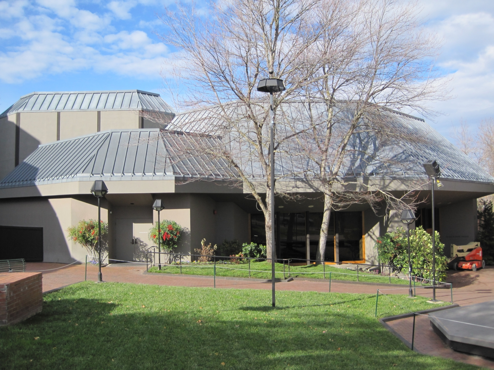
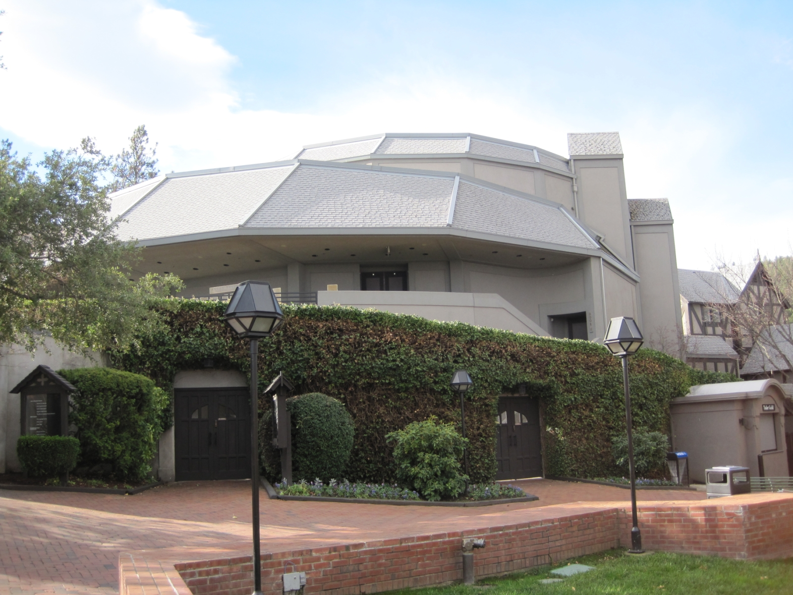
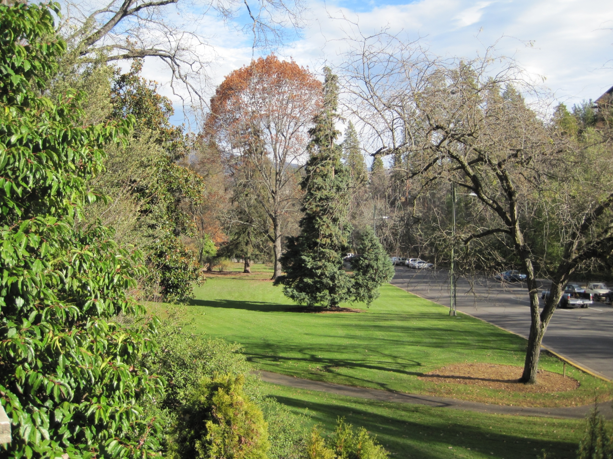

I've recently returned from a short trip home, and I had a wonderful time. I had the opportunity to visit family and friends, eat plenty of delicious food, and generally relax. I reduced the amount of old belongings stored under the house by 80% and gave away all my old books, which are archived on [Goodreads](http://www.goodreads.com/review/list/4742180?shelf=read).

 Friday - was picked up at the airport, admired the crisp air of the Rogue Valley, relaxed at home, and had dessert and coffee.

 Saturday - woke at my usual time, then spent the day with Dad. Ate plenty of good food, although something made me ill in the middle of the night.

 Sunday - tried to function after not sleeping at all the previous night. Went tree hunting.

 Monday - sorted boxes under the house and had dinner with Shelly.

 Tuesday - finally woke feeling rested, visited OSF and Lucille, and saw Bruce and the team.

 Wednesday - had breakfast with Molly, finished sorting belongings under the house, went shopping with Cathy, and bought plenty of clothes. Packed everything into the "magic duffel bag."

 Thursday - did more computer work and sorted through more boxes.

 Friday - had a relaxing morning, then went to the airport to catch my flight home.

The flight home was pleasant enough, and the sleeping pill I took let me sleep for almost eight hours. I pre-booked a window seat, which turned out great.

