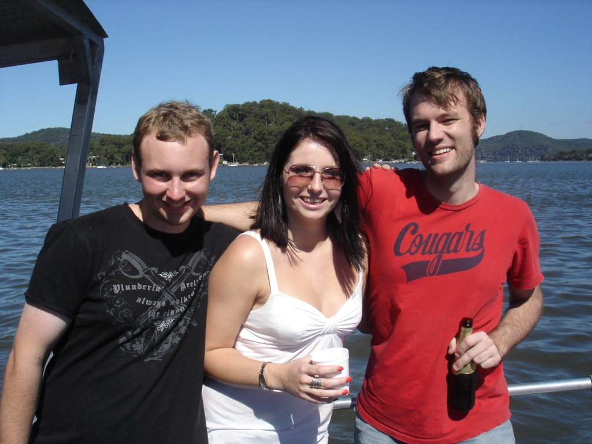

Yesterday, I was lucky enough to go on a boat ride with my co-workers as a team-building activity. Although we didn't do the usual team-building exercises, I think everyone had a great time. Clinton and I brought a case of beer, Alanna brought the wine and food, and James was the designated boat driver.

The fishing was mediocre. Our boat caught perhaps seven catfish, two little fish, and one flat-looking thing. Obviously, I don't know much about fishing!

After the trip, I felt that I had learned a little about everyone on the team, which is what team-building is all about.

