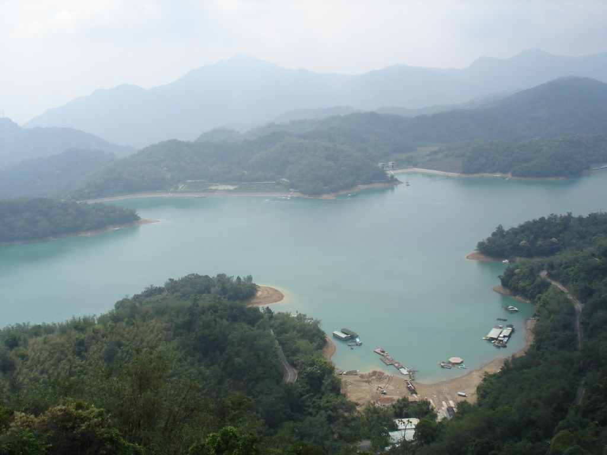

The alarms woke me quite early, and I wandered down to breakfast. I ate quickly, packed, and jumped in the car. Next, I drove to the Confucius Temple, parked nearby, and began walking. Along the way, just off the road, a flower market appeared. Cathy and my dad instinctively wandered under the tents, surrounding themselves with orchids and a myriad of other flowers. I tried to hurry them along, but it was like trying to rush children in a candy shop.

A while later, I managed to escape without making any purchases and walked up to the temple. I had seen it before, having once played cards for several hours in the nearby park. My parents wandered inside while I chatted outside. Once they were ready, I ordered a few more drinks and walked back to the car. I set out to find Anping Fort, near the western side of town. For several reasons, I never found the fort and instead became distracted by another market on Anping Road: the Sword Lion Market. Dad and Cathy enjoyed the little shops and made more purchases while I munched on fried dumplings. For lunch, I visited a packed restaurant, ate several shrimp dumplings, and headed back to the car. Along the way, I bought some water and then continued our journey.

Taro! I  love taro. Between Tainan and my destination in Jade Mountain National Park was a small city that I'll call Taro Town. As we approached, I made sure everyone understood the city and its special qualities. I found parking and walked into a nearby food shop, where I ordered three bowls of rice-ball soup. I love rice balls; they are one of my weaknesses. I love taro. Everybody was happy. I helped my parents finish their soup, as they apparently didn't like it as much as I did, and bought some cookies and mochi for the road.

Back on the road, I continued until we reached our destination: Meishan, a small Indigenous village. The hostel had rooms available, and I booked a large one. After checking in, I wandered down to an even smaller village where resources were clearly limited. Reaching it required crossing a  huge footbridge, where a single misstep felt like certain death.

Once back at the hostel, I cleaned up a little and then walked down the street for dinner. I had eaten at this place before, and the owner remembered me. I ordered three-cup boar, several types of vegetables, a few other dishes, and beer.

After dinner, I walked back to the hostel, sat down in our Japanese-style room, and played some more cards. I drank some of the worst wine any of us had ever tasted, became tired, and crashed.

